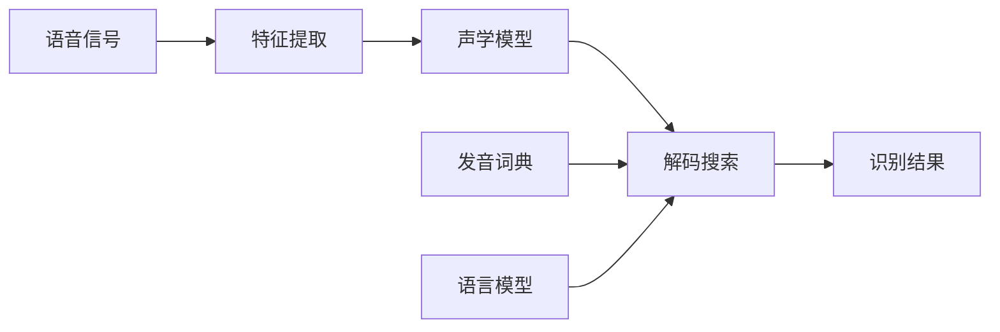

# Automatic Speech Recognition (ASR)原理与代码实例讲解

## 1. 背景介绍

### 1.1 自动语音识别(ASR)的定义与发展历程

自动语音识别(Automatic Speech Recognition, ASR)是一种利用计算机自动将人类语音转换为相应文本的技术。它的目标是让机器能够像人一样理解和识别语音信号，从而实现人机交互。ASR技术经历了几十年的发展，从早期的基于动态时间规整(DTW)的模板匹配方法，到隐马尔可夫模型(HMM)的统计学习方法，再到如今基于深度学习的端到端ASR系统，识别准确率不断提高，应用场景也日益广泛。

### 1.2 ASR技术的应用现状与挑战

ASR技术目前已广泛应用于智能语音助手、语音输入、语音搜索、语音控制、语音转写等领域，极大地提高了人机交互的便捷性和效率。但ASR仍面临着环境噪声、口音差异、自然语言理解等诸多挑战，离人类水平的语音识别还有一定差距。未来ASR技术的突破方向包括更强大的声学和语言模型、低资源语言的识别、语义理解与对话系统的结合等。

## 2. 核心概念与联系

### 2.1 语音信号的数字化表示

- 采样：将连续的模拟语音信号转换为离散的数字信号，常用采样频率为8kHz、16kHz等。
- 量化：将采样后的信号幅值映射到有限的离散值上，如16bit量化。
- 预加重、分帧、加窗等预处理操作，提取语音的短时特征。

### 2.2 声学特征提取

- MFCC(Mel频率倒谱系数)：模拟人耳的听觉特性，在Mel频率尺度上提取语音的频谱特征。
- Fbank(Log-Mel filter bank)：Mel滤波器组的输出，常作为深度学习声学模型的输入。
- PLP(感知线性预测)：基于听觉模型的线性预测特征。

### 2.3 声学模型

- HMM-GMM：用隐马尔可夫模型描述语音单元(如音素)的时序结构，用高斯混合模型(GMM)建模每个状态的观测概率分布。
- DNN-HMM：用深度神经网络(DNN)取代GMM，可以学习更复杂的非线性映射关系。
- CTC(Connectionist Temporal Classification)：端到端的序列学习方法，无需对齐输入和输出序列。

### 2.4 语言模型

- N-gram：基于词的出现频率和上下文估计句子的概率，如bigram、trigram等。
- RNN语言模型：用循环神经网络建模长距离的词序关系。
- Transformer语言模型：基于自注意力机制的神经网络，在大规模语料上预训练后可以迁移到下游任务。

### 2.5 解码搜索

- Viterbi解码：在HMM-GMM框架下寻找最优状态序列，常用Viterbi Beam Search近似搜索。
- WFST(Weighted Finite-State Transducer)：用加权有限状态转换器高效地表示发音词典、语言模型等，统一解码框架。
- Beam Search：在端到端模型中搜索最优输出序列的启发式方法。

下图展示了ASR系统的核心模块及其关系：



## 3. 核心算法原理与具体步骤

### 3.1 HMM-GMM声学模型训练

1. 初始化：根据语料统计每个HMM状态的均值和方差，初始化GMM参数。
2. E步：根据当前模型参数，计算每个观测值在每个状态下的后验概率(occupation probability)。
3. M步：根据E步的结果，更新GMM的均值、方差和权重参数，最大化似然函数。
4. 重复E步和M步直到收敛，得到最终的HMM-GMM声学模型。

### 3.2 DNN-HMM声学模型训练

1. 用HMM-GMM对齐训练数据，得到每帧语音的状态标注。
2. 将语音特征和对应的状态标注作为DNN的输入和输出，训练DNN分类器。
3. 用训练好的DNN替换HMM的GMM，输出每个状态的后验概率。
4. 在解码时，将DNN的输出概率转换为似然度，与HMM的转移概率一起决定最优状态序列。

### 3.3 CTC端到端模型训练

1. 将语音特征序列输入RNN或CNN等神经网络，输出每一时刻的字符概率分布。
2. 引入空白标签(blank)，允许输出序列中有重复和空白。
3. 定义CTC损失函数，计算所有可能的字符序列的概率之和，最大化正确序列的概率。
4. 用前向-后向算法高效计算梯度，用反向传播算法更新网络参数。
5. 解码时，选择概率最大的输出序列，并去掉重复和空白标签，得到最终的识别结果。

### 3.4 语言模型训练与解码

1. N-gram语言模型：统计训练语料中词的出现频率和转移概率，平滑处理以避免零概率问题。
2. RNN语言模型：将词嵌入(word embedding)输入RNN，预测下一个词的概率分布，用交叉熵损失函数优化。
3. Transformer语言模型：用多头自注意力机制建模词之间的依赖关系，在大规模无标注语料上预训练。
4. 解码时，将声学模型和语言模型结合，搜索acoustically possible和linguistically probable的最优假设。可以用WFST或Beam Search等方法实现。

## 4. 数学模型与公式详解

### 4.1 HMM-GMM声学模型

HMM-GMM声学模型的核心是隐马尔可夫模型和高斯混合模型。HMM描述语音单元(如音素)的时序结构，每个状态对应一个GMM，用于建模该状态下观测特征的概率分布。

设HMM有$N$个状态$\{s_1,\cdots,s_N\}$，状态转移概率矩阵为$A=[a_{ij}]$，其中$a_{ij}=P(s_j|s_i)$表示从状态$i$转移到状态$j$的概率。每个状态$s_i$对应一个$M$阶GMM，其概率密度函数为：

$$p(\mathbf{x}|s_i)=\sum_{m=1}^M c_{im} \mathcal{N}(\mathbf{x};\boldsymbol{\mu}_{im},\boldsymbol{\Sigma}_{im})$$

其中$\mathbf{x}$为观测特征向量，$c_{im}$为第$m$个高斯分量的权重，$\boldsymbol{\mu}_{im}$和$\boldsymbol{\Sigma}_{im}$分别为该分量的均值向量和协方差矩阵。GMM的参数可以用EM算法进行估计。

在解码时，给定观测序列$\mathbf{X}=\{\mathbf{x}_1,\cdots,\mathbf{x}_T\}$，目标是找到最可能的状态序列$\mathbf{S}^*$：

$$\mathbf{S}^*=\arg\max_{\mathbf{S}} P(\mathbf{S}|\mathbf{X})$$

根据Bayes定理，上式等价于：

$$\mathbf{S}^*=\arg\max_{\mathbf{S}} P(\mathbf{X}|\mathbf{S})P(\mathbf{S})$$

其中$P(\mathbf{X}|\mathbf{S})$由声学模型(HMM-GMM)计算，$P(\mathbf{S})$由语言模型给出。可以用Viterbi算法高效地求解上述优化问题。

### 4.2 CTC损失函数

CTC是一种端到端的序列学习方法，可以直接将语音特征序列映射到字符序列，无需对齐。设输入序列为$\mathbf{X}=(\mathbf{x}_1,\cdots,\mathbf{x}_T)$，输出序列为$\mathbf{y}=(y_1,\cdots,y_U)$，其中$T>U$。引入空白标签$\epsilon$，定义映射$\mathcal{B}$：将带空白的输出序列缩减为原始的字符序列。例如：

$$\mathcal{B}(AA\epsilon AB\epsilon)=AAB$$

定义CTC损失函数为：

$$\mathcal{L}_{CTC}=-\log P(\mathbf{y}|\mathbf{X})=-\log \sum_{\hat{\mathbf{y}}\in \mathcal{B}^{-1}(\mathbf{y})} P(\hat{\mathbf{y}}|\mathbf{X})$$

其中$\hat{\mathbf{y}}$为所有可能的带空白的输出序列，$\mathcal{B}^{-1}(\mathbf{y})$为$\mathbf{y}$的所有可能扩展。假设每一时刻的输出独立，有：

$$P(\hat{\mathbf{y}}|\mathbf{X})=\prod_{t=1}^T P(\hat{y}_t|\mathbf{x}_t)$$

其中$P(\hat{y}_t|\mathbf{x}_t)$由神经网络输出。可以用前向-后向算法高效计算CTC损失函数的梯度。

## 5. 项目实践：代码实例与详解

下面以PyTorch为例，展示如何实现一个简单的CTC声学模型。

```python
import torch
import torch.nn as nn
import torch.nn.functional as F

class CTCModel(nn.Module):
    def __init__(self, input_dim, hidden_dim, output_dim):
        super(CTCModel, self).__init__()
        self.rnn = nn.GRU(input_dim, hidden_dim, num_layers=2, batch_first=True)
        self.fc = nn.Linear(hidden_dim, output_dim)
    
    def forward(self, x, x_len):
        # x: (batch_size, seq_len, input_dim)
        # x_len: (batch_size,)
        x = nn.utils.rnn.pack_padded_sequence(x, x_len, batch_first=True)
        out, _ = self.rnn(x)
        out, _ = nn.utils.rnn.pad_packed_sequence(out, batch_first=True)
        out = self.fc(out)  # (batch_size, seq_len, output_dim)
        out = F.log_softmax(out, dim=-1)  # (batch_size, seq_len, output_dim)
        return out

# 训练
model = CTCModel(input_dim=40, hidden_dim=256, output_dim=28)
ctc_loss = nn.CTCLoss(blank=27, reduction='mean', zero_infinity=True)
optimizer = torch.optim.Adam(model.parameters(), lr=1e-3)

for epoch in range(num_epochs):
    for x, x_len, y, y_len in train_loader:
        optimizer.zero_grad()
        out = model(x, x_len)  # (batch_size, seq_len, output_dim)
        loss = ctc_loss(out.transpose(0, 1), y, x_len, y_len)
        loss.backward()
        optimizer.step()

# 解码
with torch.no_grad():
    out = model(x, x_len)
    decoded = F.ctc_decode(out.transpose(0, 1), x_len)[0][0]
    hypothesis = [train_dataset.index2char[i] for i in decoded[0]]
```

上面的代码实现了一个2层的双向GRU网络，用CTC损失函数进行端到端训练。在训练时，需要将输入序列按长度排序，并用`pack_padded_sequence`压缩，以提高计算效率。在解码时，可以直接用`F.ctc_decode`函数，得到最优路径。

需要注意的是，CTC解码得到的是字符级别的输出，如果想得到词级别的结果，还需要引入语言模型，进行联合解码。可以用WFST或Beam Search等方法实现。

## 6. 实际应用场景

ASR技术在很多领域都有广泛应用，下面列举几个典型场景：

1. 智能语音助手：如苹果的Siri、谷歌的Google Assistant、亚马逊的Alexa等，可以通过语音控制设备、查询信息、管理日程等。

2. 语音输入：将语音转换为文字，用于文档录入、信息检索、消息发送等，提高输入效率。

3. 语音转写：将会议、讲座、采访等音频自动转换为文本，方便记录和查阅。

4. 车载语音交互：用语音控制导航、音乐播放、空调等，提高驾驶安全性和便利性。

5. 智能客服：通过