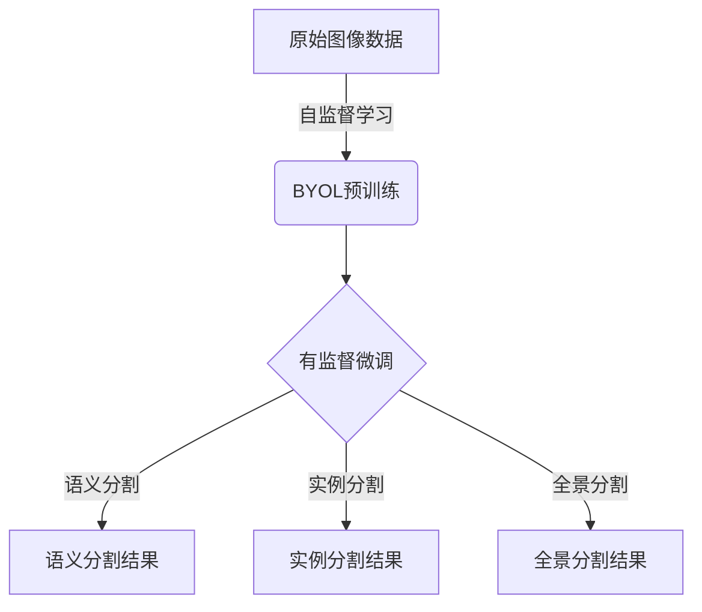

# BYOL在图像segmentation领域的应用

## 1.背景介绍

在计算机视觉领域,图像分割(Image Segmentation)是一项非常重要和具有挑战性的任务。它旨在将图像中的像素划分为多个独立的区域,每个区域对应图像中的一个对象或者语义实体。准确的图像分割可以为目标检测、实例分割、语义分割等高级视觉任务提供有价值的先验知识。

传统的监督学习方法需要大量的人工标注数据,这是一个非常昂贵和耗时的过程。而自监督学习(Self-Supervised Learning)则可以利用未标注的原始数据进行有效的预训练,从而减少对大量人工标注数据的依赖。Bootstrap Your Own Latent (BYOL)就是一种新兴的自监督表示学习方法,它通过训练一对在线和目标网络来学习数据的表示,而无需使用任何人工标注数据。

## 2.核心概念与联系

### 2.1 自监督学习(Self-Supervised Learning)

自监督学习是一种无需人工标注数据的机器学习范式。它通过从输入数据本身中构建监督信号,利用数据的内在结构和统计特性来学习有用的表示。常见的自监督学习任务包括:

- 重构(Reconstruction):从损坏或遮挡的输入重建原始数据。
- 对比学习(Contrastive Learning):将相似样本的表示拉近,不相似样本的表示分开。
- 预测(Prediction):预测输入数据的一部分,如下一个单词或像素。

BYOL属于对比学习的范畴,通过最大化在线网络和目标网络输出之间的相似性来学习数据表示。

### 2.2 图像分割(Image Segmentation)

图像分割是将图像划分为多个独立区域的过程,每个区域对应图像中的一个对象或语义实体。常见的图像分割任务包括:

- 语义分割(Semantic Segmentation):对图像中的每个像素进行分类,将属于同一类别的像素归为一个区域。
- 实例分割(Instance Segmentation):在语义分割的基础上,进一步将属于同一类别的实例区分开来。
- 全景分割(Panoptic Segmentation):同时进行语义分割和实例分割。

通过自监督预训练得到的数据表示可以作为强大的特征输入,提高图像分割模型的性能。



## 3.核心算法原理具体操作步骤

BYOL的核心思想是通过训练一对在线网络(Online Network)和目标网络(Target Network)来学习数据表示,使得在线网络的输出尽可能地接近目标网络的输出。具体算法步骤如下:

1. **输入数据增强**: 对原始输入图像 $x$ 进行随机数据增强,生成两个增强视图 $\tilde{x}_1$ 和 $\tilde{x}_2$。

2. **前向传播**: 将增强视图 $\tilde{x}_1$ 输入到在线网络中,得到其输出表示 $f_\theta(\tilde{x}_1)$。同时,将另一个增强视图 $\tilde{x}_2$ 输入到目标网络中,得到其输出表示 $\xi(\tilde{x}_2)$。

3. **投影头(Projection Head)**: 在线网络的输出 $f_\theta(\tilde{x}_1)$ 通过一个非线性投影头 $g_\theta(\cdot)$ ,得到投影表示 $z_\theta = g_\theta(f_\theta(\tilde{x}_1))$。

4. **预测头(Prediction Head)**: 目标网络的输出 $\xi(\tilde{x}_2)$ 通过一个非线性预测头 $q_\xi(\cdot)$,得到预测表示 $p_\xi = q_\xi(\xi(\tilde{x}_2))$。

5. **损失函数**: 计算在线网络投影表示 $z_\theta$ 和目标网络预测表示 $p_\xi$ 之间的向量余弦相似度,作为损失函数:

$$\mathcal{L}_\theta = -2 \cdot \frac{z_\theta^\top p_\xi}{\|z_\theta\| \|p_\xi\|}$$

6. **网络参数更新**:
    - 在线网络参数 $\theta$ 通过反向传播和优化器(如SGD)进行更新,以最小化损失函数 $\mathcal{L}_\theta$。
    - 目标网络参数 $\xi$ 通过指数移动平均(Exponential Moving Average,EMA)的方式缓慢更新,使其值趋向于在线网络参数 $\theta$:
    
    $$\xi \leftarrow \tau \xi + (1-\tau)\theta$$
    
    其中 $\tau \in [0,1]$ 是平滑更新系数,通常取较小的值如0.99。

7. **重复训练**: 重复上述步骤,使在线网络和目标网络的表示逐渐收敛,从而学习到有效的数据表示。

通过上述自监督训练过程,BYOL可以在无需人工标注数据的情况下,充分利用数据的内在结构和统计特性,学习到泛化性强的图像表示。这种表示可以作为强大的特征输入,在下游的图像分割任务中取得良好的性能。

## 4.数学模型和公式详细讲解举例说明

在BYOL算法中,有几个关键的数学模型和公式需要重点解释:

### 4.1 投影头(Projection Head)

投影头 $g_\theta(\cdot)$ 是一个非线性映射函数,它将在线网络的输出 $f_\theta(\tilde{x}_1)$ 映射到一个低维投影空间,得到投影表示 $z_\theta$。投影头的作用是增加表示的鲁棒性,减少冗余信息。通常使用多层感知机(MLP)实现投影头:

$$z_\theta = g_\theta(f_\theta(\tilde{x}_1)) = W_2^{\top} \text{ReLU}(W_1^{\top} f_\theta(\tilde{x}_1))$$

其中 $W_1$ 和 $W_2$ 分别是两层全连接层的权重矩阵,ReLU是整流线性单元激活函数。

### 4.2 预测头(Prediction Head)

预测头 $q_\xi(\cdot)$ 与投影头类似,也是一个非线性映射函数,它将目标网络的输出 $\xi(\tilde{x}_2)$ 映射到与投影头输出维度相同的预测空间,得到预测表示 $p_\xi$。预测头的作用是增加表示的discriminability,使相似样本的表示更加接近,不相似样本的表示更加分开。预测头也通常使用多层感知机实现:

$$p_\xi = q_\xi(\xi(\tilde{x}_2)) = V_2^{\top} \text{ReLU}(V_1^{\top} \xi(\tilde{x}_2))$$

其中 $V_1$ 和 $V_2$ 分别是两层全连接层的权重矩阵。

### 4.3 损失函数

BYOL的损失函数是在线网络投影表示 $z_\theta$ 和目标网络预测表示 $p_\xi$ 之间的向量余弦相似度的负值:

$$\mathcal{L}_\theta = -2 \cdot \frac{z_\theta^\top p_\xi}{\|z_\theta\| \|p_\xi\|}$$

其中 $\|\cdot\|$ 表示 $L_2$ 范数。这个损失函数的目标是最大化两个表示之间的相似性,从而使在线网络和目标网络的表示逐渐收敛。

为了理解这个损失函数,我们可以考虑一个简单的例子。假设投影表示 $z_\theta = [1, 0]$,预测表示 $p_\xi = [0.9, 0.1]$,那么损失函数值为:

$$\mathcal{L}_\theta = -2 \cdot \frac{1 \times 0.9 + 0 \times 0.1}{\sqrt{1^2 + 0^2} \sqrt{0.9^2 + 0.1^2}} \approx -1.8$$

如果两个表示完全一致,即 $z_\theta = p_\xi = [1, 0]$,那么损失函数值将达到最小值 $-2$。因此,优化器会不断调整在线网络参数 $\theta$,使得投影表示 $z_\theta$ 逐渐接近预测表示 $p_\xi$,从而最小化损失函数。

### 4.4 指数移动平均(Exponential Moving Average)

为了使目标网络的参数 $\xi$ 能够平滑地跟踪在线网络参数 $\theta$ 的变化,BYOL采用了指数移动平均(EMA)的更新策略:

$$\xi \leftarrow \tau \xi + (1-\tau)\theta$$

其中 $\tau \in [0,1]$ 是平滑更新系数,通常取较小的值如0.99。这种更新方式可以确保目标网络参数 $\xi$ 不会过于剧烈地变化,从而提高了模型的稳定性和泛化能力。

我们可以用一个简单的例子来说明EMA的作用。假设初始时刻,在线网络参数 $\theta_0 = 1$,目标网络参数 $\xi_0 = 0$,平滑更新系数 $\tau = 0.9$。在第一次迭代后,参数更新如下:

$$\begin{aligned}
\theta_1 &= 2 \\
\xi_1 &= 0.9 \times 0 + 0.1 \times 2 = 0.2
\end{aligned}$$

可以看到,目标网络参数 $\xi_1$ 只更新了一小部分,而没有直接跳到在线网络参数 $\theta_1 = 2$ 的值。在接下来的几次迭代中,目标网络参数会逐渐趋近于在线网络参数,但变化会非常平滑。这种平滑更新策略可以有效避免目标网络参数的剧烈波动,从而提高模型的稳定性和泛化能力。

通过上述数学模型和公式的详细解释,我们可以更好地理解BYOL算法的核心原理和关键组成部分。这些数学工具为BYOL提供了强大的表示学习能力,使其能够在无需人工标注数据的情况下,从原始图像数据中学习到有效的视觉表示,为下游的图像分割任务提供强大的特征支持。

## 5.项目实践:代码实例和详细解释说明

为了更好地理解BYOL算法在实践中的应用,我们提供了一个基于PyTorch的代码示例,用于在PASCAL VOC 2012数据集上进行自监督预训练,并将预训练模型应用于语义分割任务。

### 5.1 数据准备

我们首先需要准备PASCAL VOC 2012数据集,并将其划分为训练集和验证集。可以使用以下代码加载和预处理数据:

```python
import torchvision.transforms as transforms

# 定义数据增强
data_transforms = {
    'train': transforms.Compose([
        transforms.RandomResizedCrop(224),
        transforms.RandomHorizontalFlip(),
        transforms.ToTensor(),
        transforms.Normalize([0.485, 0.456, 0.406], [0.229, 0.224, 0.225])
    ]),
    'val': transforms.Compose([
        transforms.Resize(256),
        transforms.CenterCrop(224),
        transforms.ToTensor(),
        transforms.Normalize([0.485, 0.456, 0.406], [0.229, 0.224, 0.225])
    ]),
}

# 加载数据集
data_dir = 'path/to/VOCdevkit/VOC2012'
image_datasets = {x: datasets.VOCSegmentation(root=data_dir, image_set=x, download=True, transform=data_transforms[x])
                  for x in ['train', 'val']}
dataloaders = {x: torch.utils.data.DataLoader(image_datasets[x], batch_size=32, shuffle=True, num_workers=4)
               for x in ['train', 'val']}
```

### 5.2 定义BYOL模型

接下来,我们定义BYOL模型的核心组件,包括在线网络、目标网络、投影头和预测头。

```python
import torch.nn as nn

# 定义ResNet骨干网络
class ResNetBackbone(nn.Module):
    def __init__(self, pretrained=False):
        super(ResNetBackbone, self).__init__()
        self.resnet = models.resnet50(pretrained=pretrained)
        
    def forward(self, x):
        return self.resnet.conv1(x), self.res