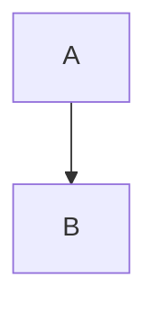

## 1. 背景介绍

Bayesian Network（贝叶斯网络）是一种概率图模型，用于表示变量之间的依赖关系和概率分布。它在人工智能、机器学习、数据挖掘等领域有着广泛的应用。华为云作为一家云计算服务提供商，为了满足客户的需求，提供了BaysNet的云服务，使得用户可以更加方便地使用BaysNet进行数据分析和预测。

本文将介绍BaysNet在华为云上的实现，包括核心概念、算法原理、数学模型和公式、项目实践、实际应用场景、工具和资源推荐、未来发展趋势与挑战以及常见问题与解答。

## 2. 核心概念与联系

BaysNet是一种有向无环图（DAG）模型，其中节点表示变量，边表示变量之间的依赖关系。每个节点都有一个条件概率表（CPT），用于表示该节点在给定其父节点的取值情况下的概率分布。BaysNet的核心概念包括：

- 节点：表示变量，可以是离散型或连续型。
- 边：表示变量之间的依赖关系，有向无环图（DAG）。
- 条件概率表（CPT）：表示节点在给定其父节点的取值情况下的概率分布。

BaysNet的核心联系在于节点之间的依赖关系，这些依赖关系可以用有向边来表示。BaysNet的节点可以是离散型或连续型，这取决于所建模型的实际情况。

## 3. 核心算法原理具体操作步骤

BaysNet的核心算法原理是基于贝叶斯定理的推理算法。具体操作步骤如下：

1. 建立BaysNet模型，包括节点、边和CPT。
2. 给定一组观测数据，根据贝叶斯定理计算后验概率分布。
3. 根据后验概率分布进行推理，包括预测、诊断和解释等。

BaysNet的推理算法可以分为两种：精确推理和近似推理。精确推理是指完全计算后验概率分布，需要对整个BaysNet模型进行联合概率分布的计算，计算复杂度较高。近似推理是指通过一些近似方法来计算后验概率分布，可以大大降低计算复杂度。

## 4. 数学模型和公式详细讲解举例说明

BaysNet的数学模型和公式主要包括联合概率分布、条件概率分布和贝叶斯定理。举例说明如下：

假设有两个离散型变量A和B，它们之间的依赖关系可以用BaysNet表示。BaysNet模型如下图所示：

其中，节点A和B分别表示变量A和B，边A-->B表示A对B有影响。

BaysNet模型的联合概率分布可以表示为：

$$P(A,B)=P(A)P(B|A)$$

其中，$P(A)$表示变量A的边缘概率分布，$P(B|A)$表示在给定A的取值情况下，变量B的条件概率分布。

BaysNet模型的条件概率分布可以表示为：

$$P(B|A)=\frac{P(A,B)}{P(A)}$$

其中，$P(A,B)$表示变量A和B的联合概率分布，$P(A)$表示变量A的边缘概率分布。

BaysNet模型的贝叶斯定理可以表示为：

$$P(A|B)=\frac{P(B|A)P(A)}{P(B)}$$

其中，$P(B|A)$表示在给定A的取值情况下，变量B的条件概率分布，$P(A)$表示变量A的边缘概率分布，$P(B)$表示变量B的边缘概率分布。

## 5. 项目实践：代码实例和详细解释说明

BaysNet在华为云上的实现可以通过BaysNet Studio进行。BaysNet Studio是一款基于BaysNet的可视化建模工具，可以帮助用户快速构建BaysNet模型，并进行数据分析和预测。

BaysNet Studio的使用步骤如下：

1. 登录华为云控制台，进入BaysNet Studio页面。
2. 创建BaysNet模型，包括节点、边和CPT。
3. 导入数据，包括训练数据和测试数据。
4. 进行数据分析和预测，包括模型训练、模型评估和模型预测等。

BaysNet Studio的代码实例和详细解释说明可以参考华为云官方文档。

## 6. 实际应用场景

BaysNet在人工智能、机器学习、数据挖掘等领域有着广泛的应用。具体应用场景包括：

- 风险评估：用于评估风险因素之间的关系和概率分布，帮助企业进行风险管理和决策。
- 医学诊断：用于诊断疾病和预测疾病发展趋势，帮助医生进行诊断和治疗。
- 金融分析：用于分析金融市场和投资风险，帮助投资者进行投资决策。
- 工业控制：用于控制系统和过程优化，帮助企业提高生产效率和质量。

## 7. 工具和资源推荐

BaysNet的工具和资源推荐包括：

- BaysNet Studio：华为云上的BaysNet可视化建模工具。
- OpenBayes：开源的BaysNet建模和推理工具。
- BaysNet教程：包括BaysNet基础知识、建模技巧和应用案例等。

## 8. 总结：未来发展趋势与挑战

BaysNet作为一种概率图模型，在人工智能、机器学习、数据挖掘等领域有着广泛的应用。未来，BaysNet的发展趋势和挑战包括：

- 模型优化：如何提高BaysNet模型的准确性和效率。
- 大数据处理：如何处理大规模数据和高维数据。
- 实时推理：如何实现BaysNet模型的实时推理和应用。

## 9. 附录：常见问题与解答

Q：BaysNet模型如何建立？

A：BaysNet模型可以通过BaysNet Studio进行可视化建模。

Q：BaysNet模型如何进行推理？

A：BaysNet模型可以通过精确推理和近似推理进行推理。

Q：BaysNet模型的应用场景有哪些？

A：BaysNet模型的应用场景包括风险评估、医学诊断、金融分析和工业控制等。

Q：BaysNet模型的发展趋势和挑战有哪些？

A：BaysNet模型的发展趋势和挑战包括模型优化、大数据处理和实时推理等。

作者：禅与计算机程序设计艺术 / Zen and the Art of Computer Programming