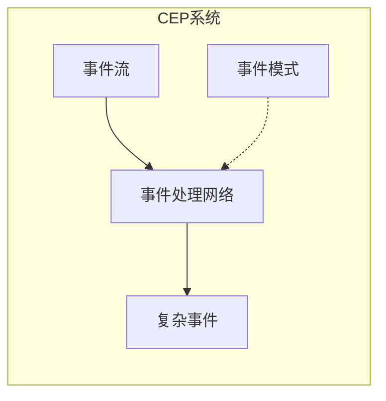
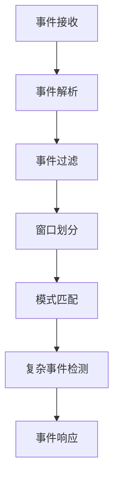
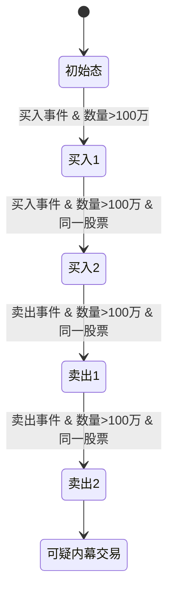

# CEP 原理与代码实例讲解

## 1.背景介绍

在当今快节奏的商业环境中,实时数据处理和分析变得越来越重要。随着数据量的激增,传统的数据处理方式已经无法满足实时性和低延迟的需求。这种需求催生了一种新的数据处理范式:复杂事件处理(Complex Event Processing,CEP)。

CEP是一种软件设计模式,旨在从大量的事件流中实时检测出有意义的事件模式。它可以应用于各种领域,如金融交易监控、网络安全、物联网、运维监控等。CEP的核心思想是将低级别的事件数据与预定义的规则或模式相匹配,从而识别出高级别的复杂事件。

## 2.核心概念与联系

CEP涉及以下几个核心概念:

1. **事件(Event)**: 事件是系统中发生的一个原子性动作或状态变化。事件通常包含时间戳、数据负载和相关元数据。

2. **事件流(Event Stream)**: 事件流是一系列按时间顺序排列的事件序列。CEP系统需要处理连续不断到来的事件流。

3. **事件模式(Event Pattern)**: 事件模式定义了一组条件,用于描述感兴趣的复杂事件。模式可以包括事件类型、事件属性、时间窗口、事件顺序等。

4. **复杂事件(Complex Event)**: 当一个事件模式被满足时,就会触发一个复杂事件。复杂事件可以被视为一种更高级别的事件抽象。

5. **事件处理网络(Event Processing Network,EPN)**: EPN是一组相互连接的事件处理代理,用于评估事件流并检测复杂事件。它类似于数据流管道,事件在其中流动并被转换、过滤和关联。

这些概念之间的关系如下所示:



事件流作为输入被送入CEP系统的事件处理网络。事件处理网络根据预定义的事件模式对事件流进行处理,当满足特定模式时,就会输出一个复杂事件。

## 3.核心算法原理具体操作步骤

CEP系统的核心算法通常包括以下几个步骤:

1. **事件接收**: 从事件源(如消息队列、日志文件等)持续接收事件流。

2. **事件解析**: 对接收到的原始事件数据进行解析,提取出事件类型、时间戳、属性等结构化信息。

3. **事件过滤**: 根据预定义的过滤条件(如事件类型、属性值范围等)对事件进行过滤,剔除不感兴趣的事件。

4. **窗口划分**: 将事件流划分为有限的时间窗口或计数窗口,以便对窗口内的事件进行模式匹配。常见的窗口类型包括滑动窗口、跳跃窗口、会话窗口等。

5. **模式匹配**: 在每个窗口内,将事件与预定义的事件模式进行匹配。模式匹配算法通常采用有限状态机、规则引擎或查询语言等方式实现。

6. **复杂事件检测**: 当一个事件模式被满足时,就会触发一个复杂事件。复杂事件可以携带原始事件的数据,也可以包含额外的上下文信息。

7. **事件响应**: 对检测到的复杂事件执行相应的操作,如发送通知、调用外部系统、触发工作流等。

下图展示了CEP系统的核心算法流程:



在实际实现中,这些步骤可能会有所调整或合并,并且需要考虑诸如并发处理、故障恢复、状态管理等问题。

## 4.数学模型和公式详细讲解举例说明

在CEP系统中,事件模式匹配是一个关键的算法问题。常见的模式匹配方法包括有限状态机、规则引擎和查询语言等。本节将重点介绍基于有限状态机的模式匹配算法。

### 4.1 有限状态机

有限状态机(Finite State Machine,FSM)是一种用于建模有限个状态和状态转移的数学计算模型。在CEP中,FSM被用于表示事件模式,每个状态对应一种事件条件,状态转移对应事件的发生。

FSM可以用一个五元组 $(Q, \Sigma, \delta, q_0, F)$ 来表示,其中:

- $Q$ 是一个有限的状态集合
- $\Sigma$ 是一个有限的输入事件集合
- $\delta: Q \times \Sigma \rightarrow Q$ 是状态转移函数
- $q_0 \in Q$ 是初始状态
- $F \subseteq Q$ 是终止状态集合

对于一个给定的事件序列 $e_1, e_2, \ldots, e_n$,FSM从初始状态 $q_0$ 开始,根据每个事件 $e_i$ 和当前状态 $q_i$,通过状态转移函数 $\delta$ 计算出下一个状态 $q_{i+1}$:

$$q_{i+1} = \delta(q_i, e_i)$$

如果最终状态 $q_n \in F$,则表示该事件序列满足了模式,否则不满足。

### 4.2 示例:股票交易监控

假设我们需要监控股票交易,检测出可能的内幕交易行为。我们定义以下事件模式:

1. 在一个小时内,同一只股票有多笔大额买入交易(>100万股)
2. 紧接着在一个小时内,同一只股票有多笔大额卖出交易(>100万股)

我们可以用FSM来表示这个模式,如下所示:



在这个FSM中:

- 初始态是开始监控的状态
- 买入1和买入2状态表示连续两笔大额买入交易
- 卖出1和卖出2状态表示紧接着的连续两笔大额卖出交易
- 终止态表示模式被满足,即检测到可疑的内幕交易行为

每个状态转移都有相应的条件,如事件类型、交易数量和交易股票。如果一个事件序列能够从初始态一直转移到终止态,则表明该序列满足了事件模式。

通过将事件模式表示为FSM,CEP系统可以高效地对连续到来的事件流进行模式匹配,从而实时检测出复杂事件。

## 5.项目实践:代码实例和详细解释说明

为了更好地理解CEP的实现,我们将使用Python和流行的CEP引擎Esper来构建一个简单的股票交易监控系统。该系统将检测出可疑的内幕交易行为,即在短时间内出现大额买入交易紧接着又有大额卖出交易的情况。

### 5.1 安装Esper

Esper是一个流行的开源CEP引擎,提供了Java和.NET两个版本。在本例中,我们将使用Esper的Python接口esper-python。

首先,我们需要安装esper-python包:

```
pip install esper-python
```

### 5.2 定义事件类型

我们首先定义股票交易事件的类型,包括交易时间、股票代码、交易类型(买入或卖出)和交易数量:

```python
from esper.utils import json_provider

trade_def = """{
  "insert-into": "TradeEvent",
  "property": {
    "time": "longValue",
    "symbol": "string",
    "type": "string",
    "quantity": "longValue"
  }
}"""

json_provider.add_type(trade_def)
```

这里我们使用Esper的JSON事件类型定义语言来定义事件类型。`insert-into`指定事件流的名称,`property`部分定义了每个事件属性的名称和类型。

### 5.3 定义事件模式

接下来,我们定义需要监控的事件模式。我们使用Esper的EPL(Event Processing Language)查询语言来表达模式:

```python
pattern = """
SELECT * FROM pattern [
  every buy=TradeEvent(type='BUY', quantity>1000000) ->
  every sell=TradeEvent(type='SELL', quantity>1000000, symbol=buy.symbol)
  where timer:within(1 hour, buy.time, sell.time)
]
"""
```

这个EPL查询定义了我们感兴趣的模式:

1. 首先是一笔大额买入交易(`type='BUY', quantity>1000000`)
2. 紧接着是一笔大额卖出交易(`type='SELL', quantity>1000000`)
3. 买入交易和卖出交易必须是同一只股票(`symbol=buy.symbol`)
4. 买入交易和卖出交易之间的时间间隔不超过1小时(`timer:within(1 hour, buy.time, sell.time)`)

当这个模式被满足时,就会触发一个复杂事件。

### 5.4 创建CEP引擎并发送事件

现在,我们创建一个CEP引擎实例,并注册事件类型和事件模式:

```python
from esper.runtime import EPRuntimeProvider

provider = EPRuntimeProvider()
runtime = provider.get_runtime()
runtime.add_type(json_provider.types_by_name["TradeEvent"])
statement = runtime.create_statement(pattern)
```

接下来,我们模拟一些股票交易事件,并将它们发送到CEP引擎:

```python
from esper.event import EventBean

# 一些正常交易
send_event(runtime, "2023-06-08 09:30:00", "AAPL", "BUY", 500000)
send_event(runtime, "2023-06-08 10:00:00", "AAPL", "SELL", 600000)

# 可疑的内幕交易
send_event(runtime, "2023-06-08 11:00:00", "MSFT", "BUY", 1500000)
send_event(runtime, "2023-06-08 11:30:00", "MSFT", "BUY", 2000000)
send_event(runtime, "2023-06-08 12:00:00", "MSFT", "SELL", 3000000)
send_event(runtime, "2023-06-08 12:15:00", "MSFT", "SELL", 1000000)

def send_event(runtime, time, symbol, type, quantity):
    event = EventBean(
        {"time": time_to_long(time), "symbol": symbol, "type": type, "quantity": quantity},
        type_name="TradeEvent",
    )
    runtime.send_event(event)
```

在这个示例中,我们首先发送了一些正常的股票交易事件。然后,我们模拟了一个可疑的内幕交易情况:在11:00到12:15这个时间段内,对微软股票(MSFT)先后发生了两笔大额买入交易和两笔大额卖出交易。

### 5.5 处理复杂事件

最后,我们监听CEP引擎触发的复杂事件,并对可疑的内幕交易事件做出响应:

```python
listener = MyListener()
statement.add_listener(listener)

class MyListener(object):
    def update(self, events):
        for event in events:
            buy = event.get("buy")
            sell = event.get("sell")
            print(
                f"Detected suspicious insider trading: {buy.get('symbol')} "
                f"Buy {buy.get('quantity')} @ {long_to_time(buy.get('time'))} "
                f"Sell {sell.get('quantity')} @ {long_to_time(sell.get('time'))}"
            )
```

在这个示例中,我们定义了一个`MyListener`类,它会在复杂事件触发时被调用。对于每个复杂事件,我们从事件属性中提取出买入交易和卖出交易的详细信息,并打印出一条警告消息。

运行这个程序,您应该会看到以下输出:

```
Detected suspicious insider trading: MSFT Buy 3500000 @ 2023-06-08 11:30:00 Sell 4000000 @ 2023-06-08 12:15:00
```

这表明我们成功地检测到了模拟的内幕交易