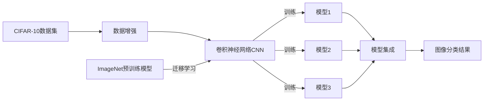

# CIFAR-10图像分类

## 1. 背景介绍

CIFAR-10是一个广泛用于计算机视觉研究的图像分类数据集。它包含60,000张32x32像素的彩色图像,这些图像分为10个类别,每个类别包含6,000张图像。这些类别分别是:飞机、汽车、鸟类、猫、鹿、狗、青蛙、马、船和卡车。数据集分为50,000张训练图像和10,000张测试图像。

CIFAR-10数据集是由加拿大高级研究院(Canadian Institute for Advanced Research,CIFAR)的Alex Krizhevsky、Vinod Nair和Geoffrey Hinton收集的。它是更大的80 million tiny images数据集的一个标记子集。这个数据集的主要目的是作为机器学习和计算机视觉算法的基准,特别是在图像分类任务上。

### 1.1 CIFAR-10数据集的重要性

CIFAR-10数据集在计算机视觉研究中具有重要意义,主要体现在以下几个方面:

#### 1.1.1 算法评估基准

CIFAR-10提供了一个标准化的测试平台,研究人员可以在这个数据集上评估和比较不同的机器学习和深度学习算法的性能。这有助于推动计算机视觉领域的发展。

#### 1.1.2 小图像分类挑战

与其他一些图像分类数据集(如ImageNet)相比,CIFAR-10中的图像尺寸较小(32x32像素)。这对图像分类算法提出了额外的挑战,因为小图像包含的信息相对较少。

#### 1.1.3 多样性和复杂性

CIFAR-10包含10个不同的类别,涵盖了动物、交通工具等多个领域。此外,每个类别中的图像也呈现出一定的多样性和复杂性。这有助于评估算法在处理不同类型图像时的鲁棒性。

### 1.2 CIFAR-10的应用

CIFAR-10数据集在计算机视觉研究和应用中有广泛的应用,例如:

- 评估和比较不同的图像分类算法,如卷积神经网络(CNN)、支持向量机(SVM)等。
- 作为深度学习模型的训练和测试数据集,用于研究新的网络架构和训练技术。  
- 研究迁移学习、few-shot learning等技术在小样本场景下的性能。
- 作为计算机视觉教学和学习的示例数据集。

## 2. 核心概念与联系

在CIFAR-10图像分类任务中,涉及到几个核心概念:

### 2.1 卷积神经网络(CNN)

卷积神经网络是一种专门用于处理网格状数据(如图像)的深度学习模型。它通过卷积层和池化层逐步提取图像的高级特征,并使用全连接层对图像进行分类。CNN在图像分类任务上取得了显著的成功。

### 2.2 数据增强

数据增强是一种常用的技术,通过对训练图像进行各种转换(如旋转、平移、缩放、翻转等)来增加训练样本的数量和多样性。这有助于提高模型的泛化能力和鲁棒性。

### 2.3 迁移学习

迁移学习是指将在一个任务上训练好的模型应用到另一个相关任务上。在CIFAR-10分类中,可以使用在ImageNet等大型数据集上预训练的模型作为特征提取器,然后在CIFAR-10数据集上进行微调(fine-tuning)。这种方法可以显著加速训练过程并提高分类性能。

### 2.4 模型集成

模型集成是将多个模型的预测结果进行组合,以获得更好的性能。常见的集成方法包括投票、平均、stacking等。在CIFAR-10分类任务中,可以训练多个不同的CNN模型,然后将它们的预测结果进行集成,以提高分类准确率。

这些核心概念之间的联系可以用下面的Mermaid流程图表示:



## 3. 核心算法原理具体操作步骤

在CIFAR-10图像分类任务中,常用的核心算法是卷积神经网络(CNN)。下面是使用CNN进行CIFAR-10图像分类的具体操作步骤:

### 3.1 数据准备

1. 下载CIFAR-10数据集,并将其划分为训练集和测试集。
2. 对训练集进行数据增强,如随机裁剪、水平翻转、颜色变换等,以增加训练样本的多样性。
3. 对图像数据进行归一化处理,将像素值缩放到[0,1]或[-1,1]范围内。

### 3.2 构建CNN模型

1. 选择合适的CNN架构,如ResNet、VGG、DenseNet等。
2. 根据选定的架构,构建CNN模型,包括卷积层、池化层、全连接层等。
3. 根据任务需求,调整模型的超参数,如卷积核大小、卷积层数量、全连接层神经元数量等。

### 3.3 模型训练

1. 定义损失函数,如交叉熵损失函数,用于衡量模型预测结果与真实标签之间的差异。
2. 选择优化算法,如随机梯度下降(SGD)、Adam等,用于更新模型参数以最小化损失函数。
3. 设置训练超参数,如学习率、批量大小(batch size)、训练轮数(epochs)等。
4. 在训练集上进行模型训练,通过前向传播计算预测结果,然后通过反向传播更新模型参数。
5. 在每个epoch结束后,在验证集上评估模型性能,以监控训练过程并调整超参数。

### 3.4 模型评估与推理

1. 在测试集上评估训练好的模型,计算分类准确率等性能指标。
2. 使用训练好的模型对新的图像进行预测,输出预测的类别标签。
3. 如果需要进一步提高性能,可以考虑使用模型集成技术,如投票、平均等方法。

### 3.5 模型优化与改进

1. 分析模型的错误样本,识别出模型容易混淆的类别或难以分类的图像。
2. 根据错误分析的结果,考虑采取措施改进模型,如调整网络架构、引入注意力机制、使用更advanced的数据增强技术等。
3. 不断迭代优化模型,直到达到满意的性能为止。

## 4. 数学模型和公式详细讲解举例说明

在CIFAR-10图像分类任务中,卷积神经网络(CNN)是最常用的数学模型。下面我们详细讲解CNN中的几个关键数学概念和公式。

### 4.1 卷积操作

卷积操作是CNN的核心,它通过滑动窗口的方式对输入图像进行特征提取。给定一个输入图像$\mathbf{X}$和卷积核$\mathbf{W}$,卷积操作可以表示为:

$$\mathbf{Y}[i,j] = \sum_{m}\sum_{n} \mathbf{X}[i+m,j+n] \cdot \mathbf{W}[m,n]$$

其中,$\mathbf{Y}$是卷积输出,$i,j$表示输出特征图上的位置索引,$m,n$表示卷积核的大小。

举例说明,假设我们有一个3x3的输入图像$\mathbf{X}$和一个2x2的卷积核$\mathbf{W}$:

$$\mathbf{X} = \begin{bmatrix}
1 & 2 & 3\\
4 & 5 & 6\\
7 & 8 & 9
\end{bmatrix},\quad
\mathbf{W} = \begin{bmatrix}
1 & 0\\
0 & 1
\end{bmatrix}$$

对$\mathbf{X}$应用卷积操作,得到输出特征图$\mathbf{Y}$:

$$\mathbf{Y} = \begin{bmatrix}
1\times1+2\times0+4\times0+5\times1 & 2\times1+3\times0+5\times0+6\times1\\
4\times1+5\times0+7\times0+8\times1 & 5\times1+6\times0+8\times0+9\times1
\end{bmatrix} = \begin{bmatrix}
6 & 8\\
12 & 14
\end{bmatrix}$$

### 4.2 池化操作

池化操作用于降低特征图的空间维度,同时保留最重要的特征信息。常见的池化操作包括最大池化和平均池化。

对于最大池化,给定输入特征图$\mathbf{X}$和池化窗口大小$k$,最大池化操作可以表示为:

$$\mathbf{Y}[i,j] = \max_{m,n \in \{0,\ldots,k-1\}} \mathbf{X}[i\cdot s+m, j\cdot s+n]$$

其中,$\mathbf{Y}$是池化输出,$s$是池化窗口的步长。

举例说明,假设我们有一个4x4的输入特征图$\mathbf{X}$,使用2x2的最大池化窗口和步长为2:

$$\mathbf{X} = \begin{bmatrix}
1 & 2 & 3 & 4\\
5 & 6 & 7 & 8\\
9 & 10 & 11 & 12\\
13 & 14 & 15 & 16
\end{bmatrix}$$

应用最大池化操作,得到输出特征图$\mathbf{Y}$:

$$\mathbf{Y} = \begin{bmatrix}
\max(1,2,5,6) & \max(3,4,7,8)\\
\max(9,10,13,14) & \max(11,12,15,16)
\end{bmatrix} = \begin{bmatrix}
6 & 8\\
14 & 16
\end{bmatrix}$$

### 4.3 损失函数

在CIFAR-10图像分类任务中,常用的损失函数是交叉熵损失函数。给定一个样本的预测概率分布$\mathbf{\hat{y}}$和真实标签的one-hot编码$\mathbf{y}$,交叉熵损失可以表示为:

$$L(\mathbf{\hat{y}}, \mathbf{y}) = -\sum_{i=1}^{C} y_i \log(\hat{y}_i)$$

其中,$C$是类别数量(对于CIFAR-10为10)。

举例说明,假设对于一个样本,模型预测的概率分布为$\mathbf{\hat{y}} = [0.1, 0.2, 0.3, 0.4]$,而真实标签为$\mathbf{y} = [0, 0, 1, 0]$(one-hot编码),则交叉熵损失为:

$$L(\mathbf{\hat{y}}, \mathbf{y}) = -(0 \times \log(0.1) + 0 \times \log(0.2) + 1 \times \log(0.3) + 0 \times \log(0.4)) = -\log(0.3) \approx 1.204$$

## 5. 项目实践：代码实例和详细解释说明

下面我们使用Python和PyTorch框架,通过代码实例来演示如何进行CIFAR-10图像分类。

### 5.1 数据准备

```python
import torch
import torchvision
import torchvision.transforms as transforms

# 定义数据预处理
transform_train = transforms.Compose([
    transforms.RandomCrop(32, padding=4),
    transforms.RandomHorizontalFlip(),
    transforms.ToTensor(),
    transforms.Normalize((0.4914, 0.4822, 0.4465), (0.2023, 0.1994, 0.2010)),
])

transform_test = transforms.Compose([
    transforms.ToTensor(),
    transforms.Normalize((0.4914, 0.4822, 0.4465), (0.2023, 0.1994, 0.2010)),
])

# 加载CIFAR-10数据集
trainset = torchvision.datasets.CIFAR10(root='./data', train=True, download=True, transform=transform_train)
trainloader = torch.utils.data.DataLoader(trainset, batch_size=128, shuffle=True, num_workers=2)

testset = torchvision.datasets.CIFAR10(root='./data', train=False, download=True, transform=transform_test)
testloader = torch.utils.data.DataLoader(testset, batch_size=100, shuffle=False, num_workers=2)
```

这段代码定义了数据预处理的转换操作,包括随机裁剪、