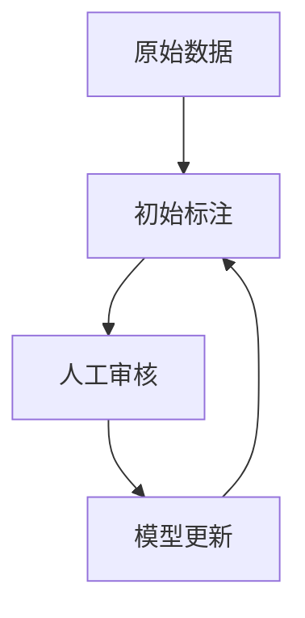
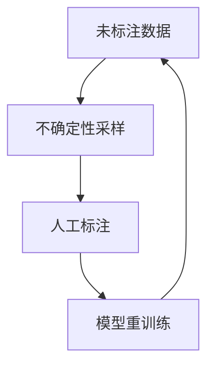
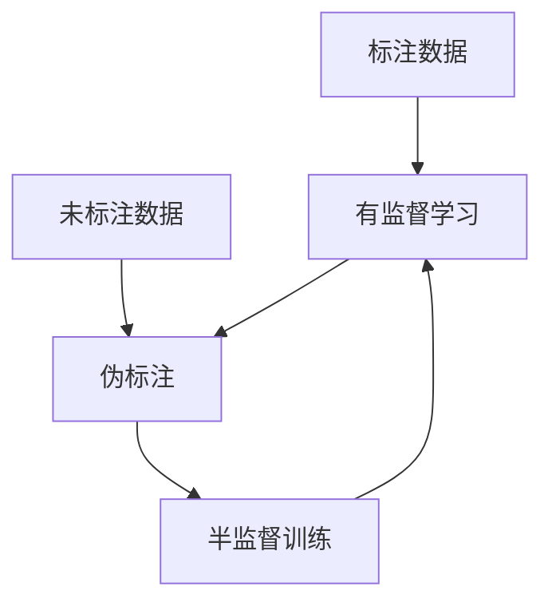
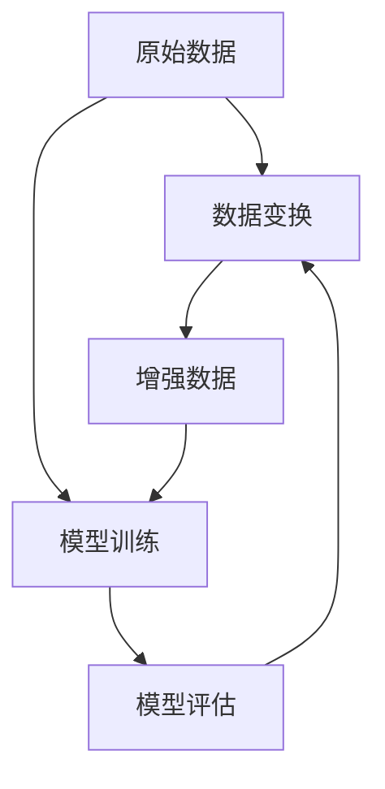

# CSDN技术博客专栏《AI数据标注工具》：数据标注工具的国际标准

## 1. 背景介绍

### 1.1 数据标注的重要性

在当今的人工智能时代,数据是推动算法和模型发展的核心动力。高质量的数据对于训练准确、高效的人工智能模型至关重要。然而,原始数据通常是未标记和未结构化的,需要经过专门的数据标注过程,才能为机器学习算法所使用。数据标注是将原始数据转化为结构化格式的过程,使其可被机器学习模型理解和处理。

### 1.2 数据标注的挑战

数据标注工作通常是手动完成的,耗时耗力且容易出错。随着数据量的不断增加,传统的人工标注方式已无法满足现代人工智能系统对大规模高质量数据的需求。因此,高效、准确的数据标注工具变得至关重要。

### 1.3 数据标注工具的作用

数据标注工具可以极大地提高标注效率,减轻人工标注的工作量。它们通常具有用户友好的界面、自动化标注功能、版本控制和协作功能等,使得数据标注过程更加高效、一致和可管理。此外,优秀的数据标注工具还应当支持多种数据类型的标注,并与不同的机器学习框架无缝集成。

## 2. 核心概念与联系

### 2.1 数据标注的类型

数据标注可分为以下几种主要类型:

1. **图像标注**: 为图像数据添加标签、边界框、分割掩码等信息。
2. **文本标注**: 为文本数据添加命名实体识别、关系抽取、情感分析等标签。
3. **语音标注**: 为语音数据添加转录文本、语音识别标签等信息。
4. **视频标注**: 为视频数据添加对象跟踪、行为识别等标签。
5. **3D点云标注**: 为3D点云数据添加物体检测、语义分割等标签。

### 2.2 标注工具的核心功能

优秀的数据标注工具通常具备以下核心功能:

1. **标注界面**: 用户友好的标注界面,支持多种数据类型的标注操作。
2. **自动标注**: 利用机器学习模型进行自动标注,提高效率。
3. **版本控制**: 记录和管理标注数据的版本变更。
4. **协作标注**: 支持多人协作标注,提高一致性。
5. **质量控制**: 通过人工审核、统计分析等方式控制标注质量。
6. **工作流管理**: 支持标注任务的分配、跟踪和管理。
7. **数据集成**: 与机器学习框架和数据存储系统无缝集成。

### 2.3 标注工具与机器学习的关系

数据标注工具是机器学习流程中的关键一环。高质量的标注数据可以提高机器学习模型的准确性和泛化能力。同时,机器学习模型也可以用于辅助数据标注,提高标注效率。标注工具和机器学习模型之间形成了良性循环,相互促进、共同发展。

## 3. 核心算法原理具体操作步骤

数据标注工具的核心算法原理主要包括以下几个方面:

### 3.1 交互式标注算法

交互式标注算法旨在提高标注效率,减轻人工标注的工作量。它通常包括以下步骤:

1. **初始标注**: 利用现有的机器学习模型对数据进行初始标注。
2. **人工审核**: 人工标注员审核和修正初始标注结果。
3. **模型更新**: 利用人工审核后的数据,重新训练机器学习模型。
4. **迭代循环**: 重复上述步骤,直到达到满意的标注质量。



### 3.2 主动学习算法

主动学习算法旨在选择最有价值的数据进行人工标注,从而提高标注效率。它通常包括以下步骤:

1. **不确定性采样**: 机器学习模型对数据进行预测,选择预测置信度最低的数据进行人工标注。
2. **人工标注**: 人工标注员标注选定的数据。
3. **模型重训练**: 利用新标注的数据,重新训练机器学习模型。
4. **迭代循环**: 重复上述步骤,直到达到满意的模型性能。



### 3.3 半监督学习算法

半监督学习算法旨在利用大量未标注数据,提高模型的泛化能力。它通常包括以下步骤:

1. **有监督学习**: 利用少量标注数据训练初始模型。
2. **伪标注**: 利用初始模型对未标注数据进行伪标注。
3. **半监督训练**: 将伪标注数据与真实标注数据一同用于模型训练。
4. **迭代循环**: 重复上述步骤,直到达到满意的模型性能。



### 3.4 数据增强算法

数据增强算法旨在通过对现有数据进行变换,生成新的训练数据,从而增加数据多样性,提高模型的泛化能力。它通常包括以下步骤:

1. **数据变换**: 对现有数据进行旋转、缩放、翻转、噪声添加等变换,生成新的训练数据。
2. **模型训练**: 利用原始数据和增强数据一同训练机器学习模型。
3. **迭代循环**: 根据模型性能,调整数据增强策略,重复上述步骤。



## 4. 数学模型和公式详细讲解举例说明

数据标注工具中常用的数学模型和公式包括:

### 4.1 交叉熵损失函数

交叉熵损失函数是监督学习中常用的损失函数,用于衡量模型预测与真实标签之间的差异。对于二分类问题,交叉熵损失函数定义如下:

$$
L(y, \hat{y}) = -[y \log(\hat{y}) + (1-y) \log(1-\hat{y})]
$$

其中,y是真实标签(0或1),\hat{y}是模型预测的概率值。

对于多分类问题,交叉熵损失函数定义如下:

$$
L(Y, \hat{Y}) = -\sum_{i=1}^{C} y_i \log(\hat{y}_i)
$$

其中,Y是真实标签的一热编码向量,\hat{Y}是模型预测的概率分布向量,C是类别数。

### 4.2 F1分数

F1分数是一种综合考虑精确率(Precision)和召回率(Recall)的评估指标,常用于分类问题的模型评估。F1分数的定义如下:

$$
F_1 = \frac{2 \times \text{Precision} \times \text{Recall}}{\text{Precision} + \text{Recall}}
$$

其中,Precision和Recall分别定义为:

$$
\text{Precision} = \frac{\text{TP}}{\text{TP} + \text{FP}}
$$

$$
\text{Recall} = \frac{\text{TP}}{\text{TP} + \text{FN}}
$$

TP、FP和FN分别表示真正例、假正例和假负例的数量。

### 4.3 均方误差

均方误差(Mean Squared Error, MSE)是一种常用的回归问题评估指标,用于衡量模型预测值与真实值之间的差异。均方误差的定义如下:

$$
\text{MSE} = \frac{1}{n} \sum_{i=1}^{n} (y_i - \hat{y}_i)^2
$$

其中,n是样本数量,y_i和\hat{y}_i分别是第i个样本的真实值和模型预测值。

### 4.4 示例:图像分割中的IoU

在图像分割任务中,常用的评估指标是交并比(Intersection over Union, IoU),用于衡量预测掩码与真实掩码之间的重合程度。IoU的定义如下:

$$
\text{IoU} = \frac{\text{Area of Overlap}}{\text{Area of Union}}
$$

其中,Area of Overlap表示预测掩码与真实掩码的重合区域面积,Area of Union表示两个掩码的并集区域面积。

例如,对于一个像素点(i,j),如果预测掩码和真实掩码都将其标记为前景(值为1),则该点的IoU为1;如果一个将其标记为前景,另一个将其标记为背景(值为0),则该点的IoU为0。对所有像素点的IoU取平均,即可得到整个图像的IoU评分。

## 5. 项目实践:代码实例和详细解释说明

以下是一个使用Python和PyTorch实现的图像分类项目示例,包括数据标注、模型训练和评估等步骤。

### 5.1 数据标注

我们首先导入必要的库和定义一些辅助函数:

```python
import os
import cv2
import numpy as np
from tqdm import tqdm

# 定义标签映射
label_map = {'cat': 0, 'dog': 1}

# 定义辅助函数
def load_image(path):
    img = cv2.imread(path)
    img = cv2.cvtColor(img, cv2.COLOR_BGR2RGB)
    return img

def save_annotation(path, label):
    with open(path, 'w') as f:
        f.write(str(label))
```

然后,我们遍历图像文件夹,为每张图像生成对应的标注文件:

```python
data_dir = 'data/images'
annotation_dir = 'data/annotations'

for cls in os.listdir(data_dir):
    class_dir = os.path.join(data_dir, cls)
    annotation_path = os.path.join(annotation_dir, cls + '.txt')
    
    with open(annotation_path, 'a') as f:
        for img_name in tqdm(os.listdir(class_dir)):
            img_path = os.path.join(class_dir, img_name)
            label = label_map[cls]
            f.write(f'{img_path} {label}\n')
```

这将生成一个annotations文件夹,其中包含每个类别对应的标注文件,每行记录了图像路径和对应的标签。

### 5.2 数据加载

接下来,我们定义一个PyTorch数据集类,用于加载图像和标注数据:

```python
import torch
from torch.utils.data import Dataset

class ImageDataset(Dataset):
    def __init__(self, annotation_file, transform=None):
        self.annotations = []
        self.transform = transform
        
        with open(annotation_file, 'r') as f:
            for line in f:
                img_path, label = line.strip().split()
                self.annotations.append((img_path, int(label)))
    
    def __len__(self):
        return len(self.annotations)
    
    def __getitem__(self, idx):
        img_path, label = self.annotations[idx]
        img = load_image(img_path)
        
        if self.transform:
            img = self.transform(img)
        
        return img, label
```

这个数据集类将从标注文件中读取图像路径和标签,并在`__getitem__`方法中加载和预处理图像数据。

### 5.3 模型训练

现在,我们可以定义一个简单的卷积神经网络模型,并使用PyTorch进行训练:

```python
import torch.nn as nn
import torch.optim as optim

# 定义模型
class CNN(nn.Module):
    def __init__(self):
        super(CNN, self).__init__()
        self.conv1 = nn.Conv2d(3, 16, kernel_size=3, padding=1)
        self.pool = nn.MaxPool2d(2, 2)
        self.conv2 = nn.Conv2d(16, 32, kernel_size=3, padding=1)
        self.fc1 = nn.Linear(32 * 7 * 7, 64)
        self.fc2 = nn.Linear(64, 2)
        self.relu = nn.ReLU()
    
    def forward(self, x):
        x = self.relu(self.conv1(x))
        x = self.pool(x)
        x = self.relu(self.conv2(x))
        x = self.pool(x)
        x = x.view(-1, 32 * 7 * 7)
        x = self.