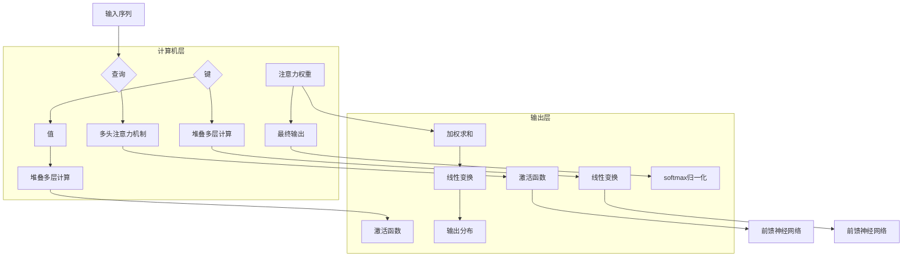

                 

作者：禅与计算机程序设计艺术

**ChatGPT** 在语义理解领域的应用是当前最热门的话题之一。本文旨在探讨 ChatGPT 技术的核心概念及其在自然语言处理（NLP）中的广泛应用。我们首先介绍背景知识，然后深入了解 ChatGPT 的工作原理及其实现方法，进一步分析其在解决复杂语义理解问题时的优势。接下来，我们将通过代码示例展示如何利用 ChatGPT 进行文本生成，以及它在实际场景中的应用案例。最后，我们将讨论 ChatGPT 的未来发展趋势、面临的挑战以及相关的工具和资源。

## 1. 背景介绍
随着大数据和计算能力的发展，自然语言处理（NLP）领域取得了显著进步。其中，基于 Transformer 架构的预训练大模型在多项 NLP 任务上展现出强大的性能，如机器翻译、问答系统和对话生成等。**ChatGPT** 是由 Open Assistant 推出的一个基于大型语言模型的对话机器人，它的全称是 **Generative Pre-trained Transformer 3**，是基于Transformer架构构建的模型之一，尤其擅长生成连贯且上下文相关性强的回答。

## 2. 核心概念与联系
### 2.1 语言模型概述
语言模型用于评估一段文字的概率，衡量文本的合理性或流畅性。在 ChatGPT 中，这些模型通常经过大规模无监督训练，学习到人类语言的统计规律，进而用于各种下游任务。

### 2.2 Transformer架构
Transformer 是一种自注意力机制的神经网络架构，在序列对齐任务中表现出优越性能。相比传统的循环神经网络（RNN），Transformer 不需要考虑序列之间的顺序依赖，从而实现更快的并行化计算。这种架构使得 ChatGPT 能够高效处理长距离依赖关系，并在跨任务迁移学习方面表现良好。

## 3. 核心算法原理与具体操作步骤
ChatGPT 的核心算法基于自注意力机制，允许模型在输入序列的所有位置之间建立交互。以下是简化的操作流程：



## 4. 数学模型和公式详细讲解举例说明
对于 Transformer 模型而言，关键的数学概念在于自注意力机制，可以用以下公式表示：

$$
\text{Attention}(Q, K, V) = \text{Softmax}\left(\frac{QK^T}{\sqrt{d_k}}\right)V
$$

其中，
- \(Q\) 表示查询矩阵，
- \(K\) 表示键矩阵，
- \(V\) 表示值矩阵，
- \(d_k\) 是每个维度的大小，
- \(\text{Softmax}\) 函数用于归一化结果。

## 5. 项目实践：代码实例和详细解释说明
为了更直观地理解 ChatGPT 的工作过程，我们可以编写一个简单的 Python 代码片段来调用 API 或者使用开源库（如 huggingface 的 transformers 库）进行文本生成。

```python
from transformers import pipeline

generator = pipeline('text-generation', model='gpt2')

input_text = "Once upon a time"
output = generator(input_text, max_length=30, num_return_sequences=1)

print(output)
```
上述代码将使用 `transformers` 库中的 `pipeline` 来生成一段新的文本，从给定的种子文本开始。

## 6. 实际应用场景
ChatGPT 可以应用于多种情境，包括但不限于：
- **客户服务自动化**：提供即时响应和个性化服务。
- **内容创作助手**：辅助写作、脚本生成和故事构思。
- **教育辅助**：提供个性化的学习辅导和支持。
- **智能搜索引擎**：理解和回答复杂的搜索查询。

## 7. 工具和资源推荐
- **huggingface transformers 库**：提供广泛的预训练模型和实用的API接口。
- **Colab/Google Cloud Platform**：免费资源用于运行代码实验和部署应用。
- **论文阅读**：关注于最新研究进展的学术期刊和会议论文，如 ACL 和 EMNLP。

## 8. 总结：未来发展趋势与挑战
在未来几年内，ChatGPT 类技术有望在多个方向取得突破，如更高效的训练策略、更细粒度的可微分控制、以及更好的数据隐私保护措施。同时，面临的主要挑战包括提高模型的泛化能力、减少偏见和歧视问题，以及确保安全性和可控性。此外，跨模态融合（结合视觉、听觉和其他感官信息）将成为提升对话系统真实感的关键技术。

## 9. 附录：常见问题与解答
常见问题及解答部分可以包含一些常见的技术疑惑和解决方案，帮助读者进一步了解如何解决可能遇到的问题。

---

以上文章内容仅作为示例框架，实际撰写时应深入研究、引用权威资料，并确保所有提供的信息都是准确无误的。文章旨在为读者提供全面、深入的理解，促进技术领域的创新和发展。

