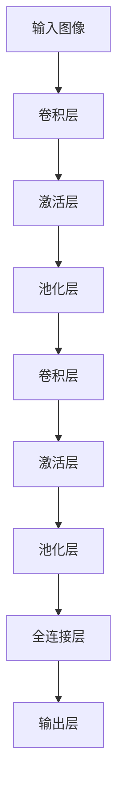
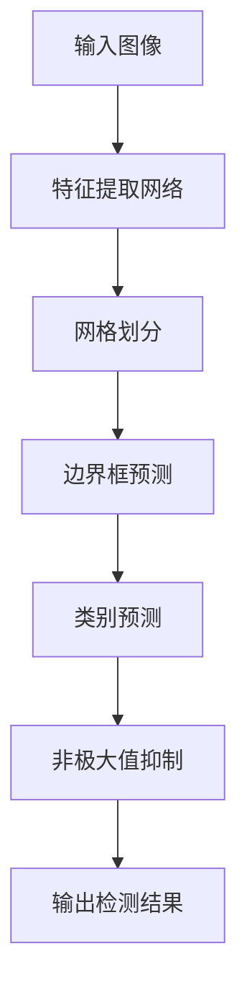
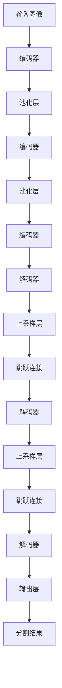

# Computer Vision (CV) 原理与代码实战案例讲解

## 1. 背景介绍

计算机视觉(Computer Vision, CV)是人工智能领域的一个重要分支,旨在使计算机能够从数字图像或视频中获取有意义的信息,并对其进行处理和分析。随着科技的飞速发展,计算机视觉技术已广泛应用于多个领域,如自动驾驶、人脸识别、医疗影像分析、工业自动化检测等。

计算机视觉技术的核心任务包括图像分类、目标检测、语义分割、实例分割、3D重建等。通过深度学习算法,尤其是卷积神经网络(Convolutional Neural Networks, CNN)的发展,计算机视觉取得了长足进步,在各种视觉任务上展现出超人的性能。

## 2. 核心概念与联系

### 2.1 图像表示

在计算机视觉中,图像被表示为一个二维或三维数组,每个元素对应图像中的一个像素。彩色图像通常使用三个通道(RGB)来表示,每个通道对应一种颜色。

### 2.2 特征提取

特征提取是计算机视觉的关键步骤之一。传统方法包括手工设计的特征提取算子,如SIFT、HOG等。深度学习方法则通过卷积神经网络自动学习特征表示。

### 2.3 模型训练

计算机视觉任务通常被建模为监督学习问题。给定大量标注好的训练数据,通过优化目标函数(如交叉熵损失),学习模型参数,使模型在训练数据上的性能最优。

### 2.4 模型评估

在测试数据集上评估模型性能是计算机视觉研究的重要环节。常用的评估指标包括准确率(Accuracy)、精确率(Precision)、召回率(Recall)、平均精度(mAP)等。

## 3. 核心算法原理具体操作步骤

### 3.1 卷积神经网络(CNN)

卷积神经网络是计算机视觉中最常用的深度学习模型,其核心思想是通过卷积操作提取图像的局部特征,并通过池化操作对特征进行下采样,最终通过全连接层对特征进行分类或回归。

CNN的具体操作步骤如下:

1. **输入层**: 将图像数据输入网络。
2. **卷积层**: 通过滑动卷积核在输入特征图上进行卷积操作,提取局部特征。
3. **激活层**: 通过非线性激活函数(如ReLU)增加网络的表达能力。
4. **池化层**: 对特征图进行下采样,减小特征图的尺寸,提高计算效率。
5. **全连接层**: 将特征图展平,并通过全连接层对特征进行高层次抽象。
6. **输出层**: 根据任务类型(分类或回归),输出相应的结果。

在训练过程中,通过反向传播算法更新网络参数,使模型在训练数据上的性能最优。



### 3.2 目标检测算法

目标检测是计算机视觉中一个重要的任务,旨在定位图像中感兴趣的目标并识别它们的类别。常用的目标检测算法包括基于区域的卷积神经网络(R-CNN)系列算法、单阶段算法(如YOLO、SSD)等。

以YOLO算法为例,其具体操作步骤如下:

1. **网格划分**: 将输入图像划分为 S×S 个网格单元。
2. **边界框预测**: 每个网格单元预测 B 个边界框及其置信度。
3. **类别预测**: 每个边界框预测 C 个类别的概率。
4. **非极大值抑制**: 对于同一目标的多个边界框,只保留置信度最高的那个。

YOLO算法的优点是速度快,可以实时进行目标检测,但精度相对其他算法略低。



### 3.3 语义分割算法

语义分割是将图像中的每个像素点与给定的类别相关联,是一种重要的像素级别的视觉任务。常用的语义分割算法包括全卷积网络(FCN)、U-Net、DeepLab等。

以U-Net为例,其具体操作步骤如下:

1. **编码器(Encoder)**: 通过卷积和池化操作提取图像的特征表示。
2. **解码器(Decoder)**: 通过上采样和反卷积操作恢复特征图的分辨率。
3. **跳跃连接(Skip Connection)**: 将编码器的特征图与解码器的对应层相连,融合低级和高级特征。
4. **输出层**: 通过一个1×1卷积层将特征图映射到每个像素的类别概率。

U-Net的优点是能够捕获多尺度的上下文信息,同时保留了精细的空间信息,在医疗图像分割等任务上表现出色。



## 4. 数学模型和公式详细讲解举例说明

### 4.1 卷积操作

卷积操作是卷积神经网络的核心操作,它通过在输入特征图上滑动卷积核来提取局部特征。卷积操作的数学表达式如下:

$$
y_{ij} = \sum_{m}\sum_{n}x_{m+i-1,n+j-1}w_{mn} + b
$$

其中,$ y_{ij} $表示输出特征图在位置(i,j)处的值,$ x_{m+i-1,n+j-1} $表示输入特征图在位置(m+i-1,n+j-1)处的值,$ w_{mn} $表示卷积核的权重,b表示偏置项。

例如,对于一个3×3的卷积核在一个5×5的输入特征图上进行卷积操作,计算过程如下:

```
输入特征图:
[1 2 3 4 5]
[6 7 8 9 10]
[11 12 13 14 15]
[16 17 18 19 20]
[21 22 23 24 25]

卷积核:
[1 2 3]
[4 5 6]
[7 8 9]

输出特征图:
[94 135 176 127 78]
[259 390 521 372 223]
[424 645 866 617 368]
[339 510 681 482 283]
[154 225 296 207 118]
```

可以看出,卷积操作能够捕获输入特征图的局部模式,并通过学习卷积核的权重来提取有用的特征。

### 4.2 池化操作

池化操作是一种下采样操作,它通过在输入特征图上滑动窗口,并取窗口内元素的最大值或平均值,来减小特征图的尺寸。池化操作可以提高模型的计算效率,并增强模型对平移和缩放的鲁棒性。

最大池化操作的数学表达式如下:

$$
y_{ij} = \max_{(m,n) \in R_{ij}}x_{mn}
$$

其中,$ y_{ij} $表示输出特征图在位置(i,j)处的值,$ R_{ij} $表示以(i,j)为中心的池化窗口区域,$ x_{mn} $表示输入特征图在位置(m,n)处的值。

例如,对于一个2×2的最大池化窗口在一个4×4的输入特征图上进行池化操作,计算过程如下:

```
输入特征图:
[1 2 3 4]
[5 6 7 8]
[9 10 11 12]
[13 14 15 16]

最大池化(窗口大小=2):
[6 8]
[14 16]
```

可以看出,最大池化操作能够保留每个窗口内的最大值,从而提取出输入特征图的主要特征。

### 4.3 反向传播算法

反向传播算法是训练深度神经网络的核心算法,它通过计算损失函数对网络参数的梯度,并使用优化算法(如随机梯度下降)更新网络参数,从而使模型在训练数据上的性能最优。

假设我们有一个输入样本 x,对应的真实标签为 y,模型的预测输出为 $\hat{y}$,损失函数为 L(y, $\hat{y}$)。我们的目标是找到模型参数 θ,使得损失函数 L 最小化。

根据链式法则,我们可以计算损失函数对任意参数 $\theta_i$ 的梯度:

$$
\frac{\partial L}{\partial \theta_i} = \frac{\partial L}{\partial \hat{y}} \cdot \frac{\partial \hat{y}}{\partial \theta_i}
$$

其中,$ \frac{\partial L}{\partial \hat{y}} $可以直接计算,$ \frac{\partial \hat{y}}{\partial \theta_i} $则需要通过反向传播算法计算。

反向传播算法的具体步骤如下:

1. 前向传播,计算模型的输出 $\hat{y}$。
2. 计算损失函数 L 对输出 $\hat{y}$ 的梯度 $ \frac{\partial L}{\partial \hat{y}} $。
3. 从输出层开始,反向传播误差梯度,计算每一层的参数梯度。
4. 使用优化算法(如随机梯度下降)更新网络参数。

通过不断迭代上述过程,模型在训练数据上的性能将不断提高。

## 5. 项目实践:代码实例和详细解释说明

在这一部分,我们将通过一个实际的计算机视觉项目,演示如何使用Python和深度学习框架(如PyTorch或TensorFlow)实现目标检测任务。

### 5.1 数据准备

首先,我们需要准备一个标注好的数据集,例如COCO数据集。COCO数据集包含80个常见物体类别,每个图像都有对应的边界框和类别标注。我们将数据集划分为训练集、验证集和测试集。

```python
import torchvision.transforms as transforms
import torchvision.datasets as datasets

# 定义数据预处理
data_transform = transforms.Compose([
    transforms.ToTensor(),
    transforms.Normalize(mean=[0.485, 0.456, 0.406], std=[0.229, 0.224, 0.225])
])

# 加载COCO数据集
train_dataset = datasets.CocoDetection(root='./data/train', annFile='./data/annotations/instances_train2017.json', transform=data_transform)
val_dataset = datasets.CocoDetection(root='./data/val', annFile='./data/annotations/instances_val2017.json', transform=data_transform)
test_dataset = datasets.CocoDetection(root='./data/test', annFile='./data/annotations/instances_test2017.json', transform=data_transform)
```

### 5.2 模型构建

接下来,我们构建一个目标检测模型,例如Faster R-CNN。Faster R-CNN是一种两阶段目标检测算法,包括区域提议网络(RPN)和分类回归网络。

```python
import torchvision.models as models

# 加载预训练模型
backbone = models.resnet50(pretrained=True)

# 构建Faster R-CNN模型
model = models.detection.fasterrcnn_resnet50_fpn(pretrained=False, pretrained_backbone=True)
```

### 5.3 模型训练

定义损失函数、优化器和训练循环,开始训练模型。在训练过程中,我们将定期在验证集上评估模型的性能,并保存最优模型。

```python
import torch.optim as optim

# 定义损失函数和优化器
loss_fn = model.loss_fn
optimizer = optim.SGD(model.parameters(), lr=0.005, momentum=0.9, weight_decay=0.0005)

# 训练循环
num_epochs = 20
for epoch in range(num_epochs):
    # 训练模式
    model.train()
    for images, targets in