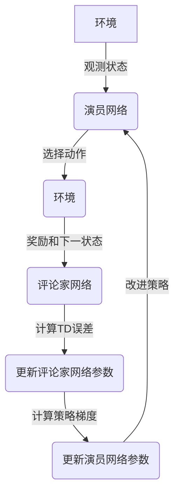

# DDPG的社会责任与公益活动

## 1.背景介绍

在当今快节奏的科技发展时代,人工智能(AI)技术的飞速进步正在深刻影响着我们的生活方式。作为一种强大的通用人工智能算法,深度确定性策略梯度(Deep Deterministic Policy Gradient,DDPG)在机器人控制、自动驾驶、智能系统优化等诸多领域发挥着重要作用。然而,除了追求技术创新,我们也有责任关注DDPG在社会层面的影响,并积极推动其在公益事业中的应用。

## 2.核心概念与联系

### 2.1 深度确定性策略梯度(DDPG)

DDPG是一种基于演员-评论家框架的强化学习算法,旨在解决连续控制问题。它结合了深度Q网络(DQN)和确定性策略梯度算法的优点,能够处理高维连续动作空间,并通过经验回放和目标网络稳定训练过程。

DDPG的核心思想是使用两个神经网络:演员网络用于确定动作,评论家网络用于评估状态-动作对的价值。通过最小化评论家网络的贝尔曼误差,并沿着策略梯度方向更新演员网络,DDPG可以逐步优化策略,达到最佳控制效果。



### 2.2 社会责任与公益活动

社会责任是指企业或个人在追求经济利益的同时,也应该承担起对社会发展的义务和责任。公益活动则是为了造福社会而开展的非营利性事业,旨在改善弱势群体的生活条件、保护环境资源、促进社会和谐等。

DDPG作为一种先进的人工智能技术,不仅可以为商业领域带来效率和收益,更应该发挥其在公益事业中的潜力,为构建更加公平、可持续的社会贡献力量。

## 3.核心算法原理具体操作步骤

DDPG算法的核心步骤如下:

1. **初始化**:初始化评论家网络 $Q(s,a|\theta^Q)$ 和演员网络 $\mu(s|\theta^\mu)$ 的参数,以及目标网络 $Q'$ 和 $\mu'$ 的参数。创建经验回放池 $\mathcal{D}$。

2. **观测初始状态**:从环境观测初始状态 $s_0$。

3. **选择动作**:根据当前策略 $\mu(s_t|\theta^\mu)$ 和探索噪声 $\mathcal{N}$ 选择动作 $a_t = \mu(s_t|\theta^\mu) + \mathcal{N}_t$。

4. **执行动作并观测**:在环境中执行动作 $a_t$,观测到奖励 $r_t$ 和下一状态 $s_{t+1}$。将转换 $(s_t, a_t, r_t, s_{t+1})$ 存储到经验回放池 $\mathcal{D}$ 中。

5. **采样批数据**:从经验回放池 $\mathcal{D}$ 中随机采样一个批量的转换 $(s_i, a_i, r_i, s_{i+1})_{i=1}^N$。

6. **计算目标Q值**:使用目标演员网络 $\mu'$ 选择下一状态的动作 $a_{i+1}' = \mu'(s_{i+1}|\theta^{\mu'})$,并通过目标评论家网络 $Q'$ 计算目标Q值:

$$y_i = r_i + \gamma Q'(s_{i+1}, a_{i+1}'|\theta^{Q'})$$

7. **更新评论家网络**:使用均方误差损失函数,最小化评论家网络的贝尔曼误差:

$$L = \frac{1}{N}\sum_{i=1}^N (y_i - Q(s_i, a_i|\theta^Q))^2$$

通过梯度下降更新评论家网络参数 $\theta^Q$。

8. **更新演员网络**:根据评论家网络对动作的评估,计算策略梯度:

$$\nabla_{\theta^\mu}J \approx \frac{1}{N}\sum_{i=1}^N\nabla_a Q(s,a|\theta^Q)|_{s=s_i,a=\mu(s_i)}\nabla_{\theta^\mu}\mu(s|\theta^\mu)|_{s_i}$$

通过梯度上升更新演员网络参数 $\theta^\mu$。

9. **软更新目标网络**:使用平滑更新规则,缓慢地将评论家网络和演员网络的参数传递给目标网络:

$$\theta^{Q'} \leftarrow \tau\theta^Q + (1-\tau)\theta^{Q'}$$
$$\theta^{\mu'} \leftarrow \tau\theta^\mu + (1-\tau)\theta^{\mu'}$$

其中 $\tau \ll 1$ 是软更新率参数。

10. **回到步骤3**,重复上述过程。

通过不断探索和学习,DDPG算法可以逐步优化策略,在连续控制任务中取得良好的表现。

## 4.数学模型和公式详细讲解举例说明

DDPG算法的数学模型基于马尔可夫决策过程(Markov Decision Process, MDP),可以用元组 $(\mathcal{S}, \mathcal{A}, P, R, \gamma)$ 来表示,其中:

- $\mathcal{S}$ 是状态空间集合
- $\mathcal{A}$ 是动作空间集合
- $P(s_{t+1}|s_t, a_t)$ 是状态转移概率函数
- $R(s_t, a_t)$ 是奖励函数
- $\gamma \in [0, 1)$ 是折现因子

在DDPG中,我们的目标是找到一个策略 $\pi: \mathcal{S} \rightarrow \mathcal{A}$,使得期望的累计折现奖励最大化:

$$J(\pi) = \mathbb{E}_\pi\left[\sum_{t=0}^\infty \gamma^t R(s_t, a_t)\right]$$

为了解决这个优化问题,DDPG引入了一个基于状态值函数 $Q^\pi(s_t, a_t)$ 的性能度量,表示在状态 $s_t$ 执行动作 $a_t$,之后按策略 $\pi$ 行动所能获得的期望累计折现奖励:

$$Q^\pi(s_t, a_t) = \mathbb{E}_\pi\left[\sum_{k=t}^\infty \gamma^{k-t} R(s_k, a_k) | s_t, a_t\right]$$

根据贝尔曼最优性方程,最优Q函数 $Q^*(s, a)$ 满足:

$$Q^*(s, a) = \mathbb{E}_{s' \sim P}\left[R(s, a) + \gamma \max_{a'} Q^*(s', a')\right]$$

我们的目标是找到一个最优策略 $\pi^*$,使得对所有状态 $s \in \mathcal{S}$,有:

$$\pi^*(s) = \arg\max_a Q^*(s, a)$$

DDPG通过使用神经网络来逼近Q函数和策略函数,并通过梯度下降和梯度上升算法进行优化,从而逐步找到最优策略。

让我们用一个简单的例子来说明DDPG算法的工作原理。假设我们有一个机器人需要控制,它的状态由位置和速度组成,动作是施加的力。我们的目标是让机器人到达一个特定的目标位置,并且以最小的能量消耗。

在这个例子中,状态空间 $\mathcal{S}$ 是机器人的位置和速度的笛卡尔积,动作空间 $\mathcal{A}$ 是施加的力的范围。状态转移概率 $P(s_{t+1}|s_t, a_t)$ 由牛顿运动定律确定,奖励函数 $R(s_t, a_t)$可以设置为距离目标位置的负值,加上施加力的平方的负值(表示能量消耗)。

我们使用两个神经网络来近似Q函数和策略函数:

- 评论家网络 $Q(s, a|\theta^Q)$:输入是状态 $s$ 和动作 $a$,输出是预测的Q值。
- 演员网络 $\mu(s|\theta^\mu)$:输入是状态 $s$,输出是预测的最优动作 $a$。

在训练过程中,我们不断地从经验回放池中采样批量的转换 $(s_i, a_i, r_i, s_{i+1})$,计算目标Q值 $y_i$,并最小化评论家网络的贝尔曼误差 $L$。同时,我们根据评论家网络对动作的评估,计算策略梯度 $\nabla_{\theta^\mu}J$,并通过梯度上升算法更新演员网络参数 $\theta^\mu$。

通过不断探索和学习,DDPG算法可以逐步优化策略,找到一个能够让机器人以最小的能量消耗到达目标位置的最优控制策略。

## 5.项目实践:代码实例和详细解释说明

为了更好地理解DDPG算法,我们提供了一个基于PyTorch的实现示例,应用于经典的"倒立摆"(Inverted Pendulum)环境。该环境是一个标准的连续控制任务,目标是通过施加水平力来保持一根摆杆在垂直状态。

### 5.1 导入必要的库

```python
import gym
import torch
import torch.nn as nn
import torch.nn.functional as F
import numpy as np
from collections import deque
```

### 5.2 定义神经网络

首先,我们定义评论家网络和演员网络的神经网络结构。

```python
class Critic(nn.Module):
    def __init__(self, state_dim, action_dim):
        super(Critic, self).__init__()
        self.l1 = nn.Linear(state_dim + action_dim, 256)
        self.l2 = nn.Linear(256, 256)
        self.l3 = nn.Linear(256, 1)

    def forward(self, state, action):
        state_action = torch.cat([state, action], 1)
        x = F.relu(self.l1(state_action))
        x = F.relu(self.l2(x))
        x = self.l3(x)
        return x

class Actor(nn.Module):
    def __init__(self, state_dim, action_dim, action_limit):
        super(Actor, self).__init__()
        self.l1 = nn.Linear(state_dim, 256)
        self.l2 = nn.Linear(256, 256)
        self.l3 = nn.Linear(256, action_dim)
        self.action_limit = action_limit

    def forward(self, state):
        x = F.relu(self.l1(state))
        x = F.relu(self.l2(x))
        x = self.l3(x)
        action = torch.tanh(x) * self.action_limit
        return action
```

### 5.3 定义DDPG算法

接下来,我们实现DDPG算法的核心逻辑。

```python
class DDPG:
    def __init__(self, state_dim, action_dim, action_limit, batch_size=64, gamma=0.99, tau=0.001):
        self.actor = Actor(state_dim, action_dim, action_limit)
        self.critic = Critic(state_dim, action_dim)
        self.target_actor = Actor(state_dim, action_dim, action_limit)
        self.target_critic = Critic(state_dim, action_dim)

        self.actor_optimizer = torch.optim.Adam(self.actor.parameters(), lr=1e-4)
        self.critic_optimizer = torch.optim.Adam(self.critic.parameters(), lr=1e-3)

        self.replay_buffer = deque(maxlen=100000)
        self.batch_size = batch_size
        self.gamma = gamma
        self.tau = tau

        self.update_target_networks(tau=1)

    def update_target_networks(self, tau=None):
        if tau is None:
            tau = self.tau

        actor_params = self.actor.named_parameters()
        critic_params = self.critic.named_parameters()
        target_actor_params = self.target_actor.named_parameters()
        target_critic_params = self.target_critic.named_parameters()

        dict_actor = dict(actor_params)
        dict_critic = dict(critic_params)
        dict_target_actor = dict(target_actor_params)
        dict_target_critic = dict(target_critic_params)

        for name in dict_actor:
            dict_target_actor[name].data.copy_(tau * dict_actor[name].data + (1 - tau) * dict_target_actor[name].data)

        for name in dict_critic:
            dict_target_critic[name].data.copy_(tau * dict_critic[name].data + (1 - tau) * dict_target_critic[name].data)

    def store_transition