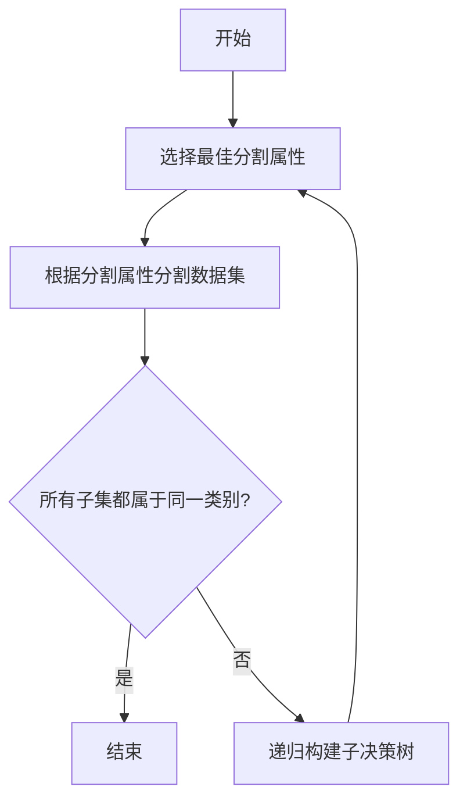
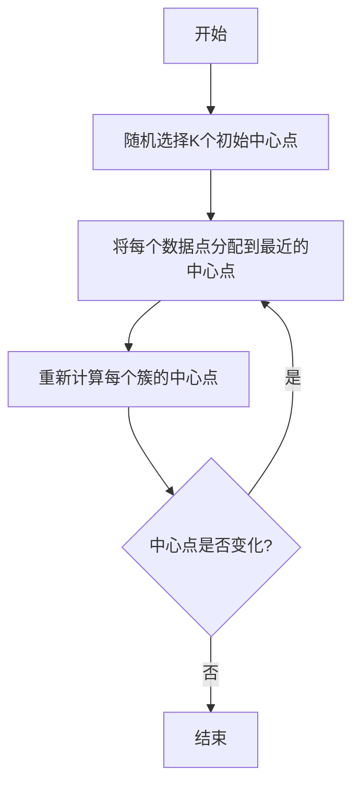

# Data Mining 原理与代码实战案例讲解

## 1.背景介绍

数据挖掘（Data Mining）是从大量数据中提取有用信息和知识的过程。随着大数据时代的到来，数据挖掘技术在各个领域的应用越来越广泛，如金融、医疗、市场营销等。数据挖掘不仅仅是简单的数据处理，它涉及统计学、机器学习、数据库技术等多个学科的知识。

## 2.核心概念与联系

### 2.1 数据挖掘的定义

数据挖掘是指从大量数据中发现隐藏的、有价值的模式和知识的过程。它包括数据预处理、模式发现、模式评估和知识表示等多个步骤。

### 2.2 数据挖掘与机器学习的关系

数据挖掘和机器学习密切相关。机器学习是数据挖掘的核心技术之一，通过学习算法从数据中提取模式和知识。数据挖掘则更关注整个过程，包括数据的获取、清洗、存储、分析和展示。

### 2.3 数据挖掘的主要任务

数据挖掘的主要任务包括分类、回归、聚类、关联规则挖掘、异常检测等。每种任务都有其特定的算法和应用场景。

## 3.核心算法原理具体操作步骤

### 3.1 分类算法

分类是将数据分配到预定义的类别中的过程。常见的分类算法包括决策树、支持向量机、朴素贝叶斯等。

#### 3.1.1 决策树

决策树是一种树形结构的分类模型，通过对数据进行分割来构建分类规则。其核心步骤包括：

1. 选择最佳分割属性
2. 根据分割属性将数据集分成子集
3. 递归地对每个子集构建决策树
4. 直到所有子集都属于同一类别或无法继续分割



### 3.2 聚类算法

聚类是将数据分组，使得同一组内的数据相似度高，不同组间的数据相似度低。常见的聚类算法包括K均值、层次聚类等。

#### 3.2.1 K均值算法

K均值算法通过迭代优化目标函数，将数据分成K个簇。其核心步骤包括：

1. 随机选择K个初始中心点
2. 将每个数据点分配到最近的中心点
3. 重新计算每个簇的中心点
4. 重复步骤2和3，直到中心点不再变化



## 4.数学模型和公式详细讲解举例说明

### 4.1 决策树的数学模型

决策树的核心是选择最佳分割属性。常用的选择标准包括信息增益、基尼指数等。

#### 4.1.1 信息增益

信息增益是基于熵的概念来衡量分割属性的好坏。熵表示数据集的不确定性，信息增益表示分割后不确定性的减少。

$$
H(D) = - \sum_{i=1}^{n} p_i \log_2 p_i
$$

其中，$H(D)$ 是数据集 $D$ 的熵，$p_i$ 是类别 $i$ 的概率。

信息增益定义为：

$$
IG(D, A) = H(D) - \sum_{v \in Values(A)} \frac{|D_v|}{|D|} H(D_v)
$$

其中，$IG(D, A)$ 是属性 $A$ 对数据集 $D$ 的信息增益，$D_v$ 是属性 $A$ 取值为 $v$ 的子集。

### 4.2 K均值的数学模型

K均值算法的目标是最小化簇内数据点到簇中心的距离平方和。目标函数定义为：

$$
J = \sum_{i=1}^{K} \sum_{x \in C_i} \| x - \mu_i \|^2
$$

其中，$K$ 是簇的数量，$C_i$ 是第 $i$ 个簇，$\mu_i$ 是第 $i$ 个簇的中心。

## 5.项目实践：代码实例和详细解释说明

### 5.1 决策树的代码实现

以下是使用Python实现决策树分类的示例代码：

```python
from sklearn.datasets import load_iris
from sklearn.tree import DecisionTreeClassifier
from sklearn.model_selection import train_test_split
from sklearn.metrics import accuracy_score

# 加载数据集
data = load_iris()
X = data.data
y = data.target

# 划分训练集和测试集
X_train, X_test, y_train, y_test = train_test_split(X, y, test_size=0.3, random_state=42)

# 创建决策树分类器
clf = DecisionTreeClassifier()

# 训练模型
clf.fit(X_train, y_train)

# 预测
y_pred = clf.predict(X_test)

# 计算准确率
accuracy = accuracy_score(y_test, y_pred)
print(f'Accuracy: {accuracy}')
```

### 5.2 K均值的代码实现

以下是使用Python实现K均值聚类的示例代码：

```python
from sklearn.datasets import make_blobs
from sklearn.cluster import KMeans
import matplotlib.pyplot as plt

# 生成数据集
X, _ = make_blobs(n_samples=300, centers=4, cluster_std=0.60, random_state=0)

# 创建K均值模型
kmeans = KMeans(n_clusters=4)

# 训练模型
kmeans.fit(X)

# 预测簇标签
y_kmeans = kmeans.predict(X)

# 可视化结果
plt.scatter(X[:, 0], X[:, 1], c=y_kmeans, s=50, cmap='viridis')
centers = kmeans.cluster_centers_
plt.scatter(centers[:, 0], centers[:, 1], c='red', s=200, alpha=0.75)
plt.show()
```

## 6.实际应用场景

### 6.1 金融领域

在金融领域，数据挖掘技术被广泛应用于信用评分、欺诈检测、风险管理等方面。例如，通过分类算法可以对客户进行信用评分，通过聚类算法可以对客户进行分群，从而制定个性化的金融产品和服务。

### 6.2 医疗领域

在医疗领域，数据挖掘技术可以用于疾病预测、患者分类、医疗资源优化等。例如，通过分类算法可以预测患者的疾病风险，通过聚类算法可以对患者进行分群，从而提供个性化的治疗方案。

### 6.3 市场营销

在市场营销中，数据挖掘技术可以用于客户细分、市场分析、推荐系统等。例如，通过关联规则挖掘可以发现商品之间的关联关系，从而进行交叉销售和推荐。

## 7.工具和资源推荐

### 7.1 工具推荐

- **Python**：Python是数据挖掘领域最常用的编程语言之一，拥有丰富的库和工具，如Scikit-learn、Pandas、NumPy等。
- **R**：R语言在统计分析和数据挖掘方面有着广泛的应用，拥有丰富的统计和数据挖掘包。
- **Weka**：Weka是一个开源的数据挖掘软件，提供了丰富的算法和工具，适合初学者和研究人员使用。

### 7.2 资源推荐

- **《Data Mining: Concepts and Techniques》**：这本书是数据挖掘领域的经典教材，详细介绍了数据挖掘的基本概念和技术。
- **Coursera上的数据挖掘课程**：Coursera上有许多优质的数据挖掘课程，如斯坦福大学的《Machine Learning》课程。
- **Kaggle**：Kaggle是一个数据科学竞赛平台，提供了丰富的数据集和竞赛，适合进行数据挖掘实践。

## 8.总结：未来发展趋势与挑战

数据挖掘技术在未来将继续发展，并在更多领域得到应用。随着数据量的不断增加和计算能力的提升，数据挖掘技术将变得更加智能和高效。然而，数据隐私和安全问题也将成为数据挖掘面临的重要挑战。如何在保护数据隐私的前提下，充分利用数据挖掘技术，是未来需要解决的重要问题。

## 9.附录：常见问题与解答

### 9.1 数据挖掘与数据分析的区别是什么？

数据挖掘和数据分析都是从数据中提取信息和知识的过程，但它们的侧重点不同。数据分析更关注数据的描述和解释，通常使用统计方法。数据挖掘则更关注从数据中发现隐藏的模式和知识，通常使用机器学习和人工智能技术。

### 9.2 如何选择合适的数据挖掘算法？

选择合适的数据挖掘算法需要考虑多个因素，如数据的类型和规模、任务的目标和要求、算法的性能和复杂度等。通常可以通过实验和比较来选择最适合的算法。

### 9.3 数据挖掘的结果如何解释和应用？

数据挖掘的结果需要结合具体的应用场景进行解释和应用。通常可以通过可视化、报告和决策支持系统等方式，将数据挖掘的结果转化为有用的信息和知识，辅助决策和行动。

---

作者：禅与计算机程序设计艺术 / Zen and the Art of Computer Programming