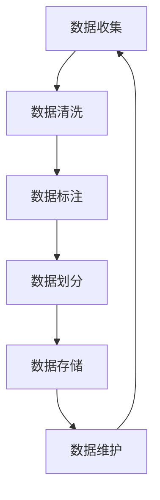

# Dataset 原理与代码实例讲解

## 1. 背景介绍

在当今的数据驱动时代,数据集(Dataset)是人工智能、机器学习和数据科学领域中不可或缺的核心组成部分。无论是训练模型、评估算法性能还是探索数据模式,高质量的数据集都扮演着关键角色。本文将深入探讨数据集的基本概念、构建原理以及实际应用,为读者提供全面的理解和实践指导。

### 1.1 数据集的重要性

数据是人工智能和机器学习算法的燃料,决定了模型的性能上限。高质量的数据集不仅能够提高模型的准确性和泛化能力,还能够促进算法的创新和发展。在许多领域,如计算机视觉、自然语言处理、推荐系统等,数据集的质量直接影响着应用的效果和用户体验。

### 1.2 数据集的挑战

尽管数据集的重要性不言而喻,但构建高质量数据集并非一蹴而就。数据收集、标注、清洗和管理都是巨大的挑战。此外,数据隐私、偏差和噪声等问题也需要被妥善处理,以确保数据集的公平性和可靠性。

## 2. 核心概念与联系

### 2.1 数据集的定义

数据集是一组有组织的数据,通常包含多个数据实例(样本)和相关的元数据。每个数据实例由一个或多个特征(features)组成,特征可以是数值型、类别型或其他类型的数据。数据集还可能包含目标变量(target variable)或标签(labels),用于监督学习任务。

### 2.2 数据集的类型

根据数据的性质和用途,数据集可以分为以下几种类型:

1. **结构化数据集**: 包含表格形式的数据,每行代表一个实例,每列代表一个特征。
2. **非结构化数据集**: 包含文本、图像、视频等非结构化数据。
3. **时序数据集**: 包含随时间变化的数据序列,如股票价格、传感器读数等。
4. **地理空间数据集**: 包含带有地理位置信息的数据,如GPS坐标、地图数据等。

### 2.3 数据集的生命周期

数据集的生命周期包括以下几个阶段:

1. **数据收集**: 从各种来源获取原始数据。
2. **数据清洗**: 处理缺失值、异常值和噪声数据。
3. **数据标注**: 为监督学习任务标注目标变量或标签。
4. **数据划分**: 将数据集划分为训练集、验证集和测试集。
5. **数据存储**: 将数据集存储在适当的格式和位置。
6. **数据维护**: 持续更新和优化数据集。



## 3. 核心算法原理具体操作步骤

### 3.1 数据收集

数据收集是构建数据集的第一步,也是最关键的一步。数据可以来自多种来源,如网络爬虫、传感器、调查问卷、公开数据集等。在收集数据时,需要注意以下几点:

1. **数据来源的多样性**: 确保数据来自不同的渠道和环境,以增加数据的代表性和泛化能力。
2. **数据质量控制**: 建立数据质量标准,过滤掉低质量或不相关的数据。
3. **隐私和伦理考虑**: 遵守相关的隐私法规和伦理准则,保护个人隐私。
4. **版权问题**: 确保数据的合法使用,避免侵犯版权。

### 3.2 数据清洗

收集到的原始数据通常存在各种问题,如缺失值、异常值、重复数据、噪声等。数据清洗旨在提高数据质量,为后续的分析和建模奠定基础。常见的数据清洗技术包括:

1. **缺失值处理**: 通过删除、插补或预测等方式处理缺失值。
2. **异常值处理**: 识别并处理异常值,如删除、修正或保留。
3. **数据规范化**: 将数据转换为统一的格式和单位。
4. **数据去重**: 删除重复的数据实例。
5. **噪声过滤**: 使用滤波器或其他技术去除噪声数据。

### 3.3 数据标注

对于监督学习任务,需要为数据实例标注目标变量或标签。数据标注是一个耗时且昂贵的过程,通常需要人工参与。常见的数据标注方法包括:

1. **人工标注**: 由专家或众包工人手动标注数据。
2. **半监督标注**: 结合少量人工标注数据和大量未标注数据进行标注。
3. **自动标注**: 使用规则或模型自动生成标签,但准确性有限。
4. **主动学习**: 智能地选择最有价值的数据进行人工标注。
5. **弱监督标注**: 利用已有的弱监督信号(如元数据)进行标注。

### 3.4 数据划分

在进行模型训练和评估之前,需要将数据集划分为训练集、验证集和测试集。这一步骤对于防止过拟合和评估模型泛化能力至关重要。常见的数据划分策略包括:

1. **随机划分**: 随机将数据划分为训练集和测试集。
2. **stratified划分**: 根据目标变量的分布情况进行分层采样。
3. **时间序列划分**: 对于时序数据,按时间顺序划分训练集和测试集。
4. **交叉验证**: 将数据集划分为多个折叠,轮流作为训练集和测试集。

### 3.5 数据存储

将清洗和标注后的数据集存储在适当的位置和格式是非常重要的。常见的数据存储格式包括:

1. **文本格式**: 如CSV、JSON、XML等。
2. **二进制格式**: 如HDF5、Parquet等,具有更高的存储效率。
3. **数据库**: 如关系型数据库、NoSQL数据库等。
4. **云存储**: 如Amazon S3、Google Cloud Storage等。

在选择存储格式时,需要考虑数据大小、访问效率、可扩展性等因素。

### 3.6 数据维护

数据集并非一成不变,需要持续维护和优化,以确保其质量和时效性。常见的数据维护操作包括:

1. **数据更新**: 定期添加新的数据实例,以反映最新的数据分布。
2. **数据修正**: 修正已发现的错误或低质量数据。
3. **数据扩充**: 通过数据增强等技术扩充数据集,提高数据多样性。
4. **数据版本控制**: 对数据集进行版本管理,方便追踪和回滚。
5. **元数据管理**: 维护数据集的元数据,如数据来源、标注方法等。

## 4. 数学模型和公式详细讲解举例说明

在构建和评估数据集时,常常需要使用一些数学模型和公式。本节将介绍一些常见的模型和公式,并给出具体的例子和说明。

### 4.1 数据分布

了解数据的分布是非常重要的,因为它直接影响到模型的性能和泛化能力。常见的数据分布包括:

1. **正态分布(高斯分布)**: 钟形曲线,由均值$\mu$和标准差$\sigma$参数化。概率密度函数为:

$$
f(x) = \frac{1}{\sqrt{2\pi\sigma^2}}e^{-\frac{(x-\mu)^2}{2\sigma^2}}
$$

2. **均匀分布**: 在给定区间内,每个值出现的概率相等。
3. **伯努利分布**: 适用于二元变量,由成功概率$p$参数化。
4. **多项式分布**: 适用于多元变量,由每个类别的概率向量参数化。

了解数据分布有助于选择合适的数据预处理和模型架构。例如,如果特征服从正态分布,可以考虑对其进行标准化(z-score标准化)。

### 4.2 数据不平衡

在许多实际问题中,数据集中不同类别的实例数量存在很大差异,这种现象被称为数据不平衡(class imbalance)。数据不平衡会导致模型过度偏向于多数类,忽视少数类,影响模型的整体性能。

评估数据不平衡程度的一个常用指标是**不平衡比率**(imbalance ratio),定义为:

$$
\text{imbalance ratio} = \frac{\max_i(n_i)}{\min_i(n_i)}
$$

其中$n_i$表示第$i$类的实例数量。不平衡比率越大,数据不平衡程度越高。

处理数据不平衡的常见方法包括:

1. **过采样(Over-sampling)**: 通过复制或生成新的少数类实例来增加其数量。
2. **欠采样(Under-sampling)**: 减少多数类实例的数量。
3. **改变分类阈值(Adjust threshold)**: 调整分类器的决策阈值,使其对少数类更加敏感。
4. **代价敏感学习(Cost-sensitive learning)**: 为不同类别的错误分类赋予不同的代价权重。

### 4.3 数据质量评估

评估数据集的质量是非常重要的,因为它直接影响到模型的性能和可靠性。常见的数据质量评估指标包括:

1. **覆盖率(Coverage)**: 数据集覆盖的领域或场景范围。
2. **多样性(Diversity)**: 数据实例的多样性程度。
3. **噪声水平(Noise level)**: 数据中噪声的比例。
4. **类别平衡(Class balance)**: 不同类别实例数量的均衡程度。
5. **标注质量(Annotation quality)**: 标注的准确性和一致性。

评估数据质量的一种常用方法是**混淆矩阵**(confusion matrix)。对于二元分类问题,混淆矩阵如下所示:

```
          Predicted
         +--------+--------+
         |   1    |   0    |
    +----+--------+--------+
 Act | 1  |   TP   |   FN   |
 ual +----+--------+--------+
     | 0  |   FP   |   TN   |
    +----+--------+--------+
```

其中,TP(True Positive)表示正确预测为正例的数量,FN(False Negative)表示错误预测为负例的数量,FP(False Positive)表示错误预测为正例的数量,TN(True Negative)表示正确预测为负例的数量。

基于混淆矩阵,可以计算出多个评估指标,如准确率(Accuracy)、精确率(Precision)、召回率(Recall)、F1分数等。这些指标可以帮助我们全面评估数据集的质量。

## 5. 项目实践: 代码实例和详细解释说明

为了更好地理解数据集的构建和使用,本节将提供一个实际项目的代码实例,并对关键步骤进行详细解释。我们将使用Python编程语言和一些常用的数据科学库,如Pandas、NumPy和Scikit-learn。

### 5.1 项目概述

本项目旨在构建一个用于手写数字识别的数据集,并训练一个基于卷积神经网络(CNN)的分类模型。我们将使用著名的MNIST数据集作为基础,并对其进行一些扩充和增强,以提高模型的泛化能力。

### 5.2 数据加载和探索

首先,我们需要加载MNIST数据集并对其进行初步探索。

```python
from tensorflow.keras.datasets import mnist
import matplotlib.pyplot as plt

# 加载MNIST数据集
(x_train, y_train), (x_test, y_test) = mnist.load_data()

# 查看数据形状
print("训练集大小:", x_train.shape, y_train.shape)
print("测试集大小:", x_test.shape, y_test.shape)

# 可视化部分图像
plt.figure(figsize=(10, 5))
for i in range(10):
    plt.subplot(2, 5, i+1)
    plt.imshow(x_train[i], cmap='gray')
    plt.title(f"Label: {y_train[i]}")
    plt.axis('off')
plt.show()
```

上述代码将加载MNIST数据集,并打印出训练集和测试集的大小。然后,它会可视化前10个训练图像及其对应的标签。

### 5