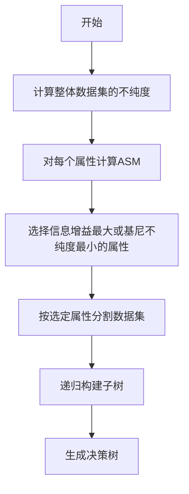

# Decision Trees 原理与代码实战案例讲解

## 1. 背景介绍

决策树（Decision Trees）是一种基础且广泛应用的机器学习算法。它模拟人类决策过程，通过一系列规则对数据进行分类或回归。决策树易于理解和实现，且具有良好的解释性，因此在商业智能、医疗诊断、信用评分等领域得到了广泛应用。

## 2. 核心概念与联系

决策树由节点和分支构成，其中节点分为内部节点和叶节点。内部节点代表一个属性上的测试，叶节点代表决策结果。构建决策树的过程就是选择最优属性进行分支的过程。

### 2.1 决策树的组成

- **根节点（Root Node）**：包含样本全集，是决策树的起点。
- **内部节点（Internal Node）**：对应属性上的测试，根据测试结果分支。
- **叶节点（Leaf Node）**：表示最终的决策结果，不再分支。

### 2.2 关键术语

- **属性选择度量（Attribute Selection Measure, ASM）**：用于选择最优属性进行分支的标准。
- **信息增益（Information Gain）**：度量分支前后信息不确定性的减少。
- **基尼不纯度（Gini Impurity）**：用于CART算法中，度量数据集的不纯度。

## 3. 核心算法原理具体操作步骤

构建决策树的核心步骤包括属性选择、树的生成和剪枝。

### 3.1 属性选择



### 3.2 树的生成

从根节点开始，递归地使用属性选择方法分割数据集，直到满足停止条件。

### 3.3 剪枝

为防止过拟合，通过剪枝减少树的复杂度，包括预剪枝和后剪枝。

## 4. 数学模型和公式详细讲解举例说明

### 4.1 信息增益

$$
\text{信息增益}(D, A) = \text{信息熵}(D) - \sum_{v \in A} \frac{|D_v|}{|D|} \text{信息熵}(D_v)
$$

其中，$D$ 是数据集，$A$ 是属性，$D_v$ 是属性 $A$ 上值为 $v$ 的子集。

### 4.2 基尼不纯度

$$
\text{基尼不纯度}(D) = 1 - \sum_{i=1}^{m} p_i^2
$$

其中，$p_i$ 是数据集 $D$ 中第 $i$ 类样本的概率，$m$ 是类别的总数。

## 5. 项目实践：代码实例和详细解释说明

以Python语言和scikit-learn库为例，展示决策树在鸢尾花分类问题上的应用。

```python
from sklearn.datasets import load_iris
from sklearn.tree import DecisionTreeClassifier
from sklearn.model_selection import train_test_split
from sklearn.metrics import accuracy_score

# 加载数据集
iris = load_iris()
X, y = iris.data, iris.target

# 划分训练集和测试集
X_train, X_test, y_train, y_test = train_test_split(X, y, test_size=0.3, random_state=42)

# 创建决策树模型
clf = DecisionTreeClassifier(criterion='entropy')  # 使用信息增益作为属性选择度量
clf.fit(X_train, y_train)

# 预测测试集
y_pred = clf.predict(X_test)

# 计算准确率
accuracy = accuracy_score(y_test, y_pred)
print(f'Accuracy: {accuracy:.2f}')
```

## 6. 实际应用场景

决策树在金融风控、医疗诊断、推荐系统等多个领域有着广泛的应用。

## 7. 工具和资源推荐

- **scikit-learn**：提供多种决策树算法的Python库。
- **WEKA**：包含决策树算法的机器学习工具包。
- **XGBoost**：高性能的决策树集成框架。

## 8. 总结：未来发展趋势与挑战

决策树的研究将继续集中在提高算法的效率、减少过拟合以及增强模型的解释性上。集成学习和深度学习的结合是未来的一个重要趋势。

## 9. 附录：常见问题与解答

- **Q1**: 决策树如何处理连续属性？
- **A1**: 通过设定阈值将连续属性离散化。

- **Q2**: 决策树如何避免过拟合？
- **A2**: 通过剪枝技术和限制树的深度来避免过拟合。

- **Q3**: 决策树在大数据集上的表现如何？
- **A3**: 在大数据集上，决策树可能需要更多时间进行训练，但可以通过算法优化和硬件加速来改善。

作者：禅与计算机程序设计艺术 / Zen and the Art of Computer Programming