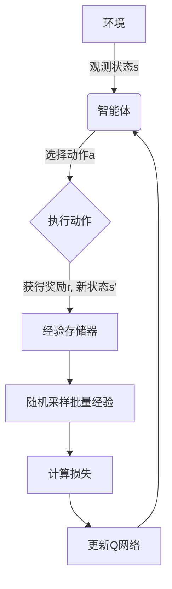
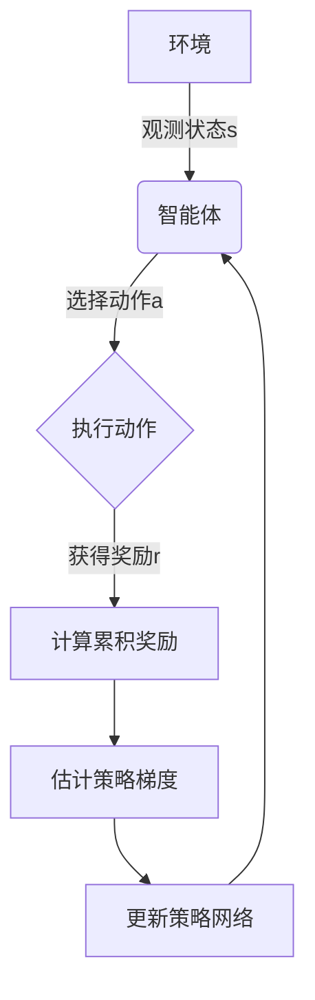
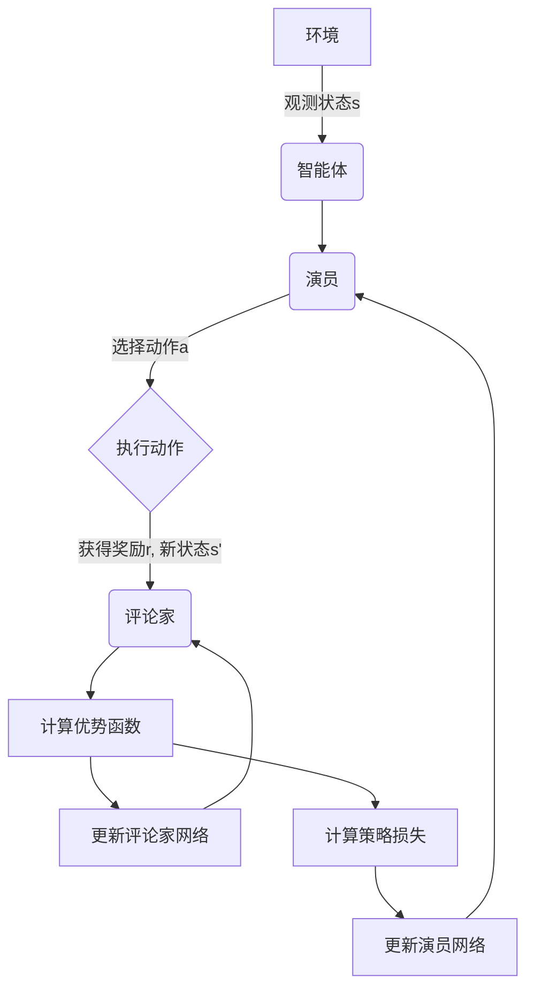

# Deep Reinforcement Learning原理与代码实例讲解

## 1.背景介绍

### 1.1 什么是强化学习

强化学习(Reinforcement Learning, RL)是机器学习的一个重要分支,它研究如何基于环境反馈来学习行为策略,以最大化长期累积奖励。与监督学习不同,强化学习没有提供标准答案,而是通过探索与学习来发现最优策略。

### 1.2 强化学习的发展历程

早期的强化学习主要应用于小规模、离散的问题,如棋类游戏。随着计算能力的提高和算法的发展,强化学习开始应用于更加复杂的连续控制问题,如机器人控制、自动驾驶等。近年来,结合深度学习的深度强化学习(Deep Reinforcement Learning, DRL)取得了突破性进展,在很多领域展现出超人类的表现。

### 1.3 深度强化学习的重要性

深度强化学习将深度神经网络引入强化学习,使得智能体可以直接从原始输入(如图像、声音等)中学习策略,而不需要人工设计特征。这极大地扩展了强化学习的应用范围,使其能够解决更加复杂的现实问题。深度强化学习在游戏、机器人控制、自然语言处理等领域取得了卓越的成就,成为人工智能研究的前沿方向之一。

## 2.核心概念与联系

### 2.1 强化学习的基本概念

强化学习问题通常建模为马尔可夫决策过程(Markov Decision Process, MDP),由以下要素组成:

- 状态(State) $s$: 环境的当前状况。
- 动作(Action) $a$: 智能体可执行的操作。
- 奖励(Reward) $r$: 环境对智能体行为的反馈,用于指导学习。
- 策略(Policy) $\pi$: 智能体在每个状态下选择动作的策略,是学习的目标。
- 状态转移概率(State Transition Probability) $P(s'|s,a)$: 在状态 $s$ 执行动作 $a$ 后,转移到状态 $s'$ 的概率。
- 折扣因子(Discount Factor) $\gamma$: 用于权衡即时奖励和长期奖励的重要性。

目标是学习一个最优策略 $\pi^*$,使得在任何状态 $s$ 下执行该策略,可获得最大化的期望累积奖励。

### 2.2 值函数与贝尔曼方程

值函数(Value Function)用于估计在给定状态或状态-动作对下执行某策略所能获得的期望累积奖励。有两种主要的值函数:

- 状态值函数(State-Value Function) $V^{\pi}(s)$: 在状态 $s$ 下执行策略 $\pi$ 所能获得的期望累积奖励。
- 动作值函数(Action-Value Function) $Q^{\pi}(s,a)$: 在状态 $s$ 下执行动作 $a$,之后遵循策略 $\pi$ 所能获得的期望累积奖励。

贝尔曼方程(Bellman Equation)将值函数与即时奖励和后继状态的值函数联系起来,是强化学习算法的基础。对于 $Q^{\pi}(s,a)$,其贝尔曼方程为:

$$Q^{\pi}(s,a) = \mathbb{E}_\pi[r_t + \gamma Q^{\pi}(s_{t+1}, a_{t+1})|s_t=s, a_t=a]$$

其中 $r_t$ 是立即奖励, $\gamma$ 是折扣因子, $s_{t+1}$ 和 $a_{t+1}$ 分别是后继状态和动作。

### 2.3 深度强化学习

深度强化学习将深度神经网络引入强化学习,用于近似值函数或直接学习策略。常见的深度强化学习算法包括:

- 深度Q网络(Deep Q-Network, DQN)
- 策略梯度(Policy Gradient)算法
- 演员-评论家(Actor-Critic)算法

这些算法利用神经网络的强大近似能力,可以从高维原始输入(如图像、语音等)中直接学习策略,显著提高了强化学习的性能和应用范围。

## 3.核心算法原理具体操作步骤

### 3.1 深度Q网络(DQN)

DQN是深度强化学习的里程碑式算法,它使用深度神经网络来近似动作值函数 $Q(s,a)$。DQN的核心思想是使用经验回放(Experience Replay)和目标网络(Target Network)来稳定训练过程。

1. 初始化Q网络和目标Q网络,两者参数相同。
2. 在每个时间步:
    a. 根据当前状态 $s$,使用 $\epsilon$-贪婪策略从Q网络中选择动作 $a$。
    b. 在环境中执行动作 $a$,获得奖励 $r$ 和新状态 $s'$。
    c. 将 $(s,a,r,s')$ 存储到经验回放池中。
    d. 从经验回放池中随机采样一个批量的经验。
    e. 计算损失函数,如均方损失: $L = \mathbb{E}_{(s,a,r,s')\sim D}\left[(r + \gamma \max_{a'}Q_{\text{target}}(s',a') - Q(s,a))^2\right]$
    f. 使用优化算法(如随机梯度下降)更新Q网络的参数,最小化损失函数。
    g. 每隔一定步数,将Q网络的参数复制到目标Q网络。

3. 重复步骤2,直至收敛。

DQN的关键在于使用经验回放和目标网络来减小相关性和不稳定性,从而提高训练效率和性能。

### 3.2 策略梯度算法

策略梯度(Policy Gradient)算法直接学习策略 $\pi_\theta(a|s)$,其中 $\theta$ 是可学习的参数。目标是最大化期望累积奖励 $J(\theta) = \mathbb{E}_{\pi_\theta}[\sum_{t=0}^\infty \gamma^t r_t]$。

1. 初始化策略网络 $\pi_\theta(a|s)$,其输出是每个动作的概率分布。
2. 在每个episode:
    a. 根据当前状态 $s$,从策略网络 $\pi_\theta(a|s)$ 中采样动作 $a$。
    b. 在环境中执行动作 $a$,获得奖励 $r$ 和新状态 $s'$。
    c. 计算累积奖励 $G_t = \sum_{k=t}^T \gamma^{k-t} r_k$。
    d. 估计策略梯度 $\nabla_\theta J(\theta) \approx \frac{1}{N}\sum_{n=1}^N \sum_{t=0}^{T_n} \nabla_\theta \log \pi_\theta(a_t^n|s_t^n)G_t^n$。
    e. 使用优化算法(如随机梯度上升)更新策略网络的参数 $\theta$,最大化 $J(\theta)$。

3. 重复步骤2,直至收敛。

策略梯度算法的优点是可以直接学习随机策略,适用于连续动作空间。但它也存在高方差、样本效率低等缺点。

### 3.3 演员-评论家算法

演员-评论家(Actor-Critic)算法结合了值函数估计和策略梯度的优点,通常具有更好的收敛性和样本效率。它包含两个部分:

- 演员(Actor) $\pi_\theta(a|s)$: 根据当前状态选择动作的策略网络。
- 评论家(Critic) $V_\phi(s)$ 或 $Q_\phi(s,a)$: 评估当前状态或状态-动作对的值函数。

1. 初始化演员网络 $\pi_\theta(a|s)$ 和评论家网络 $V_\phi(s)$ 或 $Q_\phi(s,a)$。
2. 在每个时间步:
    a. 根据当前状态 $s$,从演员网络 $\pi_\theta(a|s)$ 中采样动作 $a$。
    b. 在环境中执行动作 $a$,获得奖励 $r$ 和新状态 $s'$。
    c. 计算优势函数(Advantage Function) $A(s,a) = Q(s,a) - V(s)$。
    d. 更新评论家网络,最小化均方损失 $L_V(\phi) = \mathbb{E}_{s\sim\pi_\theta}\left[(V_\phi(s) - V_\text{target}(s))^2\right]$。
    e. 计算策略损失函数,如 $L_\pi(\theta) = -\mathbb{E}_{s\sim\pi_\theta,a\sim\pi_\theta}\left[A(s,a)\log\pi_\theta(a|s)\right]$。
    f. 更新演员网络,最小化策略损失函数 $L_\pi(\theta)$。

3. 重复步骤2,直至收敛。

演员-评论家算法通过评论家网络估计值函数,从而减小策略梯度的方差,提高了样本效率和稳定性。

## 4.数学模型和公式详细讲解举例说明

### 4.1 马尔可夫决策过程(MDP)

马尔可夫决策过程是强化学习问题的数学模型,由以下要素组成:

- 状态集合 $\mathcal{S}$
- 动作集合 $\mathcal{A}$
- 奖励函数 $R(s,a,s')$: 在状态 $s$ 执行动作 $a$ 后,转移到状态 $s'$ 所获得的奖励。
- 状态转移概率 $P(s'|s,a)$: 在状态 $s$ 执行动作 $a$ 后,转移到状态 $s'$ 的概率。
- 折扣因子 $\gamma \in [0,1)$: 用于权衡即时奖励和长期奖励的重要性。

在 MDP 中,智能体的目标是学习一个策略 $\pi: \mathcal{S} \rightarrow \mathcal{A}$,使得期望累积奖励最大化:

$$J(\pi) = \mathbb{E}_\pi\left[\sum_{t=0}^\infty \gamma^t R(s_t, a_t, s_{t+1})\right]$$

其中 $s_0$ 是初始状态, $a_t \sim \pi(\cdot|s_t)$ 是根据策略 $\pi$ 在状态 $s_t$ 选择的动作。

### 4.2 值函数与贝尔曼方程

值函数用于估计在给定状态或状态-动作对下执行某策略所能获得的期望累积奖励。有两种主要的值函数:

- 状态值函数 $V^\pi(s)$: 在状态 $s$ 下执行策略 $\pi$ 所能获得的期望累积奖励:

$$V^\pi(s) = \mathbb{E}_\pi\left[\sum_{t=0}^\infty \gamma^t R(s_t, a_t, s_{t+1})|s_0=s\right]$$

- 动作值函数 $Q^\pi(s,a)$: 在状态 $s$ 下执行动作 $a$,之后遵循策略 $\pi$ 所能获得的期望累积奖励:

$$Q^\pi(s,a) = \mathbb{E}_\pi\left[\sum_{t=0}^\infty \gamma^t R(s_t, a_t, s_{t+1})|s_0=s, a_0=a\right]$$

贝尔曼方程将值函数与即时奖励和后继状态的值函数