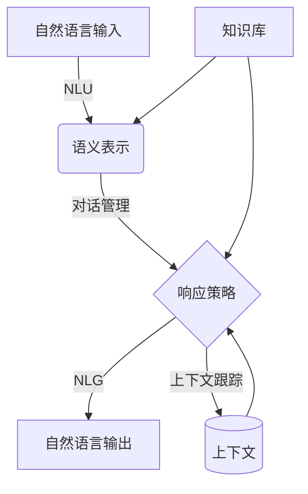

# Dialogue Systems原理与代码实例讲解

## 1.背景介绍

对话系统(Dialogue Systems)是一种人工智能技术,旨在使计算机能够像人类一样进行自然语言交互。它们是将自然语言理解(Natural Language Understanding, NLU)和自然语言生成(Natural Language Generation, NLG)技术相结合的智能系统。

对话系统的发展可以追溯到20世纪60年代,当时的系统如ELIZA和PARRY主要基于规则和模板。近年来,benefiting from the rapid development of机器学习、深度学习和大规模语料库,对话系统的性能得到了极大的提升,应用领域也日益广泛。

现代对话系统广泛应用于虚拟助手、客户服务、智能家居、在线教育、医疗健康等诸多领域,为人类提供自然、高效的交互体验。它们不仅能够回答问题、执行任务,还可以进行多轮交互、理解上下文、捕捉用户意图等,展现出越来越强大的能力。

## 2.核心概念与联系

对话系统涉及多个核心概念,包括:

1. **自然语言理解(NLU)**: 将用户的自然语言输入(文本或语音)转化为对话系统可以理解的语义表示。

2. **对话管理(Dialogue Management)**: 根据当前对话状态和上下文,决定系统的响应策略和行为。

3. **自然语言生成(NLG)**: 将对话系统的语义表示转化为自然语言输出(文本或语音)。

4. **上下文跟踪(Context Tracking)**: 跟踪和维护对话过程中的上下文信息,以确保响应的连贯性和一致性。

5. **知识库(Knowledge Base)**: 存储系统所需的结构化知识和数据,为对话提供支持。

这些概念相互关联、环环相扣,共同构建了对话系统的核心架构。下面我们将详细探讨它们的原理和实现方法。



## 3.核心算法原理具体操作步骤

### 3.1 自然语言理解(NLU)

自然语言理解旨在从用户的自然语言输入中提取语义信息,包括意图(Intent)和实体(Entity)等。这是对话系统理解用户输入的关键步骤。

常见的NLU算法包括:

1. **规则匹配**:基于手工编写的规则对输入进行模式匹配,提取意图和实体。

2. **机器学习方法**:将NLU任务建模为序列标注问题,使用条件随机场(CRF)、最大熵模型等算法进行意图分类和实体识别。

3. **深度学习方法**:利用神经网络模型(如RNN、CNN等)自动学习输入的语义表示,再进行意图分类和实体识别。常见模型包括Joint BERT、DIET、Bi-Encoder等。

NLU的具体步骤如下:

1. **文本预处理**:对输入文本进行分词、词性标注、命名实体识别等预处理。

2. **特征提取**:从预处理后的文本中提取相关的特征,如词袋(Bag of Words)、TF-IDF等。

3. **意图分类**:将特征输入分类器(如逻辑回归、SVM或深度学习模型),预测输入的意图类别。

4. **实体识别**:在输入文本中识别出与意图相关的实体(如时间、地点、数量等)。

5. **语义框架生成**:将意图和实体组合,生成结构化的语义表示(如意图 + 实体对)。

下面是一个使用DIET模型进行NLU的示例代码:

```python
from rasa.nlu.components import ComponentBuilder

# 1. 构建DIET模型组件
component_builder = ComponentBuilder()
diet_component = component_builder.create_component("DIETClassifier", {"epochs": 100})

# 2. 定义NLU管道,包含标记器、DIET模型等组件
nlu_pipeline = [
    component_builder.create_component("WhitespaceTokenizer"),
    component_builder.create_component("CountVectorsFeaturizer"),
    diet_component
]

# 3. 训练NLU模型
interpreter = Interpreter.load(nlu_pipeline, data)

# 4. 使用模型进行NLU预测
output = interpreter.parse("I want to book a flight from San Francisco to Boston")
```

### 3.2 对话管理

对话管理模块负责根据当前对话状态和上下文,决定系统的响应策略和行为。它是对话系统的"大脑",协调各个组件的工作。

常见的对话管理策略包括:

1. **基于规则的系统**:使用手工编写的规则和流程图来控制对话流程。

2. **基于框架的系统**:将对话过程建模为有限状态机或层次结构,每个状态对应特定的系统行为。

3. **基于模型的系统**:使用强化学习、深度学习等技术,从数据中学习最优的对话策略。

4. **混合系统**:结合规则、框架和模型等多种策略,发挥各自的优势。

对话管理的典型步骤包括:

1. **状态跟踪**:根据当前对话历史和上下文,维护对话的当前状态。

2. **策略学习**:通过监督学习、强化学习等方法,从数据中学习最优的对话策略模型。

3. **策略执行**:根据当前状态和学习到的策略,选择合适的系统行为(如请求信息、提供响应等)。

4. **行为生成**:将选定的行为转换为对应的语义表示,传递给自然语言生成模块。

下面是一个使用PyDial进行基于强化学习的对话管理的示例:

```python
from pydial import DialogueManager, DialogueUtils

# 1. 定义领域、意图、实体等
domains = DialogueUtils.prepare_domains("domain.xml")

# 2. 创建对话管理器
dialog_manager = DialogueManager(domains)

# 3. 初始化对话状态
dialog_manager.initialize_episode()

# 4. 进行多轮对话
while True:
    # 获取用户输入
    user_input = input("User: ")
    
    # 进行NLU和对话管理
    sys_output = dialog_manager.dialog_turn(user_input)
    
    # 输出系统响应
    print("System:", sys_output)
    
    # 判断对话是否结束
    if dialog_manager.is_terminal_state():
        break
```

### 3.3 自然语言生成(NLG)

自然语言生成模块将对话系统的语义表示转换为自然语言输出,可以是文本或语音形式。它需要综合考虑语义、语法和语用信息,生成流畅、自然的响应。

常见的NLG技术包括:

1. **基于模板的方法**:使用预定义的模板和规则,将语义表示"翻译"为自然语言。

2. **基于统计的方法**:利用统计机器翻译技术,从大量的语料中学习语义到自然语言的映射。

3. **基于神经网络的方法**:使用序列到序列(Seq2Seq)模型、变分自编码器(VAE)等深度学习模型,端到端地生成自然语言。

4. **检索式方法**:从预先构建的语料库中检索与当前语义表示最匹配的自然语言响应。

NLG的基本流程包括:

1. **文本规划**:根据对话状态和语义表示,规划响应文本的结构和内容。

2. **句子规划**:确定句子的语法结构、词序等。

3. **实现**:将规划好的句子"实现"为具体的自然语言文本。

4. **修正**:对生成的文本进行语法、语用等方面的修正,提高其自然性和流畅性。

下面是一个使用Seq2Seq模型进行NLG的示例:

```python
import torch
from transformers import T5ForConditionalGeneration, T5Tokenizer

# 1. 加载预训练的T5模型和分词器
model = T5ForConditionalGeneration.from_pretrained("t5-base")
tokenizer = T5Tokenizer.from_pretrained("t5-base")

# 2. 准备输入数据
input_text = "inform(name='Pluto',food=chinese,area=centre)"
input_ids = tokenizer.encode(input_text, return_tensors="pt")

# 3. 生成自然语言响应
output_ids = model.generate(input_ids, max_length=100, num_beams=4, early_stopping=True)
output_text = tokenizer.decode(output_ids[0], skip_special_tokens=True)

print(output_text)
# 示例输出: "Pluto is a Chinese restaurant located in the city centre."
```

### 3.4 上下文跟踪

上下文跟踪模块负责维护和更新对话过程中的上下文信息,包括对话历史、用户意图和槽位等,以确保系统响应的连贯性和一致性。

常见的上下文跟踪方法包括:

1. **基于规则的方法**:使用手工编写的规则来更新和维护上下文状态。

2. **基于机器学习的方法**:将上下文跟踪建模为序列标注或生成任务,使用条件随机场(CRF)、递归神经网络(RNN)等模型进行上下文状态跟踪。

3. **基于记忆网络的方法**:利用记忆增强的神经网络模型,显式地编码和访问对话历史信息。

4. **基于注意力机制的方法**:使用注意力机制自动关注对话历史中的关键信息,捕捉上下文依赖关系。

上下文跟踪的典型步骤包括:

1. **对话历史编码**:将当前对话的历史信息(如用户输入、系统响应等)编码为向量表示。

2. **上下文状态更新**:根据当前输入和对话历史,更新对话的上下文状态(如意图、槽位等)。

3. **上下文查询**:在需要时查询和利用当前的上下文状态信息。

下面是一个使用LSTM进行上下文跟踪的示例:

```python
import torch
import torch.nn as nn

class ContextTracker(nn.Module):
    def __init__(self, input_size, hidden_size, num_slots):
        super(ContextTracker, self).__init__()
        self.lstm = nn.LSTM(input_size, hidden_size, batch_first=True)
        self.slot_classifier = nn.Linear(hidden_size, num_slots)

    def forward(self, inputs, hidden):
        # 1. 对话历史编码
        outputs, hidden = self.lstm(inputs, hidden)
        
        # 2. 上下文状态更新
        slot_scores = self.slot_classifier(outputs)
        
        return slot_scores, hidden

# 使用示例
tracker = ContextTracker(input_size, hidden_size, num_slots)
hidden = tracker.init_hidden()

for turn in dialog:
    user_input, sys_response = turn
    input_tensor = encode_input(user_input, sys_response)
    slot_scores, hidden = tracker(input_tensor, hidden)
    
    # 3. 上下文查询
    current_slots = decode_slots(slot_scores)
```

### 3.5 知识库集成

对话系统通常需要与外部知识库集成,以获取所需的结构化知识和数据,支持对话理解和响应生成。

常见的知识库类型包括:

1. **关系数据库**:存储结构化的实体-关系数据,如MySQL、PostgreSQL等。

2. **知识图谱**:以图的形式表示实体、概念及其关系,如Freebase、DBpedia等。

3. **文档知识库**:包含大量非结构化文本数据,如维基百科、网页等。

4. **混合知识库**:结合上述多种形式,提供结构化和非结构化知识。

知识库集成的关键步骤包括:

1. **知识表示**:将知识库中的数据转换为对话系统可以理解和利用的表示形式。

2. **知识访问**:根据对话上下文,查询和检索相关的知识信息。

3. **知识融合**:将检索到的知识与对话历史和上下文相结合,生成合理的响应。

下面是一个使用KBQA(Knowledge Base Question Answering)技术访问知识库的示例:

```python
from kbqa import KnowledgeBase, QAModel

# 1. 加载知识库
kb = KnowledgeBase.from_file("kb.nt")

# 2. 加载KBQA模型
qa_model = QAModel.from_pretrained("kbqa-model")

# 3. 查询知识库
question = "Who is the president of the United States?"
answer = qa_model.answer(question, kb)

print(answer)
# 示例输出: "Joe Biden is the president of