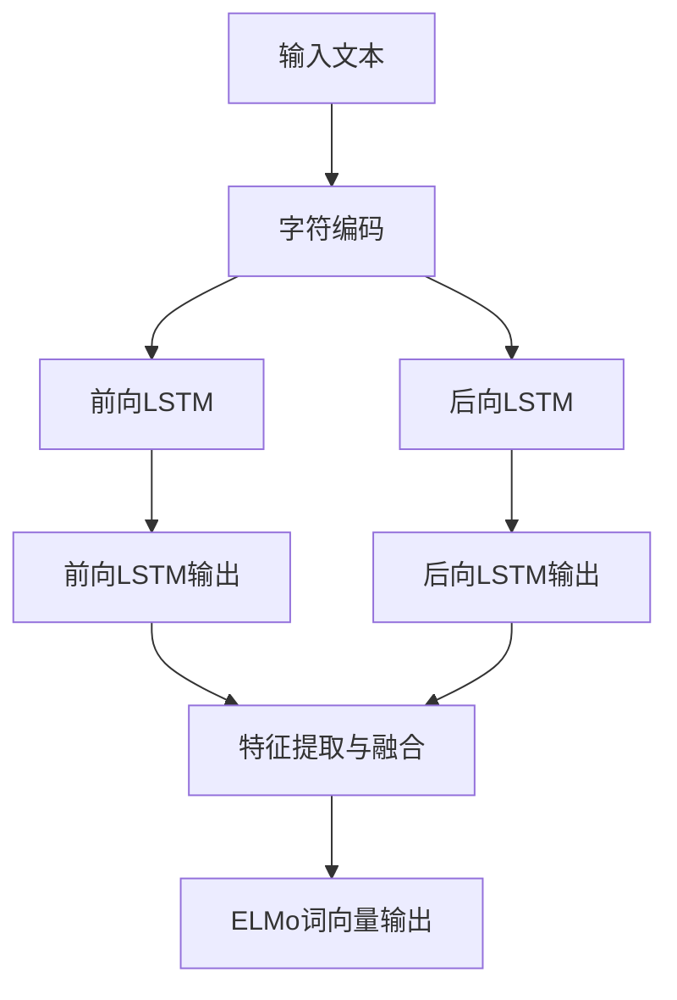

# ELMo 原理与代码实战案例讲解

## 1. 背景介绍
### 1.1 传统词向量的局限性
#### 1.1.1 词向量无法表示多义词
#### 1.1.2 词向量无法捕捉上下文信息
#### 1.1.3 词向量无法处理未登录词

### 1.2 ELMo的提出
#### 1.2.1 ELMo的创新之处  
#### 1.2.2 ELMo的发展历程
#### 1.2.3 ELMo的影响力

## 2. 核心概念与联系
### 2.1 ELMo模型架构
#### 2.1.1 ELMo模型整体架构
#### 2.1.2 双向LSTM编码器
#### 2.1.3 特征提取与融合

### 2.2 ELMo词向量
#### 2.2.1 动态词向量
#### 2.2.2 上下文相关的词向量
#### 2.2.3 多层次词向量表示

### 2.3 ELMo与其他词向量模型对比
#### 2.3.1 与Word2Vec、GloVe对比
#### 2.3.2 与BERT等预训练语言模型对比
#### 2.3.3 ELMo的优势与局限性



## 3. 核心算法原理具体操作步骤
### 3.1 基于字符的词表示
#### 3.1.1 字符卷积编码
#### 3.1.2 highway网络
#### 3.1.3 线性投影

### 3.2 双向LSTM编码
#### 3.2.1 前向LSTM
#### 3.2.2 后向LSTM  
#### 3.2.3 双向LSTM输出拼接

### 3.3 多层次特征融合
#### 3.3.1 逐层特征提取
#### 3.3.2 特征加权求和
#### 3.3.3 任务相关的特征选择

## 4. 数学模型和公式详细讲解举例说明
### 4.1 字符卷积编码公式
#### 4.1.1 卷积操作
$$ c_i = \sum_{j=1}^{k} W_{j}x_{i+j-1} $$

#### 4.1.2 最大池化
$$ h_i = \max_{j=1}^{k} c_{i+j-1} $$

### 4.2 双向LSTM前向计算公式
#### 4.2.1 输入门
$$ i_t = \sigma(W_i \cdot [h_{t-1}, x_t] + b_i) $$

#### 4.2.2 遗忘门  
$$ f_t = \sigma(W_f \cdot [h_{t-1}, x_t] + b_f) $$

#### 4.2.3 输出门
$$ o_t = \sigma(W_o \cdot [h_{t-1}, x_t] + b_o) $$

#### 4.2.4 候选记忆细胞
$$ \tilde{C}_t = \tanh(W_C \cdot [h_{t-1}, x_t] + b_C) $$

#### 4.2.5 记忆细胞状态更新
$$ C_t = f_t * C_{t-1} + i_t * \tilde{C}_t $$

#### 4.2.6 隐藏状态输出
$$ h_t = o_t * \tanh(C_t) $$

### 4.3 特征加权求和公式
$$ \text{ELMo}_k = \gamma \sum_{j=0}^{L} s_j h_{k,j} $$

## 5. 项目实践：代码实例和详细解释说明
### 5.1 环境准备
#### 5.1.1 安装TensorFlow和相关依赖
#### 5.1.2 下载和准备数据集

### 5.2 ELMo模型实现
#### 5.2.1 定义字符编码器
```python
def character_encoder(inputs, filters, kernel_size, activation='relu'):
    # 字符卷积编码
    conv = tf.keras.layers.Conv1D(filters, kernel_size, activation=activation)(inputs)
    # 最大池化
    maxpool = tf.keras.layers.GlobalMaxPooling1D()(conv)
    return maxpool
```

#### 5.2.2 定义双向LSTM编码器
```python
def bilstm_encoder(inputs, hidden_size, num_layers, dropout=0.1):
    # 定义双向LSTM层
    bilstm = tf.keras.layers.Bidirectional(
        tf.keras.layers.LSTM(hidden_size, return_sequences=True, 
                             dropout=dropout, recurrent_dropout=dropout),
        merge_mode='concat')(inputs)
    
    # 多层双向LSTM堆叠
    for _ in range(num_layers - 1):
        bilstm = tf.keras.layers.Bidirectional(
            tf.keras.layers.LSTM(hidden_size, return_sequences=True, 
                                 dropout=dropout, recurrent_dropout=dropout),
            merge_mode='concat')(bilstm)
    return bilstm
```

#### 5.2.3 定义ELMo模型
```python  
def elmo_model(vocab_size, char_dim, char_vocab_size, filters, kernel_size, 
               hidden_size, num_layers, dropout=0.1):
    # 输入层
    inputs = tf.keras.layers.Input(shape=(None,), dtype='int32')
    
    # 字符编码
    char_inputs = tf.keras.layers.Lambda(lambda x: tf.strings.unicode_split(x, 'UTF-8'))(inputs)
    char_ids = tf.keras.layers.Lambda(lambda x: char_table.lookup(x))(char_inputs)
    char_embed = tf.keras.layers.Embedding(char_vocab_size, char_dim)(char_ids)
    char_encoded = character_encoder(char_embed, filters, kernel_size)
    
    # 词嵌入
    word_embed = tf.keras.layers.Embedding(vocab_size, hidden_size)(inputs)
    
    # 拼接字符编码和词嵌入
    merged = tf.keras.layers.concatenate([char_encoded, word_embed], axis=-1)
    
    # 双向LSTM编码
    bilstm_outputs = bilstm_encoder(merged, hidden_size, num_layers, dropout)
    
    # 建立模型
    model = tf.keras.Model(inputs=inputs, outputs=bilstm_outputs)
    return model
```

### 5.3 模型训练与评估
#### 5.3.1 准备训练数据
#### 5.3.2 定义损失函数和优化器
#### 5.3.3 训练模型
#### 5.3.4 评估模型性能

### 5.4 使用ELMo词向量
#### 5.4.1 提取ELMo词向量特征
#### 5.4.2 将ELMo词向量应用于下游任务
#### 5.4.3 微调ELMo模型

## 6. 实际应用场景
### 6.1 情感分析
#### 6.1.1 使用ELMo进行情感分类
#### 6.1.2 情感分析实验结果

### 6.2 命名实体识别
#### 6.2.1 基于ELMo的命名实体识别模型
#### 6.2.2 命名实体识别实验结果

### 6.3 机器翻译
#### 6.3.1 将ELMo引入机器翻译模型
#### 6.3.2 机器翻译质量评估

## 7. 工具和资源推荐
### 7.1 ELMo官方实现
#### 7.1.1 AllenNLP
#### 7.1.2 TensorFlow版本

### 7.2 预训练的ELMo模型
#### 7.2.1 英文预训练模型
#### 7.2.2 多语言预训练模型

### 7.3 相关论文和教程
#### 7.3.1 ELMo原始论文
#### 7.3.2 ELMo教程和博客

## 8. 总结：未来发展趋势与挑战
### 8.1 ELMo的影响与启发
#### 8.1.1 动态词向量表示的重要性
#### 8.1.2 基于预训练语言模型的发展方向

### 8.2 ELMo的局限性
#### 8.2.1 计算开销较大
#### 8.2.2 模型容量受限

### 8.3 未来研究方向
#### 8.3.1 更大规模预训练模型
#### 8.3.2 轻量化动态词向量方法
#### 8.3.3 结合知识增强的词向量表示

## 9. 附录：常见问题与解答
### 9.1 ELMo和BERT的区别是什么？
### 9.2 ELMo可以处理未登录词吗？
### 9.3 如何在自己的任务中使用ELMo？
### 9.4 ELMo对于不同语言的适用性如何？
### 9.5 ELMo的训练需要多大的语料库？

作者：禅与计算机程序设计艺术 / Zen and the Art of Computer Programming