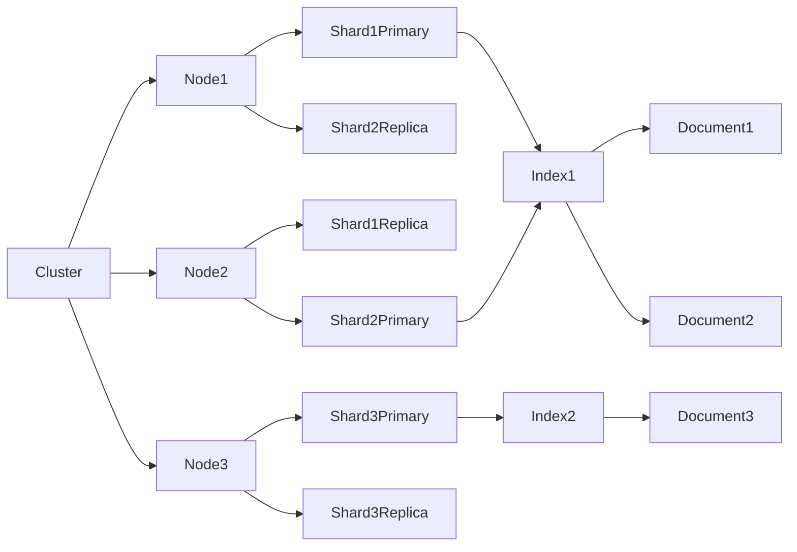
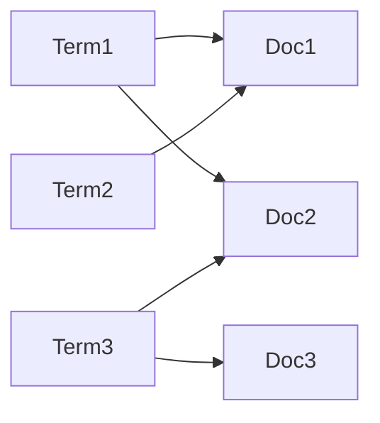

# ES索引原理与代码实例讲解

## 1.背景介绍

在当今的数据时代，海量数据的存储和高效检索已经成为企业和组织面临的重大挑战。传统的关系型数据库虽然在事务处理方面表现出色,但在处理非结构化数据和大规模数据查询时往往效率低下。这就催生了全文搜索引擎的兴起,Elasticsearch(简称ES)作为一款开源的分布式全文搜索和分析引擎,凭借其高性能、可扩展性和易用性,迅速成为大数据领域的佼佼者。

ES的核心设计理念是将数据分散存储在多个节点上,并通过集群机制实现高可用和负载均衡,从而支持PB级别的结构化和非结构化数据的实时搜索、分析和可视化。ES基于Lucene构建,并在其基础上进行了许多创新和扩展,使其能够胜任大数据场景下的各种挑战。

## 2.核心概念与联系

在深入探讨ES索引原理之前,我们需要先了解一些核心概念:

### 2.1 索引(Index)

索引是ES中的逻辑数据空间,用于存储和检索相关的文档数据。每个索引都是独立的,具有自己的映射(Mapping)定义,用于描述文档字段的类型和属性。索引可以被分片(Shard)和复制(Replica),以实现数据的分布式存储和高可用性。

### 2.2 文档(Document)

文档是ES中最小的数据单元,类似于关系型数据库中的一行记录。每个文档都属于一个索引,并由一个唯一的ID标识。文档由多个字段(Field)组成,每个字段可以是不同的数据类型,如字符串、数字、日期等。

### 2.3 集群(Cluster)

集群是ES的核心组件,由一个或多个节点(Node)组成。每个节点都可以存储数据,并参与集群的分布式操作,如路由、分片分配等。集群通过选举产生一个主节点(Master Node),负责集群的管理和协调工作。

### 2.4 分片(Shard)和复制(Replica)

为了实现数据的水平扩展和高可用性,ES将索引划分为多个分片,每个分片都是一个独立的Lucene索引。分片可以分布在不同的节点上,从而提高并行处理能力。同时,ES还支持对分片进行复制,复制分片可以在主分片出现故障时提供数据备份和查询服务。

上述概念之间的关系可以用下面的流程图来描述:



上图展示了一个包含3个节点的ES集群,其中有两个索引(Index1和Index2)。Index1被分片为2个主分片(Primary Shard)和2个复制分片(Replica Shard),分别分布在不同的节点上。每个分片都包含一部分文档数据。

## 3.核心算法原理具体操作步骤  

### 3.1 倒排索引

ES的核心是基于Lucene的倒排索引(Inverted Index)数据结构。倒排索引是文档检索系统中最常用的数据结构,它将文档中的词项(Term)与文档ID进行映射,从而实现快速的全文搜索。

倒排索引的构建过程如下:

1. **文档分析(Analysis)**: 将文档内容分割为一个个词项,包括分词、小写转换、去除停用词等步骤。
2. **词项归一化(Normalization)**: 对词项进行归一化处理,如去除重音符号、词形还原等。
3. **建立倒排表(Posting List)**: 对每个归一化后的词项,建立一个倒排表,记录该词项出现的文档ID和位置信息。
4. **索引合并(Merge)**: 将多个小的倒排索引合并为一个大的索引,以提高查询效率。

下图展示了一个简单的倒排索引结构:



在上图中,Term1出现在Doc1和Doc2中,Term2只出现在Doc1中,Term3出现在Doc2和Doc3中。通过这种结构,我们可以快速找到包含特定词项的文档集合。

### 3.2 查询过程

当用户发出一个查询请求时,ES会执行以下步骤:

1. **查询解析(Query Parsing)**: 将查询字符串解析为查询对象(Query Object)。
2. **查询重写(Query Rewriting)**: 对查询对象进行优化和重写,如添加布尔过滤器、短语查询等。
3. **查询执行(Query Execution)**: 根据倒排索引,找到与查询匹配的文档集合。
4. **相关性计算(Relevance Scoring)**: 对匹配的文档进行相关性评分,以确定结果的排序。
5. **结果返回(Result Rendering)**: 将评分后的结果按照相关性排序,并返回给客户端。

在查询执行阶段,ES会利用倒排索引快速定位包含查询词项的文档集合。然后,ES会基于各种相关性算法(如TF-IDF、BM25等)对这些文档进行评分,最终按照评分结果对文档进行排序并返回给客户端。

## 4.数学模型和公式详细讲解举例说明

在ES中,相关性评分是一个核心环节,它决定了搜索结果的排序质量。ES采用了多种相关性算法,其中最著名的是BM25算法。

### 4.1 BM25算法

BM25(Best Matching 25)算法是一种基于概率模型的相关性评分算法,它综合考虑了词频(Term Frequency)、反向文档频率(Inverse Document Frequency)和文档长度等因素,对文档的相关性进行评分。

BM25算法的公式如下:

$$
\text{Score}(D, Q) = \sum_{q \in Q} \text{IDF}(q) \cdot \frac{f(q, D) \cdot (k_1 + 1)}{f(q, D) + k_1 \cdot \left( 1 - b + b \cdot \frac{|D|}{\text{avgdl}} \right)}
$$

其中:

- $D$表示文档
- $Q$表示查询
- $q$表示查询中的词项
- $f(q, D)$表示词项$q$在文档$D$中出现的次数
- $|D|$表示文档$D$的长度(字节数)
- $\text{avgdl}$表示文档集合的平均长度
- $\text{IDF}(q)$表示词项$q$的反向文档频率,计算公式为$\text{IDF}(q) = \log \frac{N - n(q) + 0.5}{n(q) + 0.5}$,其中$N$是文档总数,$n(q)$是包含词项$q$的文档数
- $k_1$和$b$是调节因子,用于控制词频和文档长度对评分的影响程度

下面我们用一个简单的例子来说明BM25算法的工作原理。假设我们有一个包含3个文档的索引,查询为"hello world":

- 文档1: "Hello, this is a hello world example."
- 文档2: "This is another example of hello world."
- 文档3: "This document does not contain hello or world."

我们计算每个文档对于查询"hello world"的BM25评分:

1. 计算词项频率$f(q, D)$:
   - 文档1: $f(\text{"hello"}, D_1) = 2$, $f(\text{"world"}, D_1) = 1$
   - 文档2: $f(\text{"hello"}, D_2) = 1$, $f(\text{"world"}, D_2) = 1$
   - 文档3: $f(\text{"hello"}, D_3) = 0$, $f(\text{"world"}, D_3) = 0$

2. 计算反向文档频率$\text{IDF}(q)$:
   - 假设总文档数$N = 3$
   - $n(\text{"hello"}) = 2$ (文档1和文档2包含"hello")
   - $n(\text{"world"}) = 2$ (文档1和文档2包含"world")
   - $\text{IDF}(\text{"hello"}) = \log \frac{3 - 2 + 0.5}{2 + 0.5} \approx 0.176$
   - $\text{IDF}(\text{"world"}) = \log \frac{3 - 2 + 0.5}{2 + 0.5} \approx 0.176$

3. 计算BM25评分:
   - 假设$k_1 = 1.2$, $b = 0.75$, $\text{avgdl} = 30$
   - 文档1长度$|D_1| = 38$字节
   - 文档2长度$|D_2| = 34$字节
   - 文档3长度$|D_3| = 36$字节
   - 文档1评分:
     $$
     \begin{aligned}
     \text{Score}(D_1, Q) &= \text{IDF}(\text{"hello"}) \cdot \frac{f(\text{"hello"}, D_1) \cdot (k_1 + 1)}{f(\text{"hello"}, D_1) + k_1 \cdot \left( 1 - b + b \cdot \frac{|D_1|}{\text{avgdl}} \right)} \\
     &\quad + \text{IDF}(\text{"world"}) \cdot \frac{f(\text{"world"}, D_1) \cdot (k_1 + 1)}{f(\text{"world"}, D_1) + k_1 \cdot \left( 1 - b + b \cdot \frac{|D_1|}{\text{avgdl}} \right)} \\
     &\approx 0.176 \cdot \frac{2 \cdot 2.2}{2 + 1.2 \cdot (1 - 0.75 + 0.75 \cdot \frac{38}{30})} + 0.176 \cdot \frac{1 \cdot 2.2}{1 + 1.2 \cdot (1 - 0.75 + 0.75 \cdot \frac{38}{30})} \\
     &\approx 0.468
     \end{aligned}
     $$
   - 文档2评分: $\text{Score}(D_2, Q) \approx 0.335$
   - 文档3评分: $\text{Score}(D_3, Q) = 0$ (不包含查询词项)

根据上述计算结果,文档1的评分最高,因此会被排在搜索结果的首位。

通过这个例子,我们可以看到BM25算法综合考虑了词频、反向文档频率和文档长度等因素,从而能够较为准确地评估文档与查询的相关性。在实际应用中,ES还会结合其他算法和特性(如词条位置、短语查询等)来进一步优化搜索结果的质量。

## 5.项目实践:代码实例和详细解释说明

为了更好地理解ES索引的原理和使用方法,我们来看一个基于Java的代码示例。在这个示例中,我们将创建一个简单的电影索引,并对其执行一些基本的CRUD操作。

### 5.1 创建电影索引

首先,我们需要创建一个名为"movies"的索引,并定义其映射(Mapping)。映射用于描述文档字段的数据类型和属性。

```java
// 创建客户端对象
RestHighLevelClient client = new RestHighLevelClient(RestClient.builder(
        new HttpHost("localhost", 9200, "http")));

// 创建索引请求对象
CreateIndexRequest request = new CreateIndexRequest("movies");

// 设置映射
request.mapping(
    "{\n" +
    "   \"properties\": {\n" +
    "       \"title\": {\n" +
    "           \"type\": \"text\"\n" +
    "       },\n" +
    "       \"director\": {\n" +
    "           \"type\": \"text\"\n" +
    "       },\n" +
    "       \"year\": {\n" +
    "           \"type\": \"integer\"\n" +
    "       },\n" +
    "       \"genres\": {\n" +
    "           \"type\": \"keyword\"\n" +
    "       }\n" +
    "   }\n" +
    "}",
    XContentType.JSON);

// 创建索引
CreateIndexResponse createIndexResponse = client.indices().create(request, RequestOptions.DEFAULT);
```

在上面的代码中,我们首先创建了一个`RestHighLevelClient`对象,用于与ES服务器进行通信。然后,我们创建了一个`Create