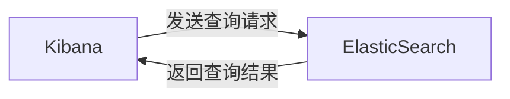
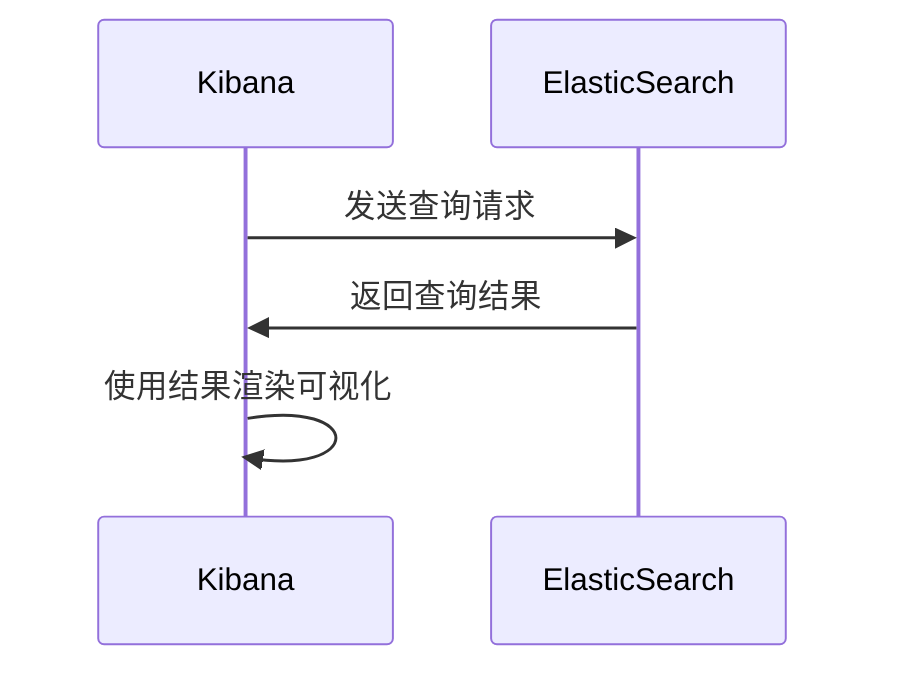

# ElasticSearch与Kibana的通信协议

## 1. 背景介绍

### 1.1 ElasticSearch与Kibana简介

ElasticSearch是一个基于Lucene的搜索服务器。它提供了一个分布式多用户能力的全文搜索引擎，基于RESTful web接口。Kibana是一个开源的分析和可视化平台，设计用于和ElasticSearch协作。它可以查询、查看并与存储在ElasticSearch索引中的数据进行交互，使用各种图表、表格和地图提供数据的实时可视化。

### 1.2 ElasticSearch与Kibana通信的必要性

Kibana需要与ElasticSearch进行通信来实现其功能。没有ElasticSearch的数据，Kibana就无法提供任何可视化或分析。同样，ElasticSearch也需要一种方式来展示其搜索结果，而Kibana正好提供了一个直观的界面。因此，两者之间的通信是非常必要的。

## 2. 核心概念与联系

### 2.1 ElasticSearch的核心概念

- 索引(Index)：类似于传统关系数据库中的"数据库"。
- 类型(Type)：类似于关系数据库中的"表"。
- 文档(Document)：类似于关系数据库中的"行"，是ElasticSearch中的最小数据单元。
- 字段(Field)：类似于关系数据库中的"列"。

### 2.2 Kibana的核心概念

- 仪表板(Dashboard)：一个可视化的集合，可以同时查看多个可视化。
- 可视化(Visualization)：基于ElasticSearch查询创建的图表。
- 搜索(Discover)：一种交互式查询ElasticSearch的方式。
- 管理(Management)：管理ElasticSearch索引模式和Kibana设置的地方。

### 2.3 ElasticSearch与Kibana的关系

Kibana使用ElasticSearch作为其后端数据存储。当在Kibana中创建一个可视化时，它会向ElasticSearch发送一个查询请求。ElasticSearch处理这个请求，返回结果，然后Kibana使用这些结果来渲染可视化。



## 3. 核心算法原理具体操作步骤

### 3.1 ElasticSearch查询过程

1. 客户端发送查询请求到ElasticSearch。
2. 查询首先会到达协调节点(Coordinating Node)，它决定哪些分片需要处理查询请求。
3. 查询请求被发送到相关的分片。每个分片独立处理查询并返回结果。
4. 协调节点收集所有分片的结果，合并排序后返回给客户端。

### 3.2 Kibana查询ElasticSearch的过程

1. 用户在Kibana界面上创建或修改一个可视化。
2. Kibana将可视化的查询请求发送到ElasticSearch。
3. ElasticSearch处理查询请求，返回结果给Kibana。
4. Kibana使用返回的结果渲染可视化。



## 4. 数学模型和公式详细讲解举例说明

ElasticSearch使用了多个数学模型和算法来实现其搜索和排序功能。其中一个关键的模型是向量空间模型(Vector Space Model)。

### 4.1 向量空间模型

在向量空间模型中，每个文档和查询都被表示为一个多维向量。文档向量的每个维度对应文档中的一个词项，维度的值表示该词项在文档中的重要性。查询向量的每个维度对应查询中的一个词项，维度的值表示该词项在查询中的重要性。

文档向量：$\vec{d} = (w_{1,d}, w_{2,d}, ..., w_{n,d})$
查询向量：$\vec{q} = (w_{1,q}, w_{2,q}, ..., w_{n,q})$

其中，$w_{i,d}$表示词项$i$在文档$d$中的权重，$w_{i,q}$表示词项$i$在查询$q$中的权重。

### 4.2 余弦相似度

ElasticSearch使用余弦相似度来衡量文档向量和查询向量之间的相似度。余弦相似度的公式如下：

$$\cos(\theta) = \frac{\vec{d} \cdot \vec{q}}{|\vec{d}| |\vec{q}|} = \frac{\sum_{i=1}^{n} w_{i,d} w_{i,q}}{\sqrt{\sum_{i=1}^{n} w_{i,d}^2} \sqrt{\sum_{i=1}^{n} w_{i,q}^2}}$$

其中，$\vec{d} \cdot \vec{q}$表示两个向量的点积，$|\vec{d}|$和$|\vec{q}|$分别表示文档向量和查询向量的模。

余弦相似度的值范围在-1到1之间。值越接近1，表示文档和查询越相似；值越接近-1，表示文档和查询越不相似。

## 5. 项目实践：代码实例和详细解释说明

下面是一个使用Python客户端与ElasticSearch交互的简单例子：

```python
from elasticsearch import Elasticsearch

# 创建ElasticSearch客户端
es = Elasticsearch(["http://localhost:9200"])

# 创建索引
es.indices.create(index="my-index", ignore=400)

# 插入文档
doc = {"name": "John Doe", "age": 30}
es.index(index="my-index", id=1, body=doc)

# 搜索文档
query = {"query": {"match": {"name": "John"}}}
res = es.search(index="my-index", body=query)

print("Got %d Hits:" % res['hits']['total']['value'])
for hit in res['hits']['hits']:
    print("%(name)s: %(age)s" % hit["_source"])
```

这个例子首先创建了一个ElasticSearch客户端。然后，它创建了一个名为"my-index"的索引，并插入了一个文档。最后，它执行了一个搜索查询，查找名字为"John"的文档，并打印出搜索结果。

## 6. 实际应用场景

ElasticSearch和Kibana在许多领域都有应用，包括：

- 日志分析：使用ElasticSearch存储日志数据，使用Kibana进行可视化和分析。
- 网站搜索：使用ElasticSearch提供网站内容的搜索功能。
- 指标分析：使用ElasticSearch存储指标数据，使用Kibana创建仪表板来监控系统性能。
- 安全分析：使用ElasticSearch存储安全事件数据，使用Kibana进行实时监控和分析。

## 7. 工具和资源推荐

- 官方文档：[ElasticSearch文档](https://www.elastic.co/guide/en/elasticsearch/reference/current/index.html), [Kibana文档](https://www.elastic.co/guide/en/kibana/current/index.html)
- 书籍：《Elasticsearch: The Definitive Guide》, 《Kibana: Analyze, Visualize & Protect》
- 在线课程：[ElasticSearch和Kibana入门](https://www.elastic.co/training/elasticsearch-kibana-getting-started)
- 社区：[Elastic社区](https://discuss.elastic.co/)

## 8. 总结：未来发展趋势与挑战

ElasticSearch和Kibana正在不断发展，以满足不断增长的数据量和复杂性。未来的发展趋势可能包括：

- 更智能的数据分析和机器学习功能。
- 更好的可扩展性和性能，以处理更大的数据量。
- 更紧密的集成，提供端到端的数据分析解决方案。

然而，也有一些挑战需要解决：

- 数据安全和隐私问题，特别是在处理敏感数据时。
- 复杂的部署和管理，特别是在大规模集群环境中。

## 9. 附录：常见问题与解答

1. **问**: ElasticSearch和关系型数据库有什么区别？
   **答**: ElasticSearch是一个分布式的文档存储，而不是关系型数据库。它提供了实时的全文搜索功能，并且可以轻松地扩展以处理大数据量。

2. **问**: Kibana可以连接其他数据源吗？
   **答**: Kibana主要设计用于与ElasticSearch协作，但也可以使用其他数据源，如Logstash和Beats。

3. **问**: 如何保护ElasticSearch和Kibana的安全？
   **答**: 可以使用X-Pack安全特性，它提供了身份验证、授权、加密和审计功能。也可以使用网络级别的安全措施，如防火墙和VPN。

作者：禅与计算机程序设计艺术 / Zen and the Art of Computer Programming