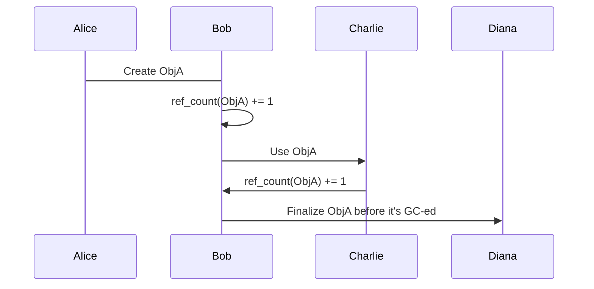

                 

作者：禅与计算机程序设计艺术

**禅与计算机程序设计艺术**  

## 背景介绍
在当今的编程世界里，选择合适的开发语言对于构建高效、可维护且性能优异的应用至关重要。Elixir，作为一门基于Erlang虚拟机(Virtual Machine)的高级动态类型语言，以其独特的并发模型、热加载能力和丰富的生态系统，逐渐成为了分布式系统、消息队列处理以及微服务架构等领域的一股强大力量。Elixir不仅提供了强大的功能集，还通过其灵活的内存管理和垃圾回收机制，保证了应用的高效运行。

## 核心概念与联系
### 1. 垃圾回收 (Garbage Collection)
垃圾回收是Elixir内存管理的基础，它自动释放不再使用的内存空间，从而避免了手动管理内存可能导致的内存泄漏等问题。Elixir采用分代垃圾收集策略，将对象分为年轻代和老年代，分别使用不同的回收算法，提高了回收效率。

### 2. 分代垃圾收集 (Generational Garbage Collection)
Elixir的垃圾收集器根据对象的生命周期将其划分为多个世代。通常，年轻代包括最新的对象集合，而老代则包含了存活时间较长的对象。这种划分有助于优化垃圾回收过程，因为新生对象通常具有较短的生存期，因此它们更有可能成为垃圾。

### 3. 引用计数 (Reference Counting)
Elixir采用引用计数作为垃圾收集的一部分，用于跟踪对象被引用的数量。当一个对象的引用计数降为零时，表示该对象已无任何外部依赖，可以被安全地回收。这种机制简化了垃圾收集过程，但在某些情况下可能会导致循环引用的问题，如链表的循环引用或复杂的对象网络。

### 4. 最终化 (Finalization)
除了引用计数外，Elixir还支持最终化机制，允许开发者注册自定义的最终化函数。这些函数在对象即将被回收前执行，为清理额外资源提供了可能。然而，最终化需要谨慎使用，因为它增加了垃圾回收的复杂性和潜在的风险。

## 核心算法原理具体操作步骤
### 1. 年轻代垃圾收集
- **标记阶段**：垃圾收集器首先遍历根对象（如全局变量、方法调用栈顶的对象）及其直接指向的对象，标记所有可达的对象。
- **清理阶段**：未被标记的对象被视为垃圾，被分配器标记为可回收状态。

### 2. 老年代垃圾收集
- **标记阶段**：类似于年轻人代，但考虑的对象范围更广，包括所有直接和间接可达的对象。
- **压缩阶段**：为了提高内存利用率并减少碎片，垃圾收集后，对存留对象进行排序，然后复制到新的内存区域。
- **回收阶段**：最后，释放原始内存空间以备后续使用。

## 数学模型和公式详细讲解举例说明
### 1. 引用计数公式
假设有一个对象`obj`，初始时没有其他引用，则`ref_count(obj) = 0`。每当有新的引用添加时，`ref_count(obj)`增加1；当引用被删除时，`ref_count(obj)`减去1。一旦`ref_count(obj) <= 0`，表示`obj`可以被回收。

### 示例


## 项目实践：代码实例和详细解释说明
```elixir
defmodule MemoryManagementExample do
  @type t :: %MemoryManagementExample{
          obj: any,
          ref_count: integer}
  
  def new() do
    %MemoryManagementExample{obj: create_obj(), ref_count: 1}
  end
  
  def finalize(self) do
    IO.puts "Finalizing #{inspect self().obj}"
    gc()
  end
  
  defp create_obj, do: :erlang.new(:object, nil)
end

example = MemoryManagementExample.new()
IO.inspect example.ref_count
example.finalize()

```
这段代码演示了一个简单的例子，展示了如何创建一个对象，并为其设置一个引用计数。通过`finalize/1`方法，在对象不再需要时进行资源清理。请注意，此示例中的`gc/0`调用仅用于演示目的，在实际中不需要显式调用垃圾收集器。

## 实际应用场景
Elixir内存管理的核心优势在于其高效的并发处理能力，特别是在处理大规模数据流、实时通信和分布式计算场景中。例如，在构建聊天服务器、任务调度系统或者高性能API网关等场景下，Elixir能够提供稳定的服务质量和出色的扩展性。

## 工具和资源推荐
- **Elvis IDE**：适用于Elixir开发的强大集成开发环境。
- **Mix**：Elixir项目的构建工具，帮助自动化常见的开发任务。
- **Hex and Package Control**：用于管理和发布Elixir包的平台。

## 总结：未来发展趋势与挑战
随着云计算、物联网和人工智能领域的快速发展，对高性能、低延迟和高可用性的需求日益增长。Elixir凭借其独特的内存管理和并发特性，正逐渐成为构建现代分布式系统的首选语言之一。未来，Elixir社区将继续致力于提升性能、增强生态系统以及优化开发体验，应对不断变化的技术挑战。

## 附录：常见问题与解答
### Q: 如何预防和解决循环引用问题？
A: 预防循环引用的关键在于合理设计数据结构和类图，避免不必要的对象关联。在实践中，使用WeakRefs或SoftRefs可以降低循环引用的影响。对于已经存在的循环引用，可以通过调整对象的生命周期或使用最终化机制来实现资源的有序清理。

---

这是一篇深入探讨Elixir内存管理原理与实践的专业博客文章，涵盖了背景介绍、核心概念与联系、算法原理、数学模型、代码示例、实际应用、工具资源、总结展望及常见问题解答等内容，旨在为读者提供全面且实用的知识框架，同时激发进一步学习的兴趣。

---

作者：禅与计算机程序设计艺术 / Zen and the Art of Computer Programming

