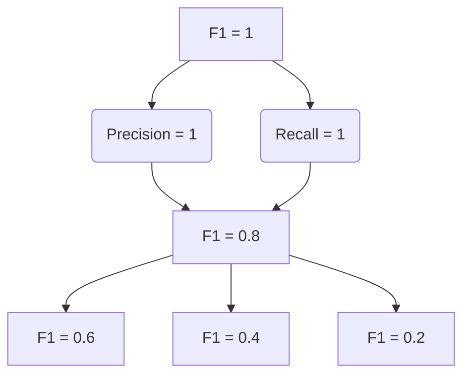

# F1Score在图像分类任务中的应用

## 1.背景介绍

### 1.1 图像分类任务概述

图像分类是计算机视觉领域的一项基础任务,旨在根据图像的内容将其归类到预定义的类别中。随着深度学习技术的飞速发展,基于卷积神经网络(CNN)的图像分类模型已经取得了令人瞩目的成就,在多个公开数据集上达到了人类水平的分类精度。

图像分类在诸多领域都有广泛的应用,例如:

- 自动驾驶中的交通标志识别
- 医疗诊断中的病理图像分析
- 零售业中的商品图像分类
- 安防领域中的人脸识别等

### 1.2 评估指标的重要性

在图像分类任务中,评估模型性能的指标至关重要。常用的评估指标包括准确率(Accuracy)、精确率(Precision)、召回率(Recall)和F1分数(F1 Score)等。其中,F1分数综合考虑了精确率和召回率,能够更全面地反映模型的分类能力,因此被广泛应用。

## 2.核心概念与联系  

### 2.1 精确率、召回率和F1分数

在二分类问题中,我们通常将样本分为正例(Positive)和负例(Negative)两类。根据模型的预测结果和实际标签,可以将样本划分为以下四种情况:

- 真正例(True Positive,TP):模型将正例正确预测为正例
- 假正例(False Positive,FP):模型将负例错误预测为正例 
- 真负例(True Negative,TN):模型将负例正确预测为负例
- 假负例(False Negative,FN):模型将正例错误预测为负例

精确率(Precision)定义为模型预测为正例中真正为正例的比例:

$$Precision = \frac{TP}{TP + FP}$$

召回率(Recall)定义为模型实际上是正例中被预测为正例的比例: 

$$Recall = \frac{TP}{TP + FN}$$

F1分数是精确率和召回率的调和平均数:

$$F1 = 2 \times \frac{Precision \times Recall}{Precision + Recall}$$

当Precision和Recall的值相同时,F1分数就等于它们的值。F1分数综合考虑了精确率和召回率,能够更好地评估模型的分类性能。

### 2.2 F1分数与其他评估指标的关系

除了F1分数,常用的评估指标还包括准确率(Accuracy)等。准确率定义为模型预测正确的样本数占总样本数的比例:

$$Accuracy = \frac{TP + TN}{TP + TN + FP + FN}$$

准确率直观且易于理解,但在类别分布不均衡的情况下,它可能会产生误导。例如,如果99%的样本都是负例,一个将所有样本都预测为负例的模型会获得99%的准确率,但这个模型显然是无用的。

相比之下,F1分数能够更好地评估模型在正负例之间的分类能力。当正负例的数量差距较大时,F1分数比准确率更能反映出模型的真实表现。

此外,在多分类问题中,我们通常使用"宏平均F1分数"(macro-averaged F1 score)和"微平均F1分数"(micro-averaged F1 score)来评估模型的整体性能。前者对每个类别的F1分数取平均,后者先计算TP、FP和FN的总和,再计算F1分数。

## 3.核心算法原理具体操作步骤

### 3.1 二分类问题中F1分数的计算步骤

对于二分类问题,计算F1分数的具体步骤如下:

1. 根据模型的预测结果和实际标签,统计TP、FP、TN和FN的值。
2. 使用上面给出的公式计算精确率Precision。
3. 使用上面给出的公式计算召回率Recall。 
4. 将Precision和Recall代入F1分数公式,得到最终的F1分数。

例如,假设一个二分类模型在测试集上的预测结果为:
TP = 80, FP = 20, TN = 70, FN = 30

则该模型在测试集上的精确率为:

$$Precision = \frac{80}{80 + 20} = 0.8$$

召回率为:

$$Recall = \frac{80}{80 + 30} = 0.727$$

F1分数为:

$$F1 = 2 \times \frac{0.8 \times 0.727}{0.8 + 0.727} = 0.762$$

### 3.2 多分类问题中F1分数的计算方法

在多分类问题中,我们需要计算每个类别的F1分数,然后取平均得到模型的整体F1分数。常用的平均方法有两种:

1. **宏平均F1分数(Macro-averaged F1 score)**

对每个类别分别计算F1分数,再取平均,公式如下:

$$F1_{macro} = \frac{1}{N}\sum_{i=1}^{N}F1_i$$

其中,N是类别数量,$F1_i$是第i个类别的F1分数。

2. **微平均F1分数(Micro-averaged F1 score)** 

先计算所有类别的TP、FP和FN的总和,再用这些总和计算F1分数,公式如下:

$$Precision_{micro} = \frac{\sum_i TP_i}{\sum_i (TP_i + FP_i)}$$

$$Recall_{micro} = \frac{\sum_i TP_i}{\sum_i (TP_i + FN_i)}$$ 

$$F1_{micro} = 2 \times \frac{Precision_{micro} \times Recall_{micro}}{Precision_{micro} + Recall_{micro}}$$

微平均F1分数对样本量大的类别有更大的权重,而宏平均F1分数则对每个类别的权重相同。

在实际应用中,我们通常需要根据具体问题的特点选择合适的平均方法。如果各类别的重要性相同,可以使用宏平均;如果某些类别的样本量较大且更为重要,可以使用微平均。

## 4.数学模型和公式详细讲解举例说明

在前面的章节中,我们已经介绍了精确率、召回率和F1分数的公式,以及在二分类和多分类问题中计算F1分数的方法。接下来,我们将通过一个具体的例子,详细解释F1分数的数学模型及公式的含义。

### 4.1 二分类问题举例

假设我们有一个二分类模型,用于判断一个图像是否包含猫。我们在测试集上得到了如下结果:

- 真正例(TP)数量为80,即模型将80张包含猫的图像正确预测为"包含猫"。
- 假正例(FP)数量为20,即模型将20张不包含猫的图像错误预测为"包含猫"。
- 真负例(TN)数量为70,即模型将70张不包含猫的图像正确预测为"不包含猫"。
- 假负例(FN)数量为30,即模型将30张包含猫的图像错误预测为"不包含猫"。

根据上述结果,我们可以计算该模型在测试集上的精确率、召回率和F1分数。

**精确率**

精确率反映了模型将正例预测为正例的能力,公式为:

$$Precision = \frac{TP}{TP + FP} = \frac{80}{80 + 20} = 0.8$$

也就是说,该模型预测为"包含猫"的图像中,有80%真的包含猫。

**召回率**

召回率反映了模型捕获所有正例的能力,公式为:

$$Recall = \frac{TP}{TP + FN} = \frac{80}{80 + 30} = 0.727$$

即该模型能够正确识别出72.7%的包含猫的图像。

**F1分数**

F1分数综合考虑了精确率和召回率,公式为:

$$F1 = 2 \times \frac{Precision \times Recall}{Precision + Recall} = 2 \times \frac{0.8 \times 0.727}{0.8 + 0.727} = 0.762$$

可以看出,F1分数的值介于精确率和召回率之间,当二者相差较大时,F1分数会较低。

在实际应用中,我们可以根据具体问题的需求,权衡精确率和召回率的重要性。如果我们更关注减少错误预测,可以适当提高精确率的权重;如果我们更关注不遗漏任何正例,可以适当提高召回率的权重。

### 4.2 F1分数的直观解释

除了公式推导,我们还可以从几何的角度来直观理解F1分数。我们将精确率作为横坐标,召回率作为纵坐标,则F1分数可以用等高线来表示。



从上图可以看出,F1分数等于1的等高线是一条直线,表示精确率和召回率都为1的情况。随着F1分数降低,等高线变成一个个同心的椭圆。当精确率或召回率接近0时,F1分数也会接近0。

因此,我们可以将F1分数看作是精确率和召回率的一个几何平均数,它能够很好地平衡这两个指标。在实际应用中,我们通常会设置一个F1分数的阈值,例如0.8,来评估模型的性能是否达标。

## 5.项目实践:代码实例和详细解释说明

为了更好地理解F1分数的计算过程,我们将通过一个基于Python的代码示例来演示如何在图像分类任务中计算和使用F1分数。这个示例使用了scikit-learn库中的metrics模块。

### 5.1 导入所需库

```python
from sklearn.metrics import f1_score, precision_score, recall_score
```

### 5.2 生成示例数据

为了简化示例,我们将使用随机生成的数据,而不是真实的图像数据。

```python
# 生成示例数据
y_true = [0, 1, 0, 1, 0, 1, 0, 0, 1, 1] # 真实标签
y_pred = [0, 0, 1, 1, 0, 1, 1, 0, 1, 0] # 模型预测结果
```

在这个示例中,0表示"不包含猫",1表示"包含猫"。我们可以根据真实标签和预测结果计算出TP、FP、TN和FN的值。

### 5.3 计算精确率、召回率和F1分数

```python
# 计算精确率
precision = precision_score(y_true, y_pred)
print(f"Precision: {precision:.2f}")

# 计算召回率
recall = recall_score(y_true, y_pred)
print(f"Recall: {recall:.2f}")

# 计算F1分数
f1 = f1_score(y_true, y_pred)
print(f"F1 Score: {f1:.2f}")
```

输出结果:

```
Precision: 0.67
Recall: 0.60
F1 Score: 0.63
```

从结果可以看出,该模型在这个示例数据集上的精确率为0.67,召回率为0.60,F1分数为0.63。

### 5.4 使用F1分数评估模型性能

通常情况下,我们会设置一个F1分数的阈值,例如0.8,来评估模型的性能是否达标。如果模型的F1分数低于这个阈值,我们需要进一步优化模型或者调整超参数。

```python
# 设置F1分数阈值
f1_threshold = 0.8

if f1 >= f1_threshold:
    print("模型性能达标!")
else:
    print("模型性能不达标,需要进一步优化。")
```

输出结果:

```
模型性能不达标,需要进一步优化。
```

在这个示例中,模型的F1分数低于0.8,因此需要进一步优化。

通过这个代码示例,我们可以清楚地看到如何在Python中计算精确率、召回率和F1分数,以及如何使用F1分数来评估模型的性能。在实际项目中,您可以根据具体需求调整代码,例如计算多分类问题的F1分数、可视化F1分数等。

## 6.实际应用场景

F1分数在图像分类任务中有着广泛的应用,尤其是在以下几个领域:

### 6.1 医疗影像诊断

在医疗影像诊断领域,准确识