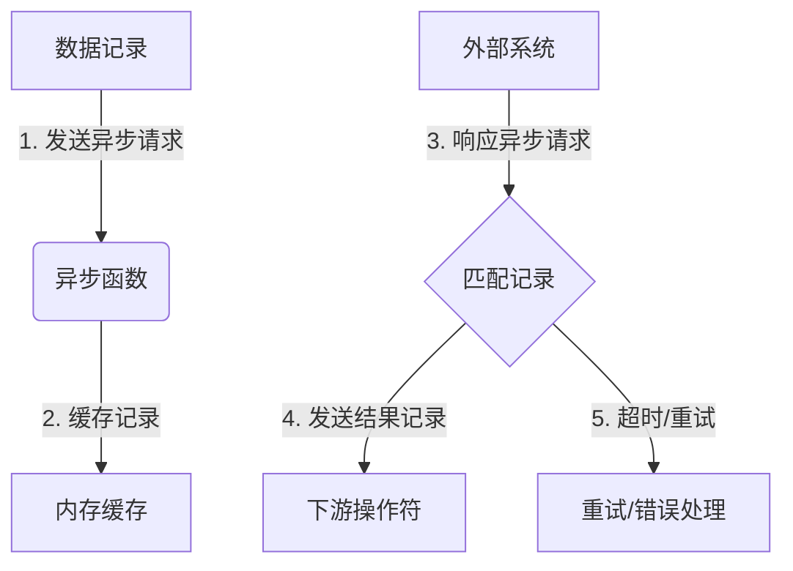

# Flink Async I/O原理与代码实例讲解

## 1. 背景介绍

在现代数据处理系统中,I/O操作通常是性能瓶颈之一。传统的同步I/O模型要求应用程序在等待I/O操作完成时保持阻塞状态,这会导致资源的低效利用。为了解决这个问题,异步I/O(Async I/O)应运而生。

Apache Flink是一个开源的分布式流处理和批处理引擎,广泛应用于大数据处理领域。Flink支持异步I/O操作,允许在等待I/O操作完成时释放线程资源,从而提高系统吞吐量和资源利用率。本文将深入探讨Flink Async I/O的原理和实现方式,并提供代码示例以加深理解。

## 2. 核心概念与联系

### 2.1 异步编程模型

异步编程模型是一种允许应用程序在等待长时间操作(如I/O)时继续执行其他任务的编程范式。与传统的同步编程模型不同,异步模型不会阻塞线程,从而提高了资源利用率和系统吞吐量。

在异步模型中,长时间操作通常由回调函数或Future/Promise对象来表示。当操作完成时,回调函数会被调用或Future/Promise对象会被解析,应用程序可以继续处理结果。

### 2.2 Flink DataStream API

Flink DataStream API是Flink用于流处理的核心API。它提供了各种转换操作符(Transformation Operators),用于对无界数据流进行转换和处理。异步I/O操作通常与DataStream API的异步函数相结合,以实现高效的数据处理管道。

### 2.3 异步I/O与异步函数

Flink中的异步I/O操作和异步函数是紧密相关的概念。异步函数是一种特殊的DataStream转换操作符,它允许将耗时的操作(如I/O)异步化,从而避免阻塞整个流处理管道。

当异步函数被调用时,它会立即返回一个"Future"对象,表示异步操作的结果。同时,异步操作会在后台执行,并在完成时解析Future对象。这种方式允许Flink继续处理其他数据记录,而不必等待I/O操作完成。

## 3. 核心算法原理具体操作步骤

Flink Async I/O的核心算法原理可以概括为以下几个步骤:

1. **异步请求发送**: 当数据记录到达异步函数时,Flink会将记录缓存在内存中,并向外部系统(如数据库或Web服务)发送异步请求。

2. **异步响应处理**: 外部系统在完成请求后,会将响应发送回Flink。Flink会将响应与原始记录进行匹配,并将结果记录发送到下游操作符。

3. **超时和重试机制**: 为了防止请求永远无法完成,Flink提供了超时和重试机制。如果在指定时间内未收到响应,Flink会自动重试请求或将记录发送到侧输出流进行错误处理。

4. **异步函数链**: Flink支持将多个异步函数链接在一起,形成异步操作管道。这种方式可以进一步提高吞吐量,因为每个异步函数都可以并行处理多个请求。

5. **异步快捷方式**: Flink提供了一些异步快捷方式,如`AsyncFunction`和`AsyncDataStream`,以简化异步I/O操作的实现。

下面是Flink Async I/O的工作流程图:



## 4. 数学模型和公式详细讲解举例说明

在Flink Async I/O中,有一个重要的概念是**异步等待时间(Async Wait Time)**。异步等待时间是指一个数据记录从进入异步函数到收到响应并发送到下游操作符的总时间。

异步等待时间可以用以下公式表示:

$$
T_{wait} = T_{queue} + T_{request} + T_{response}
$$

其中:

- $T_{wait}$ 表示异步等待时间
- $T_{queue}$ 表示记录在内存缓存中等待发送请求的时间
- $T_{request}$ 表示请求在外部系统中处理的时间
- $T_{response}$ 表示响应从外部系统返回并与记录匹配的时间

通过优化这些时间组成部分,可以减少异步等待时间,提高系统的整体吞吐量。例如,增加内存缓存大小可以减少$T_{queue}$,使用更高效的外部系统可以减少$T_{request}$,优化匹配算法可以减少$T_{response}$。

另一个重要的指标是**并行异步操作数(Parallel Async Operations)**,表示同时进行的异步操作的最大数量。这个值通常由异步函数的并行度和内存缓存大小决定。

假设异步函数的并行度为$p$,内存缓存大小为$c$,每个记录的大小为$s$,则并行异步操作数可以用以下公式近似计算:

$$
N_{parallel} = \min(p, \lfloor\frac{c}{s}\rfloor)
$$

增加并行异步操作数可以提高吞吐量,但也会增加内存消耗和调度开销。因此,需要在吞吐量和资源消耗之间进行权衡。

## 5. 项目实践: 代码实例和详细解释说明

下面是一个使用Flink DataStream API实现异步I/O操作的代码示例。在这个示例中,我们将模拟一个异步Web服务,并使用Flink的`AsyncFunction`来发送异步HTTP请求。

### 5.1 准备工作

首先,我们需要添加一些依赖项到我们的Maven项目中:

```xml
<dependency>
    <groupId>org.apache.flink</groupId>
    <artifactId>flink-streaming-java</artifactId>
    <version>1.14.0</version>
</dependency>
<dependency>
    <groupId>org.apache.httpcomponents</groupId>
    <artifactId>fluent-hc</artifactId>
    <version>4.5.13</version>
</dependency>
```

### 5.2 异步Web服务模拟

我们将使用一个简单的HTTP服务器来模拟异步Web服务。这个服务器会在收到请求后等待一段随机时间,然后返回响应。

```java
import com.sun.net.httpserver.HttpExchange;
import com.sun.net.httpserver.HttpHandler;
import com.sun.net.httpserver.HttpServer;
import java.io.IOException;
import java.io.OutputStream;
import java.net.InetSocketAddress;
import java.util.concurrent.ThreadLocalRandom;

public class MockWebService {

    public static void main(String[] args) throws IOException {
        HttpServer server = HttpServer.create(new InetSocketAddress(8080), 0);
        server.createContext("/", new MockHandler());
        server.start();
        System.out.println("Mock Web Service started on port 8080");
    }

    static class MockHandler implements HttpHandler {
        @Override
        public void handle(HttpExchange exchange) throws IOException {
            try {
                // 模拟异步操作延迟
                int delay = ThreadLocalRandom.current().nextInt(1000, 5000);
                Thread.sleep(delay);

                // 返回响应
                String response = "Hello, Async I/O!";
                exchange.sendResponseHeaders(200, response.length());
                OutputStream os = exchange.getResponseBody();
                os.write(response.getBytes());
                os.close();
            } catch (InterruptedException e) {
                e.printStackTrace();
            }
        }
    }
}
```

### 5.3 Flink作业实现

接下来,我们将实现一个Flink作业,使用`AsyncFunction`发送异步HTTP请求到上面的模拟Web服务。

```java
import org.apache.flink.configuration.Configuration;
import org.apache.flink.streaming.api.functions.async.AsyncFunction;
import org.apache.flink.streaming.api.functions.async.ResultFuture;
import org.apache.flink.streaming.api.functions.source.SourceFunction;
import org.apache.http.HttpResponse;
import org.apache.http.client.fluent.Request;
import org.apache.http.util.EntityUtils;

import java.util.Collections;
import java.util.concurrent.CompletableFuture;

public class AsyncIOExample {

    public static void main(String[] args) throws Exception {
        // 创建Flink流执行环境
        // ...

        // 定义数据源
        env.addSource(new RandomStringSource())
                // 应用异步I/O操作
                .asyncMap(new WebServiceAsyncFunction())
                // 打印结果
                .print();

        // 执行作业
        env.execute("Async I/O Example");
    }

    private static class RandomStringSource implements SourceFunction<String> {
        // ...
    }

    private static class WebServiceAsyncFunction extends AsyncFunction<String, String> {

        @Override
        public void open(Configuration parameters) throws Exception {
            // 初始化异步函数
        }

        @Override
        public void close() throws Exception {
            // 清理资源
        }

        @Override
        public CompletableFuture<String> asyncInvoke(String input, ResultFuture<String> resultFuture) {
            // 发送异步HTTP请求
            final CompletableFuture<String> future = CompletableFuture.supplyAsync(() -> {
                try {
                    HttpResponse response = Request.Get("http://localhost:8080/")
                            .execute().returnResponse();
                    return EntityUtils.toString(response.getEntity());
                } catch (Exception e) {
                    e.printStackTrace();
                }
                return null;
            });

            // 设置异步操作结果
            future.thenAccept(resultFuture::complete);

            return future;
        }
    }
}
```

在这个示例中,我们定义了一个`RandomStringSource`作为数据源,它会不断生成随机字符串。然后,我们应用`WebServiceAsyncFunction`作为异步I/O操作,它会发送HTTP请求到模拟Web服务,并等待响应。最后,我们打印结果。

`WebServiceAsyncFunction`实现了`AsyncFunction`接口,并覆写了`asyncInvoke`方法。在`asyncInvoke`方法中,我们使用`CompletableFuture`发送异步HTTP请求,并在收到响应时使用`ResultFuture`完成异步操作。

### 5.4 运行示例

要运行这个示例,你需要先启动模拟Web服务:

```
$ java MockWebService
Mock Web Service started on port 8080
```

然后,在另一个终端窗口中运行Flink作业:

```
$ mvn clean package
$ ./bin/flink run ./target/async-io-example.jar
```

你应该能看到类似如下的输出:

```
Hello, Async I/O!
Hello, Async I/O!
Hello, Async I/O!
...
```

## 6. 实际应用场景

Flink Async I/O可以应用于各种需要与外部系统进行交互的场景,例如:

1. **数据库查询**: 通过异步I/O操作,Flink可以高效地向数据库发送查询请求,而不会阻塞整个流处理管道。这在处理需要关联大量数据的场景中特别有用。

2. **Web服务集成**: 如果你的数据处理管道需要与第三方Web服务进行交互,异步I/O可以帮助你避免因等待响应而导致的性能bottleneck。

3. **缓存系统**: 异步I/O也可以用于与分布式缓存系统(如Redis或Memcached)进行交互,提高缓存访问的吞吐量。

4. **机器学习模型服务**: 在需要与机器学习模型服务进行交互的场景中,异步I/O可以提高模型推理的吞吐量和响应能力。

5. **消息队列**: 异步I/O还可以用于与消息队列系统(如Apache Kafka或RabbitMQ)进行集成,实现高效的数据流水线。

总的来说,只要你的数据处理管道需要与外部系统进行交互,并且这些交互操作可能会导致性能bottleneck,使用Flink Async I/O就可以显著提高系统的吞吐量和资源利用率。

## 7. 工具和资源推荐

如果你想进一步学习和使用Flink Async I/O,以下是一些有用的工具和资源:

1. **Apache Flink官方文档**: Flink官方文档提供了详细的API参考和最佳实践指南,包括异步I/O的使用说明。网址: https://nightlies.apache.org/flink/flink-docs-release-1.14/

2. **Flink Async I/O示例项目**: Flink官方提供了一个示例项目,演示了如何使用异步I/O与外部系统进行交互。网址: https://github.com/apache/flink/tree/master/flink-examples/flink-examples-streaming/src/main/java/org/apache/