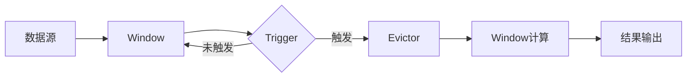

# Flink Trigger原理与代码实例讲解

## 1. 背景介绍

### 1.1 流式计算与Flink 

在大数据时代,海量数据的实时处理和分析变得越来越重要。流式计算作为一种数据处理范式,能够对连续不断到达的数据进行实时计算。Apache Flink是目前最流行的开源分布式流式计算引擎之一,它提供了高吞吐、低延迟、exactly-once语义保证等特性,在实时数据处理领域有着广泛的应用。

### 1.2 Window与Trigger

在Flink中,Window是一个非常重要的概念,它将无界的数据流划分成有界的数据集,从而允许我们对一定时间范围或数量的数据进行聚合计算。而Trigger(触发器)作为Flink中Window的一个关键组件,它决定了何时触发Window的计算,即何时将Window的计算结果输出。

### 1.3 文章概述

本文将深入探讨Flink中Trigger的原理和实现,通过结合代码实例,让读者全面理解Trigger的工作机制。同时,本文还将介绍Trigger在实际应用场景中的最佳实践,为读者提供有价值的参考。

## 2. 核心概念与联系

### 2.1 Window概念

在Flink中,Window可以分为以下几类:
- Time Window:根据时间划分窗口,如每5分钟一个窗口。
- Count Window:根据数据条数划分窗口,如每100条数据一个窗口。 
- Session Window:根据数据活跃程度划分窗口,一段时间没有数据到来就认为Session结束。

### 2.2 Trigger概念

Trigger定义了Window何时被触发,即Window中的数据何时可以进行计算并输出结果。Flink提供了不同的Trigger类型:
- EventTimeTrigger
- ProcessingTimeTrigger 
- CountTrigger
- PurgingTrigger

### 2.3 Evictor概念  

除了Trigger,Flink还提供了Evictor(驱逐者)机制。Evictor用于在Trigger触发之后,Window计算之前,将Window中的某些数据移除,即所谓的"Window数据清理"。常见的Evictor有:
- CountEvictor:保留Window中最后到达的N条数据
- DeltaEvictor:通过用户定义的DeltaFunction和threshold,判断是否移除一条数据
- TimeEvictor:保留Window中最近一段时间内的数据

### 2.4 Trigger与Window、Evictor的关系

下图展示了Trigger与Window、Evictor之间的关系和数据处理流程:



## 3. 核心算法原理与具体步骤

### 3.1 Trigger的生命周期

在Flink中,每个Window都绑定了一个Trigger,Trigger在Window的不同阶段会被调用,从而决定Window的行为。Trigger的生命周期如下:

1. onElement():每个元素(数据)到达Window时调用。
2. onEventTime():当注册的EventTime timer触发时调用。 
3. onProcessingTime():当注册的ProcessingTime timer触发时调用。
4. onMerge():当两个Window合并时,对应的Trigger也会合并,此时调用onMerge()。
5. clear():当Window被清除时调用。

### 3.2 TriggerResult

在Trigger的不同生命周期方法中,需要返回一个TriggerResult,用以决定Window接下来的行为。TriggerResult有以下几种:

- CONTINUE:不做任何操作,继续等待数据到来。
- FIRE:触发Window计算并输出结果,但是不清除Window数据,即Window继续接收数据。
- PURGE:清除Window中的数据,但是不触发计算。
- FIRE_AND_PURGE:触发Window计算输出结果,并清除Window数据。

### 3.3 Trigger示例

下面以EventTimeTrigger为例,分析其核心算法:

```java
public class EventTimeTrigger<W extends Window> extends Trigger<Object, W> {
    private static final long serialVersionUID = 1L;

    private EventTimeTrigger() {}

    @Override
    public TriggerResult onElement(Object element, long timestamp, W window, TriggerContext ctx) {
        if (window.maxTimestamp() <= ctx.getCurrentWatermark()) {
            // 如果Window的最大时间戳小于等于当前水位线,触发Window计算并清除数据
            return TriggerResult.FIRE_AND_PURGE;
        } else {
            // 否则注册一个EventTime timer,时间为Window的最大时间戳
            ctx.registerEventTimeTimer(window.maxTimestamp());
            return TriggerResult.CONTINUE;
        }
    }

    @Override
    public TriggerResult onEventTime(long time, W window, TriggerContext ctx) {
        return time == window.maxTimestamp() ?
            TriggerResult.FIRE_AND_PURGE :
            TriggerResult.CONTINUE;
    }

    @Override
    public TriggerResult onProcessingTime(long time, W window, TriggerContext ctx) {
        return TriggerResult.CONTINUE;
    }

    @Override
    public void clear(W window, TriggerContext ctx) {
        ctx.deleteEventTimeTimer(window.maxTimestamp());
    }

    @Override
    public boolean canMerge() {
        return true;
    }

    @Override
    public void onMerge(W window, OnMergeContext ctx) {
        // 当Window合并时,选择最早的EventTime timer作为合并后Window的timer
        long windowMaxTimestamp = window.maxTimestamp();
        if (windowMaxTimestamp > ctx.getCurrentWatermark()) {
            ctx.registerEventTimeTimer(windowMaxTimestamp);
        }
    }

    @Override
    public String toString() {
        return "EventTimeTrigger()";
    }

    /**
     * Creates an event-time trigger that fires once the watermark passes the end of the window.
     *
     * <p>Once the trigger fires all elements are discarded. Elements that arrive late immediately
     * trigger window evaluation with just this one element.
     */
    public static <W extends Window> EventTimeTrigger<W> create() {
        return new EventTimeTrigger<>();
    }
}
```

EventTimeTrigger的核心算法可总结如下:

1. 当一个元素到达Window时,如果Window的最大时间戳小于等于当前水位线,则触发Window计算并清除数据;否则注册一个EventTime timer,时间为Window的最大时间戳。

2. 当注册的EventTime timer触发时,如果触发时间等于Window的最大时间戳,则触发Window计算并清除数据;否则不做任何操作。

3. 当Window合并时,选择最早的EventTime timer作为合并后Window的timer。

4. 当Window被清除时,删除注册的EventTime timer。

## 4. 数学模型和公式详解

在Flink的Trigger实现中,主要涉及时间和水位线的概念,这里对其进行简要的数学建模和公式说明。

### 4.1 时间模型

Flink中有三种时间概念:
- Event Time:事件真正发生的时间。
- Ingestion Time:事件进入Flink的时间。
- Processing Time:事件被处理的时间。

它们之间的关系可以用以下公式表示:

$EventTime \leq IngestionTime \leq ProcessingTime$

### 4.2 水位线(Watermark)

水位线是Flink中用于处理EventTime的一种机制,它表示在此之前的所有事件都已经到达。假设事件的EventTime为$t_i$,水位线为$W$,则有:

$\forall t_i \leq W, \text{事件} i \text{已到达}$

水位线的计算公式为:

$W = \max_{i \in \text{已到达事件}} (t_i) - \text{允许的最大延迟时间}$

其中,允许的最大延迟时间是一个用户定义的参数,用于容忍一定程度的事件乱序。

### 4.3 EventTimeTrigger的数学描述

结合上述时间模型和水位线概念,我们可以对EventTimeTrigger的核心算法进行数学描述:

1. 当事件$i$到达Window时,若$\max_{j \in \text{Window}} (t_j) \leq W$,则触发Window计算并清除数据;否则注册一个EventTime timer $T = \max_{j \in \text{Window}} (t_j)$。

2. 当EventTime timer $T$触发时,若$T = \max_{j \in \text{Window}} (t_j)$,则触发Window计算并清除数据;否则不做任何操作。

3. 当Window $A$和$B$合并为$C$时,$T_C = \min(T_A, T_B)$。

4. 当Window被清除时,删除其对应的EventTime timer。

这些数学描述清晰地表达了EventTimeTrigger的工作原理,有助于我们深入理解Flink中的Trigger机制。

## 5. 项目实践:代码实例和详解

下面通过一个具体的代码实例,演示如何在Flink中使用Trigger。本例中,我们将实现一个基于事件时间的窗口计算,每5秒钟统计一次数据的和。

### 5.1 代码实现

```java
public class TriggerExample {
    public static void main(String[] args) throws Exception {
        StreamExecutionEnvironment env = StreamExecutionEnvironment.getExecutionEnvironment();
        
        // 设置EventTime为时间特征
        env.setStreamTimeCharacteristic(TimeCharacteristic.EventTime);
        
        // 从Socket读取数据
        DataStream<String> dataStream = env.socketTextStream("localhost", 9999);
        
        dataStream
            // 解析数据
            .map(new MapFunction<String, Tuple2<String, Long>>() {
                @Override
                public Tuple2<String, Long> map(String s) {
                    String[] arr = s.split(",");
                    return Tuple2.of(arr[0], Long.parseLong(arr[1]));
                }
            })
            // 抽取时间戳,生成水位线
            .assignTimestampsAndWatermarks(
                WatermarkStrategy.<Tuple2<String, Long>>forBoundedOutOfOrderness(Duration.ofSeconds(5))
                    .withTimestampAssigner((event, timestamp) -> event.f1)
            )
            // 按key分区
            .keyBy(r -> r.f0)
            // 设置5秒的事件时间滚动窗口,使用EventTimeTrigger
            .window(TumblingEventTimeWindows.of(Time.seconds(5)))
            .trigger(EventTimeTrigger.create())
            // 窗口聚合函数
            .aggregate(new AggregateFunction<Tuple2<String, Long>, Long, Long>() {
                @Override
                public Long createAccumulator() {
                    return 0L;
                }
    
                @Override
                public Long add(Tuple2<String, Long> value, Long accumulator) {
                    return accumulator + value.f1;
                }
    
                @Override
                public Long getResult(Long accumulator) {
                    return accumulator;
                }
    
                @Override
                public Long merge(Long a, Long b) {
                    return a + b;
                }
            })
            .print();
        
        env.execute("Trigger Example");
    }
}
```

### 5.2 代码解析

1. 首先创建了一个StreamExecutionEnvironment,并设置时间特征为EventTime。

2. 然后从Socket读取数据,并进行解析,转换为`Tuple2<String, Long>`类型,其中第一个元素为key,第二个元素为时间戳。

3. 接着使用`assignTimestampsAndWatermarks`方法抽取时间戳,并生成水位线。这里使用了`forBoundedOutOfOrderness`策略,允许最大5秒的延迟。

4. 之后按照key进行分区,然后设置了5秒的事件时间滚动窗口,并指定使用EventTimeTrigger。

5. 在窗口上定义了一个聚合函数,用于计算窗口内数据的和。

6. 最后将结果打印输出。

这个例子展示了如何在Flink中使用EventTimeTrigger来触发基于事件时间的窗口计算。当水位线越过窗口结束时间时,窗口就会被触发计算并输出结果。

## 6. 实际应用场景

Flink中的Trigger在许多实际场景中都有广泛应用,下面列举几个典型的应用场景:

### 6.1 实时监控和告警

在实时监控和告警系统中,往往需要对一段时间内的数据进行聚合计算,如果发现异常,就触发告警。这种场景下,我们可以使用基于事件时间的滚动窗口,并结合EventTimeTrigger和CountTrigger。例如,每5分钟计算一次指标,如果连续3个窗口的指标都超过阈值,就触发告警。

### 6.2 实时数据分析

在实时数据分析场景下,我们经常需要对一段时间内的数据进行聚合统计,生成报表或仪表盘。这种情况下,可以使用基于事件时间的滚动窗口或滑动窗口,并使用EventTimeTrigger触发窗口计算。例如,每小时统计一次各个指标的平均值、最大值、最小值等。

### 6.3 数据去重

在某些场景下,我们