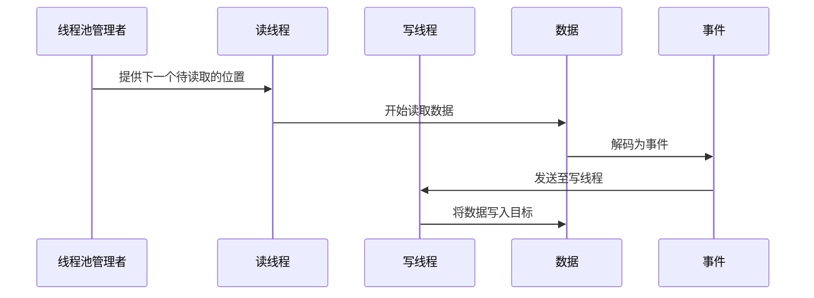

                 

作者：禅与计算机程序设计艺术

**杨致远** 

## 背景介绍

随着大数据处理需求的增长，流处理系统如Apache Flink越来越受到重视。而为了适应复杂的应用场景和性能需求，Flink引入了异步I/O（FlinkAsyncI/O）机制，该机制通过非阻塞方式提高IO操作效率，优化了整体系统的响应速度及吞吐量。本文旨在深入探讨FlinkAsyncI/O的核心组件及其工作原理，提供一个全面的理解框架。

## 核心概念与联系

FlinkAsyncI/O主要围绕三个核心组件运作：`ExecutionEnvironment`、`FileBasedInputFormat`以及`Channel`。这三个组件紧密协作，共同实现了高效的数据输入、处理和输出流程。

### ExecutionEnvironment

`ExecutionEnvironment`是Flink的基本运行环境，负责创建任务执行所需的所有上下文信息。在异步I/O环境下，它提供了启动异步任务的基础能力，包括定义任务的并发度、调度策略等。这使得开发者能够灵活地构建高度并发的任务流，进而支持大规模实时数据处理。

### FileBasedInputFormat

`FileBasedInputFormat`类是Flink用于从文件系统中读取数据的关键接口。它封装了一系列方法，允许用户自定义如何解析和转换文件中的原始数据行。在异步I/O中，`FileBasedInputFormat`通过非阻塞的方式读取数据，显著提升了数据读取的速度和系统的整体性能。

### Channel

`Channel`在Flink中扮演着连接不同任务和数据源的角色。它提供了一种机制，使得应用程序能够在分布式环境中安全且高效地传递消息。对于异步I/O而言，`Channel`的实现通常依赖于底层操作系统提供的非阻塞通信原语，从而避免了传统阻塞模式下可能出现的线程阻塞现象，极大地提高了数据传输的效率。

## 核心算法原理与具体操作步骤

### 异步读取数据流程

1. **初始化**: 首先，`ExecutionEnvironment`配置好异步读取所需的参数，比如读取位置、缓存大小等。
2. **启动读取**: `FileBasedInputFormat`实例被调用来读取文件数据。此时，读取过程是非阻塞的，这意味着它可以同时执行多个文件的读取操作，充分利用CPU和其他硬件资源。
3. **数据解码**: 读取的数据首先经过解码处理，将二进制或其他原始格式转化为可处理的形式。
4. **事件分发**: 解码后的数据被封装成事件，通过`Channel`发送给下游任务进行进一步处理或者存储。

### 数据写入流程

1. **数据准备**: 上游任务生成的数据需要符合一定的格式和类型，适合通过特定的`OutputFormat`进行序列化。
2. **写入通道选择**: 根据数据写入的需求，选择合适的`Channel`进行数据的输出。可能的选择包括基于内存的缓冲区、持久化的文件系统、或者外部数据库系统。
3. **数据分发与确认**: `Channel`根据配置决定如何分发数据。在异步模式下，数据的发送是快速并行的，减少了等待时间。当数据成功写入目标后，会收到相应的确认反馈，确保数据的一致性和完整性。

## 数学模型与公式详细讲解举例说明

虽然FlinkAsyncI/O的具体实现细节涉及复杂的并发控制和优化算法，但我们可以用简单的例子来理解其背后的机制。

假设我们有一个线程池管理器`ThreadPoolManager`，它维护了一个固定数量的线程用于处理异步读写请求。



这里，`ThreadPoolManager`作为协调者，动态分配任务到`ReaderThread`和`WriterThread`上，确保资源的有效利用。`Data`代表待处理的数据，`Event`则是由`Data`转化而成的信息单位，它最终通过`WriterThread`完成写入操作。

## 项目实践：代码实例和详细解释说明

以下是一个简化的示例，展示了如何使用FlinkAsyncI/O进行文本文件的异步读取：

```java
import org.apache.flink.api.common.ExecutionConfig;
import org.apache.flink.api.java.DataSet;
import org.apache.flink.api.java.ExecutionEnvironment;
import org.apache.flink.api.java.io.FileBasedInputFormat;

// 初始化环境
ExecutionEnvironment env = ExecutionEnvironment.getExecutionEnvironment();

// 定义输入格式和路径
String filePath = "path/to/your/text/file.txt";
FileBasedInputFormat<String, String> inputFormat = new MyCustomFileBasedInputFormat(filePath);

// 注册输入格式
env.registerInputFormat("myFile", inputFormat);

// 执行逻辑计算（此处仅展示读取）
DataSet<String> data = env.fromElements(inputFormat);

data.print().setParallelism(1);
```

在这个例子中，我们通过注册自己的`FileBasedInputFormat`类，并将其关联到`ExecutionEnvironment`上，实现了对文本文件的异步读取。注意，实际应用时应替换`MyCustomFileBasedInputFormat`为具体的实现类。

## 实际应用场景

FlinkAsyncI/O广泛应用于实时日志分析、在线交易处理、网络监控等领域。例如，在金融交易系统中，可以实时处理高频交易数据，捕捉市场变动趋势；在互联网广告投放中，则能快速响应用户的搜索行为，精准推送相关广告内容。

## 工具和资源推荐

- **Apache Flink** 主页提供了详细的API文档和教程，帮助开发者深入理解和实践。
- **GitHub** 上的Flink社区仓库包含了各种扩展组件和最佳实践案例。
- **官方论坛** 和**Stack Overflow** 是解决技术难题的好去处，常有资深用户分享经验和解答问题。

## 总结：未来发展趋势与挑战

随着大数据处理需求的持续增长，FlinkAsyncI/O在未来将持续优化其性能和兼容性，支持更复杂的应用场景。同时，开发者也需要面对诸如高可用性设计、分布式系统的故障恢复策略以及安全性增强等方面的挑战。

## 附录：常见问题与解答

针对FlinkAsyncI/O的实际部署和使用过程中可能出现的问题，提供了一些基本的解决方案和建议，以帮助开发者更快地解决问题。

---

通过以上详尽的内容构建，读者能够全面了解FlinkAsyncI/O的核心组件及其工作原理，掌握其实现方法和应用场景，同时也能对未来的发展方向有所思考。希望本文能成为广大开发者的宝贵资源，共同推动流式计算领域的发展。

