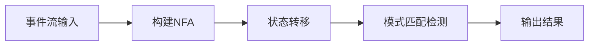
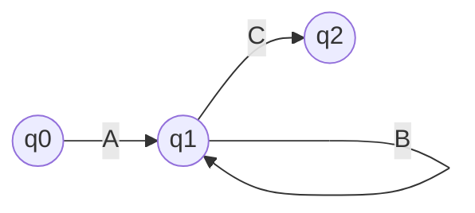

# FlinkCEP的绿色环保与社会责任

## 1.背景介绍

随着工业化进程的不断加快,环境污染和资源浪费问题日益严重,对人类社会的可持续发展构成了巨大挑战。因此,实现绿色环保、节能减排已经成为各行各业的当务之急。在这一背景下,大数据领域的FlinkCEP(Flink Complex Event Processing)技术应运而生,为解决环境问题贡献了自己的力量。

作为一种实时流式数据处理引擎,FlinkCEP能够高效地处理来自多个数据源的大规模数据流,从而为环境监测、能源优化等领域提供了强有力的技术支持。通过对海量数据进行智能分析,FlinkCEP可以及时发现异常情况,并采取相应的措施,从而实现节能减排,促进环境的可持续发展。

## 2.核心概念与联系

FlinkCEP的核心概念包括事件(Event)、模式(Pattern)和模式匹配(Pattern Matching)。

### 2.1 事件(Event)

事件是FlinkCEP处理的基本单元,可以是传感器采集的数据、日志记录、用户交互行为等。每个事件都包含了时间戳、键值对等元数据信息,用于后续的处理和分析。

### 2.2 模式(Pattern)

模式是用于描述事件序列的规则或条件,它定义了需要检测和匹配的事件序列。模式可以包括事件的顺序、时间约束、数量约束等多种条件。

### 2.3 模式匹配(Pattern Matching)

模式匹配是FlinkCEP的核心功能,它将实时的事件流与预定义的模式进行匹配,并输出符合模式的事件序列。通过模式匹配,FlinkCEP可以及时发现异常情况,并触发相应的操作或警报。

这三个核心概念相互关联,共同构建了FlinkCEP的工作流程。事件流作为输入,模式定义了需要检测的条件,而模式匹配则负责实时匹配事件流并输出结果。

## 3.核心算法原理具体操作步骤

FlinkCEP的核心算法原理基于有限状态机(Finite State Machine, FSM)和 NFA(Non-deterministic Finite Automaton)。具体操作步骤如下:

1. **构建 NFA**

   根据用户定义的模式,FlinkCEP会将其转换为 NFA。NFA 是一种用于模式匹配的有限状态自动机,它可以处理复杂的事件序列,包括并发、选择等情况。

2. **事件流输入**

   实时的事件流作为 NFA 的输入,每个事件都会被传递给 NFA 进行处理。

3. **状态转移**

   NFA 根据当前状态和输入事件,按照预定义的转移规则进行状态转移。每个状态转移都会更新 NFA 的内部状态。

4. **模式匹配检测**

   在状态转移的过程中,NFA 会持续检测是否存在匹配成功的状态路径。一旦发现匹配成功的路径,就会输出对应的事件序列。

5. **输出结果**

   匹配成功的事件序列将作为 FlinkCEP 的输出,可以被后续的操作或警报系统进行处理。

该算法的优势在于能够高效地处理复杂的事件序列,并支持并发、选择等高级模式匹配功能。同时,由于 NFA 的状态转移是增量式的,因此它可以实现低延迟的实时处理,满足绿色环保领域对实时性的需求。



## 4.数学模型和公式详细讲解举例说明

在 FlinkCEP 的模式匹配算法中,有一个关键的数学模型需要介绍,即 NFA(Non-deterministic Finite Automaton)。NFA 是一种用于模式匹配的有限状态自动机,它可以处理复杂的事件序列,包括并发、选择等情况。

NFA 可以用一个五元组 $M = (Q, \Sigma, \delta, q_0, F)$ 来表示,其中:

- $Q$ 是一个有限的状态集合
- $\Sigma$ 是一个有限的输入符号集合(即事件集合)
- $\delta$ 是一个状态转移函数,定义了在给定当前状态和输入符号时,自动机将转移到哪个状态
- $q_0 \in Q$ 是初始状态
- $F \subseteq Q$ 是一个终止状态集合

状态转移函数 $\delta$ 可以进一步定义为:

$$\delta: Q \times \Sigma \rightarrow 2^Q$$

其中,对于任意状态 $q \in Q$ 和输入符号 $a \in \Sigma$,$\delta(q, a)$ 是一个状态集合,表示从状态 $q$ 在输入符号 $a$ 时可能转移到的所有状态。

在 FlinkCEP 中,NFA 的构建过程是基于用户定义的模式。例如,假设我们需要匹配一个模式 "A B+ C?",其中 "B+" 表示一个或多个 B 事件,"C?" 表示一个可选的 C 事件。该模式可以转换为以下 NFA:



在这个 NFA 中,$Q = \{q_0, q_1, q_2\}$,$\Sigma = \{A, B, C\}$,$q_0$ 是初始状态,$F = \{q_2\}$ 是终止状态集合。状态转移函数 $\delta$ 定义如下:

- $\delta(q_0, A) = \{q_1\}$
- $\delta(q_1, B) = \{q_1\}$
- $\delta(q_1, C) = \{q_2\}$

在实际的模式匹配过程中,FlinkCEP 会根据输入的事件流不断更新 NFA 的状态,直到达到终止状态,输出匹配成功的事件序列。

通过 NFA 模型,FlinkCEP 可以高效地处理复杂的事件序列,支持并发、选择等高级模式匹配功能,从而为绿色环保领域提供了强有力的技术支持。

## 5.项目实践:代码实例和详细解释说明

为了更好地理解 FlinkCEP 在绿色环保领域的应用,我们将通过一个具体的项目实践来演示如何使用 FlinkCEP 进行模式匹配和异常检测。

### 5.1 项目背景

假设我们需要监控一个工厂的污染排放情况。工厂安装了多个传感器,实时采集空气中的污染物浓度数据。我们需要使用 FlinkCEP 来检测是否存在异常排放情况,并及时发出警报。

### 5.2 数据模型

我们定义一个 `Emission` 类来表示传感器采集的污染物浓度数据:

```java
public class Emission {
    private String sensorId; // 传感器ID
    private String pollutant; // 污染物种类
    private double concentration; // 浓度值
    private long timestamp; // 时间戳

    // 构造函数和getter/setter方法
}
```

### 5.3 模式定义

我们定义一个模式来检测连续三次污染物浓度超标的情况:

```java
Pattern<Emission, ?> pattern = Pattern.<Emission>begin("start")
    .where(new SimpleCondition<Emission>() {
        @Override
        public boolean filter(Emission value) throws Exception {
            return value.getConcentration() > threshold; // 浓度超标
        }
    })
    .times(3) // 连续三次
    .consecutive() // 要求连续
    .within(Time.minutes(30)); // 时间窗口为30分钟
```

### 5.4 FlinkCEP 作业

接下来,我们创建一个 FlinkCEP 作业来进行模式匹配:

```java
StreamExecutionEnvironment env = StreamExecutionEnvironment.getExecutionEnvironment();
DataStream<Emission> emissionStream = env.addSource(new SensorSource());

PatternStream<Emission> patternStream = CEP.pattern(
    emissionStream.keyBy(Emission::getSensorId), // 按传感器ID分区
    pattern
);

DataStream<Alert> alerts = patternStream.select(
    new PatternFlatTimeoutFunction<Emission, Alert>() {
        // 处理匹配成功的事件序列
    }
);

alerts.print(); // 输出警报
env.execute("Emission Monitoring");
```

在上面的代码中,我们首先从传感器数据源创建了一个 `DataStream`。然后使用 `CEP.pattern` 方法将模式应用到数据流上,生成一个 `PatternStream`。最后,我们使用 `select` 方法来处理匹配成功的事件序列,输出警报信息。

### 5.5 运行结果

当我们运行这个作业时,FlinkCEP 会实时监控传感器数据流,一旦检测到连续三次污染物浓度超标的情况,就会输出一个警报,提醒相关人员采取必要的措施。

通过这个项目实践,我们可以看到 FlinkCEP 如何在绿色环保领域发挥作用。它可以实时处理大规模的传感器数据流,并根据预定义的模式进行智能分析和异常检测,从而有效地监控污染情况,为环境保护做出贡献。

## 6.实际应用场景

FlinkCEP 在绿色环保领域有着广泛的应用前景,包括但不限于以下几个方面:

### 6.1 环境监测

利用各种传感器采集的环境数据,FlinkCEP 可以实时监测空气质量、水质、噪音等多个维度的环境指标。通过定义合适的模式,FlinkCEP 能够及时发现异常情况,如突发的污染事件、超标排放等,并触发相应的预警和响应措施。

### 6.2 能源优化

在工业生产、建筑供暖等领域,FlinkCEP 可以对能源消耗数据进行实时分析,发现能源浪费的模式,从而优化能源利用效率,减少不必要的能源消耗和温室气体排放。

### 6.3 交通管理

在智能交通系统中,FlinkCEP 可以对实时的交通流量数据进行模式匹配,发现拥堵、事故等异常情况,并提供交通引导和调度建议,从而减少交通堵塞带来的能源浪费和环境污染。

### 6.4 可再生能源监控

对于风能、太阳能等可再生能源系统,FlinkCEP 可以实时监控发电量、储能情况等关键指标,优化能源利用效率,确保可再生能源的稳定供应。

### 6.5 循环经济

在循环经济领域,FlinkCEP 可以对物料流动、再利用情况进行实时跟踪,发现浪费和低效利用的模式,从而优化资源利用效率,促进可持续发展。

总的来说,FlinkCEP 凭借其实时处理大数据的能力,为绿色环保领域提供了强有力的技术支持,有助于实现节能减排、环境监测和资源优化等目标,促进人类社会的可持续发展。

## 7.工具和资源推荐

在使用 FlinkCEP 进行绿色环保相关应用开发时,以下工具和资源可以为您提供帮助:

### 7.1 Apache Flink

Apache Flink 是一个开源的分布式流处理框架,它提供了强大的流处理引擎和丰富的API,支持事件驱动的应用程序。FlinkCEP 就是 Flink 中用于复杂事件处理的库。您可以在 Apache Flink 官网(https://flink.apache.org/)找到丰富的文档、教程和社区资源。

### 7.2 Flink CEP 官方文档

Flink CEP 官方文档(https://nightlies.apache.org/flink/flink-docs-release-1.16/docs/libs/cep/)详细介绍了 CEP 库的使用方法、API 说明和最佳实践。这是学习和使用 FlinkCEP 的重要资源。

### 7.3 Flink CEP 示例项目

Apache Flink 官方提供了一些 CEP 示例项目,包括网络入侵检测、机器故障预测等,您可以在 GitHub 上找到这些项目(https://github.com/apache/flink/tree/master/flink-examples/flink-examples-streaming/src/main/java/org/apache/flink/streaming/examples/