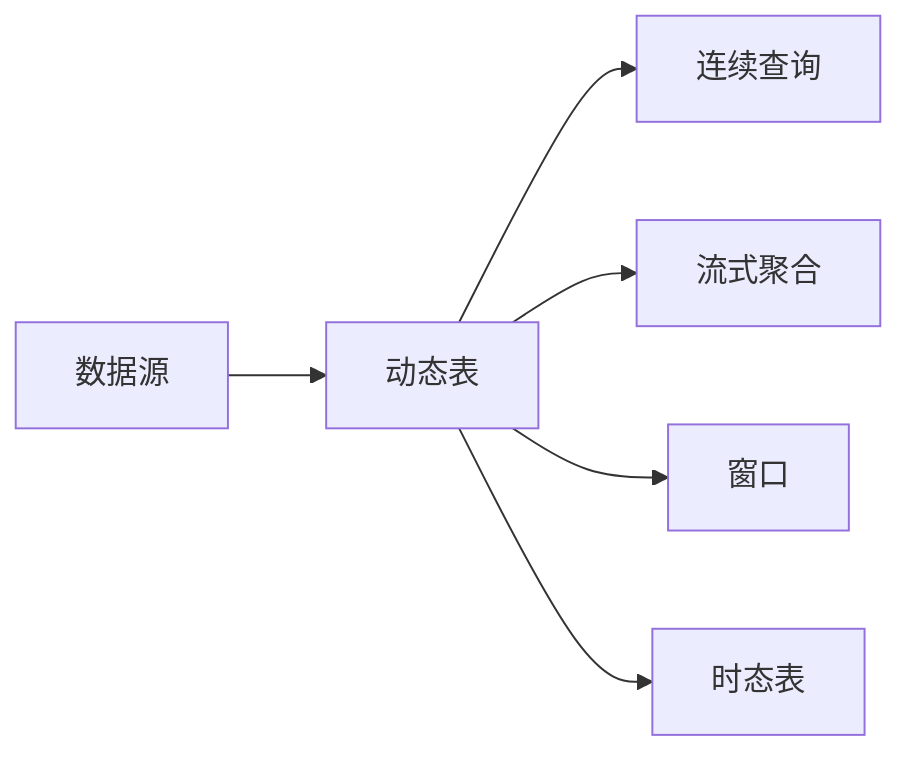

# FlinkTableAPI:数据可视化与交互式分析

## 1.背景介绍
### 1.1 大数据处理的挑战
随着大数据时代的到来,企业面临着海量数据处理和分析的挑战。传统的批处理模式已经无法满足实时性和交互性的需求。如何高效地处理海量数据并实现数据可视化和交互式分析,成为了企业亟需解决的问题。

### 1.2 Flink的优势
Apache Flink是一个开源的分布式流处理和批处理框架,具有低延迟、高吞吐、exactly-once语义保证等优点。Flink提供了DataStream API和Table API两种编程模型,其中Table API以声明式的方式处理静态和动态表,使得用户能够以更自然的方式表达复杂的数据分析逻辑。

### 1.3 Table API与数据可视化
Flink Table API不仅可以方便地处理结构化数据,还可以与各种可视化工具无缝集成,实现数据的可视化展示。通过Table API,用户可以将分析结果输出到各种存储系统中,如关系型数据库、KV存储、对象存储等,也可以将结果直接推送到可视化大屏上,实现实时数据展示。

## 2.核心概念与关联
### 2.1 动态表(Dynamic Table) 
动态表是Flink Table API的核心概念之一,它代表了一个随时间变化的表。与静态表(static table)不同,动态表中的数据可以被持续查询和更新。动态表可以通过各种数据源(如Kafka、文件系统、数据库等)创建,也可以通过查询语句从现有的表中派生出来。

### 2.2 连续查询(Continuous Query)
连续查询是在动态表上持续执行的查询,每当动态表的数据发生变化时,查询结果也会随之更新。这种查询模式非常适合实时数据分析和监控场景。通过在动态表上定义连续查询,用户可以实时跟踪关键指标的变化,并及时做出响应。

### 2.3 流式聚合(Streaming Aggregation)
流式聚合是对动态表进行实时聚合计算的过程。与批处理不同,流式聚合是在数据持续到达时不断更新聚合结果。Flink提供了多种内置的聚合函数,如SUM、COUNT、AVG、MAX、MIN等,用户也可以自定义聚合函数来满足特定需求。

### 2.4 窗口(Window)
窗口是流处理中的重要概念,它将无界的数据流切分成有界的数据集,以便进行聚合计算。Flink支持多种类型的窗口,如滚动窗口(Tumbling Window)、滑动窗口(Sliding Window)、会话窗口(Session Window)等。通过在动态表上定义窗口,用户可以灵活地控制聚合计算的时间范围。

### 2.5 时态表(Temporal Table)
时态表是一种特殊的动态表,它将表中的每一行数据与一个时间戳关联起来。通过时态表,用户可以方便地处理带有时间属性的数据,如追踪数据的变化历史、进行时间范围内的聚合计算等。Flink支持处理事件时间(Event Time)和处理时间(Processing Time)两种时间语义。

下面是这些核心概念之间的关联图:



## 3.核心算法原理与具体操作步骤
### 3.1 动态表的创建
#### 3.1.1 从数据源创建动态表
可以通过以下几种方式从外部数据源创建动态表:

1. 从文件系统读取数据(如CSV、JSON、Avro等)
2. 从消息队列读取数据(如Kafka、RabbitMQ等)  
3. 从数据库读取数据(如MySQL、PostgreSQL等)

示例代码:
```java
// 从Kafka读取数据创建动态表
tableEnv.executeSql("CREATE TABLE KafkaTable (" +
    " id INT," +
    " name STRING," +
    " age INT" +
    ") WITH (" +
    " 'connector' = 'kafka'," +
    " 'topic' = 'my_topic'," +
    " 'properties.bootstrap.servers' = 'localhost:9092'," +
    " 'format' = 'json'" +
    ")");
```

#### 3.1.2 从查询结果创建动态表
可以通过在现有表上执行查询语句,将查询结果作为一个新的动态表。

示例代码:
```java
// 从查询结果创建动态表
Table resultTable = tableEnv.sqlQuery("SELECT id, name FROM KafkaTable WHERE age > 18");
tableEnv.createTemporaryView("ResultTable", resultTable);
```

### 3.2 连续查询的定义与执行
#### 3.2.1 定义连续查询
连续查询通过在动态表上执行SQL语句来定义。查询语句可以包含各种操作,如筛选、投影、聚合、连接等。

示例代码:
```java
// 定义连续查询
Table resultTable = tableEnv.sqlQuery("SELECT id, COUNT(*) AS cnt FROM KafkaTable GROUP BY id");
```

#### 3.2.2 执行连续查询
连续查询的执行有以下几种方式:

1. 将查询结果输出到外部系统(如Kafka、数据库等)
2. 将查询结果转换成DataStream并进行后续处理
3. 将查询结果打印到控制台

示例代码:
```java
// 将查询结果输出到Kafka
tableEnv.executeSql("CREATE TABLE OutputTable (" +
    " id INT," +
    " cnt BIGINT" +
    ") WITH (" +
    " 'connector' = 'kafka'," +
    " 'topic' = 'output_topic'," +
    " 'properties.bootstrap.servers' = 'localhost:9092'," +
    " 'format' = 'json'" +
    ")");
resultTable.executeInsert("OutputTable");
```

### 3.3 流式聚合的实现
#### 3.3.1 内置聚合函数
Flink Table API提供了多种内置的聚合函数,如SUM、COUNT、AVG、MAX、MIN等,可以直接在SQL语句中使用。

示例代码:
```java
// 使用内置聚合函数
Table resultTable = tableEnv.sqlQuery("SELECT id, SUM(amount) AS total FROM KafkaTable GROUP BY id");
```

#### 3.3.2 自定义聚合函数
用户可以通过实现AggregateFunction接口来自定义聚合函数,以满足特定的业务需求。

示例代码:
```java
// 自定义聚合函数
public static class WeightedAvg extends AggregateFunction<Double, WeightedAvgAccumulator> {
    @Override
    public WeightedAvgAccumulator createAccumulator() {
        return new WeightedAvgAccumulator();
    }

    public void accumulate(WeightedAvgAccumulator acc, Double value, Double weight) {
        acc.sum += value * weight;
        acc.count += weight;
    }

    @Override
    public Double getValue(WeightedAvgAccumulator acc) {
        if (acc.count == 0) {
            return null;
        } else {
            return acc.sum / acc.count;
        }
    }
}

// 注册自定义聚合函数
tableEnv.registerFunction("weightedAvg", new WeightedAvg());

// 在查询中使用自定义聚合函数
Table resultTable = tableEnv.sqlQuery("SELECT id, weightedAvg(value, weight) AS avg FROM KafkaTable GROUP BY id");
```

### 3.4 窗口的定义与使用
#### 3.4.1 滚动窗口
滚动窗口将数据流按照固定的时间间隔进行切分,每个窗口内的数据独立处理。

示例代码:
```java
// 定义滚动窗口
Table resultTable = tableEnv.sqlQuery("SELECT id, COUNT(*) AS cnt " +
    "FROM KafkaTable " +
    "GROUP BY TUMBLE(proctime, INTERVAL '1' MINUTE), id");
```

#### 3.4.2 滑动窗口
滑动窗口在滚动窗口的基础上引入了滑动步长的概念,每次窗口滑动时,部分数据会被重复处理。

示例代码:
```java
// 定义滑动窗口
Table resultTable = tableEnv.sqlQuery("SELECT id, COUNT(*) AS cnt " +
    "FROM KafkaTable " +
    "GROUP BY HOP(proctime, INTERVAL '30' SECOND, INTERVAL '1' MINUTE), id");
```

#### 3.4.3 会话窗口 
会话窗口根据数据的活跃程度动态调整窗口的大小,当数据在一定时间内没有到达时,会话窗口就会关闭。

示例代码:
```java
// 定义会话窗口
Table resultTable = tableEnv.sqlQuery("SELECT id, COUNT(*) AS cnt " +
    "FROM KafkaTable " +
    "GROUP BY SESSION(proctime, INTERVAL '1' MINUTE), id");
```

### 3.5 时态表的处理
#### 3.5.1 时态表的创建
时态表可以通过在普通表上定义时间属性字段来创建,时间属性字段可以是事件时间或处理时间。

示例代码:
```java
// 创建时态表
tableEnv.executeSql("CREATE TABLE TemporalTable (" +
    " id INT," +
    " name STRING," +
    " age INT," +
    " ts TIMESTAMP(3)," +
    " WATERMARK FOR ts AS ts - INTERVAL '5' SECOND" +
    ") WITH (" +
    " 'connector' = 'kafka'," +
    " 'topic' = 'my_topic'," +
    " 'properties.bootstrap.servers' = 'localhost:9092'," +
    " 'format' = 'json'" +
    ")");
```

#### 3.5.2 时态表的查询
对时态表的查询可以使用特殊的时态查询语法,如FOR SYSTEM_TIME AS OF、FOR SYSTEM_TIME BETWEEN等,以便在特定时间点或时间范围内查询数据。

示例代码:
```java
// 查询某个时间点的数据
Table resultTable = tableEnv.sqlQuery("SELECT * FROM TemporalTable FOR SYSTEM_TIME AS OF TIMESTAMP '2022-03-01 10:00:00'");

// 查询某个时间范围内的数据
Table resultTable = tableEnv.sqlQuery("SELECT * FROM TemporalTable FOR SYSTEM_TIME BETWEEN TIMESTAMP '2022-03-01 10:00:00' AND TIMESTAMP '2022-03-01 11:00:00'");
```

## 4.数学模型和公式详细讲解举例说明
### 4.1 加权平均值
加权平均值是一种常见的聚合计算,它考虑了每个数据点的权重,对数据点的值进行加权求和,然后除以权重之和。

数学公式:
$$
\bar{x} = \frac{\sum_{i=1}^{n} w_i x_i}{\sum_{i=1}^{n} w_i}
$$

其中,$\bar{x}$表示加权平均值,$x_i$表示第$i$个数据点的值,$w_i$表示第$i$个数据点的权重,$n$表示数据点的总数。

示例代码:
```java
// 自定义加权平均值聚合函数
public static class WeightedAvg extends AggregateFunction<Double, WeightedAvgAccumulator> {
    @Override
    public WeightedAvgAccumulator createAccumulator() {
        return new WeightedAvgAccumulator();
    }

    public void accumulate(WeightedAvgAccumulator acc, Double value, Double weight) {
        acc.sum += value * weight;
        acc.weightSum += weight;
    }

    @Override
    public Double getValue(WeightedAvgAccumulator acc) {
        if (acc.weightSum == 0) {
            return null;
        } else {
            return acc.sum / acc.weightSum;
        }
    }
}

// 注册自定义聚合函数
tableEnv.registerFunction("weightedAvg", new WeightedAvg());

// 在查询中使用自定义聚合函数
Table resultTable = tableEnv.sqlQuery("SELECT id, weightedAvg(value, weight) AS avg_value FROM KafkaTable GROUP BY id");
```

### 4.2 贝叶斯平均
贝叶斯平均是一种考虑了先验知识的平均值计算方法,通过引入先验均值和先验样本量,可以减少异常值对平均值的影响。

数学公式:
$$
\hat{x} = \frac{C \bar{x}_0 + \sum_{i=1}^{n} x_i}{C + n}
$$

其中,$\hat{x}$表示贝叶斯平均值,$\bar{x}_0$表示先验均值,$C$表示先验样本量,$x_i$表示第$i$个数据点的值,$n$表示数据点的总数。

示例代码:
```java
// 自定义贝叶斯平均聚合函数
public static class BayesianAvg extends AggregateFunction<Double, BayesianAvgAccumulator> {
    private final double priorMean;
    private final int priorCount;

    public BayesianAvg(double priorMean, int priorCount) {
        this.priorMean = priorMean;
        this.priorCount = priorCount;
    }

    @