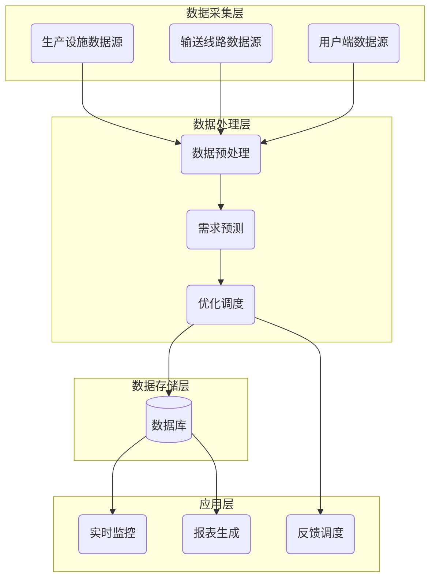

# Flink实时能源管理

## 1.背景介绍

随着能源需求的不断增长和可再生能源的兴起,实时能源管理系统变得越来越重要。传统的能源管理系统无法满足实时数据处理和快速响应的需求,因此需要采用新的技术来解决这一问题。Apache Flink作为一种分布式流式数据处理引擎,具有低延迟、高吞吐量和容错性等优势,非常适合用于实时能源管理系统的构建。

能源管理系统需要处理来自各种传感器、智能电网设备和能源生产设施的大量实时数据流。这些数据包括能源生产、输送、消耗等各个环节的信息。通过实时分析这些数据,能源管理系统可以实现精确的需求预测、智能调度、故障检测和能源优化等功能,从而提高能源利用效率、降低能源损耗和碳排放。

## 2.核心概念与联系

实时能源管理系统涉及以下几个核心概念:

1. **流式数据处理(Stream Processing)**: 指对持续不断产生的数据流进行实时处理、分析和响应。实时能源管理系统需要处理来自各种设备和传感器的实时数据流。

2. **事件时间(Event Time)**: 指每个数据记录实际发生的时间戳,而不是进入系统的时间。在能源管理系统中,事件时间非常重要,因为它可以准确反映实际情况,避免由于网络延迟或其他因素导致的数据乱序。

3. **窗口(Window)**: 流式数据处理通常需要在一定时间范围内对数据进行聚合和计算。窗口定义了这个时间范围,如滚动窗口、滑动窗口等。

4. **状态管理(State Management)**: 流式数据处理需要维护中间计算结果的状态,以便在发生故障时进行恢复。Flink提供了可靠的状态管理机制。

5. **容错(Fault Tolerance)**: 实时能源管理系统需要7*24小时不间断运行,因此容错性是一个关键因素。Flink采用基于检查点和重放的容错机制,能够在发生故障时自动恢复。

6. **吞吐量(Throughput)**: 指系统在单位时间内能够处理的数据量。对于实时能源管理系统,高吞吐量意味着能够处理更多的实时数据。

这些核心概念相互关联,共同构建了实时能源管理系统的基础架构。

## 3.核心算法原理具体操作步骤

实时能源管理系统的核心算法主要包括以下几个方面:

### 3.1 数据预处理

1. **数据清洗**: 去除无效数据、填充缺失值、处理异常值等。
2. **数据转换**: 将原始数据转换为适合后续处理的格式,如时间戳转换、单位转换等。
3. **数据标准化**: 将数据转换为统一的标准格式,方便后续处理。

### 3.2 数据模式识别

1. **时间序列模式识别**: 利用时间序列分析算法(如ARIMA、指数平滑等)识别能源数据中的周期性模式、趋势等。
2. **异常检测**: 基于统计学习或深度学习方法,识别能源数据中的异常值和异常模式。
3. **聚类分析**: 对能源数据进行聚类,发现潜在的数据模式和规律。

### 3.3 需求预测

1. **短期预测**: 基于时间序列模型(如ARIMA、Prophet等)对未来几小时或几天的能源需求进行预测。
2. **长期预测**: 结合历史数据、天气数据、人口统计等信息,利用机器学习或深度学习模型对未来几个月或几年的能源需求进行预测。

### 3.4 优化调度

1. **约束优化**: 根据能源供给、输送约束、储能约束等,建立优化模型,求解最优的能源调度方案。
2. **在线优化**: 实时监控能源系统的运行状态,动态调整优化模型的参数和约束条件,实现实时优化调度。

### 3.5 可视化展示

1. **实时监控**: 通过图表、仪表盘等方式,实时展示各个环节的能源数据和运行状态。
2. **报表生成**: 定期生成能源消耗、优化效果等报表,用于分析和决策。
3. **地理信息系统(GIS)**: 将能源数据与地理位置信息相结合,实现直观的空间可视化展示。

这些算法原理和具体操作步骤相互配合,共同实现实时能源管理系统的各项功能。

## 4.数学模型和公式详细讲解举例说明

实时能源管理系统中涉及多种数学模型和公式,下面将详细介绍其中几个核心模型。

### 4.1 时间序列模型

时间序列模型广泛应用于能源需求预测等场景。常用的时间序列模型包括:

1. **ARIMA模型**

ARIMA(AutoRegressive Integrated Moving Average)模型是一种广泛使用的时间序列预测模型,它包含三个部分:自回归(AR)、积分(I)和移动平均(MA)。ARIMA模型的公式如下:

$$
y_t = c + \phi_1 y_{t-1} + \phi_2 y_{t-2} + ... + \phi_p y_{t-p} + \theta_1 \epsilon_{t-1} + \theta_2 \epsilon_{t-2} + ... + \theta_q \epsilon_{t-q} + \epsilon_t
$$

其中:
- $y_t$是时间t的观测值
- $\phi_1, \phi_2, ..., \phi_p$是自回归项的系数
- $\theta_1, \theta_2, ..., \theta_q$是移动平均项的系数
- $\epsilon_t$是时间t的残差项,服从均值为0的白噪声过程

2. **Prophet模型**

Prophet是Facebook开源的一种时间序列预测模型,它适用于具有周期性和节假日效应的时间序列数据。Prophet模型的核心方程如下:

$$
y(t) = g(t) + s(t) + h(t) + \epsilon_t
$$

其中:
- $g(t)$是增长趋势函数,通常采用对数线性或对数多项式
- $s(t)$是周期性函数,可以包含年周期和周周期
- $h(t)$是节假日效应函数
- $\epsilon_t$是残差项,服从均值为0的高斯分布

### 4.2 优化模型

实时能源管理系统需要求解能源调度的最优方案,这通常可以建模为一个约束优化问题。

假设有n个能源生产单元、m个储能单元和k个负荷中心,目标是最小化总成本(包括生产成本、储能成本和输送成本)。可以构建如下优化模型:

$$
\begin{aligned}
\min \quad & \sum_{i=1}^n C_i(x_i) + \sum_{j=1}^m D_j(y_j^+, y_j^-) + \sum_{i=1}^n \sum_{k=1}^k T_{ik}(z_{ik}) \\
\text{s.t.} \quad & \sum_{i=1}^n x_i + \sum_{j=1}^m y_j^+ - \sum_{j=1}^m y_j^- = \sum_{k=1}^k d_k \\
& \sum_{k=1}^k z_{ik} = x_i, \quad \forall i \\
& \sum_{i=1}^n z_{ik} = d_k, \quad \forall k \\
& 0 \leq x_i \leq P_i^{\max}, \quad \forall i \\
& 0 \leq y_j^+ \leq E_j^{\max}, \quad 0 \leq y_j^- \leq E_j, \quad \forall j \\
& 0 \leq z_{ik} \leq L_{ik}^{\max}, \quad \forall i, k
\end{aligned}
$$

其中:
- $x_i$是第i个生产单元的输出功率
- $y_j^+$是第j个储能单元的充电功率
- $y_j^-$是第j个储能单元的放电功率
- $z_{ik}$是从第i个生产单元输送到第k个负荷中心的功率
- $C_i(x_i)$是第i个生产单元的成本函数
- $D_j(y_j^+, y_j^-)$是第j个储能单元的成本函数
- $T_{ik}(z_{ik})$是从第i个生产单元输送到第k个负荷中心的成本函数
- $P_i^{\max}$是第i个生产单元的最大输出功率
- $E_j^{\max}$是第j个储能单元的最大储能容量
- $E_j$是第j个储能单元的当前储能量
- $L_{ik}^{\max}$是从第i个生产单元到第k个负荷中心的最大输送功率
- $d_k$是第k个负荷中心的需求功率

通过求解这个优化模型,可以得到各个生产单元、储能单元和输送线路的最优调度方案。

## 5.项目实践:代码实例和详细解释说明

接下来,我们将通过一个具体的Flink项目实践,演示如何构建一个实时能源管理系统。

### 5.1 项目概述

本项目旨在构建一个实时能源管理系统,实现以下功能:

1. 实时接收来自能源生产设施、输送线路和用户端的数据流。
2. 对数据进行清洗、转换和标准化预处理。
3. 基于时间序列模型(如ARIMA、Prophet)对未来能源需求进行短期和长期预测。
4. 根据预测结果和系统约束,求解最优的能源调度方案。
5. 将优化结果反馈给生产设施和输送线路,实现实时调度。
6. 通过Web界面实时监控系统运行状态,并生成报表。

### 5.2 系统架构



该系统架构分为四层:

1. **数据采集层**: 从各种数据源(如生产设施、输送线路、用户端等)实时采集数据流。
2. **数据处理层**: 对采集的数据进行预处理、需求预测和优化调度等处理。
3. **数据存储层**: 将处理结果存储在数据库中,供后续查询和分析。
4. **应用层**: 实现实时监控、报表生成和反馈调度等功能。

### 5.3 代码实现

接下来,我们将介绍该系统的核心代码实现。

#### 5.3.1 数据预处理

```scala
import org.apache.flink.streaming.api.scala._

object DataPreprocessor {
  def main(args: Array[String]): Unit = {
    val env = StreamExecutionEnvironment.getExecutionEnvironment
    
    // 读取数据源
    val productionSource = env.addSource(new ProductionDataSource)
    val transmissionSource = env.addSource(new TransmissionDataSource)
    val consumptionSource = env.addSource(new ConsumptionDataSource)
    
    // 数据清洗
    val cleanedProduction = productionSource.filter(_.isValid)
    val cleanedTransmission = transmissionSource.filter(_.isValid)
    val cleanedConsumption = consumptionSource.filter(_.isValid)
    
    // 数据转换
    val transformedProduction = cleanedProduction.map(transformProductionData)
    val transformedTransmission = cleanedTransmission.map(transformTransmissionData)
    val transformedConsumption = cleanedConsumption.map(transformConsumptionData)
    
    // 数据标准化
    val standardizedProduction = transformedProduction.map(standardizeProductionData)
    val standardizedTransmission = transformedTransmission.map(standardizeTransmissionData)
    val standardizedConsumption = transformedConsumption.map(standardizeConsumptionData)
    
    // 将预处理后的数据写入Kafka
    standardizedProduction.addSink(new KafkaSink[ProductionData](...))
    standardizedTransmission.addSink(new KafkaSink[TransmissionData](...))
    standardizedConsumption.addSink(new KafkaSink[ConsumptionData](...))
    