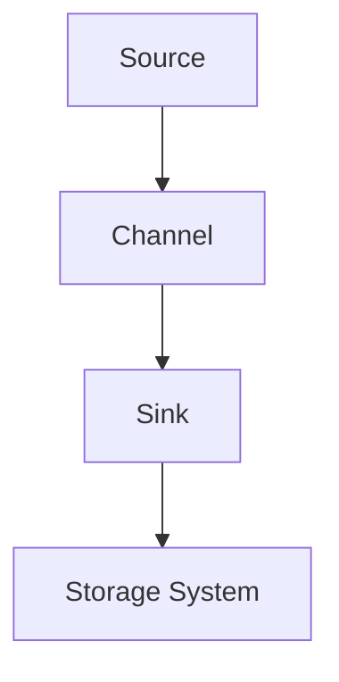

# Flume Channel原理与代码实例讲解

## 1.背景介绍

Apache Flume 是一个分布式、可靠且高可用的系统，用于高效地收集、聚合和移动大量日志数据。Flume 的设计目标是简化数据流的管理，使得数据从各种来源（如日志文件、网络流量等）流入集中存储系统（如 HDFS、HBase 等）变得更加容易。Flume 的核心组件之一是 Channel，它在数据流的传输过程中起到了关键的缓冲作用。

## 2.核心概念与联系

在 Flume 中，数据流的基本单元是 Event。Event 是一个包含数据和头信息的对象。Flume 的数据流由三个主要组件组成：Source、Channel 和 Sink。

- **Source**：负责从外部数据源收集数据，并将其转换为 Event。
- **Channel**：充当缓冲区，临时存储从 Source 收集到的 Event，直到 Sink 准备好处理它们。
- **Sink**：负责将 Event 从 Channel 中取出，并将其传输到最终的存储系统或处理系统。

Channel 是 Flume 数据流的核心部分，它确保了数据在传输过程中的可靠性和高效性。Flume 提供了多种类型的 Channel，如 Memory Channel、File Channel 和 Kafka Channel，每种 Channel 都有其特定的应用场景和优缺点。

## 3.核心算法原理具体操作步骤

Channel 的核心算法主要涉及数据的写入和读取操作。以下是 Channel 的基本操作步骤：

1. **写入操作**：
    - Source 收集到数据后，将其封装为 Event。
    - Source 将 Event 写入 Channel。
    - Channel 将 Event 存储在其内部缓冲区中。

2. **读取操作**：
    - Sink 从 Channel 中读取 Event。
    - Channel 从其内部缓冲区中取出 Event，并将其传递给 Sink。
    - Sink 处理 Event，并将其传输到最终的存储系统。

以下是一个简单的 Mermaid 流程图，展示了 Flume 数据流的基本操作步骤：



## 4.数学模型和公式详细讲解举例说明

在 Flume Channel 的设计中，数据的写入和读取操作可以用数学模型来描述。假设在时间 $t$ 时刻，Channel 中的 Event 数量为 $N(t)$，则在时间 $t + \Delta t$ 时刻，Channel 中的 Event 数量 $N(t + \Delta t)$ 可以表示为：

$$
N(t + \Delta t) = N(t) + W(t) - R(t)
$$

其中：
- $W(t)$ 表示在时间 $t$ 到 $t + \Delta t$ 期间写入 Channel 的 Event 数量。
- $R(t)$ 表示在时间 $t$ 到 $t + \Delta t$ 期间从 Channel 中读取的 Event 数量。

通过这个公式，我们可以分析 Channel 的负载情况，并进行相应的优化。例如，如果 $W(t) > R(t)$，则 Channel 中的 Event 数量会不断增加，可能导致缓冲区溢出。反之，如果 $R(t) > W(t)$，则 Channel 中的 Event 数量会减少，可能导致 Sink 等待数据的时间增加。

## 5.项目实践：代码实例和详细解释说明

下面是一个简单的 Flume 配置示例，展示了如何使用 Memory Channel：

```properties
# Define the agent
agent1.sources = source1
agent1.sinks = sink1
agent1.channels = channel1

# Define the source
agent1.sources.source1.type = netcat
agent1.sources.source1.bind = localhost
agent1.sources.source1.port = 44444

# Define the channel
agent1.channels.channel1.type = memory
agent1.channels.channel1.capacity = 1000
agent1.channels.channel1.transactionCapacity = 100

# Define the sink
agent1.sinks.sink1.type = logger

# Bind the source and sink to the channel
agent1.sources.source1.channels = channel1
agent1.sinks.sink1.channel = channel1
```

在这个配置中，我们定义了一个名为 `agent1` 的 Flume agent。这个 agent 包含一个 netcat Source、一个 Memory Channel 和一个 logger Sink。Source 从本地的 44444 端口接收数据，并将其写入 Memory Channel。Sink 从 Memory Channel 中读取数据，并将其记录到日志中。

## 6.实际应用场景

Flume Channel 在各种实际应用场景中都发挥了重要作用。以下是几个典型的应用场景：

1. **日志收集**：Flume 常用于从分布式系统中的各个节点收集日志数据，并将其集中存储在 HDFS 或 HBase 中。Channel 在这个过程中起到了缓冲和流量控制的作用，确保数据的可靠传输。

2. **实时数据处理**：在实时数据处理系统中，Flume 可以将数据从各种来源（如传感器、网络流量等）传输到实时处理系统（如 Apache Storm、Apache Spark）。Channel 确保了数据在传输过程中的低延迟和高吞吐量。

3. **数据备份**：Flume 还可以用于数据备份，将数据从生产系统传输到备份系统。Channel 在这个过程中提供了可靠的缓冲，确保数据不会丢失。

## 7.工具和资源推荐

以下是一些推荐的工具和资源，帮助您更好地理解和使用 Flume Channel：

1. **Apache Flume 官方文档**：详细介绍了 Flume 的各个组件和配置方法。
2. **Flume Cookbook**：提供了各种 Flume 配置示例和最佳实践。
3. **Flume 源代码**：可以深入研究 Flume 的实现细节，了解其内部工作原理。
4. **社区论坛和讨论组**：可以与其他 Flume 用户交流经验，解决实际问题。

## 8.总结：未来发展趋势与挑战

Flume 作为一个成熟的数据收集和传输系统，已经在许多大数据项目中得到了广泛应用。未来，随着数据量的不断增长和数据处理需求的不断增加，Flume 需要在以下几个方面进行改进和优化：

1. **性能优化**：提高 Channel 的吞吐量和低延迟，满足高并发数据传输的需求。
2. **可靠性增强**：进一步提高数据传输的可靠性，确保在各种异常情况下数据不会丢失。
3. **扩展性提升**：支持更多类型的数据源和存储系统，满足多样化的数据处理需求。

## 9.附录：常见问题与解答

### 问题1：如何选择合适的 Channel 类型？

选择 Channel 类型时，需要考虑数据的可靠性、吞吐量和延迟要求。Memory Channel 适用于低延迟、高吞吐量的场景，但在系统崩溃时可能会丢失数据。File Channel 提供了更高的可靠性，但延迟较高。Kafka Channel 适用于需要高可靠性和高吞吐量的场景。

### 问题2：如何优化 Channel 的性能？

可以通过调整 Channel 的配置参数（如容量、事务容量等）来优化其性能。此外，合理配置 Source 和 Sink 的并发度，以及使用高效的硬件资源（如 SSD）也有助于提高 Channel 的性能。

### 问题3：如何监控 Channel 的状态？

可以使用 Flume 提供的监控工具（如 JMX）来监控 Channel 的状态，包括 Event 数量、吞吐量、延迟等指标。通过监控这些指标，可以及时发现和解决性能瓶颈和异常情况。

---

作者：禅与计算机程序设计艺术 / Zen and the Art of Computer Programming