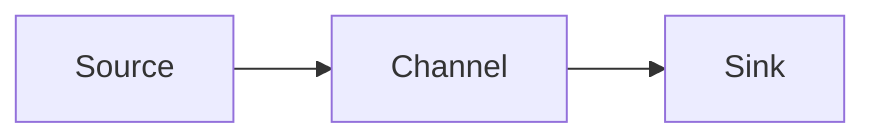
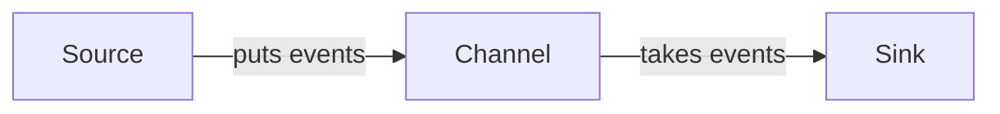

# Flume Source原理与代码实例讲解

## 1. 背景介绍

### 1.1 大数据采集的重要性
在大数据时代,海量数据的采集是大数据处理的第一步。高效可靠的数据采集是大数据分析的基础。而在众多大数据采集框架中,Flume以其分布式、高可靠、高可用、可定制化等特点而备受青睐。

### 1.2 Flume概述
Flume是一个分布式、可靠、高可用的海量日志采集、聚合和传输的系统。它可以采集各种来源(如web服务器)的日志数据,经过聚合后发送到各种数据接收端(如HDFS、HBase等)。Flume采用基于事务的数据传输方式,保证数据的可靠传输。

### 1.3 Flume架构
Flume主要由Source、Channel、Sink三大组件构成:

- Source负责采集数据,是数据的来源
- Channel是数据的缓存区,用于临时存储数据
- Sink负责输出数据,是数据的去向

它们的关系可以用下图表示:



## 2. 核心概念与联系

### 2.1 Event
Event是Flume数据传输的基本单位。一个Event由可选的header和载有数据的byte array构成。header是由key-value构成的字符串,用于传输一些元数据。

### 2.2 Source
Source是数据的来源,负责将不同来源的数据封装成Event,将Event放入Channel。Flume提供了多种内置的Source,如:

- Avro Source:接收Avro序列化的数据
- Thrift Source:接收Thrift格式的数据 
- Exec Source:执行一个Unix命令并获取它的输出
- Spooling Directory Source:监控指定目录,读取新增的文件
- Kafka Source:从Kafka消费数据
- NetCat Source:监听指定端口,接收数据

### 2.3 Channel 
Channel是Source和Sink之间的缓冲区。Source将Event放入Channel,Sink从Channel取出Event。Flume提供了两种Channel:

- Memory Channel:使用内存缓存Event,速度快但可靠性低
- File Channel:使用磁盘文件缓存Event,速度慢但可靠性高

### 2.4 Sink
Sink负责将Event从Channel取出,发送到目的地。Flume提供了多种Sink,如:

- HDFS Sink:将数据写入HDFS
- HBase Sink:将数据写入HBase
- Avro Sink:将数据发送到另一个Flume Agent
- Logger Sink:将数据写入日志文件
- Kafka Sink:将数据发送到Kafka

### 2.5 核心概念联系
下图展示了Source、Channel、Sink三者之间的关系:



## 3. 核心算法原理具体操作步骤

### 3.1 基于可靠事务的数据传输
Flume采用了基于事务的数据传输方式来保证数据的可靠传输。具体步骤如下:

1. Source从数据源读取数据,封装成Event
2. Source启动一个事务,将Event放入Channel
3. 等Source将所有Event放入Channel后,提交事务
4. Sink启动一个事务,从Channel批量取出Event
5. Sink将Event发送到目的地
6. 目的地确认接收后,Sink提交事务
7. Channel删除已被Sink消费的Event

### 3.2 失败恢复机制
为了保证数据不丢失,Flume提供了失败恢复机制:

- Source和Sink都维护了一个索引,记录了事务的状态
- 如果在提交事务时失败,可以根据索引恢复事务
- 如果数据发送到目的地失败,Sink会回滚事务,Event仍保留在Channel中,等待重新发送

### 3.3 负载均衡
Flume支持使用多个Sink并行消费Channel中的Event,实现负载均衡:

- 可以配置多个Sink,每个Sink消费一部分Event
- Flume提供了轮询(round robin)、随机(random)等负载均衡策略
- 也可以自定义负载均衡策略,如根据Event的内容分发

## 4. 数学模型和公式详细讲解举例说明

### 4.1 Channel容量估算
对于Memory Channel,需要预估最大容量,可以用Little定律来估算。设Channel的平均吞吐量为 $\lambda$,Event的平均逗留时间为 $W$,则平均队列长度 $L$为:

$$L = \lambda W$$

例如,Channel每秒接收1000个Event,每个Event在Channel中平均停留0.5秒,则Channel的平均容量需要为:

$$L = 1000 \times 0.5 = 500 (events)$$ 

### 4.2 Sink吞吐量估算
假设Sink从Channel批量取出Event的时间为 $T_b$,将Event逐个发送到目的地的时间为 $T_s$,每批次取出 $N$个Event,则Sink的吞吐量 $\mu$为:

$$\mu = \frac{N}{T_b + N \times T_s}$$

例如,每批次取出100个Event耗时0.1秒,每个Event发送耗时0.01秒,则吞吐量为:

$$\mu = \frac{100}{0.1 + 100 \times 0.01} = 500 (events/s)$$

## 5. 项目实践：代码实例和详细解释说明

下面通过一个实际的例子来演示Flume的配置和使用。这个例子从指定目录读取文件,发送到HDFS和日志文件。

### 5.1 Flume配置文件
首先编写Flume的配置文件flume.conf:

```properties
# 定义agent名,source、channel、sink的名称
a1.sources = s1
a1.channels = c1 c2 
a1.sinks = k1 k2

# 配置source
a1.sources.s1.type = spooldir
a1.sources.s1.spoolDir = /var/log/flume
a1.sources.s1.channels = c1 c2

# 配置channel
a1.channels.c1.type = memory
a1.channels.c1.capacity = 10000
a1.channels.c1.transactionCapacity = 1000

a1.channels.c2.type = memory
a1.channels.c2.capacity = 10000
a1.channels.c2.transactionCapacity = 1000

# 配置sink
a1.sinks.k1.type = hdfs
a1.sinks.k1.hdfs.path = /flume/events/%y-%m-%d/%H%M
a1.sinks.k1.hdfs.filePrefix = events
a1.sinks.k1.hdfs.rollInterval = 60
a1.sinks.k1.channel = c1

a1.sinks.k2.type = logger
a1.sinks.k2.channel = c2
```

这个配置定义了一个名为a1的agent,包含:

- 一个spooling directory source,监控/var/log/flume目录,数据发送到c1和c2两个channel
- 两个memory channel c1和c2,分别对接hdfs sink和logger sink
- 一个hdfs sink,数据来自c1,每60秒生成一个新文件,存储在HDFS的/flume/events目录
- 一个logger sink,数据来自c2,将数据输出到日志

### 5.2 启动Flume
用以下命令启动Flume agent:

```bash
flume-ng agent \
--conf conf \
--conf-file flume.conf \
--name a1 \
-Dflume.root.logger=INFO,console
```

这个命令指定了配置文件和agent名,并将日志输出到控制台。

### 5.3 测试
向/var/log/flume目录放入一些文件,如:

```bash
echo "hello world" > /var/log/flume/test.log
```

可以看到flume在HDFS的/flume/events目录下生成了新文件,同时在控制台也输出了日志,表明数据成功被传输。

## 6. 实际应用场景

Flume在实际中有非常广泛的应用,几个典型场景如下:

### 6.1 日志收集
Web服务器、应用服务器产生的日志通过Flume收集,可以将分散的日志集中存储到HDFS、HBase等,便于后续的分析处理。

### 6.2 数据库变更捕获
监控数据库的变更(如新增、修改、删除操作),将变更记录实时传输到大数据平台,可以用于实时数据分析、异构数据同步等。

### 6.3 消息队列数据传输
将Kafka等消息队列中的数据通过Flume传输到HDFS等存储,实现异构系统之间的数据交换。

### 6.4 多级数据聚合
多个Flume agent级联,可以实现多级数据聚合。比如从多个Web服务器收集日志到一个中心Flume,再由中心Flume将数据发送到大数据平台。

## 7. 工具和资源推荐

### 7.1 Flume官方文档
Flume的官方文档提供了详尽的使用指南和配置手册,是学习和使用Flume的权威资料。

官网: http://flume.apache.org/

### 7.2 Flume UI工具
一些第三方的Flume UI工具可以可视化地展示Flume的运行状态、配置Flume,如Flume-UI、Flume Commander等。

### 7.3 Flume Docker镜像
Flume的Docker镜像封装了Flume运行所需的环境,可以快速部署Flume。

Docker Hub: https://hub.docker.com/r/probablyfine/flume

## 8. 总结：未来发展趋势与挑战

### 8.1 云原生支持
随着云计算的发展,Flume未来需要更好地支持云环境,如Kubernetes编排、弹性伸缩等。

### 8.2 数据格式多样化
除了文本格式,Flume需要支持更多数据格式,如JSON、Parquet、ORC等,以适应不同数据源和数据处理需求。

### 8.3 数据安全与隐私
在数据采集过程中,需要考虑数据的安全性和隐私性,如何对敏感数据脱敏、加密。这是Flume面临的一个挑战。

### 8.4 性能优化
虽然Flume已经能够支撑很大的数据量,但在超大规模数据采集场景下,Flume仍需要不断优化,如减小资源开销、提高吞吐量等。

## 9. 附录：常见问题与解答

### 9.1 Flume采集数据会丢失吗?
Flume基于可靠的事务机制传输数据,只要Channel是可靠的(如File Channel),数据就不会丢失。

### 9.2 Flume可以采集哪些数据?
Flume可以采集任何形式的数据,包括日志、文件、消息队列、数据库变更等,通过自定义Source和Sink可以扩展更多数据源。

### 9.3 Flume的最大吞吐量是多少?
Flume的吞吐量取决于具体的部署环境和配置,根据官方的基准测试,单个agent的事件处理速率可以达到上万条每秒。

### 9.4 Flume如何实现负载均衡?
Flume支持将多个sink绑定到一个channel,根据配置的选择器(selector)策略,将event发送到不同的sink,从而实现负载均衡。

### 9.5 Flume和Kafka的区别是什么?
Flume主要用于数据采集,Kafka主要用于数据缓存和消息队列。它们经常配合使用,Flume采集数据发送到Kafka,再由Kafka分发给下游的消费者。

作者：禅与计算机程序设计艺术 / Zen and the Art of Computer Programming