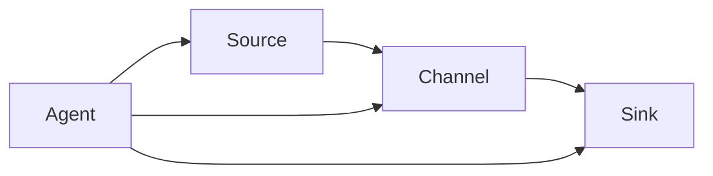

# Flume数据清洗与处理方法

## 1.背景介绍

随着大数据时代的到来,海量的数据源源不断地产生,如何高效地收集、传输和存储这些数据成为了一个巨大的挑战。Apache Flume作为一种分布式、可靠、高可用的海量日志采集系统,可以从不同的数据源采集数据,并将数据传输到HDFS、HBase、Solr等存储系统中,为后续的数据处理和分析奠定基础。

在数据收集传输的过程中,由于数据源的多样性和复杂性,原始数据往往存在格式不统一、冗余、错误等问题,因此需要对数据进行清洗和处理,以确保数据的完整性、准确性和可用性。Flume提供了强大的数据清洗和处理功能,可以在数据传输的过程中对数据进行过滤、转换、格式化等操作,从而满足不同的业务需求。

## 2.核心概念与联系

在介绍Flume数据清洗与处理方法之前,我们需要先了解Flume的几个核心概念:

1. **Source(源头)**: 用于从外部系统采集数据,例如日志文件、网络流数据等。

2. **Channel(传输通道)**: 用于临时存储从Source接收到的数据,直到数据被Sink持久化。

3. **Sink(终端)**: 用于将Channel中的数据持久化到外部系统,例如HDFS、HBase等。

4. **Event(事件)**: 表示从Source接收到的单个数据流单元,包含头信息(headers)和主体数据(body)。

5. **Agent(代理)**: 由一个Source、一个Channel和一个或多个Sink组成,用于从外部系统采集数据,并将数据传输到其他系统。

这些核心概念之间的关系如下所示:



在数据清洗和处理的过程中,我们主要关注Source和Sink两个组件,因为它们分别负责数据的采集和持久化。通过配置Source和Sink,我们可以实现各种数据清洗和处理功能。

## 3.核心算法原理具体操作步骤

Flume的数据清洗和处理功能主要依赖于Source和Sink的配置,以及一些内置的拦截器(Interceptor)。下面我们将详细介绍一些常用的数据清洗和处理方法。

### 3.1 数据过滤

在数据采集过程中,我们可能会收集到一些不需要的数据,或者某些数据格式不正确。这时我们可以使用过滤器(Filter)来过滤掉这些数据。Flume提供了一些内置的过滤器,例如:

- **RegexFilter**: 使用正则表达式匹配Event的头信息或主体数据,并根据匹配结果决定是否接受该Event。

- **TypeFilter**: 根据Event的头信息中的`type`字段值决定是否接受该Event。

要使用过滤器,我们需要在Source或Sink的配置文件中添加相应的配置项。例如,使用RegexFilter过滤掉所有包含"error"字符串的Event:

```properties
# Source的配置
agent.sources.src.type = exec
agent.sources.src.command = tail -F /var/log/app.log
agent.sources.src.interceptors = i1
agent.sources.src.interceptors.i1.type = regex_filter
agent.sources.src.interceptors.i1.regex = error
agent.sources.src.interceptors.i1.excludeEvents = true
```

在上述配置中,我们为Source添加了一个RegexFilter拦截器,并设置了正则表达式`error`。当Event的主体数据中包含"error"字符串时,该Event将被过滤掉。

### 3.2 数据转换

在某些情况下,我们需要对采集到的数据进行转换,以满足后续系统的需求。Flume提供了一些内置的转换器(Transformer),例如:

- **HostInterceptor**: 在Event的头信息中添加一个`host`字段,其值为当前主机的主机名或IP地址。

- **TimestampInterceptor**: 在Event的头信息中添加一个`timestamp`字段,其值为Event被接收的时间戳。

- **MorphlineInterceptor**: 使用Morphline配置文件对Event进行复杂的转换操作,例如删除字段、添加字段、格式化数据等。

要使用转换器,我们需要在Source或Sink的配置文件中添加相应的配置项。例如,使用HostInterceptor和TimestampInterceptor为每个Event添加主机名和时间戳:

```properties
# Source的配置
agent.sources.src.type = exec
agent.sources.src.command = tail -F /var/log/app.log
agent.sources.src.interceptors = i1 i2
agent.sources.src.interceptors.i1.type = host
agent.sources.src.interceptors.i2.type = timestamp
```

在上述配置中,我们为Source添加了两个拦截器:HostInterceptor和TimestampInterceptor。每个采集到的Event将包含`host`和`timestamp`两个头信息字段。

### 3.3 数据格式化

在将数据持久化到目标系统之前,我们可能需要对数据进行格式化,以满足目标系统的要求。Flume提供了一些内置的格式化器(Formatter),例如:

- **JSONFormatter**: 将Event格式化为JSON格式。

- **AvroFormatter**: 将Event格式化为Avro格式。

- **BinaryFormatter**: 将Event格式化为二进制格式。

要使用格式化器,我们需要在Sink的配置文件中添加相应的配置项。例如,使用JSONFormatter将Event格式化为JSON格式:

```properties
# Sink的配置
agent.sinks.sink.type = hdfs
agent.sinks.sink.hdfs.path = /flume/events/%Y/%m/%d/%H
agent.sinks.sink.hdfs.filePrefix = events-
agent.sinks.sink.hdfs.fileExtension = .json
agent.sinks.sink.hdfs.writeFormat = JSON
agent.sinks.sink.hdfs.rollInterval = 30
agent.sinks.sink.hdfs.rollSize = 1024
```

在上述配置中,我们将Sink的`writeFormat`设置为`JSON`,表示将Event格式化为JSON格式。同时,我们还设置了文件的前缀、后缀和路径,以便于后续处理。

## 4.数学模型和公式详细讲解举例说明

在数据清洗和处理过程中,我们可能需要使用一些数学模型和公式来处理数据。例如,在进行数据去重时,我们可以使用Bloom Filter算法来快速判断一个元素是否存在于集合中。

Bloom Filter是一种空间高效的概率数据结构,它可以用于测试一个元素是否属于一个集合。Bloom Filter的核心思想是使用多个哈希函数对元素进行哈希映射,并将映射结果存储在一个位向量中。

设Bloom Filter的位向量长度为$m$,使用$k$个哈希函数,则Bloom Filter的插入和查询操作如下:

插入操作:

对于一个元素$x$,使用$k$个哈希函数计算$k$个哈希值$h_1(x), h_2(x), \ldots, h_k(x)$,将位向量中对应的$k$个位置设置为1。

$$
\text{位向量}[h_i(x)] = 1, \quad i = 1, 2, \ldots, k
$$

查询操作:

对于一个元素$y$,使用$k$个哈希函数计算$k$个哈希值$h_1(y), h_2(y), \ldots, h_k(y)$,检查位向量中对应的$k$个位置是否全为1。如果任一位置为0,则可以确定$y$不在集合中;如果全部为1,则有一定概率$y$在集合中。

$$
\begin{aligned}
\text{如果} \quad &\exists i, \quad \text{位向量}[h_i(y)] = 0, \quad \text{则} y \notin \text{集合} \\
\text{如果} \quad &\forall i, \quad \text{位向量}[h_i(y)] = 1, \quad \text{则有概率} y \in \text{集合}
\end{aligned}
$$

Bloom Filter的优点是空间高效,但缺点是存在一定的误判率。误判率与位向量长度$m$、哈希函数个数$k$和插入元素个数$n$有关,具体公式如下:

$$
p = \left(1 - \left(1 - \frac{1}{m}\right)^{kn}\right)^k \approx \left(1 - e^{-\frac{kn}{m}}\right)^k
$$

通过调整$m$和$k$的值,我们可以控制误判率在一个可接受的范围内。

在Flume中,我们可以使用MorphlineInterceptor来实现Bloom Filter算法,从而对采集到的数据进行去重。具体实现方法如下:

1. 定义一个Morphline配置文件,包含Bloom Filter的相关配置。

2. 在Source或Sink的配置文件中,添加MorphlineInterceptor并指定Morphline配置文件的路径。

3. 在Morphline配置文件中,使用`bloomFilter`命令对数据进行去重。

下面是一个示例Morphline配置文件:

```hocon
morphlines : [
  {
    id : morphline1
    importCommands : ["org.apache.solr.handler.bloom.BloomFilterFactory"]
    commands : [
      {
        bloomFilter {
          # 设置Bloom Filter的参数
          capacity : 1000000
          hashCount : 3
          errorRate : 0.01
          # 指定要去重的字段
          field : message
          # 指定去重后的操作
          removeOperator : KEEP
        }
      }
    ]
  }
]
```

在上述配置文件中,我们定义了一个Bloom Filter,设置了容量为1000000、哈希函数个数为3、误判率为0.01。我们指定要去重的字段为`message`,并且在去重后保留该Event。

通过使用Bloom Filter算法,我们可以高效地对采集到的数据进行去重,从而提高数据的质量和可用性。

## 5.项目实践:代码实例和详细解释说明

为了更好地理解Flume的数据清洗和处理功能,我们将通过一个实际项目来演示如何配置和使用这些功能。

假设我们需要从一个日志文件中采集数据,并将数据存储到HDFS中。在数据采集过程中,我们需要对数据进行以下处理:

1. 过滤掉包含"error"字符串的日志行。
2. 为每条日志添加主机名和时间戳。
3. 将日志格式化为JSON格式,并存储到HDFS中。

### 5.1 配置文件

首先,我们需要创建一个Flume配置文件,定义Source、Channel和Sink。

```properties
# 定义Source
agent.sources = src

# 定义Source的类型和配置
agent.sources.src.type = exec
agent.sources.src.command = tail -F /var/log/app.log
agent.sources.src.interceptors = i1 i2 i3
agent.sources.src.interceptors.i1.type = regex_filter
agent.sources.src.interceptors.i1.regex = error
agent.sources.src.interceptors.i1.excludeEvents = true
agent.sources.src.interceptors.i2.type = host
agent.sources.src.interceptors.i3.type = timestamp

# 定义Channel
agent.channels = ch

# 定义Channel的类型和配置
agent.channels.ch.type = memory
agent.channels.ch.capacity = 1000
agent.channels.ch.transactionCapacity = 100

# 定义Sink
agent.sinks = sink

# 定义Sink的类型和配置
agent.sinks.sink.type = hdfs
agent.sinks.sink.hdfs.path = /flume/events/%Y/%m/%d/%H
agent.sinks.sink.hdfs.filePrefix = events-
agent.sinks.sink.hdfs.fileExtension = .json
agent.sinks.sink.hdfs.writeFormat = JSON
agent.sinks.sink.hdfs.rollInterval = 30
agent.sinks.sink.hdfs.rollSize = 1024

# 绑定Source、Channel和Sink
agent.sources.src.channels = ch
agent.sinks.sink.channel = ch
```

在上述配置文件中,我们定义了以下内容:

- Source: 使用`exec`类型,从`/var/log/app.log`文件中采集数据。我们添加了三个拦截器:
  - `regex_filter`: 过滤掉包含"error"字符串的日志行。
  - `host`: 为每条日志添加主机名。
  - `timestamp`: 为每条日志添加时间戳。
- Channel: 使用`memory`类型,内存缓冲区大小为1000个事件,事务容量为100个事件。
- Sink: 使用`hdfs`类型,将数据存储到HDFS中。我们设置了文件路径、前缀、后缀和格式化方式(JSON)。

### 5.2 启动Flume Agent

配置文件准备好后,我们可以启动Flume Agent:

```bash
$ bin/flume-ng agent --conf conf --conf-file example.conf --name agent --