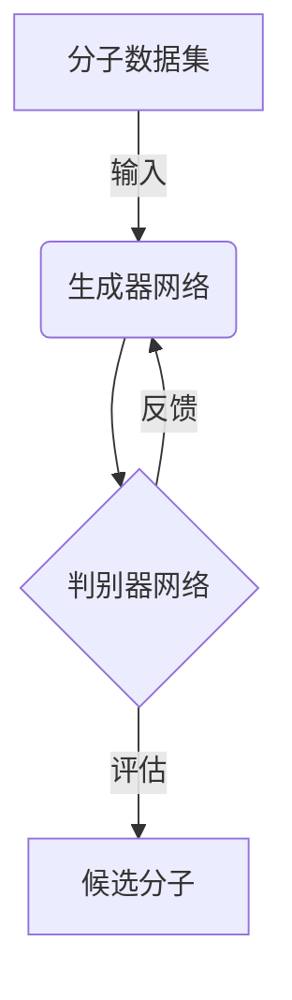

# GAN在化学生物学领域的应用

## 1. 背景介绍

### 1.1 生物医药研究的重要性

生物医药研究是一个非常重要的领域,它关系到人类的健康和生命。随着人口老龄化和新兴疾病的不断出现,对新药物和治疗方法的需求日益增长。然而,传统的药物发现过程通常耗时耗力,成本高昂,效率低下。因此,利用人工智能(AI)技术来加速药物发现过程,提高效率和成功率,降低成本,成为了一个备受关注的热点领域。

### 1.2 人工智能在生物医药领域的应用

人工智能技术在生物医药领域有着广泛的应用前景,包括但不限于:

- 虚拟筛选(Virtual Screening)
- 分子对接(Molecular Docking)
- 分子动力学模拟(Molecular Dynamics Simulations)
- 生物信息学分析(Bioinformatics Analysis)
- 药物设计(Drug Design)
- 临床试验优化(Clinical Trial Optimization)

其中,生成对抗网络(Generative Adversarial Networks, GAN)作为一种新兴的深度学习技术,在药物设计和发现领域展现出了巨大的潜力。

### 1.3 GAN简介

GAN是一种由两个神经网络组成的生成模型,包括一个生成器(Generator)和一个判别器(Discriminator)。生成器的目标是生成逼真的数据样本,而判别器的任务是区分生成的样本和真实数据样本。通过生成器和判别器的对抗训练,GAN可以学习到数据的真实分布,从而生成新的、逼真的样本数据。自2014年被提出以来,GAN已经在图像、语音、文本等多个领域取得了卓越的成果。

## 2. 核心概念与联系

### 2.1 GAN在药物设计中的应用

在药物设计领域,研究人员希望能够发现具有特定生物活性的新分子结构。传统的方法通常依赖于化合物库的筛选,或者基于已知活性化合物的结构修饰。这些方法存在着效率低下、成本高昂等问题。

GAN可以被用于生成新的、潜在具有所需生物活性的分子结构。生成器网络可以学习现有分子数据的分布,并生成新的分子结构。判别器网络则负责评估生成的分子是否符合预期的性质,例如具有特定的生物活性、药代动力学特性等。通过生成器和判别器的不断对抗训练,GAN可以逐步优化生成的分子结构,最终得到满足要求的候选化合物。



### 2.2 GAN与其他机器学习方法的区别

相比于其他机器学习方法,GAN在药物设计领域具有以下优势:

1. **生成新颖分子结构**: GAN可以生成全新的分子结构,而不仅限于对现有化合物进行修饰。这为发现具有创新活性的新药物提供了可能性。

2. **无需手工特征工程**: GAN能够直接从原始分子数据中学习,无需人工设计特征描述符。这简化了数据预处理过程,并有助于捕捉更多潜在的结构模式。

3. **端到端训练**: GAN采用端到端的训练方式,可以直接优化生成分子结构的目标,而无需分阶段训练。

4. **多约束条件**: GAN可以同时考虑多个约束条件,如活性、选择性、药代动力学等,从而生成满足多重要求的分子。

然而,GAN在药物设计中的应用仍然面临一些挑战,例如模型稳定性、评价指标设计、数据质量等,需要进一步的研究和改进。

## 3. 核心算法原理具体操作步骤  

### 3.1 GAN基本原理

GAN由生成器G和判别器D两个神经网络组成。生成器G的目标是从噪声分布中采样,生成逼真的数据样本,欺骗判别器D。判别器D则需要区分生成器G生成的假数据和真实数据。两个网络通过下面的对抗目标函数进行训练:

$$\min_G \max_D V(D,G) = \mathbb{E}_{x\sim p_{\text{data}}(x)}[\log D(x)] + \mathbb{E}_{z\sim p_z(z)}[\log(1-D(G(z)))]$$

其中:
- $p_{\text{data}}(x)$是真实数据的分布
- $p_z(z)$是噪声分布,通常是高斯分布或均匀分布
- $G(z)$是生成器根据噪声$z$生成的假数据
- $D(x)$是判别器对真实数据$x$的判别概率

在训练过程中,生成器G和判别器D相互对抗,生成器G努力生成更逼真的假数据以欺骗判别器D,而判别器D则努力区分真实数据和生成数据。通过这种对抗训练,GAN可以学习到真实数据的分布,从而生成新的逼真数据。

### 3.2 GAN在分子生成中的应用

将GAN应用于分子生成时,需要对分子结构进行适当的表示,以便神经网络能够处理。常用的分子表示方法包括:

1. **SMILES字符串**:将分子结构编码为一维字符串,如`C1=CC=C(C=C1)N`。
2. **分子指纹**:使用位向量或其他特征向量对分子结构进行编码。
3. **分子图**:将分子视为无向图,原子为节点,化学键为边。

生成器G的输入通常是一个随机噪声向量,输出是一个分子的表示形式(如SMILES字符串)。判别器D则需要判断生成的分子表示是否来自真实的分子数据集。

在训练过程中,除了基本的GAN目标函数,还可以引入其他约束条件,如:

- **有效性约束**:保证生成的分子结构是有效和合理的。
- **相似性约束**:控制生成分子与已知活性分子的相似程度。
- **性质约束**:使生成分子满足特定的物理化学性质或药代动力学特性。

这些约束条件可以通过修改目标函数或引入正则化项的方式纳入模型中。

### 3.3 GAN分子生成算法步骤

以SMILES字符串表示分子结构为例,GAN分子生成算法的具体步骤如下:

1. **准备数据集**:收集大量真实分子的SMILES字符串作为训练数据。
2. **构建生成器G**:生成器G通常是一个序列生成模型,如RNN或Transformer,将随机噪声编码为SMILES字符串。
3. **构建判别器D**:判别器D也是一个序列模型,对输入的SMILES字符串进行二分类(真实/生成)。
4. **训练GAN模型**:
    - 固定生成器G,更新判别器D,使其能够较好地区分真实数据和生成数据。
    - 固定判别器D,更新生成器G,使其生成的数据能够更好地欺骗判别器D。
    - 重复上述两个步骤,直到模型收敛。
5. **生成新分子**:使用训练好的生成器G,从随机噪声中生成新的SMILES字符串,解码为分子结构。
6. **分子优化**(可选):对生成的分子结构进行优化,满足其他约束条件,如活性、选择性、ADME等。

通过上述步骤,GAN可以学习到分子数据的分布,并生成新的、潜在具有所需生物活性的分子结构。

## 4. 数学模型和公式详细讲解举例说明

### 4.1 GAN目标函数

GAN的目标函数是一个两人零和博弈(two-player zero-sum game)的极小极大问题(minimax problem):

$$\min_G \max_D V(D,G) = \mathbb{E}_{x\sim p_{\text{data}}(x)}[\log D(x)] + \mathbb{E}_{z\sim p_z(z)}[\log(1-D(G(z)))]$$

其中:

- $p_{\text{data}}(x)$是真实数据$x$的分布
- $p_z(z)$是噪声$z$的分布,通常是高斯分布或均匀分布
- $G(z)$是生成器根据噪声$z$生成的假数据
- $D(x)$是判别器对输入数据$x$为真实数据的判别概率

这个目标函数可以分为两部分理解:

1. $\mathbb{E}_{x\sim p_{\text{data}}(x)}[\log D(x)]$:这是判别器D对真实数据$x$的期望对数似然。判别器D需要最大化这一项,使其能够较好地识别真实数据。

2. $\mathbb{E}_{z\sim p_z(z)}[\log(1-D(G(z)))]$:这是判别器D对生成数据$G(z)$的期望对数似然的相反数。判别器D需要最大化这一项,使其能够较好地识别生成数据。

生成器G的目标则是最小化这个目标函数,使得生成的数据$G(z)$能够尽可能地欺骗判别器D,使$D(G(z))$接近1。

在实际训练中,通常采用交替的方式优化生成器G和判别器D:

- 固定生成器G,优化判别器D,使其能够较好地区分真实数据和生成数据。
- 固定判别器D,优化生成器G,使其生成的数据能够更好地欺骗判别器D。

重复上述两个步骤,直到模型收敛。

### 4.2 WGAN目标函数

为了提高GAN的训练稳定性,研究人员提出了改进的GAN变体,如Wasserstein GAN(WGAN)。WGAN的目标函数是最小化生成器G和判别器D之间的Wasserstein距离:

$$\min_G \max_{D\in\mathcal{D}} \mathbb{E}_{x\sim p_{\text{data}}(x)}[D(x)] - \mathbb{E}_{z\sim p_z(z)}[D(G(z))]$$

其中$\mathcal{D}$是1-Lipschitz连续函数的集合,用于约束判别器D的梯度范数。

WGAN的目标函数具有更好的数学性质,可以提高训练的稳定性和收敛性。在分子生成任务中,WGAN也展现出了良好的性能。

### 4.3 其他GAN变体

除了WGAN,还有许多其他GAN变体被应用于分子生成任务,如:

- **条件GAN(Conditional GAN, CGAN)**:在生成过程中引入条件变量,控制生成分子的特定性质。
- **循环一致对抗网络(Cycle-Consistent Adversarial Networks, CycleGAN)**:用于分子表示形式之间的转换,如SMILES到分子图的转换。
- **注意力GAN(Attention GAN, AttnGAN)**:在生成器和判别器中引入注意力机制,捕捉分子结构的长程依赖关系。

这些变体GAN在不同的应用场景下展现出了优异的性能,为分子生成任务提供了更多选择。

### 4.4 评价指标

评价生成分子的质量是GAN在药物设计中应用的一个关键问题。常用的评价指标包括:

1. **有效性(Validity)**:生成的分子结构是否有效和合理。
2. **新颖性(Novelty)**:生成的分子是否与已知分子结构不同。
3. **相似性(Similarity)**:生成分子与已知活性分子的相似程度。
4. **性质匹配(Property Matching)**:生成分子是否满足预期的物理化学性质或药代动力学特性。
5. **活性(Activity)**:生成分子对特定靶点的生物活性。

这些指标可以通过计算机模拟或实验测试的方式进行评估。合理设计评价指标,并将其纳入GAN的目标函数或正则化项中,是提高分子生成质量的关键。

## 5. 项目实践:代码实例和详细解释说明

以下是一个使用PyTorch实现的简单GAN分子生成模型的代码示例,用于生成SMILES字符串表示的分子结构。

### 5.1 准备数据

首先,我们需要准备一个包含大量真实分子SMILES字符串的数据集。这里以一个简单的示例数据集为例:

```python