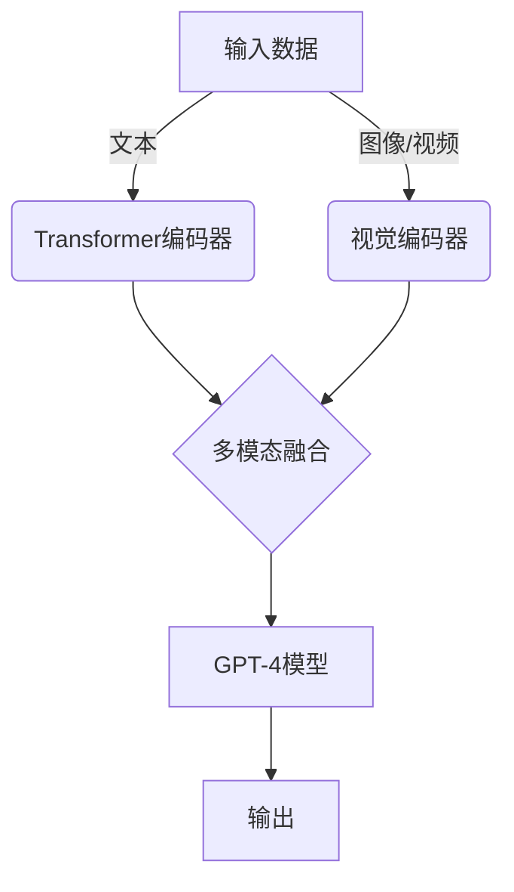

# GPT-4原理与代码实例讲解

## 1.背景介绍

在过去几年中,自然语言处理(NLP)技术取得了长足的进步,其中变革性的突破就是生成式预训练transformer(GPT)模型的诞生。GPT模型通过在大规模语料库上进行无监督预训练,学习语言的上下文关系和语义表示,从而获得强大的语言理解和生成能力。

GPT模型的发展经历了从GPT、GPT-2到GPT-3的演进,每一代模型都在规模、性能和应用场景上取得了重大突破。而最新推出的GPT-4模型,则被视为GPT系列的又一里程碑式进展。GPT-4不仅在模型规模和训练数据量上实现了大幅提升,更重要的是,它在多模态处理、推理能力、安全性和可控性等方面都有了显著的改进。

GPT-4的出现,为人工智能系统赋予了更强大的语言理解和生成能力,有望推动自然语言处理技术在各个领域的广泛应用,从而极大地提高人类与机器之间的交互体验。

## 2.核心概念与联系

### 2.1 Transformer模型

Transformer是GPT模型的核心架构,它完全基于注意力机制,摒弃了传统序列模型中的循环神经网络和卷积神经网络结构,从而有效解决了长期依赖问题。Transformer的多头注意力机制能够同时关注输入序列中的不同位置,并行计算不同位置之间的关系,从而提高了模型的并行计算能力和长期依赖建模能力。

### 2.2 自回归语言模型

GPT属于自回归语言模型的范畴,这意味着它是通过最大化语料库中连续token序列的条件概率来进行训练的。具体来说,给定一个上文序列,GPT模型需要预测下一个token的概率分布,并根据这个概率分布进行采样或选择概率最大的token作为输出。这种自回归的方式使得GPT能够生成连贯、流畅的文本序列。

### 2.3 预训练与微调

GPT模型采用了预训练与微调的范式。在预训练阶段,GPT模型在大规模无标注语料库上进行自监督学习,获得通用的语言表示能力。而在微调阶段,GPT模型会在特定任务的标注数据上进行进一步训练,使其适应具体的下游任务,如文本生成、机器翻译、问答系统等。这种预训练与微调的方式大大提高了模型的泛化能力和数据利用效率。

### 2.4 多模态处理

GPT-4模型的一大亮点是支持多模态输入,即除了文本输入外,还能够处理图像、视频等其他模态的数据。这使得GPT-4能够在视觉问答、图像描述生成等任务上发挥作用,极大拓展了其应用场景。GPT-4通过引入视觉编码器,将不同模态的数据映射到同一个潜在空间,从而实现了多模态融合。



## 3.核心算法原理具体操作步骤

GPT-4模型的核心算法原理可以概括为以下几个关键步骤:

1. **输入embedding**: 将输入序列(文本或其他模态)转换为对应的embedding向量表示。对于文本,通常使用词嵌入或子词嵌入;对于图像或视频,则使用视觉编码器提取特征。

2. **位置编码**: 由于Transformer模型没有显式的递归或卷积结构,因此需要添加位置编码,以赋予模型对序列位置的感知能力。

3. **多头注意力机制**: 这是Transformer的核心模块。输入序列的embedding向量通过多头注意力机制进行编码,捕获不同位置之间的依赖关系。

4. **前馈神经网络**: 对注意力机制的输出进行进一步非线性变换,提取更高层次的特征表示。

5. **掩码自回归**: 在训练阶段,GPT模型采用掩码自回归的方式,对语料库中的连续token序列进行最大似然估计。给定前缀序列,模型需要预测下一个token的概率分布。

6. **梯度更新**: 根据预测的概率分布和真实标签,计算损失函数,并通过反向传播算法更新模型参数。

7. **模型微调**: 在特定任务上,可以对预训练的GPT模型进行进一步微调,以提高其在该任务上的性能表现。

以上算法步骤反映了GPT-4模型的自监督预训练过程。在推理阶段,给定一个前缀序列(可以是文本、图像或其他模态),GPT-4会自回归地生成后续的token序列作为输出。

## 4.数学模型和公式详细讲解举例说明

### 4.1 Transformer模型

Transformer模型的核心是多头注意力机制,其数学表达式如下:

$$\mathrm{MultiHead}(Q, K, V) = \mathrm{Concat}(head_1, \ldots, head_h)W^O$$

$$\text{where} \quad head_i = \mathrm{Attention}(QW_i^Q, KW_i^K, VW_i^V)$$

$$\mathrm{Attention}(Q, K, V) = \mathrm{softmax}(\frac{QK^T}{\sqrt{d_k}})V$$

其中 $Q$、$K$、$V$ 分别表示查询(Query)、键(Key)和值(Value)的embedding向量。$W_i^Q$、$W_i^K$、$W_i^V$ 和 $W^O$ 是可学习的线性变换矩阵。$d_k$ 是缩放因子,用于防止点积的值过大导致梯度消失或爆炸。

通过多头注意力机制,Transformer能够同时关注输入序列中的不同位置,并行计算不同位置之间的关系,从而有效捕获长期依赖信息。

### 4.2 GPT语言模型

GPT属于自回归语言模型,其目标是最大化语料库中连续token序列的条件概率:

$$\begin{aligned}
\log P(x) &= \sum_{t=1}^T \log P(x_t | x_{<t}) \\
&= \sum_{t=1}^T \log P(x_t | x_1, \ldots, x_{t-1})
\end{aligned}$$

其中 $x = (x_1, x_2, \ldots, x_T)$ 表示长度为 $T$ 的token序列。在训练过程中,GPT模型会最大化上述条件概率的对数似然,从而学习到生成连贯、流畅文本序列的能力。

在推理阶段,给定一个前缀序列 $x_{<t}$,GPT模型会自回归地预测下一个token $x_t$ 的概率分布:

$$P(x_t | x_{<t}) = \mathrm{softmax}(h_t^T W_e)$$

其中 $h_t$ 是GPT模型在时间步 $t$ 的隐状态向量,而 $W_e$ 是可学习的embedding矩阵。通过对概率分布进行采样或选择概率最大的token,GPT模型就能够生成连贯的文本序列。

### 4.3 示例:文本生成

假设我们希望GPT-4模型根据给定的前缀文本 "今天天气非常好,"继续生成后续的文本序列。首先,我们需要将前缀文本转换为token序列,例如 `[1234, 567, 89, 12, 3456]`。然后,我们将这个token序列输入到GPT-4模型中,模型会自回归地预测下一个token的概率分布,例如:

$$P(x_t | x_{<t}) = [0.1, 0.2, 0.05, \ldots, 0.3]$$

其中,概率最大的token对应的索引为4(概率为0.3)。因此,GPT-4会输出该token对应的词 "我们",生成的文本序列变为 "今天天气非常好,我们"。

接下来,GPT-4会继续预测下一个token的概率分布,并选择概率最大的token作为输出,如此迭代,直到生成完整的文本序列。通过这种自回归的方式,GPT-4能够生成连贯、流畅的文本输出。

## 5.项目实践:代码实例和详细解释说明

为了更好地理解GPT-4模型的原理和实现细节,我们提供了一个基于PyTorch的代码示例,实现了一个简化版的GPT模型。

### 5.1 模型架构

```python
import torch
import torch.nn as nn

class GPTModel(nn.Module):
    def __init__(self, vocab_size, embedding_dim, hidden_dim, num_layers, num_heads, max_seq_len):
        super(GPTModel, self).__init__()
        self.token_embedding = nn.Embedding(vocab_size, embedding_dim)
        self.position_embedding = nn.Embedding(max_seq_len, embedding_dim)
        
        encoder_layer = nn.TransformerEncoderLayer(d_model=embedding_dim, nhead=num_heads, dim_feedforward=hidden_dim)
        self.transformer_encoder = nn.TransformerEncoder(encoder_layer, num_layers=num_layers)
        
        self.fc_out = nn.Linear(embedding_dim, vocab_size)
        
    def forward(self, input_ids):
        token_embeddings = self.token_embedding(input_ids)
        position_embeddings = self.position_embedding(torch.arange(input_ids.size(1), device=input_ids.device))
        embeddings = token_embeddings + position_embeddings
        
        encoder_output = self.transformer_encoder(embeddings)
        output = self.fc_out(encoder_output)
        
        return output
```

在这个简化版GPT模型中,我们使用了PyTorch提供的Transformer编码器模块,包括token embedding、位置编码、多头注意力机制和前馈神经网络。

- `token_embedding`层将输入的token ID序列转换为embedding向量表示。
- `position_embedding`层为每个位置生成对应的位置编码,并将其与token embedding相加,得到最终的输入embedding。
- `transformer_encoder`是PyTorch实现的Transformer编码器,包含多层编码器层,每层由多头注意力机制和前馈神经网络组成。
- `fc_out`是一个全连接层,将编码器的输出映射回词汇表的维度,得到每个token的概率分布。

### 5.2 训练过程

```python
import torch.optim as optim
from torch.nn.utils import clip_grad_norm_

def train(model, optimizer, data_loader, device, max_grad_norm=1.0):
    model.train()
    total_loss = 0
    
    for batch in data_loader:
        input_ids, labels = batch
        input_ids = input_ids.to(device)
        labels = labels.to(device)
        
        optimizer.zero_grad()
        outputs = model(input_ids)
        
        shift_logits = outputs[:, :-1, :].contiguous()
        shift_labels = labels[:, 1:].contiguous()
        
        loss = nn.CrossEntropyLoss()(shift_logits.view(-1, shift_logits.size(-1)), shift_labels.view(-1))
        loss.backward()
        
        clip_grad_norm_(model.parameters(), max_grad_norm)
        optimizer.step()
        
        total_loss += loss.item()
    
    return total_loss / len(data_loader)
```

在训练过程中,我们将输入的token ID序列和对应的标签(即下一个token)传入GPT模型。由于GPT模型是自回归的,因此我们需要将模型输出的logits和标签进行适当的位移,以计算交叉熵损失。

具体来说,我们将模型输出的logits向右位移一位,即 `shift_logits = outputs[:, :-1, :]`。同时,我们将标签向左位移一位,即 `shift_labels = labels[:, 1:]`。这样做是为了确保logits和标签之间的对应关系。

然后,我们计算 `shift_logits` 和 `shift_labels` 之间的交叉熵损失,并通过反向传播算法更新模型参数。我们还使用了梯度裁剪技术,以防止梯度爆炸的问题。

### 5.3 推理过程

```python
import torch.nn.functional as F

def generate(model, start_token_ids, max_length, top_k=50, top_p=0.95, device='cpu'):
    model.eval()
    generated = start_token_ids
    
    for _ in range(max_length):
        input_ids = torch.tensor(generated, device=device).unsqueeze(0)
        outputs = model(input_ids)
        logits = outputs[:, -1, :]
        
        filtered_logits = top_k_top_p_filtering(logits, top_k=top_k, top_p=top_p)
        next_token = torch.multinomial(F.softmax