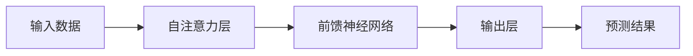

# GPT-4：点亮人工通用智能的火花

## 1. 背景介绍
随着人工智能技术的飞速发展，GPT-4作为自然语言处理领域的最新突破，不仅在技术上实现了质的飞跃，更在应用层面拓展了人工智能的边界。GPT-4的出现，标志着我们向人工通用智能（AGI）迈出了坚实的一步。

## 2. 核心概念与联系
GPT-4沿袭了其前身的设计理念，但在模型架构、训练方法和功能实现上进行了重大改进。它不仅增强了语言理解和生成的能力，还在多模态、逻辑推理等方面取得了突破。

### 2.1 模型架构
GPT-4采用了更深层次的神经网络结构，提高了参数量级，增强了模型的表达能力。

### 2.2 训练方法
它通过大规模的数据训练，采用了更为精细的自监督学习方法，提升了模型的泛化能力。

### 2.3 功能实现
GPT-4在多模态理解、情感识别、逻辑推理等方面的能力大幅提升，使其在更多实际应用场景中具备了更好的适应性。

## 3. 核心算法原理具体操作步骤
GPT-4的核心算法原理基于Transformer架构，通过自注意力机制来捕捉输入数据的全局依赖关系。



## 4. 数学模型和公式详细讲解举例说明
GPT-4的数学模型基于概率语言模型，其核心公式为：

$$ P(w_1, w_2, ..., w_n) = \prod_{i=1}^{n} P(w_i | w_1, ..., w_{i-1}) $$

其中，$w_i$ 表示词汇，$P(w_i | w_1, ..., w_{i-1})$ 表示在给定前面词汇的条件下，词汇$w_i$出现的条件概率。

## 5. 项目实践：代码实例和详细解释说明
在实际项目中，使用GPT-4进行文本生成的代码示例如下：

```python
import openai

# 设置API密钥
openai.api_key = 'your-api-key'

# 使用GPT-4生成文本
response = openai.Completion.create(
  engine="gpt-4",
  prompt="Translate the following English text to French: '{}'",
  max_tokens=60
)

print(response.choices[0].text.strip())
```

## 6. 实际应用场景
GPT-4在多个领域都有广泛的应用，包括但不限于：

- 自动化客服
- 内容创作
- 语言翻译
- 智能辅助决策

## 7. 工具和资源推荐
为了更好地利用GPT-4，以下是一些推荐的工具和资源：

- OpenAI官方文档
- Hugging Face的Transformers库
- GPT-4友好的开发平台，如AI21 Studio

## 8. 总结：未来发展趋势与挑战
GPT-4的出现预示着人工智能正向着更加智能化、多模态化的方向发展。然而，随之而来的挑战包括算法的透明度、伦理问题以及计算资源的巨大需求。

## 9. 附录：常见问题与解答
### Q1: GPT-4与GPT-3相比有哪些改进？
### A1: GPT-4在模型架构、训练数据量、多模态理解等方面都有显著提升。

### Q2: GPT-4是否能够理解图片？
### A2: GPT-4具备一定的多模态理解能力，可以结合文本和图片进行学习和推理。

### Q3: 使用GPT-4需要注意哪些伦理问题？
### A3: 在使用GPT-4时，需要注意数据隐私、内容生成的真实性和偏见问题。

作者：禅与计算机程序设计艺术 / Zen and the Art of Computer Programming