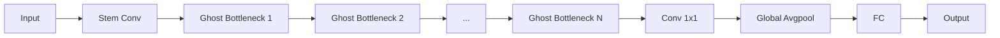
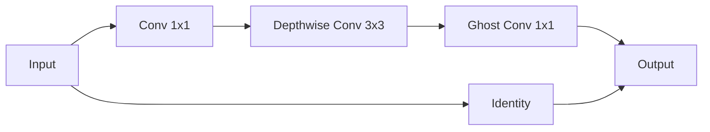
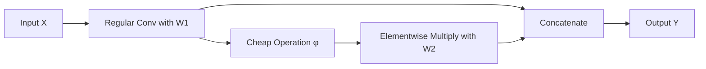

# GhostNet原理与代码实例讲解

## 1. 背景介绍

### 1.1 什么是GhostNet

GhostNet是一种基于深度学习的轻量级目标检测网络架构。它的设计目标是在保持高精度的同时，最大限度地减少模型的计算量和参数量，从而能够在资源受限的设备上实时运行，如移动设备和嵌入式设备。GhostNet的名字来源于其核心思想 - "幻影卷积(Ghost Convolution)"，即通过廉价操作生成更多的特征图。

### 1.2 GhostNet的应用场景

GhostNet广泛应用于各种需要实时、高效进行目标检测的场合，例如：

- 智能手机上的人脸识别、物体识别等应用
- 自动驾驶汽车的障碍物检测与识别
- 无人机上的目标跟踪与检测任务
- 工业视觉检测，如工业产品的缺陷检测
- 低功耗物联网设备的视觉应用

### 1.3 GhostNet的优势

相比于其他流行的轻量级网络架构如MobileNet、ShuffleNet等，GhostNet有以下优势：

- 更高的计算效率：幻影卷积通过廉价操作生成更多特征图，减少了计算量。
- 更少的参数量：生成的特征图共享同一组卷积核参数，大大减少了参数数量。
- 更好的精度：在相同计算量下，GhostNet在多个数据集上的精度超过MobileNetV3等网络。
- 更强的泛化能力：模型更简洁，更少的参数有利于减少过拟合，提高泛化性能。

## 2. 核心概念与原理

### 2.1 传统卷积的局限性

传统的卷积神经网络通过堆叠卷积层来提取特征。卷积操作本质上是对输入特征图进行线性变换，然后叠加一个偏置项，再通过激活函数引入非线性。随着网络层数的加深，卷积核数量也在增加，计算量和参数量急剧上升。

### 2.2 深度可分离卷积

为了解决上述问题，MobileNet系列网络采用了深度可分离卷积(Depthwise Separable Convolution)。它将传统卷积拆分为两步：

1. Depthwise Conv：对每个输入通道分别进行卷积，输出通道数与输入相同。
2. Pointwise Conv：用1x1卷积对Depthwise Conv的输出进行线性组合，调整通道数。

这种分解将计算量减少到原来的1/N（N为输出通道数）。但Depthwise Conv的输出特征图仍然与输入通道数相同，无法表达更丰富的特征。

### 2.3 幻影卷积(Ghost Convolution)

GhostNet提出了一种新的卷积方式 - 幻影卷积，进一步降低了计算量。它基于一个假设：卷积层的输出特征图之间存在一定的冗余，可以用廉价操作近似生成。

幻影卷积分两步进行：

1. 常规卷积：用少量的卷积核(filters)对输入做常规卷积，得到几个基础特征图。
2. 廉价操作：用线性变换（如逐元素相乘）在基础特征图的基础上生成更多的"幻影"特征图。

生成的幻影特征图与基础特征图共享卷积核参数，因此计算量几乎不增加，但特征表达能力大大提升。

### 2.4 GhostNet的网络架构

GhostNet的整体架构与MobileNetV3相似，主要由三部分组成：

1. Stem层：常规的卷积+BN+ReLU。
2. Ghost Bottlenecks：堆叠多个Ghost Bottleneck模块，每个模块内部用幻影卷积提取特征。
3. Head层：全局平均池化+全连接层输出分类结果。

下图是GhostNet的网络架构示意图：



其中，Ghost Bottleneck的内部结构如下：



Ghost Bottleneck先用一个1x1卷积进行通道扩展，然后用3x3的Depthwise Conv提取特征，最后用Ghost Conv 1x1调整通道数得到输出。输入也通过一个Identity分支直接加到输出上，构成残差连接。

## 3. 核心算法原理与操作步骤

本节详细介绍幻影卷积的算法原理和操作步骤。

### 3.1 常规卷积回顾

对于一个常规卷积层，设输入特征图为 $X \in R^{H \times W \times C}$，卷积核为 $W \in R^{K \times K \times C \times M}$，其中 $H,W$ 为输入特征图的高和宽，$C$ 为输入通道数，$K$ 为卷积核尺寸，$M$ 为输出通道数。卷积层的输出 $Y \in R^{H \times W \times M}$ 可表示为：

$$Y = X \otimes W$$

其中 $\otimes$ 表示卷积操作。这个卷积层的计算量为 $H \times W \times C \times K \times K \times M$。

### 3.2 幻影卷积的公式表示

对于一个幻影卷积层，设输入特征图 $X$ 和卷积核 $W$ 的尺寸与常规卷积相同，但卷积核数量减少为 $\frac{M}{s}$，其中 $s$ 为缩放因子，通常取2或4。幻影卷积的输出 $Y$ 可表示为：

$$
\begin{aligned}
Y_1 &= X \otimes W_1 \\
Y_2 &= \varphi(Y_1) \odot W_2
\end{aligned}
$$

其中 $Y_1 \in R^{H \times W \times \frac{M}{s}}$ 是常规卷积的输出，$W_1 \in R^{K \times K \times C \times \frac{M}{s}}$ 是常规卷积的卷积核；$\varphi$ 表示廉价操作，如恒等映射；$\odot$ 表示逐元素相乘；$W_2 \in R^{1 \times 1 \times \frac{M}{s} \times (s-1)\frac{M}{s}}$ 是廉价操作的参数，可学习；$Y_2 \in R^{H \times W \times (s-1)\frac{M}{s}}$ 是廉价操作生成的幻影特征图。

最终的输出 $Y$ 由 $Y_1$ 和 $Y_2$ 在通道维上拼接得到：

$$Y = Concat(Y_1, Y_2)$$

幻影卷积的计算量为 $H \times W \times C \times K \times K \times \frac{M}{s} + H \times W \times \frac{M}{s} \times (s-1)$，远小于常规卷积。

### 3.3 幻影卷积的操作步骤

根据上述公式，幻影卷积可分解为以下几个步骤：

1. 用常规卷积核 $W_1$ 对输入 $X$ 进行卷积，得到基础特征图 $Y_1$。
2. 对 $Y_1$ 应用廉价操作 $\varphi$，得到 $\varphi(Y_1)$。通常 $\varphi$ 为恒等映射，即 $\varphi(Y_1)=Y_1$。
3. 用学习参数 $W_2$ 与 $\varphi(Y_1)$ 做逐元素相乘，得到幻影特征图 $Y_2$。
4. 将 $Y_1$ 和 $Y_2$ 在通道维上拼接，得到最终输出 $Y$。

下图展示了幻影卷积的操作过程：



## 4. 数学模型与公式推导

本节我们从数学角度推导幻影卷积的合理性，证明其能够近似表达更多的特征。

### 4.1 常规卷积的矩阵表示

将卷积的输入 $X$ 展开为矩阵 $\mathbf{X} \in R^{HW \times CK^2}$，卷积核 $W$ 展开为矩阵 $\mathbf{W} \in R^{CK^2 \times M}$，则卷积的输出 $Y$ 可表示为矩阵乘法：

$$\mathbf{Y} = \mathbf{X} \mathbf{W}$$

其中 $\mathbf{Y} \in R^{HW \times M}$ 是输出矩阵，对应张量 $Y$。

### 4.2 幻影卷积的矩阵分解

类似地，幻影卷积的输出 $\mathbf{Y}$ 可分解为两部分：

$$
\begin{aligned}
\mathbf{Y}_1 &= \mathbf{X} \mathbf{W}_1 \\
\mathbf{Y}_2 &= \mathbf{Y}_1 \mathbf{W}_2
\end{aligned}
$$

其中 $\mathbf{W}_1 \in R^{CK^2 \times \frac{M}{s}}$，$\mathbf{W}_2 \in R^{\frac{M}{s} \times (s-1)\frac{M}{s}}$。最终输出为 $\mathbf{Y} = [\mathbf{Y}_1, \mathbf{Y}_2]$，是 $\mathbf{Y}_1$ 和 $\mathbf{Y}_2$ 的水平拼接。

将 $\mathbf{Y}_2$ 代入 $\mathbf{Y}$，得到：

$$
\mathbf{Y} = [\mathbf{X} \mathbf{W}_1, \mathbf{X} \mathbf{W}_1 \mathbf{W}_2] = \mathbf{X} [\mathbf{W}_1, \mathbf{W}_1 \mathbf{W}_2]
$$

令 $\mathbf{W}' = [\mathbf{W}_1, \mathbf{W}_1 \mathbf{W}_2]$，则幻影卷积等价于：

$$\mathbf{Y} = \mathbf{X} \mathbf{W}'$$

可见，幻影卷积在数学上等价于一个常规卷积，其卷积核矩阵为 $\mathbf{W}'$。但 $\mathbf{W}'$ 的秩为 $rank(\mathbf{W}') \leq \frac{M}{s}$，远小于常规卷积核矩阵 $\mathbf{W}$ 的秩 $M$。因此，幻影卷积可以用更少的参数生成与常规卷积近似的输出。

### 4.3 低秩分解的解释

从另一个角度看，幻影卷积实际上对常规卷积核矩阵 $\mathbf{W}$ 做了一个低秩分解：

$$\mathbf{W} \approx [\mathbf{W}_1, \mathbf{W}_1 \mathbf{W}_2] = \mathbf{W}_1 [\mathbf{I}, \mathbf{W}_2]$$

其中 $\mathbf{I}$ 为 $\frac{M}{s}$ 阶单位矩阵。这种分解将原始卷积核矩阵的秩从 $M$ 降到了 $\frac{M}{s}$，大大减少了参数量，但在表达能力上与原始矩阵相近。

综上所述，幻影卷积在数学上可以视为常规卷积的一种低秩近似，因此能够在减少计算量的同时保持较高的特征表达能力。

## 5. 代码实例与详解

本节我们通过PyTorch代码来实现幻影卷积，并解释其中的关键步骤。

### 5.1 幻影卷积的PyTorch实现

```python
import torch
import torch.nn as nn

class GhostModule(nn.Module):
    def __init__(self, inp, oup, kernel_size=1, ratio=2, dw_size=3, stride=1, relu=True):
        super(GhostModule, self).__init__()
        self.oup = oup
        init_channels = math.ceil(oup / ratio)
        new_channels = init_channels*(ratio-1)

        self.primary_conv = nn.Sequential(
            nn.Conv2d(inp, init_channels, kernel_size, stride, kernel_size//2, bias=