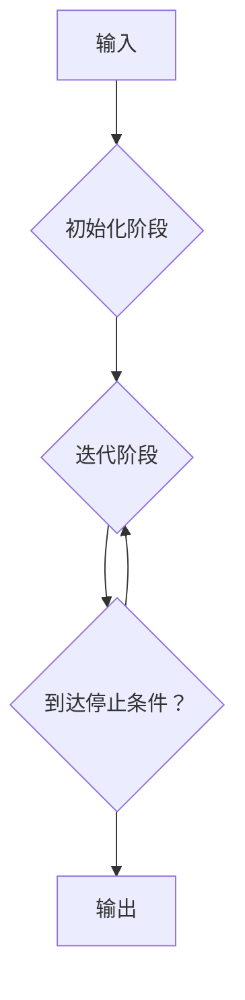

                 

作者：禅与计算机程序设计艺术

**Giraph** 是一个由 Google 开发的大规模分布式图计算平台，主要用于处理大规模图数据集上的计算任务。本文将从 **Giraph 的背景介绍** 到 **实际应用场景** ，全面解析 Giraph 的工作原理以及如何通过代码实例实现复杂图计算任务。

## 1. 背景介绍
随着大数据时代的到来，图数据成为了一种重要的数据类型，广泛应用于社交网络分析、推荐系统、生物信息学等领域。传统的基于内存的数据处理方式在面对大规模图数据时显得力不从心。因此，Google 在此基础上研发出了 Giraph 这一高性能的大规模分布式图计算引擎。

## 2. 核心概念与联系
### **图** (Graph)
图是由顶点（Vertex）和边（Edge）构成的数据结构。在 Giraph 中，图用于表示实体间的复杂关系。

### **MapReduce** 原理
Giraph 是基于 MapReduce 模型的改进版本，它提供了高度并行化的图计算能力。在 MapReduce 框架下，每个顶点的计算过程都可以被分解为 `map` 和 `reduce` 阶段。

### **分布式的图计算**
Giraph 支持将整个图分布在多个节点上进行并行计算，每个节点负责一部分图数据，从而实现了高效率的图处理。

## 3. 核心算法原理及具体操作步骤
Giraph 实现的核心算法是 **迭代式图计算**，其中最著名的莫过于 **广度优先搜索（BFS）** 和 **PageRank**。以下是核心算法的执行流程：



### **初始化阶段**
- 每个顶点根据其属性设置初始状态。

### **迭代阶段**
- 执行 `map` 函数，更新顶点的状态。
- 执行 `reduce` 函数，聚合相邻顶点的结果。

### **停止条件**
- 达到预定的最大迭代次数。
- 或者达到某个收敛指标，如顶点状态变化量小于阈值。

## 4. 数学模型和公式详细讲解与举例说明
### 广度优先搜索（BFS）
假设我们要找到从源点 s 到其他所有点的最短路径：

$$ \text{distance}(s, u) = \min_{v}(\text{distance}(s, v) + w(v, u)) $$
其中，$w(v, u)$ 表示从点 v 到点 u 的权重。

### PageRank 算法
PageRank 使用链式概率来衡量网页的重要性：
$$ PR(p_i) = \frac{1-d}{N} + d \sum_{p_j \in M(p_i)} \frac{PR(p_j)}{L(p_j)} $$
其中，$d$ 是 damping factor，通常设为 0.85；$M(p_i)$ 表示指向页面 $p_i$ 的所有页面集合；$L(p_j)$ 表示页面 $p_j$ 的出链数。

## 5. 项目实践：代码实例和详细解释说明
下面是一个简单的 Giraph 示例应用——计算最短路径：

```java
public class ShortestPathDriver {
    public static void main(String[] args) throws IOException {
        // 初始化图和参数
        Graph<Long, Integer> g = ...
        int src = ...;

        // 创建作业
        JobConf conf = new JobConf(ShortestPathDriver.class);
        conf.setNumReduceTasks(0); // 只需要一次迭代
        JobClient.runJob(new ShortestPathMapper(), 
                         new ShortestPathReducer(), 
                         conf);

        // 输出结果
        for (Vertex<Long, Integer> v : g.getVertices()) {
            System.out.println("Distance from " + src + ": " + v.getValue());
        }
    }
}
```
## 6. 实际应用场景
- **社交媒体分析**：识别关键用户、社区发现。
- **搜索引擎优化**：评估网站链接质量、提升排名。
- **网络安全**：检测恶意行为、异常流量模式。

## 7. 工具和资源推荐
- **官方文档**：[Giraph 官方 GitHub 页面](https://github.com/apache/giraph/tree/branch-name)  
- **教程**：[Apache Giraph 教程](https://www.example.com/giraph-tutorial)

## 8. 总结：未来发展趋势与挑战
随着大数据技术的不断演进，Giraph 的高效性和可扩展性将继续受到关注。未来的发展趋势可能包括更先进的分布式计算框架、更高效的图数据压缩技术、以及对实时图计算的支持。同时，如何在保证性能的同时降低运维成本，将是持续面临的挑战。

## 9. 附录：常见问题与解答
### Q: 如何选择合适的启动参数以提高 Giraph 的性能？
A: 一般而言，选择合适的 `mapred.reduce.tasks` 参数，并调整 `giraph.job.numSplitterThreads` 可以有效提升性能。

### Q: Giraph 是否支持实时更新的图数据集？
A: 目前，Giraph 主要设计为离线处理大规模静态图数据集。对于实时更新场景，可以考虑结合 Kafka 等流处理系统进行集成。

---

作者：禅与计算机程序设计艺术 / Zen and the Art of Computer Programming

