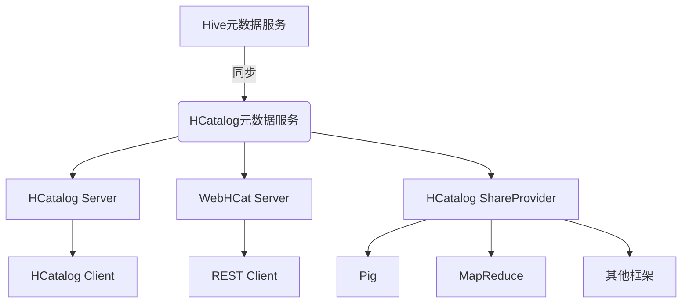

# HCatalog原理与代码实例讲解

## 1.背景介绍

### 1.1 大数据时代的数据管理挑战

随着大数据时代的到来,传统的数据管理系统面临着前所未有的挑战。海量的结构化和非结构化数据源源不断地产生,数据量和多样性都在不断增加。如何高效地存储、管理和处理这些海量异构数据,成为了当前亟待解决的问题。

### 1.2 Apache Hive 与 Hadoop 生态系统

Apache Hive 作为构建在 Hadoop 之上的数据仓库基础架构,为结构化数据提供了高效的查询和分析能力。然而,Hive 缺乏对底层数据的元数据管理功能,这使得在 Hadoop 生态系统中集成和共享数据变得困难。

### 1.3 HCatalog 的产生与作用

为了解决这一问题,Apache 社区推出了 HCatalog,作为 Hadoop 生态系统中的元数据服务。HCatalog 为 Hadoop 上的数据提供了统一的元数据管理层,使得不同的数据处理工具和框架能够轻松地共享和访问数据,从而极大地提高了数据的可管理性和可用性。

## 2.核心概念与联系

### 2.1 元数据 (Metadata)

元数据是描述数据的数据,它包含了数据的结构、类型、位置等信息。在大数据环境中,准确和统一的元数据管理对于数据的共享和集成至关重要。

### 2.2 HCatalog 架构

HCatalog 由以下几个核心组件组成:

- **HCatalog Server**: 提供元数据服务,管理和存储元数据。
- **HCatalog Client**: 供用户和应用程序与 HCatalog Server 交互。
- **WebHCat Server**: 提供 REST 接口,方便其他应用程序访问 HCatalog 服务。
- **HCatalog Listener**: 监听 Hive 元数据的变化,并同步到 HCatalog 中。
- **HCatalog ShareProvider**: 允许其他框架(如 Pig、MapReduce)访问和共享 HCatalog 中的元数据。

### 2.3 HCatalog 与 Hive 元数据服务的关系

HCatalog 并不是完全取代 Hive 的元数据服务,而是在其基础上提供了一个统一的元数据管理层。HCatalog 通过 HCatalog Listener 监听 Hive 元数据的变化,并将其同步到 HCatalog 中,从而实现了与 Hive 元数据的无缝集成。



## 3.核心算法原理具体操作步骤

### 3.1 HCatalog 表的创建

HCatalog 中的表是对底层数据的逻辑视图,它描述了数据的结构和位置。创建 HCatalog 表的步骤如下:

1. 连接 HCatalog 服务器
2. 定义表的模式(列名、数据类型等)
3. 指定表的存储格式(文本文件、序列文件等)
4. 设置表的存储位置(HDFS 路径)
5. 提交表的元数据信息

以下是使用 HCatalog Client 创建一个表的示例代码:

```java
HCatClient client = HCatClient.create(conf);
List<HCatFieldSchema> cols = new ArrayList<>();
cols.add(new HCatFieldSchema("id", HCatFieldSchema.Type.INT, ""));
cols.add(new HCatFieldSchema("name", HCatFieldSchema.Type.STRING, ""));

HCatCreateTableDesc desc = new HCatCreateTableDesc("mytable")
    .setCols(cols)
    .setFileFormat(HCatConstants.FILE_FORMAT_TEXTFILE)
    .setLocation("/user/mydata");

client.createTable(desc);
```

### 3.2 HCatalog 表的查询

HCatalog 支持使用 HiveQL 查询语言来查询表中的数据。查询的步骤如下:

1. 连接 HCatalog 服务器
2. 构建 HiveQL 查询语句
3. 执行查询,获取结果集
4. 处理查询结果

以下是使用 HCatalog Client 查询表的示例代码:

```java
HCatClient client = HCatClient.create(conf);
HCatReader reader = client.getReader("mytable");
HCatRecordReader recordReader = reader.getRecordReader();

while (recordReader.hasNext()) {
    HCatRecord record = recordReader.next();
    System.out.println("id: " + record.getInteger("id", 0));
    System.out.println("name: " + record.getString("name", ""));
}
```

## 4.数学模型和公式详细讲解举例说明

在大数据环境中,数据通常存储在分布式文件系统(如 HDFS)中,并被划分为多个数据块。为了高效地查询和处理这些数据,HCatalog 采用了一种基于数据块的查询优化策略。

设有 $n$ 个数据块 $B = \{b_1, b_2, \ldots, b_n\}$,每个数据块 $b_i$ 包含 $m_i$ 条记录。查询条件为 $Q$,满足条件 $Q$ 的记录集合为 $R_Q$。我们需要找到最小的数据块集合 $B_Q \subseteq B$,使得:

$$
R_Q = \bigcup_{b_i \in B_Q} \{r | r \in b_i \land r \text{ satisfies } Q\}
$$

这个问题可以转化为经典的集合覆盖问题,即找到最小的子集 $B_Q$,使得它们的并集覆盖了整个记录集 $R_Q$。由于集合覆盖问题是 NP 难题,因此我们需要采用启发式算法来近似求解。

HCatalog 使用了一种基于数据块元数据的贪婪算法。算法的主要步骤如下:

1. 计算每个数据块 $b_i$ 中满足条件 $Q$ 的记录数 $c_i$
2. 按照 $c_i$ 降序排列数据块
3. 从排序后的数据块中选取前 $k$ 个数据块,构成初始解 $B_Q^0$
4. 对剩余的数据块,按照贪婪策略依次加入 $B_Q^0$,直到覆盖了所有满足条件的记录

这种算法虽然无法保证找到最优解,但在大多数情况下可以获得较好的近似解,并且具有较高的执行效率。

## 5.项目实践:代码实例和详细解释说明

为了更好地理解 HCatalog 的使用,我们将通过一个实际项目来演示。该项目旨在统计网站日志中不同页面的访问量。

### 5.1 准备网站日志数据

假设我们有一个网站日志文件 `access.log`,其中每行记录了一次页面访问,格式如下:

```
192.168.1.1 - - [01/Aug/2022:00:00:01 +0800] "GET /index.html HTTP/1.1" 200 5326
```

该记录表示 IP 地址为 `192.168.1.1` 的用户在 `2022年8月1日00:00:01` 访问了 `/index.html` 页面,响应状态码为 `200`,响应大小为 `5326` 字节。

我们将日志文件上传到 HDFS 的 `/user/logs/access.log` 路径。

### 5.2 创建 HCatalog 表

接下来,我们在 HCatalog 中创建一个表来描述网站日志数据的结构:

```java
HCatClient client = HCatClient.create(conf);
List<HCatFieldSchema> cols = new ArrayList<>();
cols.add(new HCatFieldSchema("ip", HCatFieldSchema.Type.STRING, ""));
cols.add(new HCatFieldSchema("datetime", HCatFieldSchema.Type.STRING, ""));
cols.add(new HCatFieldSchema("request", HCatFieldSchema.Type.STRING, ""));
cols.add(new HCatFieldSchema("status", HCatFieldSchema.Type.INT, ""));
cols.add(new HCatFieldSchema("size", HCatFieldSchema.Type.INT, ""));

HCatCreateTableDesc desc = new HCatCreateTableDesc("access_log")
    .setCols(cols)
    .setFileFormat(HCatConstants.FILE_FORMAT_TEXTFILE)
    .setLocation("/user/logs/access.log");

client.createTable(desc);
```

这个表包含了日志记录中的各个字段,如 IP 地址、时间戳、请求信息、状态码和响应大小。

### 5.3 统计页面访问量

现在,我们可以使用 HiveQL 查询语句来统计不同页面的访问量:

```sql
SELECT substr(request, instr(request, ' ') + 1, instr(substr(request, instr(request, ' ') + 1), ' ') - 1) AS page,
       count(*) AS count
FROM access_log
WHERE status = 200
GROUP BY substr(request, instr(request, ' ') + 1, instr(substr(request, instr(request, ' ') + 1), ' ') - 1)
ORDER BY count DESC;
```

这个查询语句首先从 `request` 字段中提取出页面路径,然后统计状态码为 `200` 的记录中每个页面的访问次数,并按访问次数降序排列。

我们可以使用 HCatalog Client 执行这个查询:

```java
HCatClient client = HCatClient.create(conf);
HCatReader reader = client.getReader("access_log");
HCatRecordReader recordReader = reader.getRecordReader("SELECT ...");

while (recordReader.hasNext()) {
    HCatRecord record = recordReader.next();
    System.out.println("Page: " + record.getString("page", ""));
    System.out.println("Count: " + record.getLong("count", 0));
}
```

输出结果将显示每个页面及其对应的访问次数。

## 6.实际应用场景

HCatalog 在 Hadoop 生态系统中发挥着重要作用,为各种数据处理框架和工具提供了统一的元数据管理服务。以下是一些 HCatalog 的典型应用场景:

1. **Hive 查询优化**: Hive 可以利用 HCatalog 提供的元数据信息,优化查询执行计划,提高查询效率。

2. **Pig 数据处理**: Pig 可以通过 HCatalog 访问和处理存储在 HDFS 上的结构化数据。

3. **MapReduce 作业**: MapReduce 作业可以使用 HCatalog 提供的元数据,避免手动指定输入/输出路径和数据格式。

4. **Spark 数据处理**: Spark 可以通过 HCatalog 连接器访问 HCatalog 中的元数据,并读取和处理相应的数据。

5. **数据治理**: HCatalog 提供了一个集中式的元数据管理平台,有助于实现数据治理和数据质量管理。

6. **数据湖**: HCatalog 可以作为数据湖架构中的元数据服务,为各种数据处理工具提供统一的数据视图。

## 7.工具和资源推荐

### 7.1 HCatalog Web UI

HCatalog 提供了一个基于 Web 的用户界面,用于查看和管理元数据。通过 Web UI,您可以浏览表和视图、查看表结构、查询表数据等。

### 7.2 HCatalog CLI

HCatalog 命令行界面 (CLI) 是一个交互式的命令行工具,允许您执行各种元数据操作,如创建表、删除表、查看表结构等。

### 7.3 HCatalog Java API

HCatalog 提供了一套 Java API,供开发人员在应用程序中集成和使用 HCatalog 服务。Java API 支持创建、删除、修改表,以及查询表数据等操作。

### 7.4 HCatalog 文档

Apache HCatalog 官方文档提供了详细的概念介绍、架构设计、配置指南和使用示例,是学习和使用 HCatalog 的重要资源。

### 7.5 HCatalog 社区

HCatalog 拥有一个活跃的开发者社区,您可以在邮件列表、论坛和 issue 跟踪器上寻求帮助、提出问题或分享经验。

## 8.总结:未来发展趋势与挑战

### 8.1 元数据管理的重要性

随着大数据生态系统的不断发展,元数据管理将变得越来越重要。准确、统一和高效的元数据管理是实现数据治理、数据质量管理和数据共享的关键。

### 8.2 元数据标准化和互操作性

未来,元数据标准化和互操作性将成为