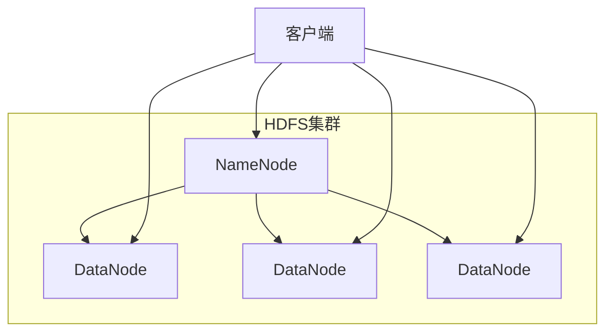
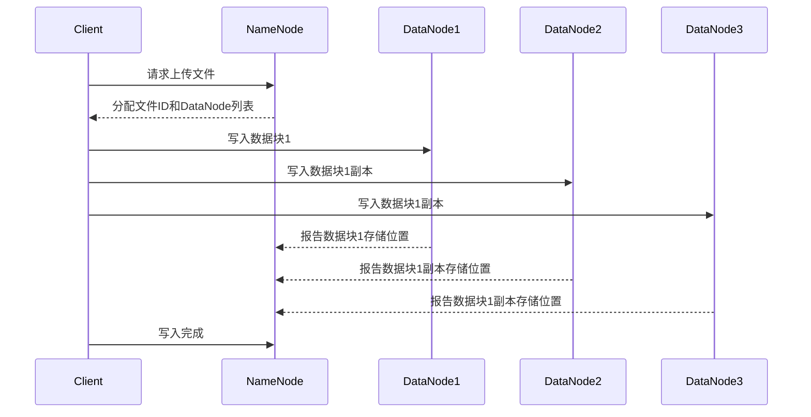
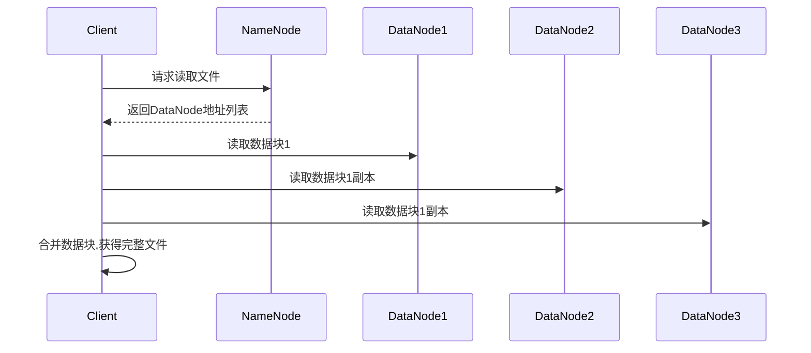
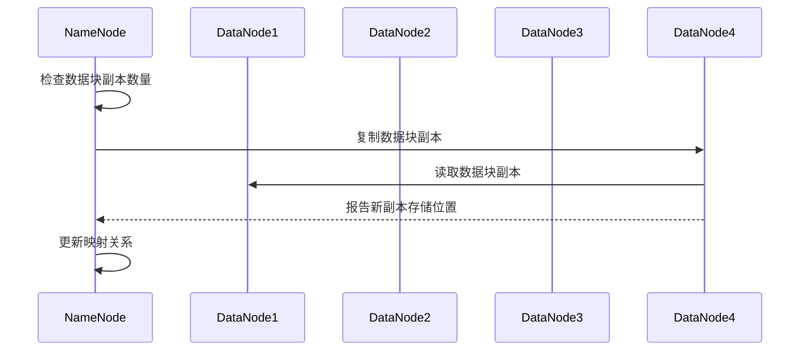

# HDFS原理与代码实例讲解

## 1. 背景介绍

### 1.1 大数据时代的到来

随着互联网、物联网、人工智能等技术的快速发展,数据量呈现出爆炸式增长趋势。传统的数据存储和处理方式已经无法满足现代大数据应用的需求。为了解决这一挑战,分布式文件系统(Distributed File System)应运而生。

### 1.2 分布式文件系统的重要性

分布式文件系统能够在多台廉价的计算机节点上存储和管理海量数据,具有高容错性、高可扩展性和高吞吐量等优点。它是实现大数据存储和处理的关键基础设施,在大数据生态系统中扮演着核心角色。

### 1.3 HDFS概述

Apache Hadoop分布式文件系统(HDFS)是一种高度容错的分布式文件系统,旨在运行在廉价的硬件集群上。它具有高容错性、高吞吐量、可在廉价硬件上运行等特点,非常适合大数据应用场景。HDFS源于Google的GFS(Google File System)分布式文件系统,并在此基础上进行了改进和优化。

## 2. 核心概念与联系

### 2.1 HDFS架构

HDFS采用主从架构,由一个NameNode(名称节点)和多个DataNode(数据节点)组成。

#### 2.1.1 NameNode

NameNode是HDFS集群的主节点,负责管理文件系统的命名空间(Namespace)和客户端对文件的访问。它维护着文件系统的目录树及文件与数据块的映射关系,并记录数据块所在的DataNode信息。

#### 2.1.2 DataNode 

DataNode是HDFS集群的从节点,负责实际存储文件数据块。每个DataNode在本地磁盘上存储数据块,并定期向NameNode发送心跳信号和数据块报告,汇报自身状态和存储的数据块信息。

#### 2.1.3 客户端

客户端是HDFS的使用者,通过与NameNode交互获取文件元数据,然后与DataNode直接通信进行数据读写操作。



### 2.2 数据块

HDFS将文件划分为一个个数据块(Block),并将这些数据块分布式存储在DataNode上。每个数据块的默认大小为128MB(可配置)。将文件划分为数据块的好处包括:

1. 支持存储大文件
2. 方便数据分布式存储
3. 提高数据传输效率
4. 支持并行读写

### 2.3 副本机制

为了提高数据的可靠性和容错性,HDFS采用了数据块副本机制。每个数据块默认会存储3个副本(可配置),分别存储在不同的DataNode上。当某个DataNode发生故障时,HDFS可以从其他DataNode上读取数据,保证数据的可用性。

## 3. 核心算法原理具体操作步骤

### 3.1 文件写入流程

当客户端向HDFS写入文件时,会经历以下步骤:

1. 客户端向NameNode请求上传文件,NameNode检查目标文件是否已存在。
2. NameNode为文件分配一个唯一的文件ID,并决定数据块的存储位置(DataNode)。
3. NameNode返回文件ID和DataNode列表给客户端。
4. 客户端按顺序向DataNode写入数据块,并在写入过程中进行数据校验。
5. 客户端定期向DataNode发送数据包,DataNode在本地临时存储数据包。
6. 当数据包达到一个数据块大小时,DataNode开始存储数据块,并向NameNode报告数据块存储位置。
7. NameNode记录文件与数据块的映射关系。
8. 客户端完成文件写入后,通知NameNode写入完成。



### 3.2 文件读取流程

当客户端从HDFS读取文件时,会经历以下步骤:

1. 客户端向NameNode请求读取文件。
2. NameNode获取文件的数据块信息,并返回DataNode地址列表给客户端。
3. 客户端按顺序从DataNode读取数据块。
4. 客户端对读取的数据块进行校验和合并,最终获得完整文件。



### 3.3 数据块复制

为了维护数据可靠性,HDFS会定期检查数据块的副本数量,如果发现副本数量不足,会自动在其他DataNode上复制新的副本。这个过程称为数据块复制(Block Replication)。

1. NameNode定期检查每个数据块的副本数量。
2. 如果某个数据块的副本数量低于设定值,NameNode会选择合适的DataNode,并指示其从存有该数据块副本的DataNode复制数据块。
3. 被选中的DataNode读取数据块副本,并将其复制到本地磁盘。
4. 复制完成后,DataNode向NameNode报告新副本的存储位置。
5. NameNode更新数据块与DataNode的映射关系。



## 4. 数学模型和公式详细讲解举例说明

### 4.1 数据块放置策略

HDFS采用了一种优化的数据块放置策略,旨在提高数据可靠性和读写性能。该策略由两个关键因素决定:

1. 副本放置位置
2. 副本选择顺序

#### 4.1.1 副本放置位置

假设集群中有N个机架(Rack),每个机架有多个DataNode。HDFS将数据块的3个副本分别放置在:

1. 本地DataNode
2. 不同机架的DataNode
3. 同一机架的另一个DataNode

这种策略可以最大限度地利用机架内带宽,同时也能在机架发生故障时提供数据容错。

设$r$为机架数量,$d_i$为第$i$个机架上的DataNode数量,则数据块副本的期望读取代价为:

$$E[X] = \frac{1}{r}\sum_{i=1}^r\frac{1}{d_i}$$

#### 4.1.2 副本选择顺序

HDFS会优先选择距离客户端最近的副本进行读取,以减少读取延迟。副本选择顺序如下:

1. 同一节点上的副本
2. 同一机架上的副本
3. 不同机架上的副本

设$p_1$为同一节点上副本的概率,$p_2$为同一机架上副本的概率,$p_3$为不同机架上副本的概率,则期望读取代价为:

$$E[C] = p_1 \times 0 + p_2 \times c_1 + p_3 \times c_2$$

其中$c_1$和$c_2$分别表示机架内和机架间的读取代价。

### 4.2 数据块大小选择

HDFS中数据块的大小是一个重要的配置参数,它会影响系统的存储效率、数据传输效率和元数据管理开销。

假设文件大小为$F$,数据块大小为$B$,则文件被划分为$\lceil\frac{F}{B}\rceil$个数据块。每个数据块都需要在NameNode中维护元数据,因此元数据开销为$O(\lceil\frac{F}{B}\rceil)$。

数据传输效率与数据块大小也有关系。较大的数据块可以减少网络请求次数,但也会增加单个请求的延迟。设网络带宽为$W$,单个数据块的传输时间为$T_B$,则总传输时间为:

$$T = \lceil\frac{F}{B}\rceil \times T_B + \frac{F}{W}$$

可以看出,数据块大小的选择需要权衡元数据开销、传输效率和单个请求延迟等因素。HDFS默认的数据块大小为128MB,这是一个相对合理的折中值。

## 5. 项目实践:代码实例和详细解释说明

本节将通过一个简单的Java示例程序,演示如何使用HDFS客户端API进行文件上传和下载操作。

### 5.1 环境准备

1. 安装Hadoop环境,并正确配置HDFS
2. 启动HDFS集群
3. 确保Java环境已正确配置

### 5.2 Maven依赖

在项目的`pom.xml`文件中添加以下依赖:

```xml
<dependency>
    <groupId>org.apache.hadoop</groupId>
    <artifactId>hadoop-client</artifactId>
    <version>3.3.4</version>
</dependency>
```

### 5.3 上传文件

```java
import org.apache.hadoop.conf.Configuration;
import org.apache.hadoop.fs.FileSystem;
import org.apache.hadoop.fs.Path;

public class HDFSExample {
    public static void main(String[] args) throws Exception {
        // 创建HDFS配置对象
        Configuration conf = new Configuration();
        conf.set("fs.defaultFS", "hdfs://namenode:9000");

        // 获取HDFS文件系统实例
        FileSystem hdfs = FileSystem.get(conf);

        // 本地文件路径
        Path localPath = new Path("/path/to/local/file.txt");
        // HDFS文件路径
        Path hdfsPath = new Path("/path/in/hdfs/file.txt");

        // 上传文件到HDFS
        hdfs.copyFromLocalFile(localPath, hdfsPath);

        System.out.println("File uploaded to HDFS successfully!");

        // 关闭HDFS连接
        hdfs.close();
    }
}
```

代码解释:

1. 创建`Configuration`对象,设置HDFS的NameNode地址。
2. 通过`FileSystem.get(conf)`获取HDFS文件系统实例。
3. 创建本地文件路径和HDFS文件路径对象。
4. 调用`hdfs.copyFromLocalFile()`方法将本地文件上传到HDFS。
5. 关闭HDFS连接。

### 5.4 下载文件

```java
import org.apache.hadoop.conf.Configuration;
import org.apache.hadoop.fs.FileSystem;
import org.apache.hadoop.fs.Path;

public class HDFSExample {
    public static void main(String[] args) throws Exception {
        // 创建HDFS配置对象
        Configuration conf = new Configuration();
        conf.set("fs.defaultFS", "hdfs://namenode:9000");

        // 获取HDFS文件系统实例
        FileSystem hdfs = FileSystem.get(conf);

        // HDFS文件路径
        Path hdfsPath = new Path("/path/in/hdfs/file.txt");
        // 本地文件路径
        Path localPath = new Path("/path/to/local/file.txt");

        // 从HDFS下载文件
        hdfs.copyToLocalFile(hdfsPath, localPath);

        System.out.println("File downloaded from HDFS successfully!");

        // 关闭HDFS连接
        hdfs.close();
    }
}
```

代码解释:

1. 创建`Configuration`对象,设置HDFS的NameNode地址。
2. 通过`FileSystem.get(conf)`获取HDFS文件系统实例。
3. 创建HDFS文件路径和本地文件路径对象。
4. 调用`hdfs.copyToLocalFile()`方