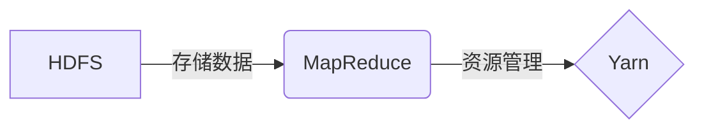

# Hadoop MapReduce计算框架原理与代码实例讲解

## 1. 背景介绍

### 1.1 大数据处理的挑战
随着互联网、物联网等技术的发展,数据呈现爆炸式增长。如何高效处理海量数据成为了一大挑战。传统的单机处理模式已经无法满足大数据时代的需求。

### 1.2 分布式计算的兴起
为了应对大数据处理的挑战,分布式计算应运而生。通过将任务分发到多个节点并行处理,可以大大提高数据处理效率。Hadoop作为一个开源的分布式计算平台,为大数据处理提供了可靠的解决方案。

### 1.3 MapReduce的诞生
MapReduce是Google提出的一个编程模型,用于大规模数据集的并行运算。Hadoop实现了MapReduce编程模型,使得开发人员无需关注底层细节,就能方便地进行分布式计算。

## 2. 核心概念与联系

### 2.1 MapReduce编程模型
- Map阶段:并行处理输入数据 
- Reduce阶段:对Map结果进行汇总

### 2.2 HDFS分布式文件系统
- 支持PB级数据存储
- 数据冗余,保障数据安全性
- 数据位置感知,利于数据处理本地化

### 2.3 Yarn资源管理系统  
- 负责集群资源管理和任务调度
- 支持多种计算框架,如MapReduce、Spark等

### 2.4 核心概念联系


## 3. 核心算法原理具体操作步骤

### 3.1 Map阶段
1. 输入数据被分割成splits
2. 对每个split并行执行map任务 
3. map将输入kv对转换为中间kv对
4. 对中间结果进行分区partition

### 3.2 Shuffle阶段  
1. 对map输出结果按key进行排序
2. 将相同key的value合并成列表
3. partition结果写入本地磁盘

### 3.3 Reduce阶段
1. 从map端拉取对应partition数据
2. 对key进行归并排序
3. reduce任务处理kv对,输出结果
4. 结果写入HDFS

## 4. 数学模型和公式详细讲解举例说明

### 4.1 词频统计WordCount
假设有大量文本数据需要统计单词出现频次,可以使用MapReduce模型高效实现:

- Map阶段:
$$map(key,value)\rightarrow list(word,1)$$

- Reduce阶段:  
$$reduce(word,list(1,1...))\rightarrow list(word,sum)$$

其中,$key$为文件名,$value$为文件内容,$word$为单词,$sum$为单词频次之和。

### 4.2 矩阵乘法
对于两个大矩阵$A$和$B$,通过MapReduce可以实现分布式矩阵乘法$C=A \cdot B$:
- Map阶段:
$$map(i,j,A_{ij})\rightarrow list((i,k),A_{ij})$$
$$map(j,k,B_{jk})\rightarrow list((i,k),B_{jk})$$

- Reduce阶段:
$$reduce((i,k),list(A_{ij},B_{jk}))\rightarrow list((i,k),\sum A_{ij}*B_{jk})$$

其中,$i,j,k$为矩阵行列索引,$A_{ij},B_{jk}$为矩阵元素。通过巧妙地设计kv对,可以将复杂的矩阵运算映射为MapReduce模型。

## 5. 项目实践：代码实例和详细解释说明

下面以经典的WordCount为例,给出Hadoop MapReduce的具体代码实现:

```java
public class WordCount {
    public static class TokenizerMapper extends Mapper<Object, Text, Text, IntWritable> {
        private final static IntWritable one = new IntWritable(1);
        private Text word = new Text();
        
        public void map(Object key, Text value, Context context) throws IOException, InterruptedException {
            StringTokenizer itr = new StringTokenizer(value.toString());
            while (itr.hasMoreTokens()) {
                word.set(itr.nextToken());
                context.write(word, one);
            }
        }
    }
    
    public static class IntSumReducer extends Reducer<Text,IntWritable,Text,IntWritable> {
        private IntWritable result = new IntWritable();
        
        public void reduce(Text key, Iterable<IntWritable> values, Context context) throws IOException, InterruptedException {
            int sum = 0;
            for (IntWritable val : values) {
                sum += val.get();
            }
            result.set(sum);
            context.write(key, result);
        }
    }
    
    public static void main(String[] args) throws Exception {
        Configuration conf = new Configuration();
        Job job = Job.getInstance(conf, "word count");
        
        job.setJarByClass(WordCount.class);
        job.setMapperClass(TokenizerMapper.class);
        job.setCombinerClass(IntSumReducer.class);
        job.setReducerClass(IntSumReducer.class);
        
        job.setOutputKeyClass(Text.class);
        job.setOutputValueClass(IntWritable.class);
        
        FileInputFormat.addInputPath(job, new Path(args[0]));
        FileOutputFormat.setOutputPath(job, new Path(args[1]));
        
        System.exit(job.waitForCompletion(true) ? 0 : 1);
    }
}
```

代码解释:
- Mapper类TokenizerMapper:
    - 继承自Mapper类,实现map方法
    - 将输入的文本按空格分割为单词,并输出(word,1)
- Reducer类IntSumReducer:
    - 继承自Reducer类,实现reduce方法
    - 对相同key的value列表进行求和,并输出(word,sum)
- main方法:
    - 配置Job,设置Mapper、Combiner、Reducer
    - 指定输入输出路径和kv对类型
    - 提交Job并等待执行完成

通过以上代码,即可实现基于MapReduce的分布式单词计数。代码结构清晰,充分利用了Hadoop提供的编程接口,使得开发人员可以专注于业务逻辑的实现。

## 6. 实际应用场景

Hadoop MapReduce在诸多领域得到了广泛应用,下面列举几个典型场景:

### 6.1 日志分析
互联网公司每天会产生海量的用户访问日志,通过MapReduce可以对日志进行清洗、统计和分析,挖掘出用户行为模式,为业务优化提供依据。

### 6.2 推荐系统
电商网站利用MapReduce对用户历史行为数据进行挖掘,计算用户和商品之间的相似度,实现个性化商品推荐,提升用户体验。

### 6.3 网页索引
搜索引擎通过MapReduce对海量网页进行分布式索引构建,提高索引效率,实现快速、准确的网页搜索。

### 6.4 机器学习
一些机器学习算法如协同过滤、聚类等,都可以用MapReduce实现,在处理大规模数据集时效果显著。

## 7. 工具和资源推荐

### 7.1 Hadoop官网
提供Hadoop各个版本的下载、文档和社区资源。
https://hadoop.apache.org/

### 7.2 Cloudera发行版
提供了Hadoop及周边生态的发行版,以及丰富的管理和开发工具。
https://www.cloudera.com/

### 7.3 《Hadoop权威指南》
Hadoop领域的经典图书,全面系统地介绍了Hadoop原理和实践。

### 7.4 GitHub示例项目
GitHub上有大量优秀的Hadoop示例项目,可供参考学习。如:
https://github.com/apache/hadoop-mapreduce-examples

## 8. 总结：未来发展趋势与挑战

### 8.1 与新兴计算框架的融合
Spark、Flink等内存计算框架的兴起,对MapReduce形成了一定冲击。未来Hadoop MapReduce将与这些新兴框架融合,发挥各自优势。

### 8.2 实时流式计算的支持
MapReduce是一个批处理框架,对实时性要求较高的流式计算支持不足。需要探索支持实时计算的新方案。

### 8.3 更易用的编程接口
原生MapReduce API使用门槛较高,后续需提供更高级更易用的编程接口如Pig、Hive等,简化开发任务。

### 8.4 AI赋能大数据处理
利用AI技术赋能大数据处理,通过机器学习自动优化数据倾斜、任务调度等,提高MapReduce性能,是一个值得关注的发展方向。

## 9. 附录：常见问题与解答

### 9.1 MapReduce适合处理哪些类型的数据和计算？
MapReduce适合处理超大规模的数据集,数据可以非结构化,对计算时延要求不高。适合数据搜索、日志分析、Web索引等批处理任务。

### 9.2 MapReduce如何实现容错？
MapReduce会对map和reduce任务的执行状态进行跟踪,一旦发现失败的任务,会自动重新调度执行。同时利用数据备份保障数据安全。

### 9.3 MapReduce的局限性有哪些？
MapReduce不适合迭代计算和流式计算等场景,处理中间结果需要大量IO操作,实时性不足。编程模型相对底层,开发效率不高。

### 9.4 掌握MapReduce需要哪些前置知识？
需要掌握Java编程、分布式系统、数据结构与算法等基础知识。同时需要熟悉Linux环境和HDFS等Hadoop组件。

作者：禅与计算机程序设计艺术 / Zen and the Art of Computer Programming