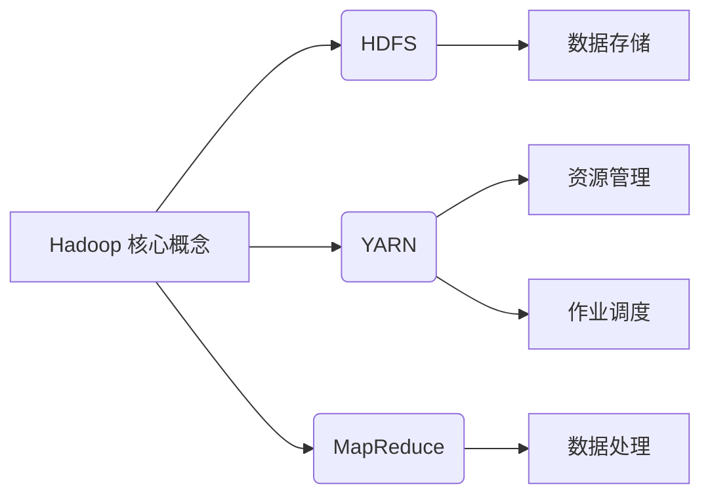
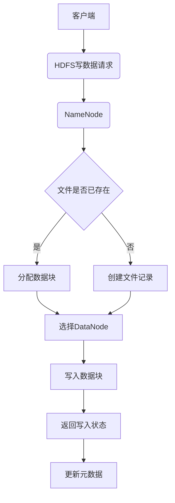
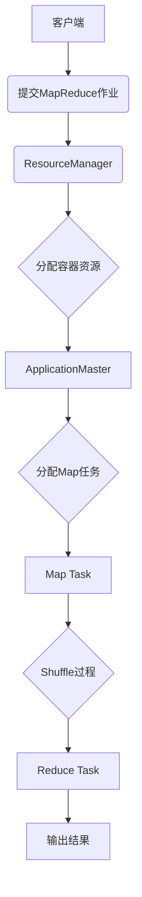

# Hadoop 原理与代码实例讲解

## 1.背景介绍

### 1.1 大数据时代的到来

随着互联网、移动互联网、物联网等新兴技术的快速发展,海量的结构化和非结构化数据不断涌现,传统的数据存储和处理方式已经无法满足日益增长的数据处理需求。大数据时代的到来,对数据存储、处理和分析提出了更高的要求,迫切需要一种全新的数据处理架构和技术。

### 1.2 Hadoop 的诞生

Hadoop 是一个由 Apache 基金会所开发的分布式系统基础架构,最初是为了实现谷歌的 GFS(Google File System)和 MapReduce 计算模型而创建的开源项目。它可以通过简单的编程模型,在大规模集群上分布式地存储和处理海量数据。Hadoop 的核心设计理念是:移动计算而非数据,可以在廉价的商用硬件上构建高可靠、高可用的分布式系统。

### 1.3 Hadoop 生态圈

随着 Hadoop 的不断发展和完善,围绕 Hadoop 衍生出了一个庞大的生态圈,包括分布式文件系统 HDFS、资源协调与作业调度框架 YARN、数据处理模型 MapReduce、HBase 分布式数据库、Hive 数据仓库等多种工具和组件。这些工具和组件共同构建了一个强大的大数据处理平台,能够满足海量数据存储、处理和分析的各种需求。

## 2.核心概念与联系



Hadoop 的核心概念主要包括 HDFS、YARN 和 MapReduce 三个部分,它们相互关联、相互依赖,共同构建了 Hadoop 分布式计算框架。

### 2.1 HDFS

HDFS(Hadoop Distributed File System)是一个高度容错的分布式文件系统,它是 Hadoop 的核心组件之一,主要负责海量数据的存储。HDFS 采用主从架构,由一个 NameNode(名称节点)和多个 DataNode(数据节点)组成。NameNode 负责管理文件系统的元数据,而 DataNode 负责实际存储数据块。

#### 2.1.1 HDFS 设计目标

- 高容错性:通过数据块的多副本机制,实现高可靠性。
- 高吞吐量:支持数据的批量读写操作,适合一次性读写大文件。
- 大规模扩展:可以通过简单地增加节点来扩展存储能力。

#### 2.1.2 HDFS 文件块

HDFS 将文件切分成一个个块(Block),并将这些块存储在不同的 DataNode 上。每个块都可以有多个副本,以提高容错性和可用性。默认情况下,HDFS 会为每个块存储 3 个副本。

### 2.2 YARN

YARN(Yet Another Resource Negotiator)是 Hadoop 的资源管理和作业调度框架,负责集群资源的统一管理和调度。YARN 由 ResourceManager、NodeManager、ApplicationMaster 和 Container 等组件组成。

#### 2.2.1 ResourceManager

ResourceManager 是 YARN 的主要协调者,负责接收作业请求、监控集群资源使用情况,并为应用程序分配资源。

#### 2.2.2 NodeManager

NodeManager 运行在每个节点上,负责管理节点上的资源,监控资源使用情况,并定期向 ResourceManager 发送心跳信号和状态报告。

#### 2.2.3 ApplicationMaster

ApplicationMaster 是每个应用程序的协调者,负责向 ResourceManager 申请资源,并监控应用程序的执行情况。

#### 2.2.4 Container

Container 是 YARN 中的资源抽象,表示一个可以运行任务的资源容器,包括 CPU、内存等资源。

### 2.3 MapReduce

MapReduce 是 Hadoop 分布式计算的核心模型,它将计算过程分为两个阶段:Map 阶段和 Reduce 阶段。

#### 2.3.1 Map 阶段

Map 阶段将输入的数据集切分为多个数据块,并对每个数据块进行处理,生成中间结果。

#### 2.3.2 Reduce 阶段

Reduce 阶段将 Map 阶段产生的中间结果进行合并和处理,得到最终的计算结果。

#### 2.3.3 MapReduce 编程模型

MapReduce 提供了一种简单的编程模型,用户只需要编写 Map 函数和 Reduce 函数,就可以在 Hadoop 集群上并行处理海量数据。

## 3.核心算法原理具体操作步骤

### 3.1 HDFS 写数据流程



1. 客户端向 NameNode 发送写数据请求。
2. NameNode 检查文件是否已存在,如果存在则分配新的数据块,否则创建文件记录。
3. NameNode 选择合适的 DataNode 节点存储数据块。
4. 客户端将数据块写入选定的 DataNode。
5. DataNode 返回写入状态给客户端。
6. 客户端通知 NameNode 写入完成,NameNode 更新元数据。

### 3.2 MapReduce 执行流程



1. 客户端向 ResourceManager 提交 MapReduce 作业。
2. ResourceManager 分配容器资源,启动 ApplicationMaster。
3. ApplicationMaster 向 ResourceManager 申请资源,分配 Map 任务。
4. Map Task 读取输入数据,并执行 Map 函数,生成中间结果。
5. 中间结果经过 Shuffle 过程,分发给 Reduce Task。
6. Reduce Task 对中间结果执行 Reduce 函数,生成最终输出结果。

## 4.数学模型和公式详细讲解举例说明

在 Hadoop 中,数据块的副本放置策略采用了一种数学模型,用于确保数据的可靠性和可用性。这个模型被称为"备份节点放置选择"(Backup Node Placement)。

假设我们有一个文件 F,大小为 B 字节,需要存储在 HDFS 中。HDFS 将文件切分成 n 个数据块,每个数据块的大小为 b 字节,并为每个数据块存储 r 个副本。我们需要确定每个副本的存储位置,以最大程度地提高数据的可靠性和可用性。

### 4.1 数据块副本放置策略

HDFS 采用以下策略来确定数据块副本的存储位置:

1. 将第一个副本存储在与客户端最近的 DataNode 上,以减少写入时的网络开销。
2. 将第二个副本存储在与第一个副本不同的机架上,以提高容错性。
3. 将第三个副本存储在与前两个副本不同的机架上,以进一步提高容错性。

这种策略可以用以下数学模型表示:

$$
\begin{align}
\min_{x_1, x_2, \ldots, x_n} & \sum_{i=1}^n \sum_{j=1}^r d(x_i, y_{ij}) \\
\text{s.t.} & \sum_{j=1}^r y_{ij} = 1, \quad \forall i \\
& y_{ij} \in \{0, 1\}, \quad \forall i, j \\
& \sum_{i=1}^n y_{ij} \leq 1, \quad \forall j \\
& \sum_{j \in R_k} y_{ij} \leq \lfloor \frac{r}{2} \rfloor, \quad \forall i, k
\end{align}
$$

其中:

- $x_i$ 表示数据块 $i$ 的存储位置。
- $y_{ij}$ 是一个二元变量,表示数据块 $i$ 的第 $j$ 个副本是否存储在位置 $x_i$。
- $d(x_i, y_{ij})$ 表示数据块 $i$ 的第 $j$ 个副本与客户端之间的距离。
- $R_k$ 表示第 $k$ 个机架上的所有节点。

目标函数是最小化所有数据块副本与客户端之间的总距离。约束条件包括:

1. 每个数据块必须有 $r$ 个副本。
2. 每个副本只能存储在一个位置。
3. 每个位置最多只能存储一个副本。
4. 每个机架上最多只能存储 $\lfloor \frac{r}{2} \rfloor$ 个副本,以提高容错性。

通过求解这个优化问题,我们可以得到每个数据块副本的最优存储位置,从而实现数据的高可靠性和高可用性。

### 4.2 示例

假设我们有一个文件 F,大小为 1TB,需要存储在 HDFS 中。HDFS 将文件切分成 1000 个数据块,每个数据块大小为 1GB,并为每个数据块存储 3 个副本。我们有 10 个机架,每个机架上有 10 个节点。

根据上述数学模型,我们可以求解出每个数据块副本的最优存储位置。例如,对于第一个数据块,其三个副本可以分别存储在以下位置:

- 第一个副本存储在与客户端最近的节点上,假设为机架 1 上的节点 1。
- 第二个副本存储在与第一个副本不同的机架上,假设为机架 2 上的节点 1。
- 第三个副本存储在与前两个副本不同的机架上,假设为机架 3 上的节点 1。

通过这种方式,我们可以最大程度地提高数据的可靠性和可用性,同时也满足了数据局部性的要求,从而提高了整体系统的性能。

## 5.项目实践:代码实例和详细解释说明

在本节中,我们将通过一个简单的 WordCount 示例,演示如何在 Hadoop 上使用 MapReduce 进行数据处理。

### 5.1 WordCount 需求

WordCount 是一个经典的 MapReduce 示例程序,它的目标是统计给定文本文件中每个单词出现的次数。输入是一个或多个文本文件,输出是每个单词及其出现次数。

### 5.2 MapReduce 实现

#### 5.2.1 Map 函数

Map 函数的输入是一行文本,输出是一个键值对列表,其中键是单词,值是 1(表示出现一次)。

```java
public static class TokenizerMapper extends Mapper<Object, Text, Text, IntWritable> {
    private final static IntWritable one = new IntWritable(1);
    private Text word = new Text();

    public void map(Object key, Text value, Context context) throws IOException, InterruptedException {
        StringTokenizer itr = new StringTokenizer(value.toString());
        while (itr.hasMoreTokens()) {
            word.set(itr.nextToken());
            context.write(word, one);
        }
    }
}
```

#### 5.2.2 Reduce 函数

Reduce 函数的输入是 Map 函数输出的键值对列表,其中键是单词,值是一个列表,表示该单词出现的次数。Reduce 函数将这些值相加,得到单词的总出现次数。

```java
public static class IntSumReducer extends Reducer<Text, IntWritable, Text, IntWritable> {
    private IntWritable result = new IntWritable();

    public void reduce(Text key, Iterable<IntWritable> values, Context context) throws IOException, InterruptedException {
        int sum = 0;
        for (IntWritable val : values) {
            sum += val.get();
        }
        result.set(sum);
        context.write(key, result);
    }
}
```

#### 5.2.3 主程序

主程序设置 MapReduce 作业的输入路径、输出路径,并指定 Map 和 Reduce 函数的类。

```java
public static void main(String[] args) throws Exception {
    Configuration conf = new Configuration();
    Job job = Job.getInstance(conf, "word count");
    job.setJar