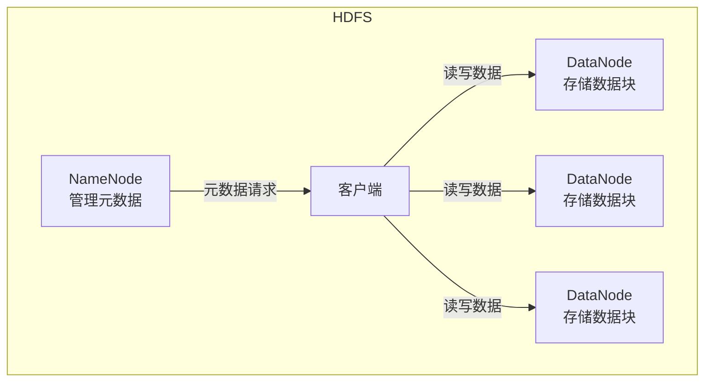
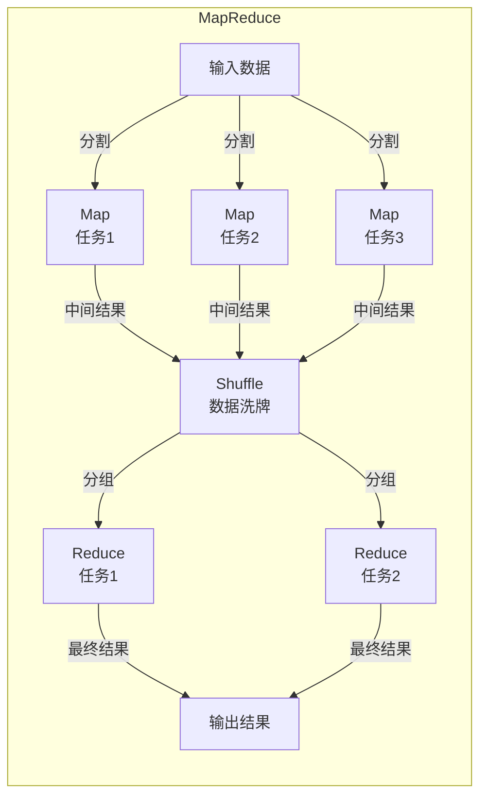
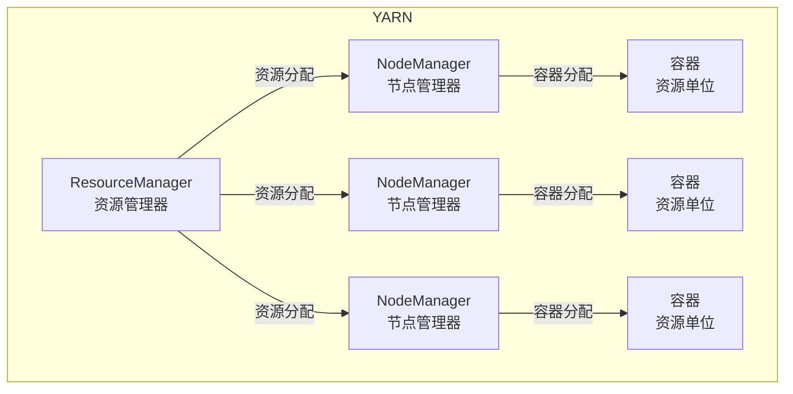

# Hadoop行业解决方案与行业趋势

## 1.背景介绍

在当今大数据时代,数据已经成为企业最宝贵的资产之一。随着数据量的不断增长,传统的数据处理方式已经无法满足企业对大数据处理的需求。这种需求的出现,催生了Hadoop这一革命性的大数据处理平台。

Hadoop是一个开源的分布式系统基础架构,最初由Apache软件基金会开发。它从设计之初就考虑了大规模数据的存储和处理问题,能够在廉价的计算机集群上运行,并提供高可靠性、高可用性、高可扩展性和高性能的数据处理能力。

Hadoop的核心设计理念是将大量的小文件存储为一个序列化的数据流,并将这些数据流分布到集群的不同节点进行存储和处理。它采用了主从架构,主节点负责任务调度,从节点负责执行具体的任务。这种松耦合的设计使得Hadoop具有很强的容错性和可扩展性。

### Hadoop生态圈

Hadoop不仅仅是一个单一的系统,它实际上是一个由多个子项目组成的生态系统,主要包括以下几个核心组件:

- **HDFS**(Hadoop Distributed File System):一个高度容错的分布式文件系统,用于存储大规模数据。
- **MapReduce**:一种编程模型,用于大规模数据集的并行处理。
- **YARN**(Yet Another Resource Negotiator):一个资源管理和任务调度系统。
- **Hive**:一种基于SQL的数据仓库工具,用于大数据的查询和分析。
- **HBase**:一种分布式、面向列的数据库,用于实时读写访问大规模数据。
- **Spark**:一种快速、通用的大规模数据处理引擎。
- **Kafka**:一种高吞吐量的分布式发布订阅消息系统。

这些组件共同构建了Hadoop的生态系统,为企业提供了一站式的大数据解决方案。

## 2.核心概念与联系

Hadoop的核心概念主要包括HDFS、MapReduce和YARN。它们之间存在着紧密的联系和依赖关系。

### HDFS

HDFS是Hadoop分布式文件系统的核心组件,主要用于存储大规模数据。它采用主从架构,由一个NameNode(名称节点)和多个DataNode(数据节点)组成。

NameNode负责管理文件系统的元数据,如文件的目录结构、文件的位置等。而DataNode则负责实际存储文件数据块。当客户端需要访问文件时,首先会向NameNode请求元数据信息,然后直接从DataNode读取或写入数据。

为了提高可靠性,HDFS采用了数据块的复制机制。每个数据块会复制多份,分布存储在不同的DataNode上。即使某个DataNode发生故障,其他DataNode上的副本也能保证数据的可用性。

### MapReduce

MapReduce是Hadoop中用于大规模数据并行处理的编程模型。它将计算过程分为两个阶段:Map阶段和Reduce阶段。

Map阶段负责将输入数据分割成多个数据块,并对每个数据块进行处理,生成中间结果。Reduce阶段则负责对Map阶段的输出结果进行汇总和处理,得到最终结果。

MapReduce的设计理念是"把大象放进冰箱",即将大规模的数据处理任务分解成多个小任务,并行执行在不同的节点上。这种分而治之的思路,使得MapReduce能够高效地处理海量数据。

### YARN

YARN是Hadoop的资源管理和任务调度系统,主要负责管理集群资源和调度任务的执行。

YARN采用主从架构,由一个ResourceManager(资源管理器)和多个NodeManager(节点管理器)组成。ResourceManager负责整个集群的资源管理和任务调度,而NodeManager则负责管理单个节点上的资源和任务执行。

当用户提交作业时,ResourceManager会根据集群的资源情况,为该作业分配合适的容器(Container)。容器是YARN中表示资源的基本单位,包括CPU、内存等资源。作业的任务会在分配的容器中执行。

YARN的设计使得Hadoop能够高效地利用集群资源,并支持多种计算框架,如MapReduce、Spark等。

## 3.核心算法原理具体操作步骤

Hadoop的核心算法原理主要体现在HDFS和MapReduce两个方面。

### HDFS算法原理

HDFS采用了主从架构和数据块复制机制,以保证数据的可靠性和高可用性。其核心算法原理如下:

1. **数据块存储**:HDFS将文件切分成多个数据块(默认128MB),并将这些数据块分布存储在不同的DataNode上。

2. **数据块复制**:为了提高容错性,每个数据块会复制多份(默认3份),分布存储在不同的DataNode上。

3. **数据块放置策略**:HDFS采用了一种智能的数据块放置策略,尽量将数据块复制到不同的机架上,以避免单点故障导致数据丢失。

4. **心跳检测和副本重新平衡**:NameNode会定期接收DataNode的心跳信号,以检测节点的存活状态。如果某个DataNode失效,NameNode会启动数据块的复制过程,将缺失的副本复制到其他DataNode上,以保证数据的可靠性。

5. **元数据管理**:NameNode负责管理整个文件系统的元数据,包括文件目录结构、文件位置、数据块位置等。为了提高性能,NameNode会将元数据缓存在内存中。

6. **读写操作**:客户端读取文件时,首先向NameNode请求文件的元数据信息,然后直接从DataNode读取数据块。写入文件时,客户端会先将数据块写入DataNode,然后通知NameNode更新元数据。

### MapReduce算法原理

MapReduce是Hadoop中用于大规模数据并行处理的编程模型,其核心算法原理如下:

1. **输入数据分割**:MapReduce会将输入数据切分成多个数据块(默认128MB),并将这些数据块分发给不同的Map任务进行处理。

2. **Map阶段**:每个Map任务会对分配的数据块进行处理,生成中间结果(Key-Value对)。

3. **Shuffle阶段**:MapReduce会对Map阶段的输出结果进行洗牌(Shuffle),将相同Key的数据分组,并分发给不同的Reduce任务。

4. **Reduce阶段**:每个Reduce任务会对分配的数据组进行处理,生成最终结果。

5. **容错机制**:MapReduce采用了容错机制,如果某个任务失败,它会自动重新执行该任务,以保证计算的正确性。

6. **任务调度**:MapReduce会根据集群的资源情况,动态地调度Map和Reduce任务的执行,以充分利用集群资源。

7. **数据本地化**:MapReduce会尽量将任务调度到存储输入数据的节点上执行,以减少数据传输开销。

8. **结果输出**:最终结果会写入HDFS或其他存储系统中,供用户访问和分析。

## 4.数学模型和公式详细讲解举例说明

在Hadoop的设计和实现中,涉及到了一些数学模型和公式,用于优化系统性能和资源利用率。下面将详细讲解其中几个关键的数学模型和公式。

### 数据块放置策略

HDFS采用了一种智能的数据块放置策略,以提高数据可靠性和读写性能。该策略的核心思想是尽量将数据块复制到不同的机架上,以避免单点故障导致数据丢失。

假设我们有一个文件F,大小为S,需要将其切分成n个数据块,每个数据块大小为b,并复制r份。那么,数据块的总数量为:

$$
N = n \times r
$$

HDFS会尽量将这N个数据块分布在不同的机架上,以提高容错性。具体来说,对于第i个数据块,HDFS会按照以下优先级进行放置:

1. 优先将数据块放置在本地节点上,以减少网络开销。
2. 如果本地节点没有足够的空间,则将数据块放置在同一机架的其他节点上。
3. 如果同一机架的节点也没有足够的空间,则将数据块放置在其他机架的节点上。

这种放置策略可以用一个代价函数来表示:

$$
\text{Cost} = \sum_{i=1}^{N} \sum_{j=1}^{r} c_{ij}
$$

其中,c_{ij}表示将第i个数据块的第j个副本放置在当前位置的代价。代价值越小,表示该放置方案越优。

HDFS会尽量minimizeize这个代价函数,以找到最优的数据块放置方案。

### 任务调度算法

MapReduce采用了一种基于资源的任务调度算法,以充分利用集群资源,提高作业执行效率。

假设我们有一个作业J,需要执行m个Map任务和r个Reduce任务。集群中有n个节点,每个节点的资源容量为c(CPU、内存等)。我们需要为每个任务分配合适的资源,以minimizeize作业的总执行时间。

这个问题可以建模为一个优化问题:

$$
\begin{align*}
\text{minimize} &\quad T \\
\text{subject to} &\quad \sum_{i=1}^{m} x_{ij} \leq c_j, \quad j = 1, \dots, n \\
                &\quad \sum_{i=1}^{r} y_{ij} \leq c_j, \quad j = 1, \dots, n \\
                &\quad x_{ij}, y_{ij} \in \{0, 1\}, \quad i = 1, \dots, m, j = 1, \dots, n
\end{align*}
$$

其中,T表示作业的总执行时间,x_{ij}和y_{ij}分别表示将第i个Map任务和第i个Reduce任务分配给第j个节点。

这个优化问题的目标是minimizeize作业的总执行时间T,同时满足每个节点的资源约束。MapReduce会根据这个模型,为每个任务分配合适的资源,以提高作业执行效率。

### 数据本地化

MapReduce采用了数据本地化策略,尽量将任务调度到存储输入数据的节点上执行,以减少数据传输开销。

假设我们有一个Map任务M,需要处理一个输入数据块D,大小为s。如果将M调度到存储D的节点N上执行,则不需要进行数据传输,执行时间为t_1。如果将M调度到其他节点上执行,则需要先将D传输过去,