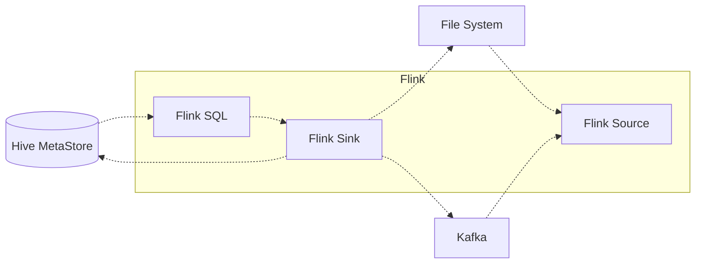

# Hive-Flink整合原理与代码实例讲解

## 1.背景介绍
### 1.1 大数据处理的需求与挑战
在当今大数据时代,企业面临着海量数据的存储、处理和分析的巨大挑战。传统的数据处理方式已经无法满足实时性、高吞吐量和低延迟的需求。因此,整合大数据生态系统中的各种工具和框架,构建高效的数据处理管道,成为了大数据工程师的重要任务。

### 1.2 Hive与Flink的优势互补
Hive作为一个基于Hadoop的数据仓库工具,提供了类SQL的查询语言HiveQL,方便用户进行数据的ETL和分析。但是Hive基于MapReduce的批处理机制,在实时计算和流式处理方面存在局限性。

Flink是一个优秀的分布式流处理框架,具有低延迟、高吞吐、exactly-once语义保证等特点。Flink提供了DataStream和DataSet API,支持流处理和批处理。

将Hive与Flink整合,可以发挥两者的优势,实现离线数据分析与实时计算的无缝衔接。用户可以使用Hive进行数据的存储和ETL,然后使用Flink消费Hive中的数据进行实时计算,并将结果写回Hive或其他存储系统。

## 2.核心概念与联系
### 2.1 Hive的核心概念
- Table:Hive中的二维表,由行和列组成。
- Partition:表的分区,可以根据某些列的值将表水平切分为不同的部分。
- Bucket:表的分桶,可以根据某些列的hash值将表垂直切分为不同的部分。
- MetaStore:Hive的元数据存储,记录了表、分区、列等schema信息。

### 2.2 Flink的核心概念 
- DataStream:Flink中的核心抽象,代表一个持续的数据流。
- DataSet:Flink中的另一个核心抽象,代表一个有界的数据集合。
- Operator:Flink中的算子,对DataStream或DataSet执行转换操作。
- Connector:Flink中的连接器,用于读取和写入外部数据源。

### 2.3 Hive与Flink的交互
Flink提供了HiveCatalog,可以将Hive中的表映射为Flink中的Table对象。Flink SQL支持直接查询Hive表,也可以将查询结果写入Hive。同时,Flink还提供了Streaming Hive Sink,可以将流式数据写入Hive表。

下图展示了Hive与Flink的整合架构:



## 3.核心算法原理与具体操作步骤
### 3.1 Hive与Flink的连接建立
1. 在Hive中创建表并导入数据
2. 在Flink中创建HiveCatalog,指定Hive MetaStore的地址
3. 在Flink中注册HiveCatalog,将Hive表映射为Flink Table

### 3.2 Flink SQL查询Hive数据
1. 在Flink SQL中直接引用Hive表名
2. 编写SQL语句,执行查询、转换等操作
3. 将结果输出到Flink的DataStream或DataSet中

### 3.3 Flink Streaming写入Hive
1. 创建Hive Streaming Sink,指定目标表名和分区信息
2. 将Flink DataStream通过Sink写入Hive
3. 数据以追加的方式写入Hive表或分区

## 4.数学模型和公式详解
### 4.1 Hive表的数据模型
Hive采用类似关系型数据库的数据模型,一个表可以表示为一个二维矩阵:

$$
\begin{bmatrix}
row_1 & value_{11} & \cdots & value_{1n} \\
row_2 & value_{21} & \cdots & value_{2n} \\
\vdots & \vdots & \ddots & \vdots \\
row_m & value_{m1} & \cdots & value_{mn}
\end{bmatrix}
$$

其中,每一行代表一条记录,每一列代表一个字段。

### 4.2 Flink DataStream的数据模型
Flink DataStream可以看作是一个无限的数据序列:

$stream = \{e_1, e_2, \cdots, e_n, \cdots \}$

每个元素$e_i$代表一个事件或记录,包含多个字段:

$e_i = \{f_1, f_2, \cdots, f_k\}$

### 4.3 Flink SQL的关系代数
Flink SQL基于关系代数,支持常见的关系操作符:

- Selection: $\sigma_{condition}(R)$
- Projection: $\pi_{attribute}(R)$
- Join: $R \bowtie_{condition} S$
- Aggregation: $\gamma_{aggregate}(R)$

通过组合这些操作符,可以完成复杂的数据查询和转换。

## 5.项目实践:代码实例和详解
下面通过一个具体的代码实例,演示如何在Flink中整合Hive进行数据处理。

### 5.1 在Hive中创建表并导入数据
```sql
-- 创建Hive表
CREATE TABLE user_behavior (
  user_id STRING,
  item_id STRING, 
  category_id STRING,
  behavior STRING,
  ts TIMESTAMP
) PARTITIONED BY (dt STRING);

-- 导入数据到Hive表
LOAD DATA INPATH '/path/to/data' 
INTO TABLE user_behavior PARTITION (dt='2022-01-01');
```

### 5.2 在Flink中创建HiveCatalog
```java
// 创建HiveCatalog
HiveCatalog hiveCatalog = new HiveCatalog("hive", null, "/path/to/hive-conf");

// 注册HiveCatalog 
tableEnv.registerCatalog("hive", hiveCatalog);

// 使用HiveCatalog
tableEnv.useCatalog("hive");
```

### 5.3 使用Flink SQL查询Hive数据
```java
// 指定查询的默认数据库
tableEnv.useDatabase("default");

// 查询Hive表
Table resultTable = tableEnv.sqlQuery(
  "SELECT user_id, COUNT(item_id) AS item_count " +
  "FROM user_behavior " + 
  "WHERE behavior = 'buy' " +
  "GROUP BY user_id"
);

// 将查询结果转换为DataStream
DataStream<Row> resultStream = tableEnv.toDataStream(resultTable);

// 打印结果
resultStream.print();
```

### 5.4 使用Flink Streaming写入Hive
```java
// 创建Hive Streaming Sink
StreamingFileSink<Row> sink = StreamingFileSink
  .forRowFormat(
    new Path("/path/to/hive/warehouse/user_behavior_agg"),
    new SimpleStringEncoder<Row>("UTF-8")
  )
  .withBucketAssigner(new DateTimeBucketAssigner("dt"))
  .build();

// 将DataStream写入Hive
resultStream
  .map(row -> row.toString())
  .addSink(sink);
```

以上代码实现了从Hive表中读取用户行为数据,统计每个用户的购买商品数量,并将聚合结果写回Hive的分区表中。

## 6.实际应用场景
Hive与Flink的整合在实际的大数据应用中有广泛的应用场景,例如:

- 电商场景:将用户的点击、浏览、购买等行为日志存储在Hive中,使用Flink进行实时的用户行为分析、推荐系统等。

- 物联网场景:将传感器采集的海量数据存储在Hive中,使用Flink进行实时的异常检测、预测性维护等。

- 金融场景:将交易、行情等数据存储在Hive中,使用Flink进行实时的风险控制、反欺诈等。

通过Hive与Flink的整合,可以实现离线数据分析与实时计算的无缝衔接,充分发挥大数据的价值。

## 7.工具和资源推荐
- Hive官方文档:https://cwiki.apache.org/confluence/display/Hive/Home
- Flink官方文档:https://ci.apache.org/projects/flink/flink-docs-stable/
- Flink中文社区:https://flink-china.org/
- 《Hive编程指南》:对Hive进行全面深入的讲解的书籍
- 《Flink原理与实践》:系统介绍Flink原理和应用的书籍

## 8.总结:未来发展趋势与挑战
Hive与Flink的整合是大数据生态系统发展的必然趋势,它们的结合可以实现数据处理的批流一体化。未来,我们可以期待:

- Hive和Flink在SQL方面的进一步统一和优化,提供更加一致的SQL语义。
- Flink对Hive的连接器和Catalog的增强,支持更多的Hive特性和优化。
- 基于Hive和Flink构建统一的数据湖方案,实现数据的管理、存储和计算。

同时,Hive与Flink的整合也面临一些挑战:

- 数据一致性:如何保证Hive与Flink之间数据的一致性和正确性。
- 性能优化:如何优化Hive与Flink之间的数据传输和计算性能。
- 元数据管理:如何统一管理Hive与Flink的元数据,实现无缝衔接。

相信通过社区的共同努力,Hive与Flink的整合将不断成熟和完善,为大数据处理带来更多的可能性。

## 9.附录:常见问题与解答
### Q1:Hive与Flink适合哪些场景?
A1:Hive适合离线数据分析、数据仓库搭建等批处理场景;Flink适合实时计算、流式处理等低延迟场景。将Hive作为数据源,Flink作为计算引擎,可以实现批流一体化的数据处理。

### Q2:Flink SQL与HiveQL的区别是什么?
A2:Flink SQL是基于Apache Calcite的标准SQL,支持更多的关系操作符和函数;而HiveQL是Hive自己的SQL方言,语法与标准SQL有一定差异。但是Flink SQL也支持读写Hive表,因此可以与HiveQL兼容。

### Q3:Hive与Flink整合时的注意事项有哪些?
A3:整合时需要注意:
- Hive和Flink版本的兼容性,选择匹配的版本。
- Hive MetaStore的配置,确保Flink能够正确连接。
- 表名和字段名的一致性,避免大小写敏感等问题。
- 数据类型的映射,确保Hive和Flink的数据类型匹配。
- 分区和分桶的设置,合理利用Hive的特性优化Flink作业。

作者：禅与计算机程序设计艺术 / Zen and the Art of Computer Programming