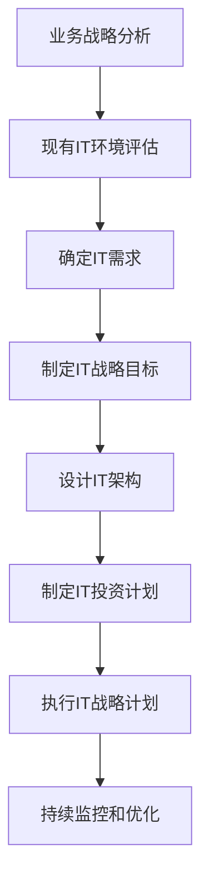

# IT战略规划：制定并执行与公司业务目标相一致的IT战略计划

## 1.背景介绍

### 1.1 IT战略规划的重要性

在当今快节奏的商业环境中，信息技术(IT)已经成为推动企业发展和创新的关键力量。有效的IT战略规划对于确保IT投资与企业的总体业务目标保持一致至关重要。它有助于优化资源分配、提高运营效率、降低成本并增强竞争优势。

### 1.2 IT战略规划的挑战

制定一个与业务目标相一致的IT战略并非一蹴而就。企业需要权衡多种因素,包括现有IT基础设施、新兴技术趋势、预算限制、人力资源等。此外,IT战略规划需要与各部门密切协作,以确保IT解决方案能够满足不同业务需求。

### 1.3 IT战略规划的目标

一个有效的IT战略规划应该实现以下目标:

- 确保IT投资与企业整体战略目标保持一致
- 优化IT资源分配,提高投资回报率
- 提高运营效率,降低IT成本
- 识别和利用新兴技术来获取竞争优势
- 建立灵活的IT架构,以适应不断变化的业务需求

## 2.核心概念与联系

### 2.1 业务战略

业务战略是企业实现长期目标的总体规划,包括市场定位、产品组合、财务目标等。IT战略必须与业务战略紧密相连,为业务战略的实现提供技术支持。

### 2.2 IT治理

IT治理是一种确保IT投资与企业目标保持一致的框架。它包括决策权限、问责制度、监控和评估机制等。有效的IT治理有助于确保IT战略规划的执行。

### 2.3 IT架构

IT架构是指企业的IT基础设施、应用程序和数据的总体设计。一个灵活、可扩展的IT架构对于支持不断变化的业务需求至关重要。IT战略规划应该考虑现有IT架构的局限性,并提出优化和升级的计划。

### 2.4 IT投资组合管理

IT投资组合管理是指对企业的IT投资进行优先排序、评估和管理的过程。它有助于确保IT投资与业务目标保持一致,并实现最大化的投资回报。

## 3.核心算法原理具体操作步骤

制定并执行与公司业务目标相一致的IT战略规划涉及以下关键步骤:



### 3.1 业务战略分析

首先需要全面分析企业的业务战略,包括市场定位、产品组合、财务目标等。了解业务战略有助于确保IT战略与之保持一致。

### 3.2 现有IT环境评估

接下来,需要评估企业现有的IT基础设施、应用程序和数据架构。识别现有IT环境的优势和局限性,有助于制定合理的IT战略计划。

### 3.3 确定IT需求

根据业务战略和现有IT环境评估,确定企业的IT需求。这包括支持新业务流程的应用程序、提高运营效率的系统、加强安全性和合规性的措施等。

### 3.4 制定IT战略目标

基于确定的IT需求,制定IT战略目标。这些目标应该与企业的整体业务目标保持一致,并具有可衡量的指标。

### 3.5 设计IT架构

设计一个灵活、可扩展的IT架构,以支持当前和未来的业务需求。这可能涉及升级现有系统、采用新技术或重构整个IT基础设施。

### 3.6 制定IT投资计划

根据IT战略目标和架构设计,制定IT投资计划。这包括确定所需资源、优先排序项目、分配预算等。

### 3.7 执行IT战略计划

一旦IT战略计划制定完成,即可开始执行。这可能涉及采购新硬件和软件、实施新系统、培训员工等。

### 3.8 持续监控和优化

在执行IT战略计划的过程中,需要持续监控进展情况,并根据需要进行调整和优化。这有助于确保IT投资与业务目标保持一致,并实现预期的回报。

## 4.数学模型和公式详细讲解举例说明

在IT战略规划过程中,可以使用一些数学模型和公式来支持决策和优化。以下是一些常见的模型和公式:

### 4.1 投资回报率 (ROI)

投资回报率是评估IT投资效益的关键指标之一。它可以用以下公式计算:

$$ROI = \frac{投资收益 - 投资成本}{投资成本} \times 100\%$$

例如,如果一个新系统的实施成本为100万美元,预计在5年内可以节省200万美元的运营成本,则该项目的ROI为:

$$ROI = \frac{200万 - 100万}{100万} \times 100\% = 100\%$$

### 4.2 总拥有成本 (TCO)

总拥有成本是指在一个系统或解决方案的整个生命周期内所需的全部直接和间接成本。它可以用以下公式计算:

$$TCO = 购买成本 + 实施成本 + 运营成本 + 支持成本 + 退役成本$$

例如,如果一个新系统的购买成本为50万美元,实施成本为20万美元,预计5年运营成本为100万美元,支持成本为30万美元,退役成本为10万美元,则该系统的TCO为:

$$TCO = 50万 + 20万 + 100万 + 30万 + 10万 = 210万美元$$

### 4.3 投资组合优化

在IT投资组合管理中,可以使用数学优化模型来确定最佳的投资组合。一种常见的模型是基于风险和回报的均值-方差优化模型,它可以用以下公式表示:

$$\max_{w} \mu_p - \lambda \sigma_p^2$$
$$\text{s.t.} \sum_{i=1}^n w_i = 1, w_i \geq 0$$

其中:
- $\mu_p$ 是投资组合的预期回报
- $\sigma_p^2$ 是投资组合的方差(风险)
- $\lambda$ 是风险厌恶系数,反映了决策者对风险的偏好
- $w_i$ 是第i个项目在投资组合中的权重

通过解决这个优化问题,可以确定在给定风险水平下获得最大预期回报的投资组合,或在给定预期回报下获得最小风险的投资组合。

## 5.项目实践:代码实例和详细解释说明

在IT战略规划过程中,可以使用各种工具和技术来支持决策和执行。以下是一些常见的代码实例:

### 5.1 IT资产管理系统

IT资产管理系统用于跟踪和管理企业的IT资产,包括硬件、软件和服务。以下是一个使用Python和SQLite实现的简单示例:

```python
import sqlite3

# 连接到SQLite数据库
conn = sqlite3.connect('it_assets.db')
c = conn.cursor()

# 创建表
c.execute('''CREATE TABLE IF NOT EXISTS assets
             (id INTEGER PRIMARY KEY, name TEXT, category TEXT, purchase_date DATE, cost REAL)''')

# 插入数据
c.execute("INSERT INTO assets (name, category, purchase_date, cost) VALUES ('Dell Laptop', 'Hardware', '2022-01-15', 1500.0)")
c.execute("INSERT INTO assets (name, category, purchase_date, cost) VALUES ('Microsoft Office', 'Software', '2022-03-01', 500.0)")

# 查询数据
c.execute("SELECT * FROM assets")
print(c.fetchall())

# 提交并关闭连接
conn.commit()
conn.close()
```

这个示例创建了一个名为`assets`的表,用于存储IT资产的详细信息。可以使用SQL语句插入、查询和更新数据。

### 5.2 IT项目管理工具

IT项目管理工具用于跟踪和协调IT项目的进度、任务和资源分配。以下是一个使用Python和Trello API实现的简单示例:

```python
import os
from trello import TrelloClient

# 初始化Trello客户端
client = TrelloClient(
    api_key=os.environ.get('TRELLO_API_KEY'),
    token=os.environ.get('TRELLO_TOKEN')
)

# 创建新的项目板
board = client.add_board('IT Strategy Implementation')

# 添加列表
todo_list = board.add_list('To Do')
doing_list = board.add_list('Doing')
done_list = board.add_list('Done')

# 添加任务卡片
todo_list.add_card('Upgrade network infrastructure')
doing_list.add_card('Implement new CRM system')
done_list.add_card('Deploy cloud storage solution')
```

这个示例使用Trello API创建了一个新的项目板,并添加了三个列表(`To Do`、`Doing`和`Done`)和一些示例任务卡片。可以使用Trello的Web界面或API进一步管理和跟踪项目进度。

### 5.3 IT投资组合优化

以下是一个使用Python和Pyomo库实现投资组合优化的示例:

```python
from pyomo.environ import *

# 创建模型
model = ConcreteModel()

# 定义项目集合
model.projects = Set(initialize=['A', 'B', 'C', 'D'])

# 定义参数
model.returns = Param(model.projects, initialize={'A': 0.15, 'B': 0.12, 'C': 0.18, 'D': 0.10})
model.risks = Param(model.projects, initialize={'A': 0.20, 'B': 0.15, 'C': 0.25, 'D': 0.12})
model.budgets = Param(model.projects, initialize={'A': 50000, 'B': 80000, 'C': 120000, 'D': 70000})
model.total_budget = Param(initialize=200000)

# 定义决策变量
model.x = Var(model.projects, domain=Binary)

# 定义目标函数
model.obj = Objective(expr=sum(model.returns[p] * model.x[p] for p in model.projects), sense=maximize)

# 定义约束条件
model.budget_constraint = Constraint(expr=sum(model.budgets[p] * model.x[p] for p in model.projects) <= model.total_budget)

# 求解模型
solver = SolverFactory('glpk')
solver.solve(model)

# 输出结果
print('Selected projects:')
for p in model.projects:
    if model.x[p].value == 1:
        print(p)
```

这个示例使用Pyomo库建立了一个整数规划模型,用于选择一组最优的IT项目,以最大化投资回报并满足总预算约束。可以根据需要调整目标函数和约束条件,以适应不同的优化场景。

## 6.实际应用场景

IT战略规划在各种行业和组织中都有广泛的应用。以下是一些典型的应用场景:

### 6.1 制造业

制造企业通常需要大量的IT投资来支持生产流程、供应链管理和产品创新。有效的IT战略规划可以确保这些投资与企业的整体目标保持一致,如提高生产效率、降低成本、缩短上市时间等。

### 6.2 金融服务

金融机构需要高度安全和可靠的IT系统来处理敏感的金融数据和交易。IT战略规划可以帮助确定合适的技术解决方案,如云计算、大数据分析和人工智能,以提高运营效率、加强风险管理和改善客户体验。

### 6.3 零售业

随着电子商务的快速发展,零售企业需要建立强大的在线销售和营销能力。IT战略规划可以帮助零售商选择合适的电子商务平台、客户关系管理系统和数据分析工具,以提高销售额、改善客户体验和优化供应链。

### 6.4 医疗保健

医疗保健行业需要高度集成的IT系统来管理电子健康记录、远程医疗服务和医疗设备。IT战略规划可以确保这些系统符合法规要求、保护患者隐私,并提高医疗服务的质量和效率。

### 6.5 政府机构

政府机构需要建立安全、高效的IT基础设施来支持公共服务和内部运营。IT战略规划可以帮助确定优先投资领域,如电子政务、数据共享和网络安全,以提高政府的透明度、问责制和服务质量。

## 7.工具和资源推荐

制定和执行IT战略规划