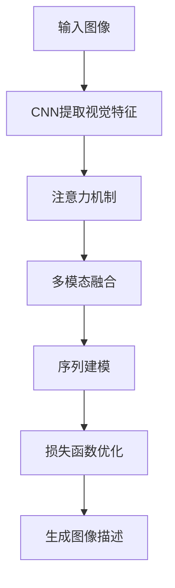

# Image Captioning原理与代码实例讲解

## 1.背景介绍

图像描述(Image Captioning)是计算机视觉和自然语言处理领域的一个交叉研究课题,旨在根据给定的图像自动生成相应的文字描述。随着深度学习技术的不断发展,图像描述任务取得了长足的进步,在很多领域都有广泛的应用前景,例如辅助视障人士了解图像内容、图像检索、自动图像标注等。

图像描述是一项极具挑战的任务,需要模型具备理解图像内容的能力,并将视觉信息转化为自然语言描述的能力。传统的基于规则的方法很难处理复杂场景,而深度学习模型通过数据驱动的方式,可以自动学习图像和文本之间的映射关系,从而生成更加准确、流畅的图像描述。

## 2.核心概念与联系

图像描述任务涉及以下几个核心概念:

1. **计算机视觉(Computer Vision)**: 用于从图像中提取视觉特征,捕获图像内容的关键信息。常用的视觉模型包括卷积神经网络(CNN)等。

2. **自然语言处理(Natural Language Processing, NLP)**: 用于将视觉特征转化为自然语言描述。常用的语言模型包括循环神经网络(RNN)、长短期记忆网络(LSTM)、Transformer等。

3. **注意力机制(Attention Mechanism)**: 帮助模型关注图像中的重要区域,从而生成更准确的描述。注意力机制使模型能够自适应地分配不同区域的权重。

4. **多模态融合(Multimodal Fusion)**: 将视觉特征和语义特征有效融合,建立图像和文本之间的映射关系。常用的融合方法包括特征拼接、注意力融合等。

5. **评估指标(Evaluation Metrics)**: 用于衡量生成的图像描述与人工标注的参考描述之间的相似性,常用指标包括BLEU、METEOR、CIDEr等。

这些概念相互关联、相辅相成,共同推动了图像描述任务的发展。视觉模型和语言模型分别提取图像和文本的特征,注意力机制和多模态融合则帮助建立两者之间的映射关系,最终生成高质量的图像描述。

## 3.核心算法原理具体操作步骤

图像描述任务的核心算法原理可以概括为以下几个步骤:

1. **图像特征提取**

   使用预训练的卷积神经网络(CNN),如VGG、ResNet等,从输入图像中提取视觉特征。这些视觉特征通常是一个特征向量或特征图,编码了图像的内容和语义信息。

2. **序列建模**

   使用循环神经网络(RNN)或Transformer等序列模型,对目标描述进行建模。模型会根据输入的视觉特征和先前生成的单词,预测下一个单词。

3. **注意力机制**

   引入注意力机制,使模型能够自适应地关注图像中的不同区域。注意力权重可以是对视觉特征的加权求和,或者是对不同区域的注意力分布。

4. **多模态融合**

   将视觉特征和语义特征进行融合,建立图像和文本之间的映射关系。常用的融合方法包括特征拼接、注意力融合等。

5. **损失函数优化**

   定义合适的损失函数,如交叉熵损失,并通过反向传播算法优化模型参数,使生成的描述与参考描述之间的差异最小化。

6. **预测和生成**

   在测试阶段,模型根据输入图像生成对应的描述,通常采用束搜索(Beam Search)或贪婪搜索(Greedy Search)等解码策略。

这个过程中,注意力机制和多模态融合是两个关键环节,能够有效捕获图像和文本之间的关联,从而提高描述的准确性和流畅性。



## 4.数学模型和公式详细讲解举例说明

在图像描述任务中,常用的数学模型和公式包括:

1. **注意力机制**

   注意力机制能够使模型自适应地关注图像中的不同区域,从而生成更准确的描述。常用的注意力机制包括加权求和注意力和软注意力。

   加权求和注意力的公式如下:

   $$\alpha_t = \text{softmax}(f(h_t, V))$$
   $$c_t = \sum_{i=1}^L \alpha_{t,i}V_i$$

   其中,$h_t$是RNN在时间步$t$的隐藏状态,$V$是视觉特征,$f$是注意力评分函数,通常为多层感知机。$\alpha_t$是注意力权重向量,用于加权求和视觉特征$V_i$,得到上下文向量$c_t$。

   软注意力的公式如下:

   $$\beta_t = \text{softmax}(W_\beta^Th_t)$$
   $$c_t = \sum_{i=1}^L \beta_{t,i}V_i$$

   其中,$W_\beta$是可学习的权重矩阵。$\beta_t$是注意力权重向量,用于加权求和视觉特征$V_i$,得到上下文向量$c_t$。

2. **多模态融合**

   多模态融合旨在将视觉特征和语义特征有效融合,建立图像和文本之间的映射关系。常用的融合方法包括特征拼接和注意力融合。

   特征拼接的公式如下:

   $$z_t = \phi([h_t, c_t])$$

   其中,$h_t$是RNN在时间步$t$的隐藏状态,$c_t$是注意力机制得到的上下文向量,$\phi$是非线性变换函数,如全连接层。$z_t$是融合后的特征向量。

   注意力融合的公式如下:

   $$\gamma_t = \text{softmax}(W_\gamma^T[h_t, c_t])$$
   $$z_t = \gamma_t \odot h_t + (1 - \gamma_t) \odot c_t$$

   其中,$W_\gamma$是可学习的权重矩阵,$\gamma_t$是注意力权重向量,用于融合$h_t$和$c_t$,得到融合后的特征向量$z_t$。$\odot$表示元素乘积。

通过上述数学模型和公式,注意力机制能够帮助模型关注图像中的重要区域,而多模态融合则能够有效地融合视觉和语义信息,从而提高图像描述的质量。

## 5.项目实践:代码实例和详细解释说明

以下是一个基于PyTorch实现的图像描述模型示例,包括数据预处理、模型定义、训练和测试等核心部分。

### 5.1 数据预处理

```python
import torchvision.transforms as transforms

# 图像预处理
image_transform = transforms.Compose([
    transforms.Resize((224, 224)),
    transforms.ToTensor(),
    transforms.Normalize(mean=[0.485, 0.456, 0.406], std=[0.229, 0.224, 0.225])
])

# 文本预处理
vocab = build_vocab(captions)  # 构建词典
word2idx = vocab.word2idx
idx2word = vocab.idx2word

# 数据加载
dataset = CaptionDataset(images, captions, word2idx, image_transform)
dataloader = DataLoader(dataset, batch_size=32, shuffle=True)
```

上述代码展示了图像和文本的预处理步骤。对于图像,我们使用了Resize、ToTensor和Normalize等转换,将图像调整为统一尺寸并归一化。对于文本,我们构建了词典,将单词映射为索引,方便后续的embedding操作。最后,我们将图像和描述组合成数据集,使用DataLoader加载数据。

### 5.2 模型定义

```python
import torch.nn as nn

class Encoder(nn.Module):
    def __init__(self, embed_size):
        super().__init__()
        self.resnet = models.resnet101(pretrained=True)
        self.linear = nn.Linear(self.resnet.fc.in_features, embed_size)
        self.bn = nn.BatchNorm1d(embed_size, momentum=0.01)

    def forward(self, images):
        with torch.no_grad():
            features = self.resnet(images)
        features = features.reshape(features.size(0), -1)
        features = self.bn(self.linear(features))
        return features

class Decoder(nn.Module):
    def __init__(self, embed_size, hidden_size, vocab_size, num_layers):
        super().__init__()
        self.embed = nn.Embedding(vocab_size, embed_size)
        self.lstm = nn.LSTM(embed_size, hidden_size, num_layers, batch_first=True)
        self.linear = nn.Linear(hidden_size, vocab_size)

    def forward(self, features, captions):
        embeddings = self.embed(captions)
        inputs = torch.cat((features.unsqueeze(1), embeddings), dim=1)
        hiddens, _ = self.lstm(inputs)
        outputs = self.linear(hiddens)
        return outputs

class AttentionModule(nn.Module):
    def __init__(self, encoder_dim, decoder_dim, attention_dim):
        super().__init__()
        self.encoder_att = nn.Linear(encoder_dim, attention_dim)
        self.decoder_att = nn.Linear(decoder_dim, attention_dim)
        self.full_att = nn.Linear(attention_dim, 1)
        self.relu = nn.ReLU()
        self.softmax = nn.Softmax(dim=1)

    def forward(self, encoder_out, decoder_hidden):
        att1 = self.encoder_att(encoder_out)
        att2 = self.decoder_att(decoder_hidden)
        att = self.full_att(self.relu(att1 + att2.unsqueeze(1))).squeeze(2)
        alpha = self.softmax(att)
        attention_weighted_encoding = (encoder_out * alpha.unsqueeze(2)).sum(dim=1)
        return attention_weighted_encoding, alpha

class CaptionModel(nn.Module):
    def __init__(self, embed_size, hidden_size, vocab_size, num_layers):
        super().__init__()
        self.encoder = Encoder(embed_size)
        self.decoder = Decoder(embed_size, hidden_size, vocab_size, num_layers)
        self.attention = AttentionModule(embed_size, hidden_size, attention_dim=512)

    def forward(self, images, captions):
        features = self.encoder(images)
        outputs = self.decoder(features, captions)
        return outputs

    def caption(self, image, max_length=50):
        with torch.no_grad():
            features = self.encoder(image).unsqueeze(1)
            states = None
            inputs = features
            caption = []
            for _ in range(max_length):
                hiddens, states = self.decoder.lstm(inputs, states)
                attention, _ = self.attention(features, hiddens.squeeze(1))
                output = self.decoder.linear(attention.unsqueeze(0))
                predicted = output.max(2)[1]
                caption.append(predicted.item())
                inputs = self.decoder.embed(predicted)
                if predicted == word2idx['<end>']:
                    break
        return [idx2word[idx] for idx in caption]
```

上述代码定义了图像描述模型的核心组件,包括Encoder、Decoder和AttentionModule。

- Encoder使用预训练的ResNet提取图像特征,并通过线性层和BatchNorm层将特征映射到embedding空间。
- Decoder是一个LSTM网络,将图像特征和词嵌入拼接作为输入,生成每个时间步的输出概率。
- AttentionModule实现了注意力机制,能够根据解码器的隐藏状态和编码器的特征,计算注意力权重,从而获得加权后的上下文向量。

CaptionModel将这些模块组合在一起,实现了图像描述的完整流程。在训练阶段,模型会最小化生成描述与参考描述之间的交叉熵损失。在测试阶段,模型采用贪婪搜索策略,根据输入图像生成对应的描述。

### 5.3 训练和测试

```python
import torch.optim as optim

model = CaptionModel(embed_size=512, hidden_size=512, vocab_size=len(vocab), num_layers=1)
criterion = nn.CrossEntropyLoss()
optimizer = optim.Adam(model.parameters(), lr=0.001)

for epoch in range(num_epochs):
    for images, captions in dataloader:
        outputs = model(images, captions)
        targets = captions[:, 1:].contiguous().view(-1)
        loss = criterion(outputs.view(-1, vocab_size), targets)
        optimizer.zero_grad()
        loss.backward()
        optimizer.step()

# 测试
image = test_image_transform(test_image)
caption = model.caption(image.unsqueeze(0))
print(' '.join(caption))
```

上述代码展示了模型的训练和测试过程。

在训练阶段,我们定义了交叉熵损失函数和Adam优化