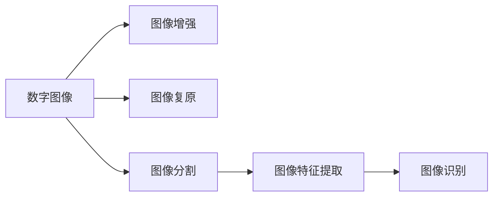

# Image Processing 原理与代码实战案例讲解

## 1. 背景介绍
### 1.1 什么是图像处理
图像处理是指使用计算机对数字图像进行分析、处理、理解和识别等，以获取所需信息或达到预期效果的技术。它涉及对图像进行各种变换和分析，如图像增强、图像复原、图像分割、图像特征提取、图像识别等。

### 1.2 图像处理的应用领域
图像处理技术广泛应用于各个领域，如医学影像分析、遥感图像解译、工业视觉检测、人脸识别、无人驾驶等。它为这些领域提供了强大的工具，极大地提高了工作效率和精度。

### 1.3 图像处理的发展历程
图像处理的发展可以追溯到20世纪60年代，随着计算机技术的发展，图像处理技术也不断进步。近年来，深度学习的兴起为图像处理带来了革命性的变化，极大地提升了图像处理的性能。

## 2. 核心概念与联系
### 2.1 数字图像
数字图像是指用数字矩阵表示的图像，矩阵中的每个元素称为像素。灰度图像的像素值表示灰度级，彩色图像每个像素由RGB三个分量表示。

### 2.2 图像增强
图像增强是指提高图像质量、突出感兴趣特征的处理，如对比度增强、直方图均衡化、锐化等。其目的是使图像更适合人眼观察或更适合后续的自动处理。

### 2.3 图像复原
图像复原是指去除图像中的噪声、模糊等退化因素，恢复图像的原貌。常用方法有维纳滤波、逆滤波、盲去卷积等。

### 2.4 图像分割
图像分割是指将图像划分成若干个具有特定意义的区域，是图像分析的关键步骤。常用方法有阈值分割、区域生长、Watershed算法等。

### 2.5 图像特征提取
图像特征提取是指从图像中提取能够表征图像内容的特征，为后续的图像识别、图像检索等任务提供支持。常用特征有颜色特征、纹理特征、形状特征等。

### 2.6 图像识别
图像识别是指识别图像中的目标物体或场景，是计算机视觉的核心任务之一。传统方法基于特征匹配，深度学习方法则端到端地学习特征和分类器。

### 2.7 核心概念之间的联系
下图展示了图像处理中几个核心概念之间的联系：



## 3. 核心算法原理具体操作步骤
### 3.1 直方图均衡化
直方图均衡化是一种常用的图像增强方法，它通过调整图像的灰度直方图，使其接近均匀分布，从而增强图像的对比度。具体步骤如下：
1. 计算图像的灰度直方图
2. 计算灰度级的累积分布函数(CDF)
3. 根据CDF，将原始灰度值映射到新的灰度值
4. 根据映射关系，生成新的图像

### 3.2 维纳滤波
维纳滤波是一种经典的图像复原算法，它在频域对退化图像进行处理，以最小均方误差为准则，求解最优复原滤波器。具体步骤如下：
1. 对退化图像进行傅里叶变换
2. 根据退化函数和噪声功率谱，构建维纳滤波器
3. 用维纳滤波器乘以退化图像的频谱
4. 对结果进行傅里叶逆变换，得到复原图像

### 3.3 Watershed算法
Watershed算法是一种基于拓扑理论的图像分割算法，它将图像看作地形表面，灰度值对应地形的高度，通过模拟水淹过程，实现图像分割。具体步骤如下：
1. 计算图像的梯度幅值
2. 在梯度图像上进行标记，找到局部极小值点
3. 从标记点开始，模拟水淹过程，形成分水岭
4. 根据分水岭，实现图像的分割

### 3.4 SIFT特征提取
SIFT(Scale-Invariant Feature Transform)是一种经典的局部特征提取算法，它具有尺度不变性、旋转不变性等优点。具体步骤如下：
1. 尺度空间极值检测：在不同尺度下，找到局部极值点
2. 关键点定位：去除低对比度和边缘响应较弱的极值点
3. 方向确定：计算关键点周围的梯度方向直方图，确定主方向
4. 关键点描述：在关键点周围提取128维的SIFT特征向量

### 3.5 卷积神经网络
卷积神经网络(CNN)是一种广泛用于图像识别的深度学习模型，它通过卷积、池化等操作，提取图像的层次化特征，并用全连接层实现分类。具体步骤如下：
1. 卷积层：用卷积核对图像进行卷积，提取局部特征
2. 激活函数：对卷积结果进行非线性变换，如ReLU
3. 池化层：对特征图下采样，减小数据量，提高鲁棒性
4. 全连接层：将特征展平，并进行分类预测
5. 损失函数：计算预测结果与真实标签的误差
6. 优化算法：通过反向传播和梯度下降，更新网络参数

## 4. 数学模型和公式详细讲解举例说明
### 4.1 图像的数学表示
数字图像可以用二维矩阵表示：
$$
I=
\begin{bmatrix}
f(0,0) & f(0,1) & \cdots & f(0,N-1) \\
f(1,0) & f(1,1) & \cdots & f(1,N-1) \\
\vdots & \vdots & \ddots & \vdots \\
f(M-1,0) & f(M-1,1) & \cdots & f(M-1,N-1)
\end{bmatrix}
$$
其中，$f(x,y)$表示位置$(x,y)$处的像素值，$M$和$N$分别表示图像的高度和宽度。

### 4.2 图像卷积
图像卷积是图像处理中的重要操作，它可以用于图像平滑、锐化、边缘检测等。二维卷积的定义为：
$$(f*g)(x,y)=\sum_{m=-\infty}^{\infty}\sum_{n=-\infty}^{\infty}f(m,n)g(x-m,y-n)$$
其中，$f(x,y)$为输入图像，$g(x,y)$为卷积核。

例如，对图像进行均值平滑，可以使用如下卷积核：
$$
\frac{1}{9}
\begin{bmatrix}
1 & 1 & 1 \\
1 & 1 & 1 \\
1 & 1 & 1
\end{bmatrix}
$$

### 4.3 傅里叶变换
傅里叶变换是图像处理中的重要工具，它可以将图像从空间域转换到频率域。二维离散傅里叶变换(DFT)定义为：
$$F(u,v)=\frac{1}{MN}\sum_{x=0}^{M-1}\sum_{y=0}^{N-1}f(x,y)e^{-j2\pi(\frac{ux}{M}+\frac{vy}{N})}$$
其中，$f(x,y)$为输入图像，$F(u,v)$为频谱图像。

例如，对图像进行低通滤波，可以在频率域乘以一个低通滤波器：
$$H(u,v)=
\begin{cases}
1, & \sqrt{u^2+v^2}\leq D_0 \\
0, & \text{otherwise}
\end{cases}
$$
其中，$D_0$为截止频率。

### 4.4 Sobel算子
Sobel算子是一种常用的边缘检测算子，它通过计算图像梯度的近似值来找到边缘。Sobel算子包括两个卷积核，分别用于计算水平和垂直方向的梯度：
$$G_x=
\begin{bmatrix}
-1 & 0 & +1 \\
-2 & 0 & +2 \\
-1 & 0 & +1
\end{bmatrix} * I, \quad
G_y=
\begin{bmatrix}
-1 & -2 & -1 \\
0 & 0 & 0 \\
+1 & +2 & +1
\end{bmatrix} * I
$$
梯度幅值和方向可以由下式计算：
$$G=\sqrt{G_x^2+G_y^2}, \quad \theta=\arctan(\frac{G_y}{G_x})$$

### 4.5 SIFT特征描述子
SIFT特征描述子是一个128维的向量，它描述了关键点周围的梯度信息。具体地，将关键点周围16x16的窗口划分为4x4的子区域，每个子区域计算8个方向的梯度直方图，共得到128个值。

假设$d_i$表示第$i$个子区域的梯度直方图，则SIFT特征描述子为：
$$\mathbf{f}=[d_1,d_2,\cdots,d_{16}]^T$$
为了增强鲁棒性，通常对特征向量进行归一化处理：
$$\mathbf{f}=\frac{\mathbf{f}}{\|\mathbf{f}\|}$$

## 5. 项目实践：代码实例和详细解释说明
下面以Python和OpenCV为例，展示几个图像处理的代码实例。

### 5.1 图像读取和显示
```python
import cv2

# 读取图像
img = cv2.imread('image.jpg')

# 显示图像
cv2.imshow('image', img)
cv2.waitKey(0)
cv2.destroyAllWindows()
```
`cv2.imread`函数用于读取图像文件，`cv2.imshow`函数用于在窗口中显示图像，`cv2.waitKey`函数等待按键事件，`cv2.destroyAllWindows`函数关闭所有窗口。

### 5.2 图像平滑
```python
import cv2

# 读取图像
img = cv2.imread('image.jpg')

# 均值滤波
blur = cv2.blur(img, (5,5))

# 高斯滤波 
gaussian = cv2.GaussianBlur(img, (5,5), 0)

# 中值滤波
median = cv2.medianBlur(img, 5)

# 显示结果
cv2.imshow('original', img)
cv2.imshow('blur', blur)
cv2.imshow('gaussian', gaussian) 
cv2.imshow('median', median)
cv2.waitKey(0)
cv2.destroyAllWindows()
```
`cv2.blur`函数实现均值滤波，`cv2.GaussianBlur`函数实现高斯滤波，`cv2.medianBlur`函数实现中值滤波。它们都接受两个参数，第一个参数是输入图像，第二个参数是滤波器的大小。

### 5.3 图像梯度
```python
import cv2

# 读取图像
img = cv2.imread('image.jpg', 0) 

# Sobel算子
sobelx = cv2.Sobel(img, cv2.CV_64F, 1, 0, ksize=3)
sobely = cv2.Sobel(img, cv2.CV_64F, 0, 1, ksize=3)

# Scharr算子 
scharrx = cv2.Scharr(img, cv2.CV_64F, 1, 0)
scharry = cv2.Scharr(img, cv2.CV_64F, 0, 1)

# Laplacian算子
laplacian = cv2.Laplacian(img, cv2.CV_64F)

# 显示结果
cv2.imshow('sobelx', sobelx)
cv2.imshow('sobely', sobely)
cv2.imshow('scharrx', scharrx)
cv2.imshow('scharry', scharry)
cv2.imshow('laplacian', laplacian)
cv2.waitKey(0)
cv2.destroyAllWindows()
```
`cv2.Sobel`函数实现Sobel算子，`cv2.Scharr`函数实现Scharr算子，`cv2.Laplacian`函数实现Laplacian算子。它们都接受四个参数，分别是输入图像、输出图像的数据类型、x方向的导数阶数和y方向的导数阶数。

### 5.4 图像阈值化
```python
import cv2

# 读取图像
img = cv2.imread('image.jpg', 0)

# 全局阈