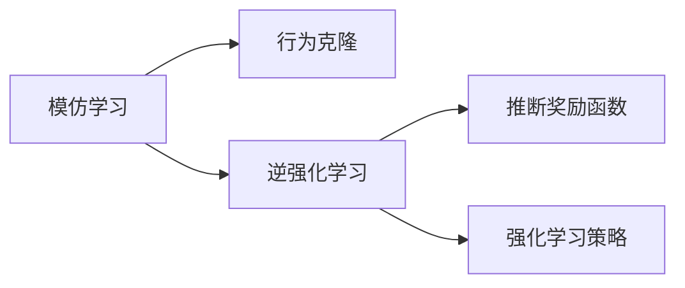

# Imitation Learning原理与代码实例讲解

## 1. 背景介绍
在人工智能领域，机器学习已经取得了显著的进展。其中，模仿学习（Imitation Learning，IL）作为一种让机器通过观察和模仿专家行为来学习特定任务的技术，近年来受到了广泛关注。它在自动驾驶、机器人控制等领域展现出巨大的潜力。与传统的强化学习相比，模仿学习能够在没有明确奖励信号的情况下，通过学习专家的策略来快速学习任务。

## 2. 核心概念与联系
模仿学习主要包括行为克隆（Behavioral Cloning，BC）和逆强化学习（Inverse Reinforcement Learning，IRL）。BC直接从专家的状态-动作对中学习策略，而IRL则是从专家的行为中推断出奖励函数，再通过强化学习来学习策略。



## 3. 核心算法原理具体操作步骤
### 3.1 行为克隆
1. 数据收集：从专家那里收集状态-动作对。
2. 模型训练：使用监督学习方法训练一个策略模型。
3. 策略部署：将训练好的模型部署到实际任务中。

### 3.2 逆强化学习
1. 数据收集：从专家那里收集状态-动作对。
2. 奖励函数推断：使用专家的行为数据推断出奖励函数。
3. 策略学习：利用推断出的奖励函数，通过强化学习训练策略。

## 4. 数学模型和公式详细讲解举例说明
在行为克隆中，我们通常使用如下的损失函数来训练策略模型：
$$
L(\theta) = \frac{1}{N} \sum_{i=1}^{N} \| \pi_\theta(s_i) - a_i \|^2
$$
其中，$\pi_\theta$ 是参数为 $\theta$ 的策略模型，$s_i$ 和 $a_i$ 分别是第 $i$ 个样本的状态和动作，$N$ 是样本总数。

在逆强化学习中，我们需要解决的是如下的优化问题：
$$
\max_{r} \sum_{(s,a)} p_{\pi_E}(s,a) \log p_{\pi}(s,a|r)
$$
其中，$p_{\pi_E}(s,a)$ 是专家策略下状态-动作对的分布，$p_{\pi}(s,a|r)$ 是在奖励函数 $r$ 下学习到的策略 $\pi$ 的状态-动作分布。

## 5. 项目实践：代码实例和详细解释说明
以行为克隆为例，我们可以使用Python和TensorFlow来实现一个简单的模仿学习模型。以下是一个简化的代码示例：

```python
import tensorflow as tf
from tensorflow.keras.models import Sequential
from tensorflow.keras.layers import Dense

# 假设我们已经有了专家的状态-动作数据
states = [...]  # 状态数据
actions = [...]  # 动作数据

# 构建模型
model = Sequential([
    Dense(64, activation='relu', input_shape=(state_dim,)),
    Dense(action_dim)
])

# 编译模型
model.compile(optimizer='adam', loss='mse')

# 训练模型
model.fit(states, actions, epochs=10)

# 使用模型进行预测
predictions = model.predict(new_states)
```

在这个例子中，我们首先导入了TensorFlow库，并构建了一个简单的神经网络模型。然后，我们使用专家的状态-动作数据来训练这个模型，并使用训练好的模型来预测新的状态下的动作。

## 6. 实际应用场景
模仿学习在多个领域都有应用，例如：
- 自动驾驶：通过模仿专业司机的驾驶行为来训练自动驾驶系统。
- 机器人控制：让机器人通过模仿人类的动作来学习复杂的操作技能。
- 游戏AI：让游戏中的非玩家角色（NPC）通过模仿玩家的行为来提供更具挑战性的对手。

## 7. 工具和资源推荐
- TensorFlow和PyTorch：两个流行的深度学习框架，适用于模仿学习模型的构建和训练。
- Gym：OpenAI提供的一个用于开发和比较强化学习算法的工具包，也适用于模仿学习。
- RoboSchool：OpenAI开发的开源机器人模拟器，可以用于模仿学习的研究。

## 8. 总结：未来发展趋势与挑战
模仿学习作为一种有效的学习策略，未来有望在更多领域得到应用。然而，它也面临着一些挑战，如如何处理专家数据的稀缺性、如何提高模型的泛化能力等。随着研究的深入，我们有理由相信这些问题将得到解决。

## 9. 附录：常见问题与解答
Q1: 模仿学习和强化学习有什么区别？
A1: 模仿学习侧重于从专家的行为中学习，而不需要明确的奖励信号；而强化学习侧重于通过与环境的交互来学习，需要明确的奖励信号。

Q2: 模仿学习是否总是需要专家数据？
A2: 是的，模仿学习的核心就是从专家的行为中学习。

Q3: 模仿学习在实际应用中有哪些限制？
A3: 模仿学习依赖于高质量的专家数据，如果专家数据有误或不完整，可能会导致学习到的策略效果不佳。

作者：禅与计算机程序设计艺术 / Zen and the Art of Computer Programming