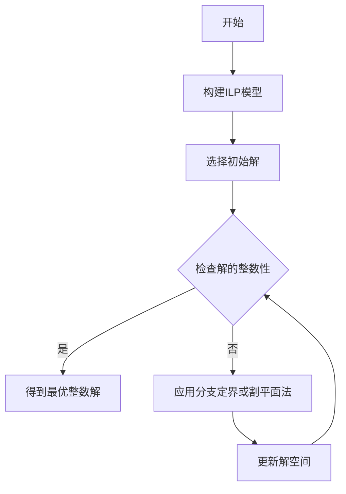

# IntegerLinearProgramming算法原理与代码实现

## 1. 背景介绍

整数线性规划（Integer Linear Programming，ILP）是运筹学中的一种数学优化模型，它要求所有的决策变量都是整数。在现实世界中，许多问题都可以归结为整数线性规划问题，如物流配送、生产计划、资源分配等。ILP的核心挑战在于寻找最优解的同时，满足整数约束，这使得问题的求解比一般的线性规划更为复杂。

## 2. 核心概念与联系

整数线性规划的核心概念包括决策变量、目标函数、约束条件等。决策变量是需要决定的数值，目标函数是需要最大化或最小化的函数，约束条件是决策变量需要满足的条件。整数线性规划与线性规划的主要区别在于决策变量的整数性。

## 3. 核心算法原理具体操作步骤

整数线性规划的求解通常采用分支定界法（Branch and Bound）或割平面法（Cutting Plane）。分支定界法通过逐步细化搜索范围来找到最优解，而割平面法则是通过添加额外的约束来排除非整数解。



## 4. 数学模型和公式详细讲解举例说明

整数线性规划的数学模型可以表示为：

$$
\begin{align}
\text{minimize} \quad & c^Tx \\
\text{subject to} \quad & Ax \leq b \\
& x \in \mathbb{Z}^n
\end{align}
$$

其中，$c$ 和 $x$ 是向量，$A$ 是矩阵，$b$ 是约束条件向量，$x$ 的所有元素都必须是整数。

## 5. 项目实践：代码实例和详细解释说明

在实际项目中，可以使用Python的PuLP库来实现整数线性规划。以下是一个简单的例子：

```python
from pulp import *

# 定义问题
prob = LpProblem("Simple ILP", LpMinimize)

# 定义决策变量
x = LpVariable("x", 0, None, LpInteger)
y = LpVariable("y", 0, None, LpInteger)

# 目标函数
prob += x + 2*y

# 约束条件
prob += 3*x + 4*y >= 1
prob += 2*x + y >= 2

# 求解
prob.solve()

# 输出结果
for v in prob.variables():
    print(v.name, "=", v.varValue)
```

## 6. 实际应用场景

整数线性规划在许多领域都有应用，例如在航空公司的航班调度、在制造业的生产计划、在电信行业的网络设计等。

## 7. 工具和资源推荐

对于整数线性规划问题的求解，推荐使用PuLP、CPLEX、Gurobi等优化求解器。这些工具提供了强大的算法库和接口，可以帮助用户更高效地解决问题。

## 8. 总结：未来发展趋势与挑战

整数线性规划作为一种强大的优化工具，其求解算法和理论仍在不断发展中。未来的研究方向可能包括算法的并行化、大规模问题的高效求解方法、以及与机器学习等其他领域的结合。

## 9. 附录：常见问题与解答

Q: 整数线性规划和线性规划有什么区别？
A: 主要区别在于决策变量的整数性。

Q: 分支定界法和割平面法有什么区别？
A: 分支定界法通过逐步细化搜索范围来找到最优解，割平面法则是通过添加额外的约束来排除非整数解。

作者：禅与计算机程序设计艺术 / Zen and the Art of Computer Programming