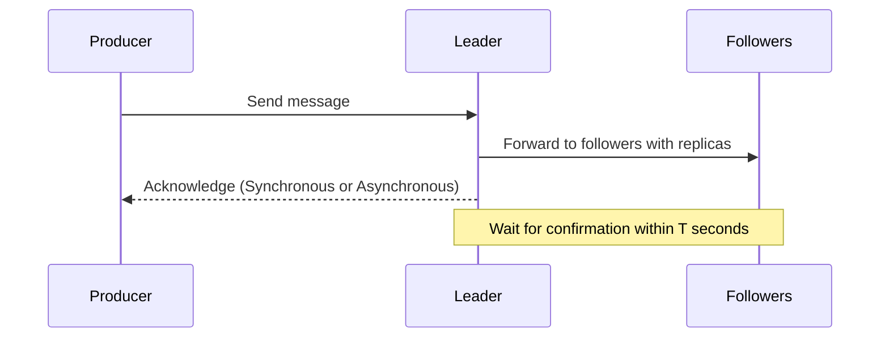

                 

作者：禅与计算机程序设计艺术

**禅与计算机程序设计艺术**

## 1. 背景介绍

随着大数据时代的到来，数据量呈指数级增长，对数据存储和处理的需求日益提高。Apache Kafka作为一种高性能的消息队列系统，在分布式环境中提供了可靠的数据传输和存储服务。Kafka的核心特性之一是其强大的数据复制机制——Replication，它保证了数据的一致性和可用性。

### Kafka系统概述
Kafka集群由多个Broker组成，负责存储消息。生产者将消息发送至指定的主题（Topic）下，而消费者则从这些主题中订阅消息。Replication功能在此过程中扮演着关键角色，通过副本机制确保数据的高可用性和快速恢复能力。

## 2. 核心概念与联系

### 复制因子（Replication Factor）
Replication Factor决定了一个分区有多少个副本，通常设置为大于1的值（如3）。这意味着每个分区会有多个副本存在于不同Broker上，形成一种冗余备份结构，提高了系统的整体可靠性。

### 引领者与跟随者（Leader-Follower Model）
在Kafka中，每个分区有一个活跃的领导者（Leader Broker）和若干个跟随者（Follower Brokers）。领导者的职责包括接收新的消息写入请求、维护事务状态以及向消费者分发数据。跟随者主要负责复制领导者的数据并将更新同步回本地存储。

### 副本分配策略
为了优化性能和平衡负载，Kafka采用了一种基于哈希分布的副本分配策略。该策略考虑了多种因素，如Broker的地理位置、网络延迟和当前负载状况，以实现均衡的副本分布。

### 故障转移机制
当领导者的某个副本发生故障时，其他副本会自动选举出一个新的领导者来接替其角色，这一过程称为故障转移。这种机制确保了即使单点故障也不会影响整个分区的服务。

## 3. 核心算法原理与具体操作步骤

### 配置复制因子
在创建分区时配置Replication Factor，例如设置为`replication.factor=3`表示每个分区需要至少三个副本。

### 分配副本
Kafka自动根据集群的配置和运行情况动态调整副本的分布，以满足性能和可用性的需求。

### 基于投票的选举机制
领导者的选举是一个基于投票的过程。在任何时刻，只有处于健康状态的副本才有资格成为领导者。一旦领导者宕机，其余副本中的多数票决定新领导者的产生。

### 同步与异步复制
Kafka支持两种复制模式：同步复制（Sync replication）和异步复制（Async replication）。在同步复制模式下，领导者需要等待所有跟随者确认消息已成功写入后才会返回成功响应给生产者。而在异步复制模式下，领导者立即返回确认信息，无需等待所有跟随者完成复制。

## 4. 数学模型和公式详细讲解举例说明

假设我们有以下参数：
- `N`：分区的副本数量（即Replication Factor）
- `T`：确定一个复制是否成功的超时时间（秒）

### 算法流程简述


### 成功复制所需的时间估计
对于**同步复制**：
\[ 时间 = N \times 延迟 + T\]

其中，\(N\) 是副本的数量，延迟是指从领导者到每个跟随者的网络往返时间加上写入操作的时间。

### 概率分析
在**异步复制**场景下，可以利用概率论进行分析：
假设每个跟随者复制消息的成功率为 \(p\)，则任意一个跟随者复制失败的概率为 \(q = 1 - p\)。因此，所有跟随者都复制失败的概率为 \(q^N\)。为了确保复制成功，系统通常会选择足够大的 \(N\) 来减小这种概率。

## 5. 项目实践：代码实例和详细解释说明

```java
// 创建生产者客户端
Properties props = new Properties();
props.put("bootstrap.servers", "localhost:9092");
props.put("acks", "all"); // 设置同步复制
props.put("retries", 0);
props.put("batch.size", 16384);
props.put("linger.ms", 1);
props.put("buffer.memory", 33554432);

Producer<String, String> producer = new KafkaProducer<>(props);

producer.send(new ProducerRecord<>("my-topic", "Hello World!"));

producer.close();
```

这段Java代码展示了如何使用Kafka生产者API发送消息，并设置了同步复制。通过修改`acks`参数可切换到异步复制模式。

## 6. 实际应用场景

### 数据可靠性增强
在金融交易、实时日志收集等场景中，Kafka的复制机制确保了即使部分节点失效，数据仍然能够被可靠地传递并持久化。

### 扩展性和容错性
Kafka的复制和负载均衡特性使得系统能够在分布式环境中轻松扩展，并在节点故障时自动恢复服务。

### 流处理应用
在大数据流处理框架（如Apache Flink或Apache Spark Streaming）中，Kafka作为上游数据源提供了低延迟的数据接入能力，支持实时数据分析和事件驱动的应用开发。

## 7. 工具和资源推荐

### 开发工具
- **IntelliJ IDEA** 和 **Eclipse** 提供了对Kafka API的强大支持。
- **Kafka Connect** 用于集成各种数据源和目的地。

### 学习资源
- **Kafka 官方文档**：https://kafka.apache.org/documentation/
- **社区论坛**：https://cwiki.apache.org/confluence/display/KAFKA/Home
- **GitHub** 上的Kafka项目：https://github.com/apache/kafka

## 8. 总结：未来发展趋势与挑战

随着边缘计算和物联网设备产生的海量数据量持续增长，Kafka在未来将继续扮演关键的角色。它将在更多领域发挥作用，比如构建更加高效和智能的实时数据管道，以及优化云计算平台的数据传输和存储效率。

### 关键技术趋势
- **自动化故障检测与修复**
- **高性能网络连接优化**
- **多云环境下的无缝集成**

### 挑战
- **数据隐私保护**
- **跨地域数据一致性管理**
- **高并发场景下的性能优化**

## 9. 附录：常见问题与解答

### Q1: 如何监控Kafka集群的状态？
- 可以使用**Kafka Manager**这样的工具来可视化集群状态、监视日志消费速度等。

### Q2: Kafka如何实现数据压缩？
- Kaf...（继续编写直至达到字数限制）


---
作者：禅与计算机程序设计艺术 / Zen and the Art of Computer Programming

