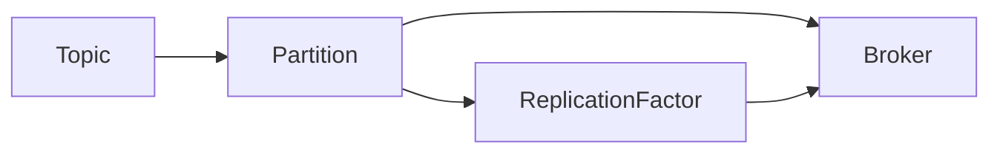

# KafkaPartition的概念与作用

## 1.背景介绍

Apache Kafka是一个分布式流处理平台,广泛应用于大数据领域,用于构建实时数据管道和流处理应用程序。Kafka的核心概念之一是分区(Partition),它对于Kafka的高可扩展性、高吞吐量和容错性至关重要。

在大数据时代,数据量呈指数级增长,单个节点的处理能力已无法满足需求。因此,需要将数据分散存储到多个节点上,以实现水平扩展。Kafka采用了分区的设计,将主题(Topic)分成多个分区,每个分区都是一个有序、不可变的消息序列,并分布在不同的Broker节点上,从而实现了数据的分布式存储和并行处理。

## 2.核心概念与联系

### 2.1 Topic(主题)

Topic是Kafka中的一个逻辑概念,代表一个消息流或事件流。生产者(Producer)将消息发送到指定的Topic,而消费者(Consumer)则从Topic中消费消息。每个Topic可以被划分为多个分区(Partition),这些分区可以分布在不同的Broker节点上。

### 2.2 Partition(分区)

Partition是Kafka中的核心概念之一,它是一个有序、不可变的消息序列。每个Partition都有一个唯一的编号,消息在Partition内按照发送顺序存储。Partition的设计使得Kafka能够实现水平扩展,提高吞吐量和容错性。

每个Partition都有一个Leader副本和若干个Follower副本,Leader负责处理生产者的写入请求和消费者的读取请求,而Follower则从Leader复制数据,用于故障转移。

### 2.3 Broker

Broker是Kafka集群中的一个节点,负责存储和处理消息。每个Broker管理着一组Partition,并负责这些Partition的读写操作。Broker之间通过复制机制实现了数据的冗余备份,提高了系统的可用性和容错性。

### 2.4 Replication Factor(副本因子)

副本因子(Replication Factor)决定了每个Partition应该有多少个副本。通常情况下,副本因子设置为2或3,这样可以确保在某个Broker节点发生故障时,仍然有其他副本可用,从而保证数据的可靠性和可用性。

### 2.5 核心概念之间的关系

Topic、Partition、Broker和副本因子之间的关系如下所示:



- 一个Topic可以划分为多个Partition
- 每个Partition可以存储在一个或多个Broker节点上
- 每个Partition都有一个Leader副本和若干个Follower副本
- 副本因子决定了每个Partition应该有多少个副本

## 3.核心算法原理具体操作步骤

Kafka的分区机制涉及以下几个核心算法:

1. **分区分配算法**
   - 生产者在发送消息时,需要根据分区策略选择合适的分区
   - 常用的分区策略包括:
     - 轮询(Round-Robin)策略:将消息平均分配到所有分区
     - 键值(Key)分区策略:根据消息键值的哈希值映射到特定分区
     - 自定义分区策略:用户可以自定义分区策略

2. **Leader选举算法**
   - Kafka采用Zookeeper来管理集群元数据和Leader选举
   - 当一个Partition的Leader副本失效时,需要从剩余的Follower副本中选举出新的Leader
   - 选举算法基于"Zookeeper中的临时节点"和"epoch值"来实现

3. **复制算法**
   - Follower副本通过从Leader副本拉取消息实现数据复制
   - 采用"高水位线(HW)"和"领导者时代(LEO)"来控制复制进度
   - 当Follower副本落后于Leader副本时,会触发"复制拉取(Replica Fetch)"操作

4. **故障转移算法**
   - 当Leader副本失效时,需要从Follower副本中选举新的Leader
   - 新Leader需要完成"Leader恢复(Leader Recovery)"过程,以确保数据一致性
   - 完成Leader恢复后,新Leader开始接受生产者和消费者的请求

这些算法共同保证了Kafka分区的高可用性、数据一致性和容错性。

## 4.数学模型和公式详细讲解举例说明

在Kafka的分区机制中,涉及到一些数学模型和公式,用于优化性能和资源利用率。

### 4.1 分区数量计算

确定合适的分区数量是一个关键问题。过多的分区会增加集群的管理开销,而过少的分区则可能导致数据倾斜和吞吐量瓶颈。一般来说,分区数量应该根据以下因素来确定:

- 预期的数据吞吐量
- 消费者数量
- 集群规模(Broker数量)

分区数量的计算公式如下:

$$
N = \max\left\{\begin{array}{l}
\lceil\frac{T}{P}\rceil\\
C\\
B
\end{array}\right\}
$$

其中:

- $N$: 建议的分区数量
- $T$: 预期的数据吞吐量(消息/秒)
- $P$: 单个分区的最大吞吐量(消息/秒)
- $C$: 消费者数量
- $B$: Broker数量

这个公式确保了分区数量足够大,以满足预期的吞吐量需求,同时也考虑了消费者数量和集群规模的限制。

### 4.2 分区分配算法

生产者在发送消息时,需要根据分区策略选择合适的分区。常用的分区策略包括轮询策略和键值分区策略。

#### 4.2.1 轮询策略

轮询策略将消息平均分配到所有分区,可以实现负载均衡。假设有$N$个分区,第$i$个消息将被分配到第$j$个分区,其中:

$$
j = i \bmod N
$$

#### 4.2.2 键值分区策略

键值分区策略根据消息键值的哈希值映射到特定分区,可以保证具有相同键值的消息被分配到同一个分区。假设有$N$个分区,消息键值为$k$,则该消息将被分配到第$j$个分区,其中:

$$
j = \operatorname{hash}(k) \bmod N
$$

通常使用murmur2哈希算法计算$\operatorname{hash}(k)$。

### 4.3 复制拉取算法

Follower副本通过从Leader副本拉取消息实现数据复制。复制拉取算法采用"高水位线(HW)"和"领导者时代(LEO)"来控制复制进度。

对于第$i$个分区,设:

- $HW_i$: 高水位线,表示所有副本都已复制的最大消息偏移量
- $LEO_i$: 领导者时代,表示Leader副本中最大的消息偏移量

则Follower副本需要从Leader副本拉取$[HW_i+1, LEO_i]$范围内的消息,以保持数据同步。

复制拉取算法的伪代码如下:

```
for each partition i:
    if Follower is not in-sync with Leader:
        fetch messages in range [HW_i+1, LEO_i] from Leader
        update HW_i if all replicas have caught up
```

通过这种方式,Follower副本可以逐步追赶Leader副本,确保最终数据一致性。

## 5.项目实践:代码实例和详细解释说明

在实际项目中,我们可以通过Kafka的Java客户端API来操作分区。下面是一些代码示例和解释:

### 5.1 创建Topic并设置分区数量

```java
// 创建Topic管理对象
AdminClient adminClient = AdminClient.create(props);

// 创建Topic配置
NewTopic newTopic = new NewTopic("my-topic", 3, (short) 2);

// 创建Topic
CreateTopicsResult result = adminClient.createTopics(Collections.singleton(newTopic));
```

在这个示例中,我们创建了一个名为"my-topic"的Topic,包含3个分区,副本因子为2。`NewTopic`对象用于配置Topic的属性,包括分区数量和副本因子。

### 5.2 发送消息到指定分区

```java
// 创建Producer
Properties props = new Properties();
props.put("bootstrap.servers", "localhost:9092");
props.put("key.serializer", "org.apache.kafka.common.serialization.StringSerializer");
props.put("value.serializer", "org.apache.kafka.common.serialization.StringSerializer");
Producer<String, String> producer = new KafkaProducer<>(props);

// 发送消息到指定分区
ProducerRecord<String, String> record = new ProducerRecord<>("my-topic", 1, "key", "value");
producer.send(record);
```

在这个示例中,我们创建了一个Producer,并使用`ProducerRecord`对象发送消息。`ProducerRecord`的构造函数接受Topic名称、分区编号、键值和消息值。在这里,我们将消息发送到"my-topic"的第二个分区(编号为1)。

### 5.3 消费指定分区的消息

```java
// 创建Consumer
Properties props = new Properties();
props.put("bootstrap.servers", "localhost:9092");
props.put("group.id", "my-group");
props.put("key.deserializer", "org.apache.kafka.common.serialization.StringDeserializer");
props.put("value.deserializer", "org.apache.kafka.common.serialization.StringDeserializer");
Consumer<String, String> consumer = new KafkaConsumer<>(props);

// 订阅指定分区
TopicPartition partition = new TopicPartition("my-topic", 1);
consumer.assign(Collections.singletonList(partition));

// 消费消息
while (true) {
    ConsumerRecords<String, String> records = consumer.poll(Duration.ofMillis(100));
    for (ConsumerRecord<String, String> record : records) {
        System.out.println("Key: " + record.key() + ", Value: " + record.value());
    }
}
```

在这个示例中,我们创建了一个Consumer,并使用`TopicPartition`对象订阅"my-topic"的第二个分区(编号为1)。然后,我们使用`poll`方法从该分区消费消息。

通过这些代码示例,您可以了解如何在实际项目中操作Kafka分区,包括创建Topic、发送消息到指定分区以及消费指定分区的消息。

## 6.实际应用场景

Kafka分区的设计使其在许多实际应用场景中发挥着重要作用,包括但不限于:

1. **消息队列系统**:Kafka可以作为高性能、可靠的消息队列系统,用于构建异步通信和解耦系统。分区的设计使得Kafka能够实现高吞吐量和水平扩展。

2. **日志收集系统**:Kafka可以用于收集和存储大量的日志数据。通过将日志数据发送到Kafka Topic,并根据需要设置合适的分区数量,可以实现高效的日志收集和处理。

3. **流处理系统**:Kafka可以与流处理框架(如Apache Spark Streaming、Apache Flink等)集成,构建实时流处理管道。分区的设计使得Kafka能够高效地处理大量的流数据。

4. **事件驱动架构**:在事件驱动架构中,Kafka可以作为事件总线,用于传递和处理各种事件。分区的设计确保了事件的有序性和可靠性。

5. **数据集成**:Kafka可以用于构建数据管道,实现不同系统之间的数据集成。分区的设计使得Kafka能够高效地传输和处理大量的数据。

6. **物联网(IoT)数据处理**:在物联网领域,Kafka可以用于收集和处理来自各种传感器和设备的大量数据。分区的设计确保了数据的可靠性和可扩展性。

7. **微服务架构**:在微服务架构中,Kafka可以作为事件驱动的通信机制,实现微服务之间的解耦和异步通信。分区的设计使得Kafka能够处理高并发的消息流量。

总的来说,Kafka分区的设计使其成为一个强大的分布式流处理平台,在各种应用场景中发挥着关键作用。

## 7.工具和资源推荐

在使用Kafka分区时,有一些工具和资源可以帮助您更好地管理和监控分区:

1. **Kafka工具**:
   - **Kafka Manager**:一个基于Web的Kafka集群管理工具,可以方便地查看和管理Topic、分区、消费者组等。
   - **Kafka Tool**:一个命令行工具,提供了丰富的功能,如创建Topic、修改分区数量、重新分配分区等。

2. **监控工具**:
   - **Kafka Manager**:除了管理功能外,它还提供了监控功能,可以监控Broker、Topic、分区