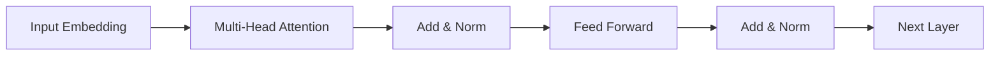
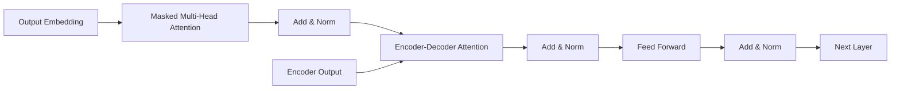

# Language Translation原理与代码实例讲解

## 1.背景介绍

在当今全球化的世界中,语言翻译技术扮演着越来越重要的角色。无论是促进不同文化之间的交流,还是帮助企业拓展国际市场,高质量的语言翻译都是必不可少的。随着人工智能和自然语言处理技术的不断进步,语言翻译领域也在发生着翻天覆地的变化。

传统的基于规则的翻译系统正逐渐被基于数据驱动的神经网络翻译系统所取代。这种新型翻译系统能够通过学习大量的双语语料,自动捕捉语言的语义和语法规则,从而提供更加准确、流畅的翻译结果。其中,Transformer模型是当前神经网络机器翻译领域的主流模型,展现出了卓越的性能表现。

本文将深入探讨语言翻译的核心原理和算法,并通过代码实例详细讲解Transformer模型的实现细节。我们将从语言翻译任务的基本概念出发,逐步介绍注意力机制、编码器-解码器架构等关键技术,最终构建一个端到端的神经网络翻译系统。

## 2.核心概念与联系

在深入探讨语言翻译的细节之前,我们需要先了解一些核心概念和它们之间的联系。

### 2.1 机器翻译(Machine Translation)

机器翻译是指利用计算机软件将一种自然语言(源语言)转换为另一种自然语言(目标语言)的过程。这个过程涉及到语言学、计算机科学和人工智能等多个领域的知识。

### 2.2 序列到序列学习(Sequence-to-Sequence Learning)

语言翻译任务可以被视为一个序列到序列学习问题。给定一个源语言的句子序列,我们需要生成一个对应的目标语言的句子序列。这种任务可以通过编码器-解码器架构来实现,其中编码器负责将源语言序列编码为中间表示,解码器则根据这个中间表示生成目标语言序列。

### 2.3 注意力机制(Attention Mechanism)

注意力机制是序列到序列学习中的一个关键技术。它允许模型在生成目标序列时,selectively关注源序列中的不同部分,从而更好地捕捉长距离依赖关系。这种机制极大地提高了翻译质量,尤其是对于长句子的翻译。

### 2.4 Transformer模型

Transformer是一种全新的基于注意力机制的序列到序列模型,它完全摒弃了传统的循环神经网络和卷积神经网络结构,而是仅依赖注意力机制来捕捉输入和输出之间的依赖关系。Transformer模型在多个语言翻译任务上取得了最先进的性能。

## 3.核心算法原理具体操作步骤

### 3.1 Transformer模型架构

Transformer模型由编码器(Encoder)和解码器(Decoder)两个主要部分组成,如下图所示:


编码器的作用是将输入序列处理为中间表示,解码器则利用该中间表示生成输出序列。

#### 3.1.1 编码器(Encoder)

编码器由多个相同的层组成,每一层都包含两个子层:多头自注意力机制(Multi-Head Attention)和前馈神经网络(Feed-Forward Neural Network)。



1. 输入首先被映射为embeddings表示
2. 然后通过多头自注意力机制,允许每个单词"注意"到输入序列中的其他单词
3. 输出经过残差连接和层归一化处理
4. 再通过前馈神经网络进行处理
5. 再次残差连接和层归一化
6. 传递到下一层

#### 3.1.2 解码器(Decoder)

解码器也由多个相同的层组成,每一层包含三个子层:

1. 掩蔽的多头自注意力机制
2. 编码器-解码器注意力机制
3. 前馈神经网络



1. 输出embedding经过掩蔽的多头自注意力,不能"注意"到后面的单词
2. 与编码器输出进行注意力计算
3. 前馈神经网络处理
4. 残差连接和层归一化
5. 传递到下一层

通过上述层次结构,Transformer编码器捕获输入序列的上下文信息,解码器则结合输入信息生成输出序列。

### 3.2 注意力机制(Attention)

注意力机制是Transformer的核心部件,允许模型在计算目标时selectively关注输入序列的不同部分。

#### 3.2.1 Scaled Dot-Product Attention

给定查询(query) $q$、键(key) $k$和值(value) $v$,Scaled Dot-Product Attention计算如下:

$$\text{Attention}(q, k, v) = \text{softmax}(\frac{qk^T}{\sqrt{d_k}})v$$

其中 $d_k$ 是缩放因子,用于防止点积过大导致的梯度消失问题。

#### 3.2.2 多头注意力(Multi-Head Attention)

多头注意力机制可以同时从不同的表示子空间捕获不同的相关性。给定查询 $Q$、键 $K$、值 $V$:

$$\begin{aligned}
\text{MultiHead}(Q, K, V) &= \text{Concat}(head_1, \dots, head_h)W^O\\
\text{where } head_i &= \text{Attention}(QW_i^Q, KW_i^K, VW_i^V)
\end{aligned}$$

其中 $W_i^Q$、$W_i^K$、$W_i^V$ 和 $W^O$ 是可学习的线性投影参数。

通过多头注意力机制,Transformer能够从不同的子空间捕获不同类型的相关性,提高了模型的表达能力。

### 3.3 位置编码(Positional Encoding)

由于Transformer完全摒弃了循环和卷积结构,因此需要一种方法来注入序列的位置信息。位置编码就是为了解决这个问题而被引入的。

对于序列中的每个位置,位置编码会被加到该位置的embedding上。位置编码可以通过不同的函数来定义,例如正弦和余弦函数:

$$\begin{aligned}
\text{PE}_{(pos, 2i)} &= \sin(pos / 10000^{2i / d_{model}})\\
\text{PE}_{(pos, 2i+1)} &= \cos(pos / 10000^{2i / d_{model}})
\end{aligned}$$

其中 $pos$ 是位置索引, $i$ 是维度索引。

通过位置编码,Transformer就能够区分不同位置的单词,从而捕捉序列的位置信息。

## 4.数学模型和公式详细讲解举例说明

在上一节中,我们已经介绍了注意力机制和位置编码等核心概念。现在,我们将通过数学模型和公式进一步深入探讨Transformer的细节。

### 4.1 注意力计算

回顾一下Scaled Dot-Product Attention的计算公式:

$$\text{Attention}(Q, K, V) = \text{softmax}(\frac{QK^T}{\sqrt{d_k}})V$$

其中 $Q$ 是查询矩阵(query matrix), $K$ 是键矩阵(key matrix), $V$ 是值矩阵(value matrix), $d_k$ 是缩放因子。

让我们用一个具体的例子来说明这个过程。假设我们有一个英语句子 "I love machine learning"。在将其输入到Transformer之前,我们需要先将每个单词映射为一个embedding向量,例如:

- "I" -> [0.2, 0.1, -0.3, ...]
- "love" -> [-0.1, 0.4, 0.2, ...]
- "machine" -> [0.3, -0.2, 0.5, ...]
- "learning" -> [-0.4, 0.3, -0.1, ...]

这些embedding向量就构成了我们的输入矩阵 $X$。在编码器的自注意力层中,我们需要计算 $Q=XW^Q$, $K=XW^K$, $V=XW^V$,其中 $W^Q$、$W^K$、$W^V$ 是可学习的线性投影参数。

接下来,我们计算 $QK^T$ 得到注意力分数矩阵,并除以缩放因子 $\sqrt{d_k}$。然后,我们对每一行进行softmax操作,得到注意力概率矩阵。最后,我们将注意力概率矩阵与值矩阵 $V$ 相乘,就得到了注意力输出。

通过上述计算,Transformer能够自动学习到单词之间的相关性,并selectively关注对翻译更加重要的单词。

### 4.2 多头注意力

在实际应用中,我们通常使用多头注意力机制来捕捉不同子空间的相关性。回顾一下多头注意力的计算公式:

$$\begin{aligned}
\text{MultiHead}(Q, K, V) &= \text{Concat}(head_1, \dots, head_h)W^O\\
\text{where } head_i &= \text{Attention}(QW_i^Q, KW_i^K, VW_i^V)
\end{aligned}$$

假设我们有 $h=4$ 个注意力头,embedding维度为 $d_{model}=512$,那么每个注意力头的维度就是 $d_k=d_v=64$。我们将输入 $Q$、$K$、$V$ 分别与不同的投影矩阵 $W_i^Q$、$W_i^K$、$W_i^V$ 相乘,得到对应每个头的查询、键和值。然后,对于每个头,我们按照上一节介绍的方式计算Scaled Dot-Product Attention。最后,我们将所有头的注意力输出拼接在一起,并与输出投影矩阵 $W^O$ 相乘,得到最终的多头注意力输出。

通过多头注意力机制,Transformer能够同时关注输入序列中不同位置的不同特征,提高了模型的表达能力。

### 4.3 位置编码

为了注入序列的位置信息,Transformer使用了位置编码。回顾一下位置编码的计算公式:

$$\begin{aligned}
\text{PE}_{(pos, 2i)} &= \sin(pos / 10000^{2i / d_{model}})\\
\text{PE}_{(pos, 2i+1)} &= \cos(pos / 10000^{2i / d_{model}})
\end{aligned}$$

其中 $pos$ 是位置索引, $i$ 是维度索引, $d_{model}$ 是embedding维度。

让我们以一个具体的例子来说明位置编码是如何工作的。假设我们有一个长度为4的序列,embedding维度为4。那么,位置编码矩阵就是:

$$\begin{bmatrix}
\sin(0) & \cos(0) & \sin(0) & \cos(0)\\
\sin(1) & \cos(1) & \sin(2) & \cos(2)\\
\sin(2) & \cos(2) & \sin(4) & \cos(4)\\
\sin(3) & \cos(3) & \sin(6) & \cos(6)
\end{bmatrix}$$

我们将这个位置编码矩阵与输入embedding相加,就能够为每个位置注入不同的位置信息。通过这种方式,Transformer能够区分不同位置的单词,从而捕捉序列的位置信息。

## 5.项目实践:代码实例和详细解释说明

在了解了Transformer的核心原理之后,我们将通过代码实例来实现一个简单的英语到法语的机器翻译系统。我们将使用PyTorch框架,并基于注释的Transformer实现。

### 5.1 数据准备

首先,我们需要准备训练数据。在这个例子中,我们将使用一个包含英语-法语平行语料库的数据集。我们将对数据进行预处理,包括分词、构建词表、填充和截断序列等步骤。

```python
import torch
from torchtext.datasets import Multi30k
from torchtext.data import Field, BucketIterator

# 定义字段
SRC = Field(tokenize='spacy', 
            tokenizer_language='