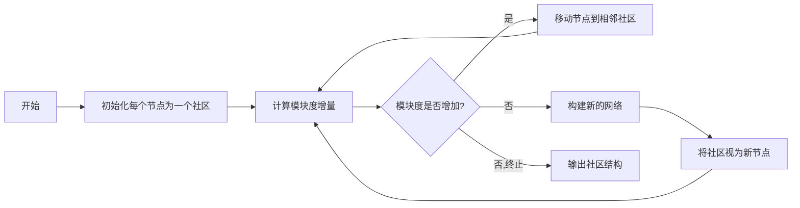
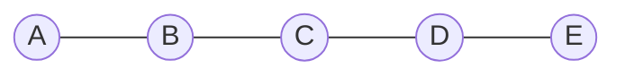

# Louvain社区发现算法在图计算中的应用

## 1.背景介绍

在现实世界中,许多复杂系统都可以被抽象为网络或图的形式,如社交网络、蛋白质互作网络、神经网络等。这些网络通常由大量的节点和连接组成,并且往往呈现出社区结构的特征。社区是指网络中由一些紧密连接的节点组成的子集群。发现网络中的社区结构对于理解网络拓扑、功能模块和动力学行为至关重要。

Louvain算法是一种用于发现大型网络中社区结构的高效无监督聚类算法。它由Vincent D. Blondel等人于2008年提出,并在2011年进行了改进。该算法基于模块度(Modularity)的优化思想,通过迭代地优化模块度指标来发现网络的社区结构。Louvain算法具有较高的计算效率和良好的聚类性能,在许多领域得到了广泛应用,如社交网络分析、生物信息学、计算机视觉等。

## 2.核心概念与联系

### 2.1 图(Graph)

图是一种数据结构,由节点(Node)和连接节点的边(Edge)组成。在图论中,图用于表示任何关系,其中节点表示实体,边表示实体之间的关系。图可以是有向的(Directed)或无向的(Undirected)。

### 2.2 社区(Community)

社区是指网络中由一些紧密连接的节点组成的子集群。社区内部的节点之间连接紧密,而与其他社区的连接则相对较少。社区的发现有助于揭示网络的内在结构和功能模块。

### 2.3 模块度(Modularity)

模块度是衡量网络社区结构好坏的一种指标。它测量网络中节点分区的紧密程度,即同一社区内部连接的程度与跨社区连接的程度之差。模块度值越高,说明网络的社区结构越明显。

模块度的计算公式如下:

$$Q = \frac{1}{2m}\sum_{i,j}\left[A_{ij} - \frac{k_ik_j}{2m}\right]\delta(c_i,c_j)$$

其中:
- $m$是网络中所有边的总数
- $A_{ij}$是邻接矩阵,如果存在边$i\rightarrow j$,则$A_{ij}=1$,否则为0
- $k_i$和$k_j$分别是节点$i$和$j$的度数(边的数量)
- $\delta(c_i,c_j)$是指示函数,当节点$i$和$j$属于同一个社区时为1,否则为0

模块度的取值范围是[-1,1],值越接近1,说明网络的社区结构越明显。

### 2.4 Louvain算法的核心思想

Louvain算法的核心思想是通过优化模块度指标来发现网络的社区结构。算法分为两个阶段:

1. **第一阶段**: 对每个节点,计算将其移动到相邻社区后模块度的增量,并选择能使模块度最大增加的移动方式。重复这一过程,直到模块度不再增加为止。
2. **第二阶段**: 将第一阶段形成的社区视为新的节点,构建一个新的网络。然后在新网络上重复第一阶段的过程,直到模块度不再增加。

通过这两个阶段的迭代,Louvain算法可以有效地发现网络的层次化社区结构。

## 3.核心算法原理具体操作步骤

Louvain算法的具体步骤如下:



1. **初始化**: 将每个节点初始化为一个独立的社区。

2. **计算模块度增量**: 对于每个节点$i$,计算将其从当前社区$c_i$移动到相邻社区$c_j$后,模块度的增量$\Delta Q$。增量计算公式如下:

$$\Delta Q = \left[\frac{\sum_{in} + k_{i,in}}{2m} - \left(\frac{\sum_{tot}}{2m}\right)^2\right] - \left[ \frac{\sum_{in}}{2m}-\left(\frac{\sum_{tot}}{2m}\right)^2-\left(\frac{k_{i}}{2m}\right)^2\right]$$

其中:
- $\sum_{in}$是$i$在当前社区$c_i$内的边权重之和
- $k_{i,in}$是$i$与$c_j$社区的边权重之和
- $\sum_{tot}$是整个网络的边权重之和
- $k_i$是节点$i$的度数

3. **移动节点**: 对于每个节点$i$,找到能使模块度最大增加的相邻社区$c_j$,并将$i$移动到$c_j$。如果没有能增加模块度的移动,则保持$i$的社区不变。

4. **判断终止条件**: 如果在此轮迭代中模块度有增加,则回到步骤2,继续下一轮迭代;否则进入步骤5。

5. **构建新网络**: 将第一阶段形成的社区视为新的节点,构建一个新的网络。新网络中,节点之间的边权重等于原网络中跨社区的边权重之和。

6. **重复迭代**: 在新构建的网络上重复步骤2到步骤4,直到模块度不再增加。

7. **输出结果**: 输出最终发现的社区结构。

通过以上迭代过程,Louvain算法可以有效地发现网络的层次化社区结构。

## 4.数学模型和公式详细讲解举例说明

在Louvain算法中,模块度是衡量网络社区结构好坏的关键指标。模块度的计算公式如下:

$$Q = \frac{1}{2m}\sum_{i,j}\left[A_{ij} - \frac{k_ik_j}{2m}\right]\delta(c_i,c_j)$$

其中:
- $m$是网络中所有边的总数
- $A_{ij}$是邻接矩阵,如果存在边$i\rightarrow j$,则$A_{ij}=1$,否则为0
- $k_i$和$k_j$分别是节点$i$和$j$的度数(边的数量)
- $\delta(c_i,c_j)$是指示函数,当节点$i$和$j$属于同一个社区时为1,否则为0

让我们通过一个简单的例子来理解这个公式:



上图是一个简单的无向图,包含5个节点和4条边。我们计算该网络的模块度:

- $m = 4$,因为网络中总共有4条边
- $A_{ij}$的取值如下:
    - $A_{AB} = A_{BA} = 1$
    - $A_{BC} = A_{CB} = 1$
    - $A_{CD} = A_{DC} = 1$
    - $A_{DE} = A_{ED} = 1$
    - 其他$A_{ij}$均为0
- 节点的度数为:
    - $k_A = 1$
    - $k_B = 2$
    - $k_C = 2$
    - $k_D = 2$
    - $k_E = 1$

假设我们将节点划分为两个社区$C_1 = \{A, B, C\}$和$C_2 = \{D, E\}$,则模块度计算如下:

$$\begin{aligned}
Q &= \frac{1}{2m}\sum_{i,j}\left[A_{ij} - \frac{k_ik_j}{2m}\right]\delta(c_i,c_j) \\
&= \frac{1}{8}\left[\left(1 - \frac{1\times1}{8}\right) + \left(1 - \frac{2\times2}{8}\right) + \left(1 - \frac{2\times2}{8}\right) + \left(1 - \frac{2\times1}{8}\right) + \left(1 - \frac{1\times2}{8}\right) + \left(1 - \frac{1\times2}{8}\right) + \left(1 - \frac{1\times1}{8}\right)\right] \\
&= \frac{1}{8}\left[1 + \frac{1}{2} + \frac{1}{2} + \frac{3}{4} + \frac{3}{4} + \frac{3}{4} + 1\right] \\
&= \frac{17}{16} \\
&\approx 1.0625
\end{aligned}$$

可以看出,这种划分得到了一个较高的模块度值,说明网络具有明显的社区结构。

在Louvain算法的迭代过程中,需要计算将某个节点$i$从当前社区$c_i$移动到相邻社区$c_j$后,模块度的增量$\Delta Q$。增量计算公式如下:

$$\Delta Q = \left[\frac{\sum_{in} + k_{i,in}}{2m} - \left(\frac{\sum_{tot}}{2m}\right)^2\right] - \left[ \frac{\sum_{in}}{2m}-\left(\frac{\sum_{tot}}{2m}\right)^2-\left(\frac{k_{i}}{2m}\right)^2\right]$$

其中:
- $\sum_{in}$是$i$在当前社区$c_i$内的边权重之和
- $k_{i,in}$是$i$与$c_j$社区的边权重之和
- $\sum_{tot}$是整个网络的边权重之和
- $k_i$是节点$i$的度数

通过计算$\Delta Q$,算法可以确定是否将节点$i$移动到相邻社区$c_j$,从而优化模块度。

## 5.项目实践：代码实例和详细解释说明

下面是使用Python实现Louvain社区发现算法的代码示例,基于NetworkX库:

```python
import networkx as nx
import community as community_louvain

# 创建一个示例图
G = nx.karate_club_graph()

# 计算社区结构
partition = community_louvain.best_partition(G)

# 打印社区结构
print("社区结构:")
for com in set(partition.values()):
    nodes = [node for node in partition.keys() if partition[node] == com]
    print(f"社区 {com}: {nodes}")

# 绘制图形,不同颜色表示不同社区
pos = nx.spring_layout(G)
cmap = ['r', 'g', 'b', 'y', 'c', 'm']
node_color = [cmap[partition[node]] for node in G.nodes()]
nx.draw(G, pos, node_color=node_color, with_labels=True)
```

代码解释:

1. 首先,我们导入NetworkX库和Louvain社区发现算法的实现模块`community`。

2. 创建一个示例图`G`。这里使用了NetworkX内置的`karate_club_graph()`函数,它生成了一个表示zachary的空手道俱乐部的社交网络图。

3. 调用`community_louvain.best_partition()`函数,传入图`G`,计算该图的社区结构。该函数返回一个字典`partition`,其中键为节点,值为该节点所属的社区编号。

4. 遍历`partition`字典,打印每个社区及其包含的节点。

5. 使用NetworkX的`spring_layout()`函数计算节点的布局位置。

6. 为每个节点分配一种颜色,表示它所属的社区。

7. 调用`nx.draw()`函数,传入图`G`、节点位置`pos`和节点颜色`node_color`,绘制带有社区标记的网络图。

运行上述代码,你将看到输出的社区结构以及绘制的网络图,不同颜色的节点表示不同的社区。

该示例代码演示了如何使用Louvain算法发现网络中的社区结构,并将结果可视化。在实际应用中,你可以根据需求对代码进行修改和扩展,例如处理加权图、有向图,或者将算法应用于特定领域的数据集。

## 6.实际应用场景

Louvain社区发现算法在许多领域都有广泛的应用,下面列举了一些典型的应用场景:

### 6.1 社交网络分析

在社交网络中,用户之间通过关注、好友等关系形成了复杂的网络结构。发现社交网络中的社区有助于理解用户群体的分布特征、兴趣爱好等,为社交网络的个性化推荐、广告投放等提供支持。

### 6.2 生物信息学

在生