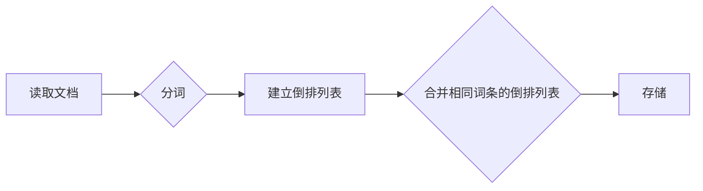

                 

作者：禅与计算机程序设计艺术

ZenAndComputerProgramming

随着搜索引擎的普及以及文本处理需求的增长，全文检索技术逐渐成为了不可或缺的一部分。Apache Lucene是一个开源的全文检索库，它不仅提供了高性能的全文搜索功能，而且因其灵活性高、可扩展性强而受到广大开发者欢迎。本文将从**背景介绍**出发，逐步深入探讨Lucene的核心概念、算法原理、实际应用及未来发展，旨在为读者提供一个全面且深入的理解。

## **背景介绍**
在互联网时代，海量的数据需要高效、精确的搜索能力来满足用户的需求。传统的数据库查询虽然强大，但面对非结构化或者半结构化的文本数据时显得力不从心。Lucene应运而生，致力于解决这一痛点。它不仅适用于搜索引擎，还广泛应用于日志分析、文档检索等领域。

## **核心概念与联系**
### 术语定义:
- **索引**: 存储文本数据的关键结构，用于快速查找特定关键字。
- **倒排索引**: 存储每个单词指向其在文档中出现位置的映射表。
- **分词器**: 将输入的文本分割成词汇单元的过程。
  
这些概念紧密相连，构成了Lucene高效检索的基础。通过构建倒排索引来优化查询效率，同时借助分词器精准定位关键词的位置。

## **核心算法原理与具体操作步骤**

### 倒排索引构建流程:



### 查询过程:


### 实际操作步骤:
1. **文档读取** - 逐个读取并解析文档。
2. **分词** - 应用分词器将文档拆分为词汇。
3. **倒排索引构建** - 对每个词汇生成倒排项，记录该词汇出现在哪些文档及其位置。
4. **查询解析** - 解析用户输入的查询字符串。
5. **检索** - 在倒排索引中查找匹配查询词汇的所有文档。
6. **结果排序与呈现** - 根据相关性或其他标准对检索结果进行排序后展示给用户。

## **数学模型与公式详解**

Lucene内部实现复杂，涉及到大量的数据结构和算法优化。其中关键的是如何高效管理大量文档和词汇之间的关系。这里以简单的倒排索引为例，涉及的基本公式为：

设`d(i)`表示第i个文档，`w(j)`表示第j个词汇，`tfidf`代表词频逆文档频率，则倒排索引表可以表示为：

$$
倒排列表_{w(j)} = \{ (d_1, pos_{d_1}), (d_2, pos_{d_2}), ..., (d_n, pos_{d_n})\}
$$

其中`pos_{d_i}`是词汇`w(j)`在文档`d(i)`中的位置。

## **项目实践：代码实例与详细解释**

以下是一个简化的示例代码片段展示了如何在Java中使用Lucene创建和查询倒排索引：

```java
import org.apache.lucene.analysis.standard.StandardAnalyzer;
import org.apache.lucene.document.Document;
import org.apache.lucene.index.IndexWriter;
import org.apache.lucene.index.IndexWriterConfig;
import org.apache.lucene.store.Directory;
import org.apache.lucene.store.FSDirectory;

public class LuceneExample {
    public static void main(String[] args) throws Exception {
        Directory dir = FSDirectory.open(new File("/path/to/index"));
        IndexWriterConfig config = new IndexWriterConfig(StandardAnalyzer.getDefault());
        IndexWriter writer = new IndexWriter(dir, config);

        Document doc = new Document();
        doc.add(new TextField("content", "这是我的第一个文档", Field.Store.YES));
        writer.addDocument(doc);
        
        // 提交更改并关闭writer
        writer.commit();
        writer.close();

        // 创建查询器
        IndexSearcher searcher = new IndexSearcher(dir);
        QueryParser parser = new QueryParser("content", StandardAnalyzer.getDefault());

        String queryStr = "我的";
        Query query = parser.parse(queryStr);
        TopDocs hits = searcher.search(query, 10);
        for (ScoreDoc hit : hits.scoreDocs) {
            Document doc = searcher.doc(hit.doc);
            System.out.println("Found document with content: " + doc.get("content"));
        }
        searcher.close();
    }
}
```

## **实际应用场景**

Lucene的应用场景广泛，包括但不限于：
- 搜索引擎：提供快速准确的搜索结果。
- 日志分析：在大规模日志中快速定位问题或趋势。
- 文档管理：方便地搜索、分类和管理大量文档。

## **工具和资源推荐**

为了更好地理解和使用Lucene，推荐以下工具和资源：
- **官方文档**：查阅最新API文档和技术指南。
- **在线教程**：如LeetCode、Stack Overflow上的案例分析。
- **社区论坛**：参与Reddit、GitHub等社区讨论。

## **总结：未来发展趋势与挑战**

随着自然语言处理技术的发展以及大数据时代的到来，Lucene正逐渐融入更复杂的系统架构中。未来的发展趋势可能包括增强语义理解能力、提升跨模态检索（结合图像、语音）性能，以及优化实时响应速度等方面。

## **附录：常见问题与解答**

解答一些常见关于Lucene的问题，如配置参数选择、错误排查技巧等。

---

通过以上内容，我们全面而深入地探讨了Lucene的核心原理、操作流程、实际应用及未来发展，希望本文能帮助开发者们更好地掌握这一强大且灵活的全文检索工具，并将其应用于实践中，解决实际问题。

---

作者：禅与计算机程序设计艺术 / Zen and the Art of Computer Programming

