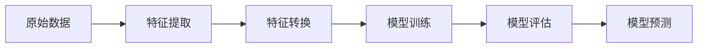

# MLlib 原理与代码实例讲解

## 1. 背景介绍
### 1.1 大数据时代的机器学习需求
### 1.2 Apache Spark 生态系统概述  
### 1.3 MLlib 在 Spark 生态中的定位

## 2. 核心概念与联系
### 2.1 MLlib 主要组成部分
#### 2.1.1 基本统计
#### 2.1.2 特征工程
#### 2.1.3 分类与回归
#### 2.1.4 聚类
#### 2.1.5 协同过滤
#### 2.1.6 降维
#### 2.1.7 模型选择与评估
### 2.2 MLlib 支持的数据类型
#### 2.2.1 本地向量与矩阵  
#### 2.2.2 分布式矩阵
#### 2.2.3 标注点 
### 2.3 MLlib Pipeline 工作流



## 3. 核心算法原理与具体操作步骤
### 3.1 分类算法
#### 3.1.1 逻辑回归
#### 3.1.2 支持向量机
#### 3.1.3 决策树与随机森林
#### 3.1.4 朴素贝叶斯
### 3.2 回归算法  
#### 3.2.1 线性回归
#### 3.2.2 广义线性回归
#### 3.2.3 决策树回归
### 3.3 聚类算法
#### 3.3.1 K-Means
#### 3.3.2 高斯混合模型
#### 3.3.3 LDA主题模型
### 3.4 推荐算法
#### 3.4.1 交替最小二乘法(ALS)
### 3.5 降维算法
#### 3.5.1 奇异值分解(SVD)
#### 3.5.2 主成分分析(PCA)

## 4. 数学模型和公式详解
### 4.1 逻辑回归的 Sigmoid 函数与损失函数
$$
g(z) = \frac{1}{1+e^{-z}}
$$
其中 $z = \theta^T x$
### 4.2 支持向量机的软间隔最大化
$$
\min_{\mathbf w, b, \zeta} \frac{1}{2}\mathbf w^T \mathbf w + C \sum_{i=1}^{n} \zeta_i \\
s.t. ~ y_i(\mathbf w^T \phi(\mathbf x_i) + b) \geq 1 - \zeta_i,\\
\zeta_i \geq 0, i=1, ..., n
$$
### 4.3 决策树的基尼不纯度
$$
\operatorname{Gini}(p) = \sum_{k=1}^{K} p_k (1-p_k) = 1 - \sum_{k=1}^{K} p_k^2
$$
### 4.4 K-Means 的目标函数
$$
J = \sum_{j=1}^k \sum_{i=1}^n w_{ij} \Vert x^{(i)} - \mu_j \Vert^2
$$

## 5. 项目实践：代码实例和详解
### 5.1 使用 MLlib 进行文本分类
```scala
import org.apache.spark.ml.classification.LogisticRegression
import org.apache.spark.ml.feature.{HashingTF, Tokenizer}
import org.apache.spark.ml.linalg.Vector
import org.apache.spark.sql.Row

// 加载并解析数据
val training = spark.createDataFrame(Seq(
  (0L, "a b c d e spark", 1.0),
  (1L, "b d", 0.0),
  (2L, "spark f g h", 1.0),
  (3L, "hadoop mapreduce", 0.0)
)).toDF("id", "text", "label")

// 配置 ML Pipeline
val tokenizer = new Tokenizer()
  .setInputCol("text")
  .setOutputCol("words")
val hashingTF = new HashingTF()
  .setNumFeatures(1000)
  .setInputCol(tokenizer.getOutputCol)
  .setOutputCol("features")
val lr = new LogisticRegression()
  .setMaxIter(10)
  .setRegParam(0.01)

// 训练模型
val model = lr.fit(hashingTF.transform(tokenizer.transform(training)))

// 对新文本进行预测
val test = spark.createDataFrame(Seq(
  (4L, "spark i j k"),
  (5L, "l m n"),
  (6L, "spark hadoop spark"),
  (7L, "apache hadoop")
)).toDF("id", "text")

model.transform(hashingTF.transform(tokenizer.transform(test)))
  .select("id", "text", "probability", "prediction")
  .collect()
  .foreach { case Row(id: Long, text: String, prob: Vector, prediction: Double) =>
    println(s"($id, $text) --> prob=$prob, prediction=$prediction")
  }
```

### 5.2 使用 MLlib 进行电影推荐
```scala
import org.apache.spark.ml.evaluation.RegressionEvaluator
import org.apache.spark.ml.recommendation.ALS

// 加载并解析数据
val data = spark.read.textFile("data/mllib/als/sample_movielens_ratings.txt")
val ratings = data.map(parseRating).toDF()

// 切分训练集和测试集
val Array(training, test) = ratings.randomSplit(Array(0.8, 0.2))

// 配置 ALS 模型参数
val als = new ALS()
  .setMaxIter(5)
  .setRegParam(0.01)
  .setUserCol("userId")
  .setItemCol("movieId")
  .setRatingCol("rating")

// 训练模型  
val model = als.fit(training)

// 对测试集进行预测
val predictions = model.transform(test)

// 评估模型
val evaluator = new RegressionEvaluator()
  .setMetricName("rmse")
  .setLabelCol("rating")
  .setPredictionCol("prediction")
val rmse = evaluator.evaluate(predictions)
println(s"Root-mean-square error = $rmse")

// 为指定用户生成Top 10电影推荐
val userId = 789
val topKRecs = model.recommendForAllUsers(10)
val recommendedMovies = topKRecs
  .filter(_.getAs[Int]("userId") == userId)
  .flatMap(_.getAs[Seq[Row]]("recommendations"))
  .map(row => (row.getAs[Int]("movieId"), row.getAs[Float]("rating")))
  .collect()
println(recommendedMovies.mkString("\n"))  
```

## 6. 实际应用场景
### 6.1 电商平台的个性化商品推荐
### 6.2 社交网络的用户画像与关系链接预测
### 6.3 金融领域的风险评估与反欺诈
### 6.4 文本数据的分类、聚类与情感分析
### 6.5 图像识别与分类

## 7. 工具和资源推荐
### 7.1 Spark MLlib 官方文档
### 7.2 Spark Summit 会议视频与 PPT
### 7.3 Databricks 博客与论坛
### 7.4 《Advanced Analytics with Spark》一书
### 7.5 Coursera 上的 Spark 专项课程

## 8. 总结与展望
### 8.1 MLlib 在 Spark 生态中的重要地位
### 8.2 MLlib 对大规模机器学习的促进作用
### 8.3 MLlib 未来的发展方向与挑战
#### 8.3.1 更多算法的分布式实现
#### 8.3.2 模型管理与部署工具链 
#### 8.3.3 实时机器学习流处理
#### 8.3.4 基于 GPU 的加速
#### 8.3.5 与深度学习框架的集成

## 9. 附录：常见问题解答
### 9.1 如何在 Spark 安装 MLlib？
### 9.2 DataFrame 和 RDD API 的区别？
### 9.3 如何将 MLlib 模型部署到生产环境？ 
### 9.4 MLlib 是否支持在线学习？
### 9.5 MLlib 与 scikit-learn 的比较？

作者：禅与计算机程序设计艺术 / Zen and the Art of Computer Programming